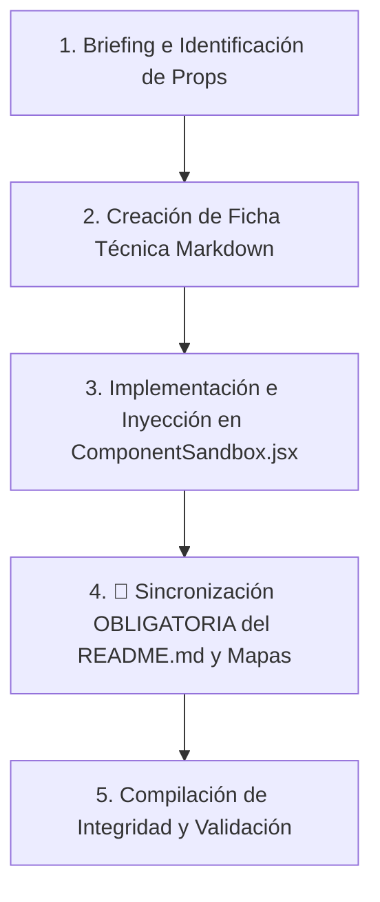

# Skill de Creación de Componentes (`component-creator`)

Esta skill automatiza de manera estricta el ciclo de vida completo al crear e integrar un nuevo componente premium en el catálogo reutilizable de **PROTOTIPE** y en el playground interactivo del **dev-dashboard**.

## 📁 Variable de Proyecto Dinámica

> **Variable `[PROYECTO_ACTIVO]`:** Ruta raíz del proyecto sobre el que se está trabajando. Se determina en este orden de prioridad:
> 1. Si el usuario la especificó en el trigger (ej. `@crear-componente "App Reservas" NombreComponente`), usar esa.
> 2. Si hay un proyecto abierto actualmente en el contexto de la sesión, usar ese.
> 3. Si ninguna de las anteriores aplica, preguntar al usuario antes de continuar: "¿En qué proyecto estás trabajando? Indica la ruta o el nombre de la plantilla."

---

## 📁 Rutas del Proyecto Portables

> Las rutas de este flujo se construyen dinámicamente usando el directorio raíz del ecosistema `[GIT_ROOT]` (portabilidad absoluta):
>
> **Rutas del ecosistema (portables):**
> - Biblioteca: `[GIT_ROOT]/Documentacion PROTOTIPE/06_Biblioteca_Componentes/`
> - Bitácora: `[GIT_ROOT]/Documentacion PROTOTIPE/03_Auditorias_y_Faro_Core/bitacora_cambios.md`
> - Mapas: `[GIT_ROOT]/Documentacion PROTOTIPE/04_Estandares_y_Skills/`
> - Dev-dashboard: `[GIT_ROOT]/Central PROTOTIPE/dev-dashboard/`
> - Manuales: `[GIT_ROOT]/Documentacion PROTOTIPE/07_Manuales_Desarrollo/`
>
> **Rutas del cliente/proyecto de desarrollo:**
> - Código fuente: `[GIT_ROOT]/[PROYECTO_ACTIVO]/src/`
> - Componentes: `[GIT_ROOT]/[PROYECTO_ACTIVO]/src/components/`
> - Hooks: `[GIT_ROOT]/[PROYECTO_ACTIVO]/src/hooks/`
> - Servicios: `[GIT_ROOT]/[PROYECTO_ACTIVO]/src/services/`
> - Variables de entorno: `[GIT_ROOT]/[PROYECTO_ACTIVO]/.env.local`
> - Package: `[GIT_ROOT]/[PROYECTO_ACTIVO]/package.json`

---

## ⚠️ REGLA DE ORO — VISIBILIDAD EN DASHBOARD (CRÍTICO)

> [!CAUTION]
> El dashboard (`ComponentLibraryView`) carga los componentes **exclusivamente** desde el `README.md` de la biblioteca, consultado por el CLI Daemon en `http://localhost:3001/api/library`. Si un componente **no está indexado en el README.md**, será **completamente invisible en el árbol lateral del dashboard**, independientemente de que su ficha markdown exista y su playground esté implementado en `ComponentSandbox.jsx`.
>
> **La omisión del registro en README.md es el error más frecuente y más costoso de este flujo. Nunca lo omitas.**

---

## 📂 Categorías Válidas de la Biblioteca

> Las únicas categorías físicas permitidas en `06_Biblioteca_Componentes/` o la raíz de documentación son las siguientes. Usar un nombre fuera de esta lista rompe la consistencia e indexación:
> - `00_Core_Ecosistema_Obligatorios` (Core del Ecosistema)
> - `Ecommerce_y_Ventas` (Ventas y Carritos)
> - `Fidelizacion_y_Gamificacion` (Lealtad y Puntos)
> - `Formularios_y_UI` (Controles Visuales Básicos)
> - `Logica_y_Hooks` (Estado Local y Hooks React)
> - `Modales` (Popups y Modales)
> - `Paginas` (Vistas completas)
> - `Pedidos_y_Gestion` (Gestión de Pedidos)
> - `Reservas_y_Citas` (Agendas y Horarios)
> - `Servicios_y_Firebase` (Servicios JS / Firebase Integraciones)
> - `Utilidades` (Helpers y utilitarios genéricos)
> - `Visualizacion` (Gráficos, dashboards)
> - `09_Modulos_Completos` (Módulos de negocio enteros)

---

## 🛠️ Flujo de Trabajo Secuencial Obligatorio

Cuando el usuario invoque el comando `@crear-componente [PROYECTO_ACTIVO?] [NombreComponente] [Requerimientos/Idea]`, la IA debe ejecutar rigurosamente los siguientes 5 pasos consecutivos:



---

### Paso 1: Briefing y Diseño Técnico
Antes de escribir una sola línea de código, la IA debe estructurar conceptualmente el componente:
- **Propósito y Casos de Uso:** Qué problema resuelve y dónde se aplica.
- **Props y Firma del Componente:** Definir con precisión los tipos de datos de las propiedades de entrada.
- **Estados Locales:** Qué estados maneja y qué hooks necesita (`useState`, `useRef`, `useMemo`).
- **Adaptabilidad Cromática (Marca Blanca):** Identificar cómo consumirá las variables CSS del ecosistema (`--color-primary`, `--color-surface-2`, `--color-border`, etc.).

---

### Paso 2: Creación de la Ficha Técnica Markdown
Crear un archivo `.md` de documentación en español bajo el directorio específico de la biblioteca:
- **Ruta de destino:** `[GIT_ROOT]/Documentacion PROTOTIPE/06_Biblioteca_Componentes/[Categoría]/[Nombre_En_Español]/[nombre_en_serpiente].md`
- **Estructura del Markdown:** Debe iniciar obligatoriamente con el bloque de comentarios HTML conteniendo el JSON de Manifiesto de Dependencias para habilitar la resolución automática de dependencias durante la auto-inyección.
  > [!IMPORTANT]
  > Para asegurar el correcto filtrado en el dashboard y la portabilidad del código, es obligatorio clasificar el componente en una de las 4 categorías del **Estándar de Arquitectura Modular**:
  > **REGLAS DE targetPath Y type:**
  > - **Atom (`atom`):** Presentacionales puros. El `targetPath` debe ser `"src/components/ui/[NombreTécnico].jsx"`.
  > - **Component (`component`):** Layouts y navegación común. El `targetPath` debe ser `"src/components/common/[NombreTécnico].jsx"`.
  > - **Feature (`feature`):** Acoplados a dominio de negocio. El `targetPath` debe ser `"src/features/[featureName]/components/[NombreComponente].jsx"`.
  > - **Logic (`logic` / `hook` / `service`):** Capa de datos desacoplada o hooks. El `targetPath` debe ser `"src/features/[featureName]/hooks/[useHookName].js"` o `"src/features/[featureName]/api/[Repository].js"`.
  > - Queda **estrictamente PROHIBIDO** apuntar `"targetPath"` a directorios de sandbox (`src/components/admin/sandboxes/...` o `dev-dashboard/...`).
  
  ```markdown
  <!--
  {
    "resource": "[NombreComponente]",
    "technicalName": "[NombreComponente]",
    "targetPath": "src/features/[featureName]/components/[NombreComponente].jsx",
    "type": "feature",
    "niches": [],
    "dependencies": {
      "npm": {},
      "internal": []
    }
  }
  -->
  ```
  1. **Propósito y Casos de Uso**
  2. **Especificación Visual y Estilos (Tailwind CSS):** Detallar variables HSL y animaciones.
  3. **Código React Completo:** Código 100% funcional, autónomo, portable y sin placeholders. No omitir ninguna línea.
  4. **Lógica de Estado y Ciclo de Vida:** Explicar handlers, effects y hooks.
  5. **Flujo Operativo y Secuencia de Interacción:** Incluir diagramas Mermaid.

---

### Paso 3: Implementación e Inyección en `ComponentSandbox.jsx` y Sandboxes Individuales
- **Rutas clave:**
  - Archivo de Sandbox: [NEW] `[GIT_ROOT]/Central PROTOTIPE/dev-dashboard/src/components/admin/sandboxes/[NombreComponente]Sandbox.jsx`
- **Tareas Obligatorias:**
  1. **Creación del Archivo de Sandbox:** Queda estrictamente PROHIBIDO inyectar la lógica del componente o del playground inline en `ComponentSandbox.jsx`. Se debe crear un archivo independiente `src/components/admin/sandboxes/[NombreComponente]Sandbox.jsx` que exporte por defecto el sandbox interactivo con sus propios controles, imports y componentes de apoyo embebidos.
  2. **Importación de SandboxLayout:** Dentro del archivo de Sandbox creado, la importación de `SandboxLayout` **debe ser relativa directa** (`import { SandboxLayout } from './SandboxLayout';`). Queda estrictamente prohibido usar imports absolutos o subir de nivel (`../SandboxLayout`), ya que causaría fallos de compilación en Vite.
  3. **Resolución Automática por Globbing:** La Consola Central resuelve y carga dinámicamente los playgrounds usando `import.meta.glob('./sandboxes/*.jsx')`. No es necesario registrar imports estáticos en `ComponentSandbox.jsx`.
  4. **Registro OBLIGATORIO de Mapeo (Evitar Fallo Prebuild):** Para que el script de prebuild `verify_library_integrity.cjs` asocie correctamente la ficha de documentación física con el playground del dashboard, **debes registrar obligatoriamente** el alias y nombre del componente en minúsculas en el mapa `COMPONENT_SANDBOX_MAP` de `ComponentSandbox.jsx` (ej: `'nombre_componente': 'NombreComponente'`). Si el componente no tiene UI (como hooks lógicos o servicios puros), regístralo en la constante `COMPONENT_META` describiendo su tipo y notas.

---

### Paso 4: 🔴 Sincronización OBLIGATORIA del Catálogo — BLOQUEANTE

> [!CAUTION]
> Este paso es **no negociable y no omitible**. Debe ejecutarse **siempre**.

Ejecutar **todos** los sub-pasos en una sola ronda de edición:

#### 4.1 — `README.md` del Catálogo
Editar `[GIT_ROOT]/Documentacion PROTOTIPE/06_Biblioteca_Componentes/README.md`:
- Localizar la sección de categoría correcta.
- Agregar la entrada con link markdown en el formato estándar:
  ```
  * [Nombre Visual (NombreTécnico)](file:///D:/PROTOTIPE/.../archivo.md): Descripción de una línea.
  ```

#### 4.2 — `mapa_documentacion_ia.md`
Agregar la entrada del nuevo archivo con su Criterio de Decisión técnica en:
`[GIT_ROOT]/Documentacion PROTOTIPE/04_Estandares_y_Skills/mapa_documentacion_ia.md`

#### 4.3 — `mapa_aplicacion.md` (condicional)
Si el componente se instala físicamente en el proyecto activo, actualizar:
`[GIT_ROOT]/Documentacion PROTOTIPE/04_Estandares_y_Skills/mapa_aplicacion.md`

#### 4.4 — `bitacora_cambios.md`
Registrar el cambio en:
`[GIT_ROOT]/Documentacion PROTOTIPE/03_Auditorias_y_Faro_Core/bitacora_cambios.md`

---

### Paso 5: Evaluación y Creación Obligatoria de Manuales de Desarrollo
- **Acción:** Tras refactorizar y documentar el componente, el agente debe evaluar si la complejidad del componente (por flujos lógicos complejos, de 2+ hooks, integración con Zustand/Firebase) requiere de un manual de desarrollo específico en `07_Manuales_Desarrollo/`.

- **Ruta de Almacenamiento Obligatoria para Manuales:**
  ```
  [GIT_ROOT]/Documentacion PROTOTIPE/07_Manuales_Desarrollo/[Categoria_Español]/[Nombre_Manual_Español]/manual_[nombre].md
  ```
- **Estructura Requerida del Manual:**
  1. **Propósito y Visión General:** Explicación de alto nivel de por qué existe esta lógica.
  2. **Arquitectura y Flujo de Datos:** Flujo paso a paso de la información.
  3. **Guía de Integración:** Instrucciones precisas para acoplar el componente.
  4. **Troubleshooting:** Casos borde comunes.

---

### Paso 6: Compilación de Integridad y Verificación
- **Comando:** `cmd /c npm run build` en `[GIT_ROOT]/Central PROTOTIPE/dev-dashboard`
- **Verificación:** Sin errores de sintaxis, variables no definidas ni fallos de Vite.

---

## ✅ Checklist de Entrega Obligatorio

| # | Entregable | Archivo objetivo |
|---|-----------|-----------------|
| 1 | Ficha `.md` creada con código completo | `06_Biblioteca_Componentes/[Cat]/[Nombre]/archivo.md` |
| 2 | Archivo Sandbox independiente creado | `src/components/admin/sandboxes/[NombreComponente]Sandbox.jsx` |
| 3 | Mapeo de alias en `COMPONENT_SANDBOX_MAP` (Opcional) | `ComponentSandbox.jsx` |
| 4 | Entrada en `README.md` de la biblioteca | **`06_Biblioteca_Componentes/README.md`** |
| 5 | Entrada en `mapa_documentacion_ia.md` | `04_Estandares_y_Skills/mapa_documentacion_ia.md` |
| 6 | Manual de Desarrollo en `07_Manuales_Desarrollo/` (si aplica) | `07_Manuales_Desarrollo/...` |
| 7 | Registro en `bitacora_cambios.md` | `03_Auditorias_y_Faro_Core/bitacora_cambios.md` |
| 8 | Build exitoso sin errores | `cmd /c npm run build` en `dev-dashboard` |

---

## 🚨 Anti-Patrones CSS Estructurales — PROHIBICIONES EXPLÍCITAS

> [!CAUTION]
> Estos errores han causado bugs reales en producción. Su ocurrencia es un fallo de calidad **crítico**. Verificar antes de considerar cualquier componente o sandbox como terminado.

### ❌ Prohibición 1 — Ancho hardcodeado en px dentro de contenedores relativos

Cuando un div hijo tiene `position: absolute` dentro de un contenedor con `overflow: hidden`, el ancho del hijo **NUNCA puede ser un valor fijo en px** (e.g. `style={{ width: '494px' }}`). El hijo debe usar `100%`, `inset-0`, o un valor CSS calculado desde el padre.

```jsx
// ❌ PROHIBIDO — el contenido desborda el clip y se desalinea
<div style={{ width: sliderPos + '%', overflow: 'hidden' }}>
  <div style={{ width: '494px' }}>...</div>  {/* ← NUNCA */}
</div>

// ✅ CORRECTO — el contenido ocupa exactamente el espacio del padre
<div style={{ width: sliderPos + '%', overflow: 'hidden' }}>
  <div className="absolute inset-0">...</div>  {/* ← inset-0 = 100% width + height */}
</div>
```

### ❌ Prohibición 2 — Image Comparison Slider con overflow+width (patrón roto)

El patrón `overflow:hidden + width:%` para sliders de comparación de imágenes es **estructuralmente incorrecto** porque el contenido interno no sabe cuánto mide el contenedor padre. Siempre usar `clipPath`:

```jsx
// ❌ PROHIBIDO — causa desalineamiento del contenido al recortar
<div className="overflow-hidden" style={{ width: sliderPos + '%' }}>
  <div className="absolute inset-0 bg-[var(--color-primary)]">Render 3D</div>
</div>

// ✅ CORRECTO — clipPath recorta sin mover ni escalar el contenido
<div
  className="absolute inset-0 bg-[var(--color-primary)]"
  style={{ clipPath: `inset(0 ${100 - sliderPos}% 0 0)` }}
>
  Render 3D
</div>
```

### ❌ Prohibición 3 — Ancho fijo con `100vw` dentro de un sandbox

Dentro del sandbox, que vive en un panel lateral del dashboard, `100vw` no representa el ancho del componente sino el de la ventana completa. Nunca usar `100vw` para dimensionar contenido interno.

```jsx
// ❌ PROHIBIDO
<div style={{ width: '100vw', maxWidth: '576px' }}>...</div>

// ✅ CORRECTO — usa el espacio del contenedor natural
<div className="w-full">...</div>   // o
<div className="absolute inset-0">...</div>
```

### ❌ Prohibición 4 — `position: absolute` sin `position: relative` en el padre

Todo elemento `absolute` flota respecto al ancestro posicionado más cercano. Si el contenedor padre no tiene `relative`, `absolute`, `fixed` o `sticky`, el elemento escapará visualmente.

```jsx
// ❌ PROHIBIDO — el hijo escapa del contenedor visual
<div className="w-full h-40">          {/* sin position */}
  <div className="absolute inset-0">Panel</div>
</div>

// ✅ CORRECTO
<div className="relative w-full h-40">
  <div className="absolute inset-0">Panel</div>
</div>
```

### ❌ Prohibición 5 — Usar `useRef` sin conectar al DOM para obtener dimensiones

Si necesitas el ancho real de un contenedor en píxeles para cálculos dinámicos, usa `ref.current.getBoundingClientRect()` dentro de un `useEffect` o `ResizeObserver`. No uses `100vw`, ancho hardcodeado, ni `window.innerWidth` como proxy.

```jsx
// ✅ CORRECTO — obtener ancho real del contenedor
const containerRef = useRef(null);
const [width, setWidth] = useState(0);
useEffect(() => {
  if (!containerRef.current) return;
  const observer = new ResizeObserver(([entry]) => setWidth(entry.contentRect.width));
  observer.observe(containerRef.current);
  return () => observer.disconnect();
}, []);
```

---

## 🎨 Estándar Estético y Código Portable de PROTOTIPE

1. **Sin dependencias externas complejas:** Animaciones con CSS nativo y keyframes inline. Iconos SVG en línea o Lucide React.
2. **Uso estricto de variables HSL:**
   - Fondo: `bg-[var(--color-bg)]`
   - Superficies: `bg-[var(--color-surface)]` / `bg-[var(--color-surface-2)]`
   - Bordes: `border-[var(--color-border)]`
   - Textos: `text-[var(--color-text)]` / `text-[var(--color-text-muted)]`
   - Marca: `text-[var(--color-primary)]` / `bg-[var(--color-primary)]`
 3. **Prevención de Truncamiento en Scroll y Animación (Crítico):** En todo componente o sandbox que emplee desplazamiento horizontal (`overflow-x-auto`) o vertical (`overflow-y-auto`) combinado con elementos interactivos que tengan animaciones de traslación (`translate-y`, `hover:-translate-y-1`), escalas (`scale-105`) o sombras de elevación (`shadow-xl`), es **obligatorio** aplicar un padding de holgura vertical u horizontal (mínimo `py-4` o `px-4`) dentro del contenedor de scroll. Esto garantiza que los bordes activos, tarjetas y efectos resplandecientes no sean recortados/cortados por los límites de caja del contenedor con scroll.
 4. **Interactividad:** Siempre incluir microinteracciones, estados de carga y estados de error/vacío elegantes.
 5. **Estándar de Controles:** Prohibido usar selectores `<select>` nativos del navegador; usar obligatoriamente `CustomSelect` (de `src/components/ui/CustomSelect.jsx`) configurado con las variables HSL correspondientes.
 6. **Estándar de Confirmación:** En todo flujo de eliminación, limpieza o acción destructiva del componente, es obligatorio requerir confirmación asíncrona mediante el hook `useAlertConfirm` con `variant: 'error'` o `variant: 'warning'`.
 7. **Prohibición de Dependencias Huérfanas:** Queda terminantemente prohibido importar componentes o utilidades inexistentes o que no estén declarados en `package.json` (ej: no usar `TapShield`). Registra toda dependencia real del proyecto en la sección `dependencies` de los manifiestos de documentación.
 8. **Evitación de Conflictos de Estilos Globales en Light Mode (Contraste y Muestrarios):**
    - **Contraste de Botones / Textos:** En modo claro, las reglas globales del dashboard pueden forzar el color de texto blanco (`.text-white`) a negro (`!important`) si no se usan nombres de clases nativos de Tailwind (por ejemplo, al usar `bg-[var(--color-primary)]` en lugar de `bg-violet-650`). Para garantizar contraste legible de textos blancos sobre botones con fondos de marca, usa siempre la clase `!text-white`.
    - **Muestrarios de Color con Estilo Inline:** El dashboard aplica estilos de sombreado y fondo (`!important`) a cualquier div que combine las clases `rounded-2xl` o `rounded-3xl` con clases de borde (`border`). Para evitar que un contenedor de color de fondo dinámico (swatch) sea sobreescrito con fondo blanco, se debe forzar el inline style con `!important` (ej. `style={{ backgroundColor: \`${tonoObj.hex} !important\` }}`) o evitar la combinación de `rounded-2xl` y `border` en el div que muestra el color.
 9. **Superposición de Líneas y Z-Index en Steppers/Líneas de Tiempo:**
    - La línea de progreso en cronogramas y steppers debe quedar visualmente detrás de los círculos o hitos. Aplica `relative z-10` y un color de fondo sólido (como `bg-[var(--color-surface)]`) en los círculos/hitos de la línea, y aplica `z-[-1]` o `z-[-10]` con posición absoluta en el elemento que dibuja la línea de progreso para evitar que la raye por encima.
10. **Responsividad Móvil y Prevención de Desbordamiento:**
    - Usar `flex flex-col` por defecto para formularios, controles y barras de botones (mobile-first), cambiando a `sm:flex-row` únicamente en breakpoints superiores si hay espacio suficiente.
    - Envolver tablas en un div con `overflow-x-auto w-full`.
    - Aplicar `whitespace-nowrap` a cabeceras de tablas (`<th>`), fechas, identificadores y badges de estado para evitar saltos de línea y desbordamiento.
    - Usar `w-full max-w-[ancho]` en lugar de anchos fijos en px (no usar `w-[400px]`).
    - Usar paddings adaptativos (ej. `p-3 sm:p-5`) en lugar de fijos grandes (`p-6`) en móviles.
 11. **Contrato Obligatorio Para Features Con Firebase:**
     Si el componente o feature usa Firebase/Firestore (o maneja datos críticos como stock, caja, créditos u órdenes), debe estructurarse obligatoriamente bajo un diseño desacoplado de 3 capas:
     - **Repository (`src/features/[featureName]/api/[featureName]Repository.js`):** Conectores puros del SDK de Firebase. Retorna promesas o payloads limpios. Queda prohibido usar hooks de React aquí.
     - **Service (`src/features/[featureName]/services/[featureName]Service.js`):** Capa de dominio lógico, validaciones con Zod y reglas de negocio.
     - **Hook/Store (`src/features/[featureName]/hooks/use[FeatureName].js`):** Estado UI reactivo, control de carga/error y callbacks para la UI.
     - **Componentes (`src/features/[featureName]/components/`):** Vistas presentacionales que consumen el Hook.
     - **Entrypoint (`src/features/[featureName]/index.js`):** Exporta el API público de la feature. Todo consumo externo debe pasar obligatoriamente por este archivo.
     - *Listeners:* Los listeners realtime (`onSnapshot`) deben estar controlados por `RealtimeQueryRegistry` para evitar lecturas duplicadas e idempotencia contra Strict Mode, requiriendo sesión activa.
     - *Escrituras:* Escrituras de campos calientes de stock o caja deben ejecutarse mediante transacciones concurrentes (`runTransaction`).
     - *Persistencia Offline:* Queda estrictamente prohibido usar `localStorage` para colas de outbox, registros de auditoría offline, sincronización de ventas, inventario local o telemetría. Debe emplearse Dexie.js / IndexedDB (`src/features/[featureName]/offline/[featureName]OutboxDb.js`) con estructura de transaccionalidad, `eventId` e idempotencia de clave primaria.
