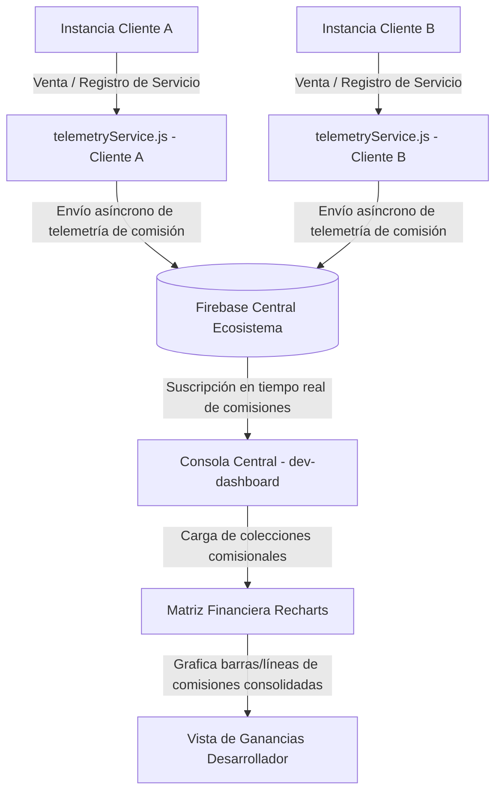

# Flujos Operativos y Lógicos — Consola Central de Control (dev-dashboard)

Este documento detalla los flujos de procesos críticos orquestados por la Consola Central de Control (`dev-dashboard`), su comunicación con el servidor local `Prototipe-CLI` y la interacción de telemetría con las instancias de clientes en producción.

---

## 1. Flujo de Aprovisionamiento Multi-Instancia (Onboarding)

Describe el ciclo de vida desde que el desarrollador configura una nueva marca en la interfaz de la Consola Central hasta la inicialización física en el disco local y despliegue backend de la instancia cliente.

```mermaid
sequenceDiagram
    autonumber
    actor Dev as Desarrollador / IA
    participant Dash as Consola Central (dev-dashboard)
    participant CLI as Servidor Bridge (Prototipe-CLI)
    participant Work as Worker Hijo (worker_create_project.js)
    participant DB as Firebase Cliente / Central
    
    Dev->>Dash: Configura Nombre, Nicho y Colores HSL
    Dash->>CLI: POST /api/create-project (Payload de Configuración)
    CLI->>Work: Fork IPC (Inicia proceso hijo asíncrono)
    CLI-->>Dash: Retorna Canal SSE (Server-Sent Events) para telemetría de progreso
    
    rect rgb(20, 20, 25)
        note over Work: Proceso en segundo plano (Evita congelar Express)
        Work->>Work: Clona plantilla base desde Plantillas Core
        Work->>Work: Genera marcas HSL, favicon y PWA assets
        Work->>Work: Genera .prototipe.json y carpeta de Documentacion local
        Work->>DB: Despliega firestore.rules e indexes a Firebase Cliente
        Work->>DB: Registra metadatos de la licencia del cliente
    end
    
    Work-->>CLI: Envía actualización de estado vía IPC
    CLI-->>Dash: Envía progreso (%) vía canal SSE en vivo
    Dash-->>Dev: Renderiza barra de progreso animada en UI
    Work-->>CLI: Finaliza proceso (Código de salida 0)
    CLI-->>Dash: Cierra SSE y notifica éxito
    Dash-->>Dev: Muestra Onboarding Exitoso y botón de Onboarding completado
```

---

## 2. Flujo de Captura y Diagnóstico de Incidentes (Matriz de Telemetría)

Describe cómo se capturan los errores en caliente en las aplicaciones de los clientes en producción y cómo el desarrollador los depura con un clic utilizando el visor de código integrado.

```mermaid
sequenceDiagram
    autonumber
    actor User as Cliente / Usuario Final
    participant App as Instancia Cliente (Producción)
    participant FS as Firestore (Base de Datos Ecosistema)
    participant Dash as Consola Central (dev-dashboard)
    participant CLI as Servidor Bridge (Prototipe-CLI)
    
    User->>App: Detona un error en caliente (Runtime Exception)
    App->>App: Captura error en ErrorBoundary / catch asíncrono
    App->>FS: telemetryService.js sube log detallado a Firestore (ID, stack, archivo, línea)
    
    Note over Dash: Escucha activa en tiempo real de Firestore
    FS-->>Dash: Notificación de nuevo incidente en caliente
    Dash->>Dash: Enciende indicador LED rojo en Matriz de Telemetría
    
    rect rgb(20, 20, 25)
        note over Dash: Depuración interactiva con un clic
        Dash->>CLI: GET /api/project/file?path=ruta/al/archivo/con/bug
        CLI->>CLI: Resuelve ruta física del archivo local
        CLI-->>Dash: Devuelve código fuente en texto plano
        Dash->>Dash: Renderiza código en el modal de Diagnóstico y resalta la línea exacta del bug
    end
```

---

## 3. Flujo de Control de Licencias y Consolidación Comisional

Detalla el registro de transacciones sujetas a comisión de desarrollo o pago de licenciamiento y cómo se grafican de forma unificada para el desarrollador.

---

## 4. Estándar de Mantenimiento de Flujos

Cualquier cambio de arquitectura en la Consola Central (como nuevos endpoints en el Bridge, alteración de esquemas de telemetría o nuevos componentes interactivos de control de procesos) debe registrarse en la bitácora de cambios y actualizar este documento en el mismo paso para asegurar que el modelo de procesos se mantenga al día.
