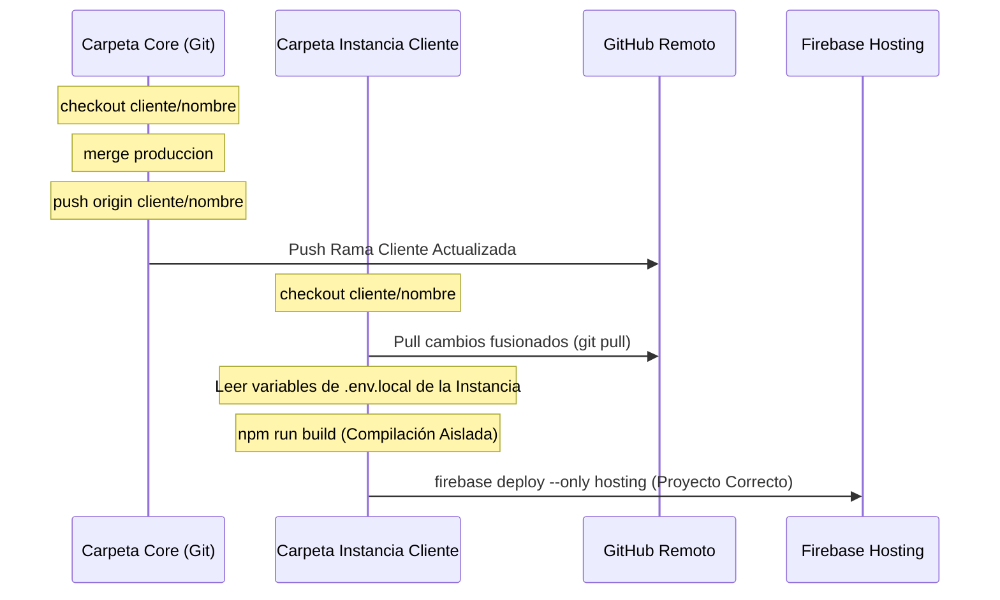

# Plan de Sincronización Core a Clientes (Multi-Instancia) y Aislamiento de Entorno

## Propósito
Integrar el panel `CoreSyncPanel.jsx` en el menú del `dev-dashboard` y refactorizar el endpoint de sincronización del CLI Bridge (`server.js`) para garantizar que la compilación y despliegue de hosting de cada cliente se realice de forma aislada, utilizando el archivo `.env.local` y la configuración Firebase correspondientes a su directorio físico en `Instancias Clientes`.

---

## 1. Diseño y Modificaciones en el Frontend (dev-dashboard)

### Registro en `NAV_TABS` (`src/App.jsx`)
Añadiremos una pestaña dedicada para el sincronizador:
```javascript
{ id: 'sync', label: 'Sincronizar Cores', icon: RefreshCw, shortLabel: 'Sincronizar' }
```

### Renderizado de Componente (`src/App.jsx`)
Renderizaremos el componente `CoreSyncPanel` en el cuerpo del dashboard:
```javascript
{/* ===== TAB: SINCRONIZAR CORES ===== */}
{activeTab === 'sync' && (
  <CoreSyncPanel showToast={(msg, type) => showToast(msg, { type })} />
)}
```

---

## 2. Refactorización en el Backend (Prototipe-CLI)

### Modificación de `/api/git/sync-core-to-clients-stream` (`server.js`)
Para evitar el cruce de variables de entorno y despliegues incorrectos (debido a que `.env.local` está en `.gitignore` y no cambia con `git checkout` en el Core), aplicaremos la siguiente secuencia para cada cliente seleccionado:



1. **Fase Git en el Core**:
   - `git checkout cliente/nombre`
   - `git merge produccion --no-verify -m "merge: Core global update"`
   - `git push origin cliente/nombre --no-verify`
2. **Localización de la Instancia**:
   - Buscar la carpeta física de la instancia local del cliente llamando a `findProjectDir(clientName)`.
3. **Fase de Compilación y Deploy en la Instancia**:
   - Si existe la carpeta física (ej: `D:\PROTOTIPE\Instancias Clientes\ventas-moni-app`):
     - Cambiar el directorio de trabajo (CWD) a `projectDir`.
     - Ejecutar `git checkout cliente/nombre` (por seguridad).
     - Ejecutar `git pull origin cliente/nombre` para sincronizar los cambios de Git.
     - Resolver el `firebaseProjectId` de la instancia.
     - Ejecutar `npm run build` en el directorio de la instancia.
     - Ejecutar `firebase deploy --only hosting -P [projectId]` en el directorio de la instancia.
   - Si no existe la carpeta física (caso de ejecución remota o desarrollo distribuido):
     - Sincronizar en Git en `corePath`, pero omitir el build/deploy local notificándolo en los logs SSE.

---

## 3. Plan de Pruebas y Validación

1. **Prueba Estructural**: Validar que la pestaña esté accesible en la barra de navegación del `dev-dashboard`.
2. **Prueba de Selección**: Confirmar que al seleccionar una plantilla Core, se listen correctamente todos los clientes asociados detectando su desfase de commits.
3. **Prueba de Ejecución Aislada**:
   - Ejecutar la sincronización para un cliente (ej. `moni`).
   - Validar en la terminal de logs que el build y deploy se realicen en `D:\PROTOTIPE\Instancias Clientes\ventas-moni-app` y utilicen el ID de Firebase de ese cliente.
