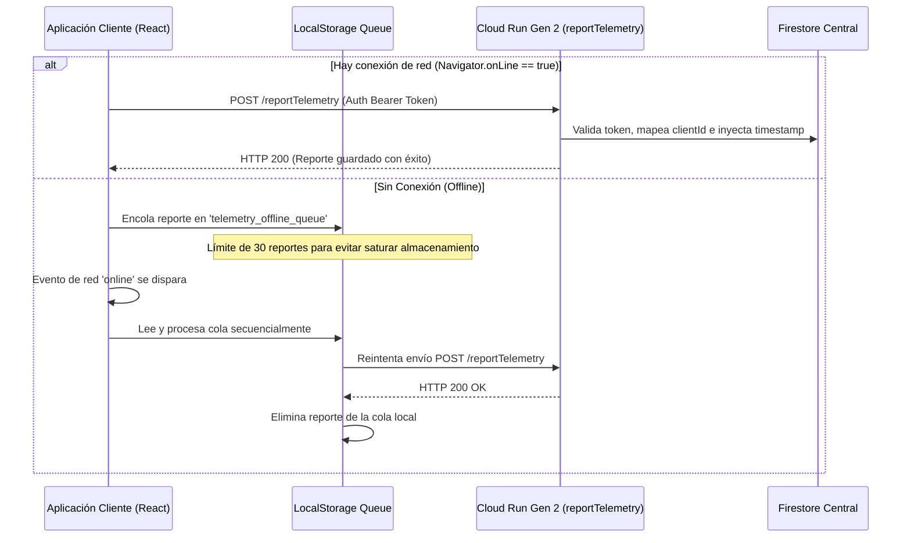

<!--
{
  "technicalName": "TelemetriaEcosistemaGlobal",
  "targetPath": "src/components/ui/TelemetriaEcosistemaGlobal.jsx",
  "dependencies": {
    "npm": {},
    "internal": []
  }
}
-->

## Versión: 2.0.0
## Changelog:
  - v2.0.0 [BREAKING]: Rediseñada la telemetría centralizada migrando a Firebase Cloud Functions Gen 2 (desplegada sobre Google Cloud Run con `cors: true`) y requiriendo Authorization Bearer Token. Se deshabilitaron los bypasses locales para permitir integraciones reales en caliente y se eliminaron comillas redundantes en las variables de entorno.
  - v1.0.0: Versión inicial con almacenamiento offline temporal en localStorage.
## Instancias conocidas:
  - [App Ventas](file:///D:/PROTOTIPE/Plantillas%20Core/App%20Ventas/src/services/telemetryService.js)
  - [Prototipe-CLI (Ventas Template)](file:///D:/PROTOTIPE/Prototipe-CLI/templates/template-ventas/src/services/telemetryService.js)
  - [Dashboard Central (Cloud Function)](file:///D:/PROTOTIPE/Central%20PROTOTIPE/dev-dashboard/functions/index.js)

---

## 1. Propósito y Casos de Uso
El componente de **Telemetría del Ecosistema Global** es **MANDATORIO** y de aplicación obligatoria para todas las aplicaciones creadas, instanciadas o replicadas bajo la plataforma **PROTOTIPE**. 

Sus objetivos centrales son:
1. **Monitoreo de Cobro (Billing):** Reportar de manera consolidada las ventas brutas, ventas netas, impuestos, número de pedidos y comisiones acumuladas del cliente final al desarrollador central para la facturación.
2. **Diagnóstico Técnico (Failures/Crashes):** Capturar excepciones no controladas mediante el `ErrorBoundary` de la aplicación y reportarlas de forma estructurada con su stack trace, variables de entorno de pantalla, url de ejecución, agente de usuario y contexto de sesión.
3. **Resiliencia de Red (Offline Cache):** Encolar temporalmente los reportes en el almacenamiento local del cliente (`localStorage`) cuando no hay conexión a internet y enviarlos secuencialmente con reintentos y política de backoff al recuperar el acceso a la red.

---

## 2. Flujo Operativo y Secuencia de Datos


---

## 3. Código del Cliente (`telemetryService.js` completo)
Este módulo debe ubicarse en `src/services/telemetryService.js` de cada aplicación cliente:

```javascript
import { auth } from '../config/firebaseConfig';
import { getCentralFirestore } from './centralFirebaseService';
import { doc, setDoc, collection, addDoc, serverTimestamp } from 'firebase/firestore';

// Variables de entorno para modo Blaze (HTTP)
const CENTRAL_ENDPOINT = import.meta.env.VITE_DEVELOPER_TELEMETRY_ENDPOINT;
const DEV_TOKEN = import.meta.env.VITE_DEVELOPER_TELEMETRY_TOKEN;

// Variables de entorno de identificación del cliente
const CLIENT_ID = import.meta.env.VITE_DEVELOPER_CLIENT_ID;
const CLIENT_NICHE = import.meta.env.VITE_NICHE || 'general';

// Almacenamiento en memoria para prevenir duplicados de error
const reportedErrorsCache = {};

// Constantes de almacenamiento local
const OFFLINE_QUEUE_KEY = 'telemetry_offline_queue';

/**
 * Genera un hash/firma simple para identificar errores idénticos.
 */
function getErrorHash(errorMsg, stack) {
  const cleanStack = (stack || '').split('\n')[0] || '';
  return `${errorMsg}_${cleanStack}`.replace(/[^a-zA-Z0-9_]/g, '_');
}

/**
 * Agrega un reporte a la cola local en localStorage.
 */
function enqueueOfflineReport(type, payload) {
  try {
    const queue = JSON.parse(localStorage.getItem(OFFLINE_QUEUE_KEY) || '[]');
    // Limitar la cola a un tamaño máximo para evitar desbordar el localStorage (ej: max 30 elementos)
    if (queue.length > 30) {
      queue.shift();
    }
    queue.push({ type, payload, timestamp: new Date().toISOString(), retries: 0 });
    localStorage.setItem(OFFLINE_QUEUE_KEY, JSON.stringify(queue));
    console.debug(`[Telemetry] Reporte de tipo '${type}' encolado localmente (Offline).`);
  } catch (err) {
    console.error('[Telemetry] Error al encolar reporte localmente:', err);
  }
}

/**
 * Procesa y vacía la cola local de reportes cuando hay internet.
 */
export async function processOfflineQueue() {
  if (!navigator.onLine) return;

  try {
    const queue = JSON.parse(localStorage.getItem(OFFLINE_QUEUE_KEY) || '[]');
    if (queue.length === 0) return;

    console.log(`[Telemetry] Procesando cola local de telemetría (${queue.length} pendientes)...`);
    const remainingQueue = [];

    for (const report of queue) {
      const currentRetries = report.retries || 0;
      if (currentRetries >= 5) {
        console.warn(`[Telemetry] Descartando reporte de tipo '${report.type}' tras 5 reintentos fallidos debido a error persistente de red/CORS.`);
        continue;
      }

      try {
        if (report.type === 'billing') {
          await executeBillingReport(report.payload);
        } else if (report.type === 'failure') {
          await executeFailureReport(report.payload);
        }
      } catch (err) {
        console.warn('[Telemetry] Reintento fallido para reporte encolado. Se conservará en la cola.', err);
        report.retries = currentRetries + 1;
        remainingQueue.push(report);
      }
    }

    localStorage.setItem(OFFLINE_QUEUE_KEY, JSON.stringify(remainingQueue));
    if (remainingQueue.length === 0) {
      console.log('[Telemetry] Todos los reportes locales pendientes fueron procesados/enviados.');
    }
  } catch (err) {
    console.error('[Telemetry] Error al procesar la cola de telemetría local:', err);
  }
}

// Escuchar cambios en la conexión de red del navegador
if (typeof window !== 'undefined') {
  window.addEventListener('online', processOfflineQueue);
  // Intentar procesar en frío al arrancar
  setTimeout(processOfflineQueue, 3000);
}

/**
 * Lógica de envío del reporte mensual de facturación (Billing)
 */
async function executeBillingReport(payload) {
  console.log("[Telemetry] Reportando facturación mensual...");
  
  const centralDb = getCentralFirestore();
  if (!centralDb) {
    throw new Error("No hay conexión a la base de datos central.");
  }

  // Curar reportes antiguos encolados en la cola local offline (legacy sin token)
  if (!payload.token && DEV_TOKEN) {
    payload.token = DEV_TOKEN;
  }

  console.log("[Telemetry] Escribiendo reporte directo en Firestore Central (reportesBilling)...");
  const reportId = `${payload.clientId}_${payload.periodo}`;
  const docRef = doc(centralDb, 'reportesBilling', reportId);
  await setDoc(docRef, {
    ...payload,
    updatedAt: serverTimestamp()
  });
  console.log("[Telemetry] Reporte billing escrito directamente en Firestore Central exitosamente.");
}

/**
 * Lógica de envío de reportes de error/fallo
 */
async function executeFailureReport(payload) {
  console.log("[Telemetry] Reportando incidente de fallo...");

  const centralDb = getCentralFirestore();
  if (!centralDb) {
    throw new Error("No hay conexión a la base de datos central.");
  }

  // Curar reportes antiguos encolados en la cola local offline (legacy sin token)
  if (!payload.token && DEV_TOKEN) {
    payload.token = DEV_TOKEN;
  }

  console.log("[Telemetry] Escribiendo incidente de fallo en Firestore Central (app_failures)...");
  const failuresRef = collection(centralDb, 'app_failures');
  await addDoc(failuresRef, {
    ...payload,
    createdAt: serverTimestamp()
  });
  console.log("[Telemetry] Incidente de fallo escrito directamente en Firestore Central exitosamente.");
}

/**
 * Reporta los acumulados mensuales de la tienda al panel central del desarrollador.
 */
export async function reportMonthlyBillingToDeveloper(
  totalVentas,
  billingConfigOrPercent,
  periodo,
  orderCount = 0,
  totalVentasNetas = null,
  totalImpuestos = 0,
  facturasDianCount = 0
) {
  let billingMode = 'percentage';
  let comisionPorcentaje = 1;
  let montoFijoServicio = 0;
  let pagoMensualFijo = 0;
  let comisionValor = 0;
  let enableDianBilling = false;
  let costoPorFacturaDian = 0;

  if (billingConfigOrPercent && typeof billingConfigOrPercent === 'object') {
    billingMode = billingConfigOrPercent.billingMode || 'percentage';
    comisionPorcentaje = billingConfigOrPercent.comisionPorcentaje ?? 1;
    montoFijoServicio = billingConfigOrPercent.montoFijoServicio ?? 0;
    pagoMensualFijo = billingConfigOrPercent.pagoMensualFijo ?? 0;
    enableDianBilling = billingConfigOrPercent.enableDianBilling === true;
    costoPorFacturaDian = billingConfigOrPercent.costoPorFacturaDian ?? 0;

    const baseComisionable = enableDianBilling ? (totalVentasNetas ?? totalVentas) : totalVentas;

    if (billingMode === 'percentage') {
      comisionValor = (baseComisionable * comisionPorcentaje) / 100;
    } else if (billingMode === 'fixed_per_service') {
      comisionValor = orderCount * montoFijoServicio;
    } else if (billingMode === 'flat_monthly') {
      comisionValor = pagoMensualFijo;
    }

    if (enableDianBilling && facturasDianCount > 0) {
      comisionValor += (facturasDianCount * costoPorFacturaDian);
    }
  } else {
    comisionPorcentaje = Number(billingConfigOrPercent) || 1;
    comisionValor = (totalVentas * comisionPorcentaje) / 100;
  }

  const payload = {
    clientId: CLIENT_ID || "desconocido",
    token: DEV_TOKEN || "desconocido",
    totalVentas,
    totalVentasNetas: totalVentasNetas ?? totalVentas,
    totalImpuestos,
    facturasDianCount,
    costoPorFacturaDian,
    comisionPorcentaje,
    comisionValor,
    billingMode,
    montoFijoServicio,
    pagoMensualFijo,
    periodo,
    orderCount,
    enableDianBilling
  };

  if (!navigator.onLine) {
    enqueueOfflineReport('billing', payload);
    return;
  }

  try {
    await executeBillingReport(payload);
  } catch (error) {
    console.error("[Telemetry] Error en reporte de facturación. Encolando...", error);
    enqueueOfflineReport('billing', payload);
  }
}

// Firmas de errores ruidosos a ignorar automáticamente para evitar sobrecostos
const NOISE_TO_IGNORE = [
  'failed to fetch',
  'load failed',
  'networkerror',
  'script error',
  'extension',
  'cors',
  'canceled'
];

/**
 * Reporta un error o excepción de la aplicación a la base de datos central de errores.
 */
export async function reportAppFailureToDeveloper(errorMsg, stack, source = 'automatic') {
  if (!DEV_TOKEN || !CLIENT_ID) return;

  const msgLower = (errorMsg || '').toLowerCase();

  // 1. Filtrar en frío errores automáticos de red/extensiones no críticos
  if (source === 'automatic') {
    const isNoise = NOISE_TO_IGNORE.some(patron => msgLower.includes(patron));
    if (isNoise) {
      console.debug(`[Telemetry] Filtro de ruido activo. Omitiendo reporte automático: ${errorMsg}`);
      return;
    }
  }

  // 2. Mecanismo Anti-Duplicado (Throttle de 5 minutos / 300 segundos por firma de error)
  const errorHash = getErrorHash(errorMsg, stack);
  const now = Date.now();
  if (reportedErrorsCache[errorHash] && (now - reportedErrorsCache[errorHash] < 300000)) {
    console.debug(`[Telemetry] Reporte de error duplicado omitido (Throttled): ${errorMsg}`);
    return;
  }
  reportedErrorsCache[errorHash] = now;

  // Contexto del usuario logueado en Firebase Auth (Seguro sin datos sensibles)
  let userContext = null;
  if (auth && auth.currentUser) {
    userContext = {
      uid: auth.currentUser.uid,
      email: auth.currentUser.email
    };
  }

  const extendedPayload = {
    clientId: CLIENT_ID,
    token: DEV_TOKEN || "desconocido",
    niche: CLIENT_NICHE,
    timestamp: new Date().toISOString(),
    errorMsg: errorMsg || 'Unknown Error',
    stack: stack || 'No stack trace available',
    resolved: false,
    source,
    environment: {
      url: typeof window !== 'undefined' ? window.location.href : 'N/A',
      userAgent: typeof navigator !== 'undefined' ? navigator.userAgent : 'Server/Node',
      language: typeof navigator !== 'undefined' ? navigator.language : 'N/A',
      screenResolution: typeof window !== 'undefined' ? `${window.screen.width}x${window.screen.height}` : 'N/A',
      viewport: typeof window !== 'undefined' ? `${window.innerWidth}x${window.innerHeight}` : 'N/A'
    },
    user: userContext
  };

  if (!navigator.onLine) {
    enqueueOfflineReport('failure', extendedPayload);
    return;
  }

  try {
    await executeFailureReport(extendedPayload);
  } catch (error) {
    console.error('[Telemetry] Falló reporte inmediato de error. Encolando...', error);
    enqueueOfflineReport('failure', extendedPayload);
  }
}
```

---

## 4. Código del Servidor (Cloud Function `reportTelemetry` completo)
Este endpoint HTTPS reside en el backend central (desplegado sobre Cloud Run en Firebase Functions Gen 2):

```javascript
const { onRequest } = require("firebase-functions/v2/https");
const admin = require("firebase-admin");
const db = admin.firestore();
const FieldValue = admin.firestore.FieldValue;

/**
 * Endpoint HTTPS Central de Telemetría para procesar reportes de uso y diagnóstico.
 * Requiere CORS configurado y autorización vía token de Firestore.
 */
exports.reportTelemetry = onRequest({ maxInstances: 10, cors: true }, async (req, res) => {
  if (req.method !== "POST") {
    res.status(405).send({ error: "Only POST requests are allowed" });
    return;
  }

  // Extraer token de cabecera Authorization
  const authHeader = req.headers.authorization;
  if (!authHeader || !authHeader.startsWith("Bearer ")) {
    res.status(401).send({ error: "Unauthorized: Missing Authorization header" });
    return;
  }

  const token = authHeader.split("Bearer ")[1];
  if (!token) {
    res.status(401).send({ error: "Unauthorized: Invalid token format" });
    return;
  }

  try {
    // Validar token en Firestore central: /tokens/{token}
    const tokenDoc = await db.collection("tokens").doc(token).get();
    if (!tokenDoc.exists) {
      res.status(401).send({ error: "Unauthorized: Invalid developer token" });
      return;
    }

    const tokenData = tokenDoc.data();
    const clientId = tokenData.clientId;
    if (!clientId) {
      res.status(400).send({ error: "Bad Request: Token has no associated Client ID" });
      return;
    }

    const { type, ...payload } = req.body;
    if (!type) {
      res.status(400).send({ error: "Bad Request: Missing telemetry 'type'" });
      return;
    }

    const now = FieldValue.serverTimestamp();

    if (type === "billing") {
      const { periodo, totalVentas, totalVentasNetas, totalImpuestos, facturasDianCount, costoPorFacturaDian, comisionPorcentaje, comisionValor, billingMode, montoFijoServicio, pagoMensualFijo, orderCount, enableDianBilling } = payload;
      
      if (!periodo) {
        res.status(400).send({ error: "Bad Request: Missing billing period ('periodo')" });
        return;
      }

      // Escribir reporte en /reportesBilling/{clientId}_{periodo}
      const reportId = `${clientId}_${periodo}`;
      const reportRef = db.collection("reportesBilling").doc(reportId);

      await reportRef.set({
        clientId,
        periodo,
        totalVentas: totalVentas ?? 0,
        totalVentasNetas: totalVentasNetas ?? (totalVentas ?? 0),
        totalImpuestos: totalImpuestos ?? 0,
        facturasDianCount: facturasDianCount ?? 0,
        costoPorFacturaDian: costoPorFacturaDian ?? 0,
        comisionPorcentaje: comisionPorcentaje ?? 0,
        comisionValor: comisionValor ?? 0,
        billingMode: billingMode ?? "percentage",
        montoFijoServicio: montoFijoServicio ?? 0,
        pagoMensualFijo: pagoMensualFijo ?? 0,
        orderCount: orderCount ?? 0,
        enableDianBilling: enableDianBilling === true,
        updatedAt: now
      }, { merge: true });

      res.status(200).send({ success: true, message: "Billing report processed successfully", reportId });
      return;

    } else if (type === "failure") {
      // Registrar incidencia en la colección centralizada /app_failures
      const failureRef = db.collection("app_failures").doc();
      await failureRef.set({
        ...payload,
        clientId,
        createdAt: now
      });

      res.status(200).send({ success: true, message: "Failure incident reported successfully", failureId: failureRef.id });
      return;

    } else {
      res.status(400).send({ error: `Bad Request: Telemetry type '${type}' is not supported` });
      return;
    }

  } catch (error) {
    console.error("Critical error in reportTelemetry Cloud Function:", error);
    res.status(500).send({ error: "Internal Server Error", details: error.message });
  }
});
```

---

## 5. Configuración de Variables de Entorno y Entorno GCP
Para que el componente funcione en local y hosting, deben inyectarse en el archivo `.env.local` de la aplicación las siguientes claves de forma sanitizada (sin comillas redundantes):

```env
# Telemetría Centralizada (Modo Blaze)
VITE_DEVELOPER_TELEMETRY_ENDPOINT=https://reporttelemetry-bkwhzlbhlq-uc.a.run.app/
VITE_DEVELOPER_TELEMETRY_TOKEN=your_secure_developer_auth_token
VITE_DEVELOPER_CLIENT_ID=client_instance_unique_identifier
VITE_NICHE=retail
```

> [!CAUTION]
> **POLÍTICA IAM MÍNIMA:** En Google Cloud Platform, el servicio de Cloud Run asociado a esta función (`reporttelemetry`) debe configurarse para permitir invocaciones públicas otorgando el rol `roles/run.invoker` al miembro especial `allUsers`. De lo contrario, el proveedor de Cloud Run interceptará las peticiones del navegador con un error 403 Forbidden antes de procesar la respuesta CORS Gen 2.
