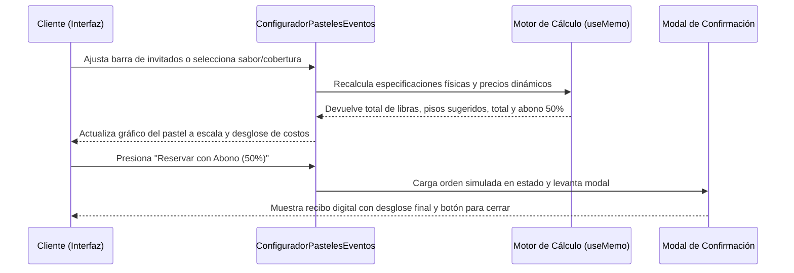

<!--
{
  "resource": "ConfiguradorPastelesEventos",
  "technicalName": "ConfiguradorPastelesEventos",
  "targetPath": "src/components/common/ConfiguradorPastelesEventos.jsx",
  "type": "component",
  "niches": ["alimentos-artesanales"],
  "dependencies": {
    "npm": {
      "lucide-react": "^0.300.0"
    },
    "internal": [
      {
        "name": "CustomSelect",
        "link": "file:///D:/PROTOTIPE/Documentacion%20PROTOTIPE/06_Biblioteca_Componentes/Componentes_Atomicos/Selector_Desplegable/custom_select.md"
      }
    ]
  }
}
-->

# ConfiguradorPastelesEventos

Asistente interactivo paso a paso para configurar pasteles personalizados de eventos, calculando de forma reactiva el peso sugerido (en libras/kilos), el número sugerido de pisos del pastel y el costo estimado según el número de invitados y los sabores seleccionados.

## 1. Propósito y Casos de Uso
* Pastelerías artesanales y reposterías gourmet que comercializan pasteles bajo pedido para bodas, cumpleaños y aniversarios.
* Automatización de cotizaciones de pastelería, evitando estimaciones manuales lentas y errores en la capacidad física del bizcocho.

## 2. Especificación Visual y Estilos (Tailwind CSS)
* **Diseño en 2 Columnas (Escritorio):** Panel izquierdo con controles de personalización y panel derecho con previsualización del pastel a escala (dibujo/representación visual reactiva del número de pisos). Se colapsa a 1 columna en móviles.
* **Paleta de Colores Pastelería:** Tonos suaves e inspiradores usando variables de tema, con acentos cálidos y texturas limpias.
* **Alineación de Rejilla Protegida:** Labels alineaos a la base con altura fija y sin anchos fijos en píxeles.

---

## 3. Código React Completo y 100% Funcional

```jsx
import React, { useState, useMemo } from 'react';
import { Sparkles, Calendar, Layers, Users, Heart, CheckCircle2 } from 'lucide-react';
import CustomSelect from '../ui/CustomSelect';

const SABORES_MASA = [
  { id: 'vainilla', label: 'Vainilla Francesa', colorCode: '#f3e1b7' },
  { id: 'chocolate', label: 'Chocolate Fudge', colorCode: '#4a2c2a' },
  { id: 'zanahoria', label: 'Zanahoria y Nueces', colorCode: '#d9743b' },
  { id: 'red_velvet', label: 'Red Velvet', colorCode: '#8a1a1b' }
];

const RELLENOS = [
  { value: 'arequipe', label: 'Arequipe / Dulce de Leche (+ $10.000)' },
  { value: 'frutos_rojos', label: 'Coulis de Frutos Rojos (+ $15.000)' },
  { value: 'crema_avellanas', label: 'Crema de Avellanas (+ $20.000)' },
  { value: 'chocolate_blanco', label: 'Mousse de Chocolate Blanco (+ $15.000)' },
  { value: 'limon_curd', label: 'Lemon Curd Artesanal (+ $12.000)' }
];

const COBERTURAS = [
  { value: 'crema_mantequilla', label: 'Crema de Mantequilla (Buttercream)' },
  { value: 'fondant', label: 'Fondant Suizo (+ $25.000)' },
  { value: 'ganache', label: 'Ganache de Chocolate Oscuro (+ $20.000)' },
  { value: 'semi_desnudo', label: 'Semi-Desnudo (Naked Cake)' }
];

export default function ConfiguradorPastelesEventos({ onReserve }) {
  const [invitados, setInvitados] = useState(25);
  const [saborMasa, setSaborMasa] = useState('vainilla');
  const [relleno, setRelleno] = useState('arequipe');
  const [cobertura, setCobertura] = useState('crema_mantequilla');
  const [dedicatoria, setDedicatoria] = useState('');
  const [reservaInfo, setReservaInfo] = useState(null);

  const especificacionesPastel = useMemo(() => {
    let pisos = 1;
    let pesoLibras = 1;

    if (invitados <= 15) {
      pisos = 1;
      pesoLibras = 1.5;
    } else if (invitados <= 35) {
      pisos = 2;
      pesoLibras = 3;
    } else if (invitados <= 70) {
      pisos = 3;
      pesoLibras = 5;
    } else {
      pisos = 4;
      pesoLibras = 8;
    }

    return { pisos, pesoLibras };
  }, [invitados]);

  const cotizacion = useMemo(() => {
    let basePrice = especificacionesPastel.pesoLibras * 45000;
    
    if (relleno === 'frutos_rojos' || relleno === 'chocolate_blanco') basePrice += 15000;
    if (relleno === 'crema_avellanas') basePrice += 20000;
    if (relleno === 'arequipe') basePrice += 10000;
    if (relleno === 'limon_curd') basePrice += 12000;

    if (cobertura === 'fondant') basePrice += 25000;
    if (cobertura === 'ganache') basePrice += 20000;

    basePrice += (especificacionesPastel.pisos - 1) * 15000;

    const total = basePrice;
    const abonoRequerido = total * 0.5;

    return { total, abonoRequerido };
  }, [especificacionesPastel, relleno, cobertura]);

  const cakeStyle = useMemo(() => {
    let crumb = '#f3e1b7';
    if (saborMasa === 'chocolate') crumb = '#4a2c2a';
    if (saborMasa === 'zanahoria') crumb = '#d9743b';
    if (saborMasa === 'red_velvet') crumb = '#8a1a1b';

    let filling = '#c18c5d';
    if (relleno === 'frutos_rojos') filling = '#be123c';
    if (relleno === 'crema_avellanas') filling = '#5c3a21';
    if (relleno === 'chocolate_blanco') filling = '#f3f4f6';
    if (relleno === 'limon_curd') filling = '#fbbf24';

    let frosting = '#fef3c7';
    if (cobertura === 'fondant') frosting = '#ffffff';
    if (cobertura === 'ganache') frosting = '#37221f';
    if (cobertura === 'semi_desnudo') frosting = 'rgba(254, 243, 199, 0.45)';

    return { crumb, filling, frosting };
  }, [saborMasa, relleno, cobertura]);

  const handleReserve = () => {
    const orden = {
      id: `PST-${Math.floor(1000 + Math.random() * 9000)}`,
      invitados,
      saborMasa: SABORES_MASA.find(s => s.id === saborMasa)?.label,
      relleno: RELLENOS.find(r => r.value === relleno)?.label,
      cobertura: COBERTURAS.find(c => c.value === cobertura)?.label,
      dedicatoria,
      especificacionesPastel,
      cotizacion
    };

    setReservaInfo(orden);
    if (onReserve) onReserve(orden);
  };

  return (
    <div className="w-full bg-[var(--color-surface)] text-[var(--color-text)] rounded-2xl border border-[var(--color-border)] shadow-xl p-4 sm:p-5 relative min-w-0">
      
      <div className="mb-6 border-b border-[var(--color-border)] pb-4 flex items-center gap-3">
        <div className="p-2 bg-[var(--color-primary)]/10 rounded-lg text-[var(--color-primary)]">
          <Sparkles className="w-6 h-6" />
        </div>
        <div>
          <h3 className="font-bold text-base text-[var(--color-text)]">Asistente de Configuración de Pasteles</h3>
          <p className="text-xs text-[var(--color-text-muted)] mt-0.5">Diseña el pastel ideal a tu medida y calcula el abono</p>
        </div>
      </div>

      <div className="grid grid-cols-1 lg:grid-cols-12 gap-6">
        
        <div className="lg:col-span-7 flex flex-col gap-4">
          
          <div>
            <div className="flex justify-between items-center mb-2">
              <label className="text-xs font-bold uppercase tracking-wider text-[var(--color-text-muted)]">
                Cantidad de Invitados
              </label>
              <span className="bg-[var(--color-primary)]/10 text-[var(--color-primary)] text-xs font-bold px-2 py-0.5 rounded-full">
                {invitados} Personas
              </span>
            </div>
            <input
              type="range"
              min="5"
              max="150"
              step="5"
              value={invitados}
              onChange={(e) => {
                setInvitados(parseInt(e.target.value));
                setReservaInfo(null);
              }}
              className="w-full h-2 bg-[var(--color-surface-2)] rounded-lg appearance-none cursor-pointer accent-[var(--color-primary)]"
            />
          </div>

          <div>
            <label className="block text-xs font-bold uppercase tracking-wider text-[var(--color-text-muted)] mb-2">
              Sabor de Masa (Bizcocho)
            </label>
            <div className="grid grid-cols-1 sm:grid-cols-2 gap-2.5">
              {SABORES_MASA.map((sabor) => (
                <button
                  key={sabor.id}
                  type="button"
                  onClick={() => {
                    setSaborMasa(sabor.id);
                    setReservaInfo(null);
                  }}
                  className={`flex items-center gap-2 px-3 py-2.5 rounded-xl text-xs font-bold border transition-all text-left cursor-pointer ${
                    saborMasa === sabor.id
                      ? 'bg-[var(--color-primary)]/10 border-[var(--color-primary)] text-[var(--color-primary)] shadow-sm scale-[1.01] ring-1 ring-[var(--color-primary)]/20'
                      : 'bg-[var(--color-surface-2)] border-[var(--color-border)] hover:bg-[var(--color-border)]/50 text-[var(--color-text)]'
                  }`}
                >
                  <span 
                    className="w-3.5 h-3.5 rounded-full border border-black/15 shrink-0 shadow-inner" 
                    style={{ backgroundColor: sabor.colorCode }}
                  />
                  <span className="truncate">{sabor.label}</span>
                </button>
              ))}
            </div>
          </div>

          <div className="grid grid-cols-1 sm:grid-cols-2 gap-3">
            <div>
              <label className="flex items-end text-xs font-bold uppercase tracking-wider text-[var(--color-text-muted)] mb-2 h-8 leading-tight">
                Relleno Principal
              </label>
              <CustomSelect
                options={RELLENOS}
                value={relleno}
                onChange={(val) => {
                  setRelleno(val);
                  setReservaInfo(null);
                }}
              />
            </div>
            <div>
              <label className="flex items-end text-xs font-bold uppercase tracking-wider text-[var(--color-text-muted)] mb-2 h-8 leading-tight">
                Cobertura / Acabado
              </label>
              <CustomSelect
                options={COBERTURAS}
                value={cobertura}
                onChange={(val) => {
                  setCobertura(val);
                  setReservaInfo(null);
                }}
              />
            </div>
          </div>

          <div>
            <label className="block text-xs font-bold uppercase tracking-wider text-[var(--color-text-muted)] mb-2">
              Dedicatoria Escrita (Opcional)
            </label>
            <input
              type="text"
              placeholder="Ej: ¡Feliz Cumpleaños Mamá! 🎉"
              value={dedicatoria}
              onChange={(e) => {
                setDedicatoria(e.target.value);
                setReservaInfo(null);
              }}
              maxLength={40}
              className="w-full h-10 px-3 bg-[var(--color-surface-2)] border border-[var(--color-border)] rounded-xl text-sm focus:outline-none focus:border-[var(--color-primary)] text-[var(--color-text)]"
            />
          </div>
        </div>

        <div className="lg:col-span-5 flex flex-col justify-between bg-[var(--color-surface-2)] border border-[var(--color-border)] rounded-2xl p-4 gap-4">
          
          <div className="flex-1 flex flex-col items-center justify-between min-h-[220px] bg-[var(--color-surface)] border border-[var(--color-border)] rounded-xl p-4 relative overflow-hidden">
            <div className="flex justify-between items-center w-full mb-2 border-b border-[var(--color-border)] pb-2">
              <span className="text-[10px] font-bold uppercase tracking-wider text-[var(--color-text-muted)]">
                Estructura Proyectada
              </span>
              <span className="text-[10px] font-bold text-emerald-600 bg-emerald-500/10 px-2 py-0.5 rounded-full">
                {especificacionesPastel.pisos} {especificacionesPastel.pisos === 1 ? 'Piso' : 'Pisos'}
              </span>
            </div>

            <div className="flex-1 flex flex-col justify-center items-center w-full py-2">
              <div className="flex flex-col-reverse items-center justify-center gap-1.5 w-full max-w-[180px] relative">
                <div className="w-40 h-2 bg-gradient-to-r from-slate-200 via-slate-300 to-slate-200 rounded-full border border-slate-400/50 shadow relative z-10 flex flex-col items-center">
                  <div className="w-12 h-6 bg-gradient-to-b from-slate-300 to-slate-400/80 border-x border-b border-slate-400 mx-auto shadow-inner rounded-b-lg absolute top-1.5" />
                </div>
                <div className="flex flex-col-reverse items-center gap-1.5 w-full relative z-20 pb-0.5">
                  {Array.from({ length: especificacionesPastel.pisos }).map((_, index) => {
                    const widths = ['w-32', 'w-24', 'w-18', 'w-12'];
                    const heights = ['h-9', 'h-8', 'h-7', 'h-6'];
                    return (
                      <div
                        key={index}
                        className={`${widths[index]} ${heights[index]} rounded-t-md rounded-b-sm border border-black/15 shadow relative overflow-hidden transition-all duration-300`}
                        style={{
                          background: `linear-gradient(to bottom, ${cakeStyle.crumb} 38%, ${cakeStyle.filling} 38%, ${cakeStyle.filling} 62%, ${cakeStyle.crumb} 62%)`
                        }}
                      >
                        <div 
                          className="absolute top-0 left-0 right-0 h-1.5 rounded-t-md border-b border-black/5" 
                          style={{ backgroundColor: cakeStyle.frosting }} 
                        />
                      </div>
                    );
                  })}
                </div>
              </div>
            </div>

            <div className="mt-2 text-center border-t border-[var(--color-border)] pt-2 w-full">
              <span className="text-[11px] font-semibold text-[var(--color-text-muted)] block">
                Detalle Físico:
              </span>
              <span className="text-xs font-bold text-[var(--color-text)]">
                Pastel de {especificacionesPastel.pesoLibras} Libras ({invitados} invitados)
              </span>
            </div>
          </div>

          <div className="border-t border-[var(--color-border)] pt-3 flex flex-col gap-2">
            <div className="flex justify-between items-center text-xs text-[var(--color-text-muted)] gap-4">
              <span className="truncate">Valor Base ({especificacionesPastel.pesoLibras} Lb)</span>
              <span className="font-semibold text-[var(--color-text)] whitespace-nowrap">
                ${(especificacionesPastel.pesoLibras * 45000).toLocaleString()}
              </span>
            </div>
            
            {(relleno !== 'arequipe' || cobertura !== 'crema_mantequilla' || especificacionesPastel.pisos > 1) && (
              <div className="flex justify-between items-center text-xs text-[var(--color-text-muted)] gap-4">
                <span className="truncate">Adicionales (Relleno/Acabado/Pisos)</span>
                <span className="font-semibold text-[var(--color-text)] whitespace-nowrap">
                  ${(cotizacion.total - (especificacionesPastel.pesoLibras * 45000)).toLocaleString()}
                </span>
              </div>
            )}

            <div className="flex justify-between items-center border-t border-[var(--color-border)] pt-2.5 mt-1 gap-4">
              <span className="text-xs font-bold">Costo Total Estimado</span>
              <span className="text-base font-extrabold text-[var(--color-primary)] whitespace-nowrap">
                ${cotizacion.total.toLocaleString()}
              </span>
            </div>

            <div className="flex justify-between items-center bg-[var(--color-primary)]/5 border border-[var(--color-primary)]/10 p-2.5 rounded-xl text-xs mt-1 gap-4">
              <span className="font-bold text-[var(--color-text-muted)]">Abono requerido (50%)</span>
              <span className="font-extrabold text-[var(--color-primary)] whitespace-nowrap">
                ${cotizacion.abonoRequerido.toLocaleString()}
              </span>
            </div>
          </div>

          <button
            onClick={handleReserve}
            type="button"
            className="w-full py-2.5 px-4 min-h-[44px] h-auto bg-[var(--color-primary)] hover:opacity-90 active:scale-95 text-[var(--color-text)] font-bold text-xs rounded-xl transition-all shadow-sm flex items-center justify-center gap-2 cursor-pointer !text-[var(--color-text)]"
          >
            <Calendar className="w-4 h-4" />
            <span>Reservar con Abono (50%)</span>
          </button>
        </div>
      </div>

      {reservaInfo && (
        <div className="fixed inset-0 bg-black/60 backdrop-blur-sm z-50 flex items-center justify-center p-4">
          <div className="bg-[var(--color-surface)] border border-[var(--color-border)] rounded-2xl p-5 max-w-sm w-full shadow-2xl flex flex-col gap-4 text-center">
            <div className="mx-auto p-2 bg-emerald-100 text-emerald-600 rounded-full w-12 h-12 flex items-center justify-center">
              <CheckCircle2 className="w-8 h-8" />
            </div>
            <div>
              <h4 className="font-bold text-lg text-[var(--color-text)]">¡Reserva Generada!</h4>
              <p className="text-xs text-[var(--color-text-muted)] mt-1">
                Orden registrada bajo el código <span className="font-mono font-bold text-[var(--color-text)]">{reservaInfo.id}</span>
              </p>
            </div>

            <div className="bg-[var(--color-surface-2)] border border-[var(--color-border)] rounded-xl p-3 text-left flex flex-col gap-1.5 text-xs">
              <p className="text-[var(--color-text)]"><strong>Masa:</strong> {reservaInfo.saborMasa}</p>
              <p className="text-[var(--color-text)]"><strong>Relleno:</strong> {reservaInfo.relleno}</p>
              <p className="text-[var(--color-text)]"><strong>Estructura:</strong> {reservaInfo.especificacionesPastel.pesoLibras} Libras ({reservaInfo.especificacionesPastel.pisos} Pisos)</p>
              {reservaInfo.dedicatoria && <p className="text-[var(--color-text)]"><strong>Dedicatoria:</strong> "{reservaInfo.dedicatoria}"</p>}
              <hr className="border-[var(--color-border)] my-1" />
              <div className="flex justify-between text-emerald-600 font-bold">
                <span>Abono Confirmado:</span>
                <span className="whitespace-nowrap">${reservaInfo.cotizacion.abonoRequerido.toLocaleString()}</span>
              </div>
            </div>

            <button
              onClick={() => setReservaInfo(null)}
              type="button"
              className="w-full py-2 bg-[var(--color-surface-2)] hover:bg-[var(--color-border)] border border-[var(--color-border)] text-xs font-semibold rounded-lg transition-colors text-[var(--color-text)]"
            >
              Cerrar Vista
            </button>
          </div>
        </div>
      )}
    </div>
  );
}
```

## 4. Lógica de Estado y Ciclo de Vida
* **`invitados` (Número):** Estado que controla el número total de comensales. Su cambio recalcula de forma reactiva el peso y pisos requeridos, además de influir directamente en el precio base.
* **`cotizacion` (Objeto memoizado):** Centraliza la lógica de tarificación. Recalcula el precio total y la cuota de abono del 50% de manera eficiente a través de un hook `useMemo` para evitar re-renders innecesarios.
* **`reservaInfo` (Objeto):** Almacena el ticket temporal de reserva al presionar el botón principal. Si este estado no es nulo, despliega un portal/modal confirmando la dedicatoria, el abono y el ID de cotización.

## 5. Flujo Operativo y Secuencia de Interacción


