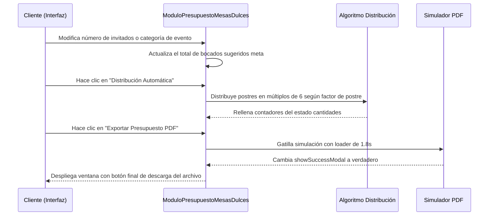

<!--
{
  "resource": "ModuloPresupuestoMesasDulces",
  "technicalName": "ModuloPresupuestoMesasDulces",
  "targetPath": "src/components/common/ModuloPresupuestoMesasDulces.jsx",
  "type": "component",
  "niches": ["alimentos-artesanales"],
  "dependencies": {
    "npm": {
      "lucide-react": "^0.300.0"
    },
    "internal": [
      {
        "name": "CustomSelect",
        "link": "file:///D:/PROTOTIPE/Documentacion%20PROTOTIPE/06_Biblioteca_Componentes/Componentes_Atomicos/Selector_Desplegable/custom_select.md"
      }
    ]
  }
}
-->

# ModuloPresupuestoMesasDulces

Cotizador dinámico para mesas de postres de eventos que calcula la distribución ideal y cantidades de cupcakes, trufas, macarons y shots dulces recomendados según el número de invitados del cliente.

## 1. Propósito y Casos de Uso
* Pastelerías y banqueteras de eventos que comercializan mesas de postres por volumen y requieren agilizar el cálculo de raciones y costes.
* Herramienta comercial de ventas para cotizar en tiempo real durante reuniones de planificación de bodas, quinceañeros y eventos corporativos.

## 2. Especificación Visual y Estilos (Tailwind CSS)
* **Rejilla con Foto de Producto:** Lista de postres con imágenes ilustrativas, contadores de incremento táctiles (`w-8 h-8`) y descripción corta.
* **Alineación Vertical en Inputs:**
  - Labels con clase `flex items-end h-8 mb-2 leading-tight` para mantener consistencia.
  - Ocultamiento de spinners en inputs de tipo numérico (`[appearance:textfield]`).
* **Botones e Indicadores B2B:** Total cotizado, costo promedio por invitado y barra informativa del total de bocados sugeridos.

---

## 3. Código React Completo y 100% Funcional

```jsx
import React, { useState, useMemo } from 'react';
import { Sparkles, Users, Award, FileText, Check, Plus, Minus, Download, HelpCircle, Loader2 } from 'lucide-react';
import CustomSelect from '../ui/CustomSelect';

const EVENTOS_CATEGORIAS = [
  { value: 'boda', label: 'Boda / Matrimonio (Sugerencia 3.5 postres/persona)' },
  { value: 'cumpleanos', label: 'Cumpleaños / Infantil (Sugerencia 2.5 postres/persona)' },
  { value: 'quince', label: 'Quinceañero / Sweet 16 (Sugerencia 3.0 postres/persona)' },
  { value: 'corporativo', label: 'Evento Corporativo (Sugerencia 2.0 postres/persona)' }
];

const POSTRES_DISPONIBLES = [
  { id: 'macaron', label: 'Macarons Franceses Surtidos', price: 4200, factor: 0.8, img: 'https://images.unsplash.com/photo-1569864358642-9d1684040f43?auto=format&fit=crop&w=150&q=80' },
  { id: 'cupcake', label: 'Mini Cupcakes Red Velvet', price: 3800, factor: 0.6, img: 'https://images.unsplash.com/photo-1576618148400-f54bed99fcfd?auto=format&fit=crop&w=150&q=80' },
  { id: 'trufa', label: 'Trufas de Chocolate Belga', price: 2800, factor: 1.0, img: 'https://images.unsplash.com/photo-1549007994-cb92ca87df46?auto=format&fit=crop&w=150&q=80' },
  { id: 'shot', label: 'Shots de Tres Leches / Maracuyá', price: 4500, factor: 0.5, img: 'https://images.unsplash.com/photo-1587314168485-3236d6710814?auto=format&fit=crop&w=150&q=80' }
];

export default function ModuloPresupuestoMesasDulces({ onAddCombo }) {
  const [invitados, setInvitados] = useState(50);
  const [tipoEvento, setTipoEvento] = useState('boda');
  const [cantidades, setCantidades] = useState({
    macaron: 0,
    cupcake: 0,
    trufa: 0,
    shot: 0
  });

  const [savingPDF, setSavingPDF] = useState(false);
  const [showSuccessModal, setShowSuccessModal] = useState(false);
  const [eventNameInput, setEventNameInput] = useState('');
  const [toastText, setToastText] = useState('');

  // Proporción de postres por persona de acuerdo al tipo de evento
  const postresSugeridosPorPersona = useMemo(() => {
    switch (tipoEvento) {
      case 'boda': return 3.5;
      case 'quince': return 3.0;
      case 'cumpleanos': return 2.5;
      case 'corporativo': return 2.0;
      default: return 3.0;
    }
  }, [tipoEvento]);

  const totalBocadosSugeridos = useMemo(() => {
    return Math.ceil(invitados * postresSugeridosPorPersona);
  }, [invitados, postresSugeridosPorPersona]);

  // Totales reales del cotizador
  const resumenCotizacion = useMemo(() => {
    let totalPiezas = 0;
    let costoTotal = 0;

    POSTRES_DISPONIBLES.forEach((p) => {
      const cant = cantidades[p.id] || 0;
      totalPiezas += cant;
      costoTotal += cant * p.price;
    });

    const costoPorInvitado = invitados > 0 ? costoTotal / invitados : 0;

    return { totalPiezas, costoTotal, costoPorInvitado };
  }, [cantidades, invitados]);

  // Función de distribución automática inteligente
  const handleAutoDistribute = () => {
    const totalObjetivo = totalBocadosSugeridos;
    const nuevasCantidades = {};

    POSTRES_DISPONIBLES.forEach((p) => {
      // Distribución ponderada según factor de salida típico
      const cantidadSugerida = Math.round((totalObjetivo * p.factor) / 2.9);
      // Redondear a múltiplos de 6 (bandejas estándar de despacho)
      nuevasCantidades[p.id] = Math.ceil(cantidadSugerida / 6) * 6;
    });

    setCantidades(nuevasCantidades);
    setToastText('Distribución automática recomendada aplicada');
    setTimeout(() => setToastText(''), 3000);
  };

  const handleUpdateCantidad = (id, delta) => {
    setCantidades((prev) => {
      const current = prev[id] || 0;
      const next = Math.max(0, current + delta);
      return { ...prev, [id]: next };
    });
  };

  const handleExportPDF = () => {
    if (resumenCotizacion.totalPiezas === 0) return;
    setSavingPDF(true);
    // Simular render del archivo PDF comercial
    setTimeout(() => {
      setSavingPDF(false);
      setShowSuccessModal(true);
    }, 1800);
  };

  const handleAddAll = () => {
    if (resumenCotizacion.totalPiezas === 0 || !onAddCombo) return;
    
    const comboInfo = {
      id: `MESA-${Math.floor(1000 + Math.random() * 9000)}`,
      nombre: `Mesa Dulces - Evento ${eventNameInput || 'Personalizado'}`,
      precio: resumenCotizacion.costoTotal,
      cant: 1,
      detalle: cantidades
    };

    onAddCombo(comboInfo);
    setToastText('Mesa de dulces inyectada al pedido exitosamente');
    setTimeout(() => setToastText(''), 3500);
  };

  return (
    <div className="w-full bg-[var(--color-surface)] text-[var(--color-text)] rounded-2xl border border-[var(--color-border)] shadow-xl p-4 sm:p-5 relative min-w-0">
      
      {/* Toast de Éxito */}
      {toastText && (
        <div className="absolute top-4 left-1/2 -translate-x-1/2 z-50 bg-emerald-600 text-[var(--color-text)] px-4 py-2 rounded-full text-xs font-semibold shadow-lg flex items-center gap-2 whitespace-nowrap">
          <Check className="w-4 h-4" />
          <span>{toastText}</span>
        </div>
      )}

      {/* Header */}
      <div className="mb-5 border-b border-[var(--color-border)] pb-4 flex items-center gap-3">
        <div className="p-2 bg-[var(--color-primary)]/10 rounded-lg text-[var(--color-primary)]">
          <Sparkles className="w-6 h-6" />
        </div>
        <div>
          <h3 className="font-bold text-base text-[var(--color-text)]">Cotizador de Mesas de Postres</h3>
          <p className="text-xs text-[var(--color-text-muted)] mt-0.5">Calcula bocados sugeridos y cotiza por número de invitados</p>
        </div>
      </div>

      <div className="grid grid-cols-1 lg:grid-cols-12 gap-5">
        
        {/* Parámetros de la Mesa */}
        <div className="lg:col-span-12 grid grid-cols-1 md:grid-cols-3 gap-3 bg-[var(--color-surface-2)] p-4 rounded-xl border border-[var(--color-border)]">
          <div>
            <label className="flex items-end text-xs font-bold uppercase tracking-wider text-[var(--color-text-muted)] mb-2 h-8 leading-tight">
              Tipo de Evento
            </label>
            <CustomSelect
              options={EVENTOS_CATEGORIAS}
              value={tipoEvento}
              onChange={(val) => {
                setTipoEvento(val);
                setCantidades({ macaron: 0, cupcake: 0, trufa: 0, shot: 0 }); // Resetear
              }}
            />
          </div>

          <div>
            <label className="flex items-end text-xs font-bold uppercase tracking-wider text-[var(--color-text-muted)] mb-2 h-8 leading-tight">
              Número de Invitados
            </label>
            <input
              type="number"
              min="10"
              max="1000"
              value={invitados}
              onChange={(e) => {
                setInvitados(Math.max(10, parseInt(e.target.value) || 0));
                setCantidades({ macaron: 0, cupcake: 0, trufa: 0, shot: 0 });
              }}
              className="w-full h-10 px-3 bg-[var(--color-surface)] border border-[var(--color-border)] rounded-xl text-sm focus:outline-none focus:border-[var(--color-primary)] text-[var(--color-text)] [appearance:textfield] [&::-webkit-outer-spin-button]:appearance-none [&::-webkit-inner-spin-button]:appearance-none"
            />
          </div>

          <div>
            <label className="flex items-end text-xs font-bold uppercase tracking-wider text-[var(--color-text-muted)] mb-2 h-8 leading-tight">
              Nombre del Evento (B2B)
            </label>
            <input
              type="text"
              placeholder="Ej: Boda Gómez Arboleda 💍"
              value={eventNameInput}
              onChange={(e) => setEventNameInput(e.target.value)}
              className="w-full h-10 px-3 bg-[var(--color-surface)] border border-[var(--color-border)] rounded-xl text-sm focus:outline-none focus:border-[var(--color-primary)] text-[var(--color-text)]"
            />
          </div>
        </div>

        {/* Lista de Postres y Selección de Cantidades */}
        <div className="lg:col-span-7 flex flex-col gap-3">
          
          <div className="flex justify-between items-center py-1">
            <span className="text-xs font-bold uppercase tracking-wider text-[var(--color-text-muted)] flex items-center gap-1">
              <Users className="w-4 h-4 text-[var(--color-primary)]" />
              Bocados Proyectados: {totalBocadosSugeridos} unidades
            </span>
            <button
              onClick={handleAutoDistribute}
              type="button"
              className="text-[11px] font-bold text-[var(--color-primary)] hover:underline flex items-center gap-1 bg-[var(--color-primary)]/5 px-2.5 py-1.5 rounded-lg border border-[var(--color-primary)]/15 active:scale-95 transition-all cursor-pointer"
            >
              Distribución Automática
            </button>
          </div>

          {/* Lista de Postres en Grid */}
          <div className="flex flex-col gap-3">
            {POSTRES_DISPONIBLES.map((postre) => {
              const cant = cantidades[postre.id] || 0;
              return (
                <div
                  key={postre.id}
                  className="bg-[var(--color-surface-2)] border border-[var(--color-border)] rounded-xl p-3.5 flex flex-col sm:flex-row sm:items-center justify-between gap-3 shadow-sm hover:shadow transition-shadow"
                >
                  {/* Info postre */}
                  <div className="flex items-center gap-3 min-w-0">
                     {
                        e.target.onerror = null;
                        e.target.src = "https://images.unsplash.com/photo-1576618148400-f54bed99fcfd?auto=format&fit=crop&w=150&q=80";
                      }}
                      className="w-12 h-12 object-cover rounded-lg border border-[var(--color-border)] shrink-0"
                    />
                    <div className="min-w-0">
                      <p className="font-bold text-xs text-[var(--color-text)] truncate">{postre.label}</p>
                      <p className="text-[10px] text-[var(--color-text-muted)] mt-0.5 whitespace-nowrap">
                        Precio Unitario: <span className="font-semibold text-[var(--color-text)]">${postre.price.toLocaleString()}</span>
                      </p>
                    </div>
                  </div>

                  {/* Controles y Total */}
                  <div className="flex items-center justify-between sm:justify-end gap-4 border-t border-[var(--color-border)]/50 pt-2 sm:border-0 sm:pt-0 shrink-0">
                    <div className="flex items-center bg-[var(--color-surface)] border border-[var(--color-border)] rounded-lg p-1 gap-1">
                      <button
                        onClick={() => handleUpdateCantidad(postre.id, -6)}
                        type="button"
                        className="w-7 h-7 bg-[var(--color-surface-2)] hover:bg-[var(--color-border)] rounded flex items-center justify-center text-xs font-bold transition-all text-[var(--color-text)] active:scale-90 cursor-pointer"
                      >
                        <Minus className="w-3.5 h-3.5" />
                      </button>
                      
                      <span className="w-8 text-center text-xs font-bold font-mono text-[var(--color-text)]">
                        {cant}
                      </span>

                      <button
                        onClick={() => handleUpdateCantidad(postre.id, 6)}
                        type="button"
                        className="w-7 h-7 bg-[var(--color-surface-2)] hover:bg-[var(--color-border)] rounded flex items-center justify-center text-xs font-bold transition-all text-[var(--color-text)] active:scale-90 cursor-pointer"
                      >
                        <Plus className="w-3.5 h-3.5" />
                      </button>
                    </div>
                    
                    <span className="w-16 text-right font-bold text-xs text-[var(--color-text)] whitespace-nowrap">
                      ${(cant * postre.price).toLocaleString()}
                    </span>
                  </div>
                </div>
              );
            })}
          </div>

        </div>

        {/* Panel lateral de Cotización */}
        <div className="lg:col-span-5 flex flex-col justify-between bg-[var(--color-surface-2)] border border-[var(--color-border)] rounded-2xl p-4 gap-4">
          
          {/* Resumen de Raciones */}
          <div className="flex flex-col gap-3">
            <span className="text-[10px] font-bold uppercase tracking-wider text-[var(--color-text-muted)]">
              Estado de la Muestra
            </span>

            <div className="bg-[var(--color-surface)] border border-[var(--color-border)] rounded-xl p-3 flex flex-col gap-2.5">
              <div className="flex justify-between items-center text-xs">
                <span className="text-[var(--color-text-muted)] font-medium">Bocados Seleccionados:</span>
                <span className={`font-bold ${resumenCotizacion.totalPiezas >= totalBocadosSugeridos ? 'text-emerald-600' : 'text-amber-600'}`}>
                  {resumenCotizacion.totalPiezas} / {totalBocadosSugeridos} Unid.
                </span>
              </div>

              {/* Barra de progreso de cobertura */}
              <div className="w-full h-2 bg-[var(--color-surface-2)] rounded-full overflow-hidden">
                <div
                  className={`h-full transition-all duration-300 ${
                    resumenCotizacion.totalPiezas >= totalBocadosSugeridos ? 'bg-emerald-500' : 'bg-amber-500'
                  }`}
                  style={{ width: `${Math.min(100, (resumenCotizacion.totalPiezas / totalBocadosSugeridos) * 100)}%` }}
                />
              </div>

              <span className="text-[9px] text-[var(--color-text-muted)] leading-tight">
                * Las cantidades deben cotizarse en múltiplos de 6 por restricciones de caja de horneado.
              </span>
            </div>
          </div>

          {/* Desglose de Costes B2B */}
          <div className="border-t border-[var(--color-border)] pt-3 flex flex-col gap-2">
            <div className="flex justify-between items-center text-xs text-[var(--color-text-muted)]">
              <span>Total Postres:</span>
              <span className="font-semibold text-[var(--color-text)]">{resumenCotizacion.totalPiezas} unidades</span>
            </div>
            
            <div className="flex justify-between items-center text-xs text-[var(--color-text-muted)]">
              <span>Costo por Invitado:</span>
              <span className="font-semibold text-[var(--color-text)]">$ {Math.round(resumenCotizacion.costoPorInvitado).toLocaleString()} / pers.</span>
            </div>

            <div className="flex justify-between items-center border-t border-[var(--color-border)] pt-2 mt-1">
              <span className="text-xs font-bold">Valor Total Mesa Dulces:</span>
              <span className="text-base font-extrabold text-[var(--color-primary)]">
                $ {resumenCotizacion.costoTotal.toLocaleString()}
              </span>
            </div>
          </div>

          {/* Acciones del Cotizador */}
          <div className="flex flex-col gap-2">
            <button
              onClick={handleExportPDF}
              disabled={resumenCotizacion.totalPiezas === 0 || savingPDF}
              type="button"
              className={`w-full py-2 px-4 min-h-[40px] h-auto border border-[var(--color-border)] font-semibold text-xs rounded-xl flex items-center justify-center gap-2 transition-all ${
                resumenCotizacion.totalPiezas > 0 && !savingPDF
                  ? 'bg-[var(--color-surface)] hover:bg-[var(--color-border)] cursor-pointer text-[var(--color-text)]'
                  : 'bg-[var(--color-surface-3)] text-[var(--color-text-muted)]/50 border border-[var(--color-border)] cursor-not-allowed'
              }`}
            >
              {savingPDF ? (
                <>
                  <Loader2 className="w-4 h-4 animate-spin text-[var(--color-primary)]" />
                  <span>Generando PDF...</span>
                </>
              ) : (
                <>
                  <FileText className="w-4 h-4" />
                  <span>Exportar Presupuesto PDF</span>
                </>
              )}
            </button>

            <button
              onClick={handleAddAll}
              disabled={resumenCotizacion.totalPiezas === 0}
              type="button"
              className={`w-full py-2.5 px-4 min-h-[44px] h-auto font-bold text-xs rounded-xl transition-all shadow-sm flex items-center justify-center gap-2 ${
                resumenCotizacion.totalPiezas > 0
                  ? 'bg-[var(--color-primary)] text-[var(--color-text)] hover:opacity-90 active:scale-95 cursor-pointer !text-[var(--color-text)]'
                  : 'bg-[var(--color-surface-3)] text-[var(--color-text-muted)]/50 border border-[var(--color-border)] cursor-not-allowed'
              }`}
            >
              <Plus className="w-4 h-4" />
              <span>Añadir Mesa Dulces al Pedido</span>
            </button>
          </div>

        </div>

      </div>

      {/* Modal Éxito PDF */}
      {showSuccessModal && (
        <div className="fixed inset-0 bg-black/60 backdrop-blur-sm z-50 flex items-center justify-center p-4">
          <div className="bg-[var(--color-surface)] border border-[var(--color-border)] rounded-2xl p-5 max-w-sm w-full shadow-2xl flex flex-col gap-4 text-center">
            <div className="mx-auto p-2 bg-emerald-100 text-emerald-600 rounded-full w-12 h-12 flex items-center justify-center">
              <Download className="w-8 h-8" />
            </div>
            <div>
              <h4 className="font-bold text-lg text-[var(--color-text)]">¡PDF Listo para Descargar!</h4>
              <p className="text-xs text-[var(--color-text-muted)] mt-1">
                La cotización formal para <span className="font-bold text-[var(--color-text)]">"{eventNameInput || 'Mesa Dulces Personalizada'}"</span> ha sido generada exitosamente.
              </p>
            </div>

            <div className="bg-[var(--color-surface-2)] border border-[var(--color-border)] rounded-xl p-3 text-left flex flex-col gap-1 text-xs">
              <p className="text-[var(--color-text)]"><strong>Bocados Totales:</strong> {resumenCotizacion.totalPiezas} postres</p>
              <p className="text-[var(--color-text)]"><strong>Mesa de postres:</strong> Macarons ({cantidades.macaron}), Cupcakes ({cantidades.cupcake}), Trufas ({cantidades.trufa}), Shots ({cantidades.shot})</p>
              <hr className="border-[var(--color-border)] my-1" />
              <div className="flex justify-between text-[var(--color-primary)] font-bold">
                <span>Total Cotizado:</span>
                <span>$ {resumenCotizacion.costoTotal.toLocaleString()}</span>
              </div>
            </div>

            <button
              onClick={() => setShowSuccessModal(false)}
              type="button"
              className="w-full py-2 bg-[var(--color-primary)] hover:opacity-90 text-[var(--color-text)] font-bold rounded-lg transition-all !text-[var(--color-text)]"
            >
              Descargar Archivo Cotización
            </button>
          </div>
        </div>
      )}

    </div>
  );
}
```

## 4. Lógica de Estado y Ciclo de Vida
* **`cantidades` (Objeto):** Mapa clave-valor que controla las porciones de postres seleccionados (macarons, cupcakes, trufas, shots). La modificación de cualquier contador actualiza de manera reactiva el total de piezas y el valor del presupuesto.
* **`savingPDF` (Booleano):** Estado que simula la espera de renderizado del documento PDF comercial, desplegando un spinner con clase `animate-spin` en el botón para simular una carga pesada asíncrona.
* **`showSuccessModal` (Booleano):** Estado de control del portal de éxito que despliega el archivo listo para descarga.

## 5. Flujo Operativo y Secuencia de Interacción


