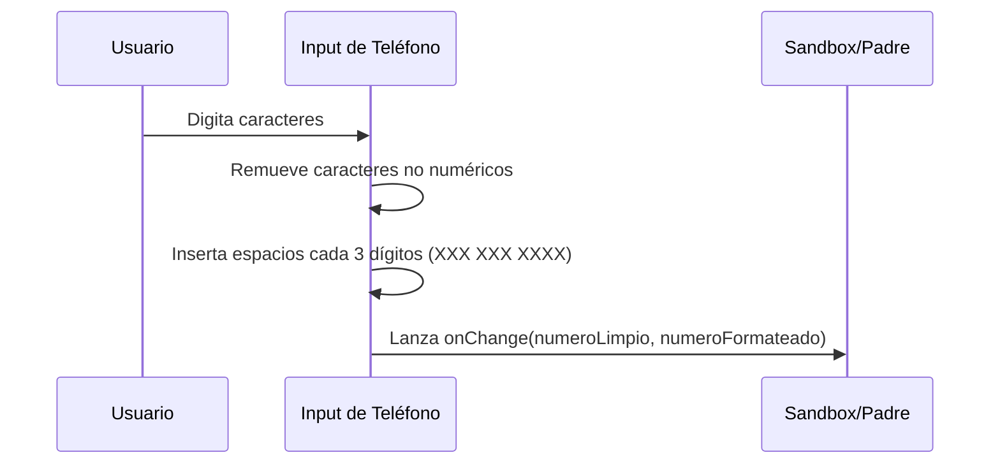

<!--
{
  "technicalName": "PhoneFormattingInput",
  "targetPath": "src/components/ui/PhoneFormattingInput.jsx",
  "dependencies": {
    "npm": {
      "lucide-react": "^0.300.0"
    },
    "internal": [
      {
        "name": "CustomSelect",
        "link": "file:///D:/PROTOTIPE/Documentacion%20PROTOTIPE/06_Biblioteca_Componentes/Componentes_Atomicos/Selector_Desplegable/custom_select.md"
      }
    ]
  },
  "type": "atom",
  "niches": []
}
-->

# PhoneFormattingInput — Input Telefónico con Formato e Indicativos

## 1. Propósito y Casos de Uso
El `PhoneFormattingInput` es un componente de formulario diseñado para la captura y formateo de números de celular en la plataforma de compras o el portal administrativo. Aplica automáticamente espaciados de lectura a medida que se digita y gestiona códigos internacionales mediante `CustomSelect`.

## 2. Especificación Visual y Estilos
- **Maquetación Responsiva:** Estructura apilada horizontal limpia con bordes HSL unificados.
- **Formateador Táctil:** Inyección de espacios en blanco periódicos en base a la longitud sin interferir con la edición del cursor.

## 3. Código React Completo y 100% Funcional

```jsx
import React, { useState } from 'react';
import { Phone } from 'lucide-react';
import CustomSelect from '../Selector_Desplegable/CustomSelect';

const COUNTRY_CODES = [
  { value: '+57', label: '🇨🇴 +57' },
  { value: '+1', label: '🇺🇸 +1' },
  { value: '+52', label: '🇲🇽 +52' },
  { value: '+34', label: '🇪🇸 +34' },
  { value: '+54', label: '🇦🇷 +54' }
];

export default function PhoneFormattingInput({
  value,
  onChange,
  countryCode = '+57',
  onCountryCodeChange,
  placeholder = '300 123 4567',
  className = ''
}) {
  const [isFocused, setIsFocused] = useState(false);

  // Sanitiza el texto reteniendo solo números
  const cleanNumber = (val) => val.replace(/\D/g, '');

  // Aplica la máscara XXX XXX XXXX
  const formatPhone = (val) => {
    const raw = cleanNumber(val).slice(0, 10);
    if (raw.length <= 3) return raw;
    if (raw.length <= 6) return `${raw.slice(0, 3)} ${raw.slice(3)}`;
    return `${raw.slice(0, 3)} ${raw.slice(3, 6)} ${raw.slice(6)}`;
  };

  const handleInputChange = (e) => {
    const rawValue = e.target.value;
    const formatted = formatPhone(rawValue);
    const clean = cleanNumber(formatted);
    onChange(clean, formatted);
  };

  return (
    <div className={`relative w-full ${className}`}>
      <div
        className={`flex items-stretch w-full min-h-[44px] rounded-xl border bg-[var(--color-surface)] overflow-hidden transition-all duration-300 ${
          isFocused
            ? 'border-[var(--color-primary)] ring-2 ring-[var(--color-primary)]/20 shadow-md shadow-[var(--color-primary)]/5'
            : 'border-[var(--color-border)] hover:border-[var(--color-text-muted)]/50'
        }`}
      >
        {/* Selector de Indicativo de País */}
        <div className="w-[110px] shrink-0 border-r border-[var(--color-border)] flex items-center bg-[var(--color-surface-2)]">
          <CustomSelect
            options={COUNTRY_CODES}
            value={countryCode}
            onChange={onCountryCodeChange}
            className="border-none bg-transparent h-full"
          />
        </div>

        {/* Input Telefónico */}
        <div className="flex-1 flex items-center px-3.5">
          <Phone className="w-5 h-5 text-[var(--color-text-muted)] shrink-0 mr-2.5" />
          <input
            type="text"
            value={formatPhone(value)}
            onChange={handleInputChange}
            placeholder={placeholder}
            onFocus={() => setIsFocused(true)}
            onBlur={() => setIsFocused(false)}
            className="w-full h-10 bg-transparent text-[var(--color-text)] focus:outline-none placeholder-transparent text-sm [appearance:textfield] [&::-webkit-outer-spin-button]:appearance-none [&::-webkit-inner-spin-button]:appearance-none"
          />
        </div>
      </div>
    </div>
  );
}
```

## 4. Lógica de Estado y Ciclo de Vida
Propaga los cambios mediante el callback `onChange` devolviendo dos versiones del número: la versión desinfectada de caracteres no numéricos (para base de datos) y la versión formateada con espacios (para presentación visual en pantalla).

## 5. Flujo Operativo y Secuencia de Interacción


