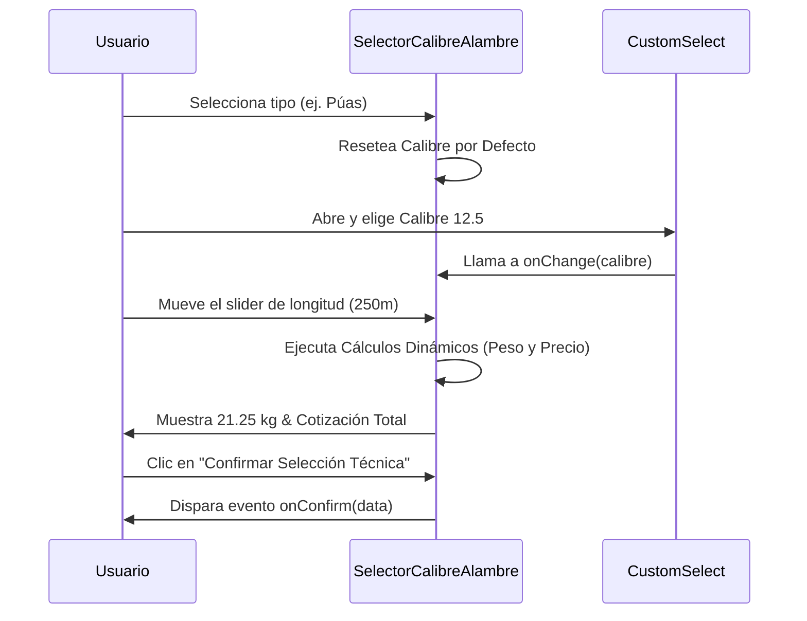

<!--
{
  "resource": "SelectorCalibreAlambre",
  "technicalName": "SelectorCalibreAlambre",
  "targetPath": "src/components/common/SelectorCalibreAlambre.jsx",
  "type": "component",
  "niches": ["ferreteria-rural"],
  "dependencies": {
    "npm": {
      "framer-motion": "^12.40.0",
      "lucide-react": "^1.16.0"
    },
    "internal": [
      {
        "name": "CustomSelect",
        "link": "file:///D:/PROTOTIPE/Documentacion%20PROTOTIPE/06_Biblioteca_Componentes/Componentes_Atomicos/Selector_Desplegable/custom_select.md"
      }
    ]
  }
}
-->

# Selector de Calibre y Alambre Rural (`SelectorCalibreAlambre`)

El componente `SelectorCalibreAlambre` permite a los usuarios configurar cercados y alambres rurales (como alambres de púas, galvanizados y concertinas) mediante una interfaz visual intuitiva, facilitando la selección del calibre idóneo y el cálculo dinámico del metraje, peso estimado de transporte y cotización de referencia comercial.

---

## 1. Propósito y Casos de Uso
- **Cotizador de Cercados:** Estimar de manera interactiva el peso y costo del alambre según la longitud lineal de los linderos del lote o finca.
- **Selector Técnico de Calibres:** Facilitar la comprensión de la relación inversa entre el número de calibre (AWG) y el grosor del alambre, ofreciendo datos de resistencia mecánica para evitar compras erróneas.
- **Logística y Transporte:** Proveer el tonelaje/peso estimado acumulado en kilogramos para calcular el flete del despacho antes del pago.

---

## 2. Especificación Visual y Estilos
- **Esquema de Color:** Gradientes adaptables violeta/índigo basados en variables HSL semánticas (`var(--color-primary)`, `var(--color-surface)`).
- **Mobile-First Layout:** Disposición en una columna vertical para móviles que escala a dos columnas en pantallas grandes (`lg:grid-cols-12`).
- **Micro-animaciones:** Efectos de hover en las tarjetas de tipo de alambre, y transiciones suaves durante la selección de opciones.
- **Controles Premium:** Reemplazo de selectores HTML nativos por un selector interactivo tipo tarjeta y el componente unificado `CustomSelect.jsx`.

---

## 3. Código React Completo

```jsx
import React, { useState, useMemo } from 'react';
import { Shield, Sparkles, Scale, Info, Weight, ChevronRight, Check } from 'lucide-react';
import CustomSelect from '../ui/CustomSelect';

const ALAMBRE_TIPOS = [
  {
    id: 'puas',
    name: 'Alambre de Púas',
    description: 'Cercados ganaderos y seguridad perimetral.',
    icon: Shield,
    color: 'from-amber-500/20 to-orange-500/20',
    borderClass: 'border-orange-500/30',
    basePricePerMeter: 450, // COP
    densityPerMeter: 0.085, // kg
    calibres: [
      { value: '12.5', label: 'Calibre 12.5 (2.51 mm) - Alta Tensión', multPrice: 1.2, resistance: '400 kgf' },
      { value: '14', label: 'Calibre 14 (2.03 mm) - Tradicional', multPrice: 1.0, resistance: '350 kgf' },
      { value: '16', label: 'Calibre 16 (1.65 mm) - Suave/Manejable', multPrice: 0.85, resistance: '280 kgf' }
    ]
  },
  {
    id: 'galvanizado',
    name: 'Alambre Galvanizado',
    description: 'Cercados lisos, viñedos, tutorado y amarres.',
    icon: Sparkles,
    color: 'from-blue-500/20 to-indigo-500/20',
    borderClass: 'border-indigo-500/30',
    basePricePerMeter: 380, // COP
    densityPerMeter: 0.065, // kg
    calibres: [
      { value: '10', label: 'Calibre 10 (3.40 mm) - Industrial', multPrice: 1.4, resistance: '520 kgf' },
      { value: '12', label: 'Calibre 12 (2.77 mm) - Estructural', multPrice: 1.15, resistance: '450 kgf' },
      { value: '14', label: 'Calibre 14 (2.03 mm) - Multipropósito', multPrice: 0.95, resistance: '380 kgf' },
      { value: '16', label: 'Calibre 16 (1.65 mm) - Amarre y Mallas', multPrice: 0.8, resistance: '290 kgf' }
    ]
  },
  {
    id: 'concertina',
    name: 'Alambre Concertina (Cuchillas)',
    description: 'Máxima seguridad militar y residencial.',
    icon: Scale,
    color: 'from-rose-500/20 to-red-500/20',
    borderClass: 'border-rose-500/30',
    basePricePerMeter: 1200, // COP
    densityPerMeter: 0.12, // kg
    calibres: [
      { value: '12', label: 'Calibre 12 (2.77 mm) + Cuchilla Galvanizada', multPrice: 1.3, resistance: '650 kgf' },
      { value: '14', label: 'Calibre 14 (2.03 mm) + Cuchilla de Acero', multPrice: 1.0, resistance: '580 kgf' }
    ]
  }
];

export default function SelectorCalibreAlambre({
  onConfirm,
  currencySymbol = '$',
  className = ''
}) {
  const [selectedTipoId, setSelectedTipoId] = useState('puas');
  const [length, setLength] = useState(100);
  
  const selectedTipo = useMemo(() => {
    return ALAMBRE_TIPOS.find(t => t.id === selectedTipoId) || ALAMBRE_TIPOS[0];
  }, [selectedTipoId]);

  const [selectedCalibreVal, setSelectedCalibreVal] = useState(selectedTipo.calibres[0].value);

  React.useEffect(() => {
    const isValValid = selectedTipo.calibres.some(c => c.value === selectedCalibreVal);
    if (!isValValid) {
      setSelectedCalibreVal(selectedTipo.calibres[0].value);
    }
  }, [selectedTipo, selectedCalibreVal]);

  const selectedCalibre = useMemo(() => {
    return selectedTipo.calibres.find(c => c.value === selectedCalibreVal) || selectedTipo.calibres[0];
  }, [selectedTipo, selectedCalibreVal]);

  const calculations = useMemo(() => {
    const basePrice = selectedTipo.basePricePerMeter;
    const mult = selectedCalibre.multPrice;
    const pricePerMeter = Math.round(basePrice * mult);
    const totalPrice = pricePerMeter * length;
    const totalWeight = parseFloat((selectedTipo.densityPerMeter * (12.5 / parseFloat(selectedCalibre.value)) * length).toFixed(2));
    
    return {
      pricePerMeter,
      totalPrice,
      totalWeight
    };
  }, [selectedTipo, selectedCalibre, length]);

  const calibreOptions = useMemo(() => {
    return selectedTipo.calibres.map(c => ({
      value: c.value,
      label: c.label
    }));
  }, [selectedTipo]);

  const handleConfirm = () => {
    if (onConfirm) {
      onConfirm({
        tipo: selectedTipo.name,
        tipoId: selectedTipo.id,
        calibre: selectedCalibre.value,
        calibreLabel: selectedCalibre.label,
        longitud: length,
        pesoEstimadoKg: calculations.totalWeight,
        precioTotal: calculations.totalPrice,
        resistencia: selectedCalibre.resistance
      });
    }
  };

  return (
    <div className={`w-full max-w-4xl mx-auto bg-[var(--color-surface)] border border-[var(--color-border)] rounded-3xl overflow-hidden shadow-2xl ${className}`}>
      <div className="p-6 bg-gradient-to-r from-violet-600/10 to-indigo-600/10 border-b border-[var(--color-border)]">
        <h3 className="text-xl font-bold text-[var(--color-text)] flex items-center gap-2">
          <Shield className="w-6 h-6 text-violet-500" />
          Configurador de Calibre y Alambre Rural
        </h3>
        <p className="text-sm text-[var(--color-text-muted)] mt-1">
          Selecciona el tipo de cercado, calibre y longitud para obtener el desglose técnico y cotización estimada.
        </p>
      </div>

      <div className="grid grid-cols-1 lg:grid-cols-12 gap-0">
        <div className="lg:col-span-7 p-6 border-b lg:border-b-0 lg:border-r border-[var(--color-border)] space-y-6">
          <div>
            <label className="block text-sm font-semibold text-[var(--color-text)] mb-3">
              1. Tipo de Alambre Cercado
            </label>
            <div className="grid grid-cols-1 sm:grid-cols-3 gap-3">
              {ALAMBRE_TIPOS.map(tipo => {
                const IconComponent = tipo.icon;
                const isSelected = selectedTipoId === tipo.id;
                return (
                  <button
                    key={tipo.id}
                    onClick={() => {
                      setSelectedTipoId(tipo.id);
                      setSelectedCalibreVal(tipo.calibres[0].value);
                    }}
                    className={`flex flex-col text-left p-4 rounded-2xl border transition-all duration-300 relative group cursor-pointer h-auto min-h-[140px] ${
                      isSelected
                        ? `bg-gradient-to-br ${tipo.color} border-violet-500 shadow-md ring-1 ring-violet-500`
                        : 'bg-[var(--color-surface-2)] border-[var(--color-border)] hover:bg-[var(--color-surface-3)]'
                    }`}
                  >
                    <div className="flex items-center justify-between w-full mb-2">
                      <div className={`p-2 rounded-xl bg-[var(--color-surface)] border ${tipo.borderClass}`}>
                        <IconComponent className="w-5 h-5 text-violet-500" />
                      </div>
                      {isSelected && (
                        <div className="w-5 h-5 bg-violet-600 rounded-full flex items-center justify-center">
                          <Check className="w-3 h-3 text-[var(--color-text)]" />
                        </div>
                      )}
                    </div>
                    <span className="font-bold text-sm text-[var(--color-text)] mt-2">
                      {tipo.name}
                    </span>
                    <span className="text-xs text-[var(--color-text-muted)] mt-1 leading-snug line-clamp-2">
                      {tipo.description}
                    </span>
                  </button>
                );
              })}
            </div>
          </div>

          <div>
            <div className="flex items-end h-8 mb-2 leading-tight">
              <label className="block text-sm font-semibold text-[var(--color-text)]">
                2. Calibre del Alambre (Diámetro)
              </label>
            </div>
            <CustomSelect
              value={selectedCalibreVal}
              onChange={setSelectedCalibreVal}
              options={calibreOptions}
            />
            <div className="mt-2.5 p-3 rounded-xl bg-violet-500/5 border border-violet-500/10 flex items-start gap-2">
              <Info className="w-4 h-4 text-violet-500 mt-0.5 shrink-0" />
              <p className="text-xs text-[var(--color-text-muted)] leading-relaxed">
                <span className="font-semibold text-violet-400">Especificación:</span> Resistencia promedio a la tracción de esta configuración es de aproximadamente <span className="font-semibold text-[var(--color-text)]">{selectedCalibre.resistance}</span>. A menor calibre (número AWG), mayor es el grosor del alambre y su durabilidad.
              </p>
            </div>
          </div>

          <div className="space-y-3">
            <div className="flex items-center justify-between">
              <label className="block text-sm font-semibold text-[var(--color-text)]">
                3. Longitud del Cercado
              </label>
              <div className="flex items-center gap-2 bg-[var(--color-surface-2)] border border-[var(--color-border)] rounded-xl px-3 py-1.5">
                <input
                  type="number"
                  value={length}
                  onChange={(e) => {
                    const val = Math.max(10, Math.min(5000, Number(e.target.value)));
                    setLength(val);
                  }}
                  className="w-16 bg-transparent border-0 outline-none text-right font-bold text-[var(--color-text)] p-0 [appearance:textfield] [&::-webkit-outer-spin-button]:appearance-none [&::-webkit-inner-spin-button]:appearance-none"
                />
                <span className="text-xs font-semibold text-[var(--color-text-muted)] border-l border-[var(--color-border)] pl-2">
                  metros
                </span>
              </div>
            </div>

            <div className="flex items-center gap-4">
              <input
                type="range"
                min="20"
                max="1000"
                step="10"
                value={length}
                onChange={(e) => setLength(Number(e.target.value))}
                className="w-full h-2 bg-[var(--color-surface-3)] rounded-lg appearance-none cursor-pointer accent-violet-600"
              />
            </div>
          </div>
        </div>

        <div className="lg:col-span-5 p-6 bg-[var(--color-surface-2)] flex flex-col justify-between">
          <div className="space-y-6">
            <label className="block text-sm font-semibold text-[var(--color-text)]">
              Desglose Técnico Estimado
            </label>

            <div className="bg-[var(--color-surface)] border border-[var(--color-border)] rounded-2xl p-4 space-y-4">
              <div className="flex items-center justify-between border-b border-[var(--color-border)] pb-3">
                <div className="flex items-center gap-2">
                  <Weight className="w-4 h-4 text-violet-500 shrink-0" />
                  <div>
                    <span className="text-xs text-[var(--color-text-muted)] block">Peso Total Estimado</span>
                  </div>
                </div>
                <div className="text-right">
                  <span className="text-lg font-bold text-[var(--color-text)]">
                    {calculations.totalWeight} kg
                  </span>
                </div>
              </div>

              <div className="flex items-center justify-between border-b border-[var(--color-border)] pb-3">
                <div className="flex items-center gap-2">
                  <Shield className="w-4 h-4 text-violet-500 shrink-0" />
                  <div>
                    <span className="text-xs text-[var(--color-text-muted)] block">Resistencia Ruptura</span>
                  </div>
                </div>
                <div className="text-right">
                  <span className="text-sm font-semibold text-violet-400">
                    {selectedCalibre.resistance}
                  </span>
                </div>
              </div>

              <div className="flex items-center justify-between">
                <div className="flex items-center gap-2">
                  <Info className="w-4 h-4 text-violet-500 shrink-0" />
                  <div>
                    <span className="text-xs text-[var(--color-text-muted)] block">Precio por Metro</span>
                  </div>
                </div>
                <div className="text-right">
                  <span className="text-sm font-semibold text-[var(--color-text)]">
                    {currencySymbol} {calculations.pricePerMeter.toLocaleString('es-CO')}
                  </span>
                </div>
              </div>
            </div>

            <div className="bg-gradient-to-br from-violet-600/10 to-indigo-600/10 border border-violet-500/20 rounded-2xl p-4">
              <span className="text-xs text-violet-400 block font-medium">Cotización Total Proyectada</span>
              <div className="flex items-baseline gap-1 mt-1">
                <span className="text-3xl font-extrabold text-[var(--color-text)]">
                  {currencySymbol} {calculations.totalPrice.toLocaleString('es-CO')}
                </span>
                <span className="text-xs text-[var(--color-text-muted)]">COP</span>
              </div>
            </div>
          </div>

          <div className="mt-6">
            <button
              onClick={handleConfirm}
              className="w-full flex items-center justify-center gap-2 py-3 px-4 bg-violet-600 hover:bg-violet-700 active:bg-violet-800 !text-[var(--color-text)] font-semibold rounded-xl shadow-lg shadow-violet-600/20 transition-all duration-200 cursor-pointer"
            >
              Confirmar Selección Técnica
              <ChevronRight className="w-4 h-4" />
            </button>
          </div>
        </div>
      </div>
    </div>
  );
}
```

---

## 4. Lógica de Estado y Ciclo de Vida
- **Estado de Tipo (`selectedTipoId`):** Controla el alambre activo y resetea dinámicamente el calibre del dropdown al primer calibre disponible de la nueva selección para evitar inconsistencias de datos.
- **Efecto de Sincronización:** Un `useEffect` evalúa que el calibre seleccionado permanezca en la lista de calibres válidos del tipo de alambre seleccionado.
- **Cálculos en Memoria (`useMemo`):** Computa eficientemente el peso (kg) multiplicando la densidad teórica por el cociente de calibre por la longitud, y el precio total sin re-renderizar componentes padres.

---

## 5. Secuencia de Interacción


