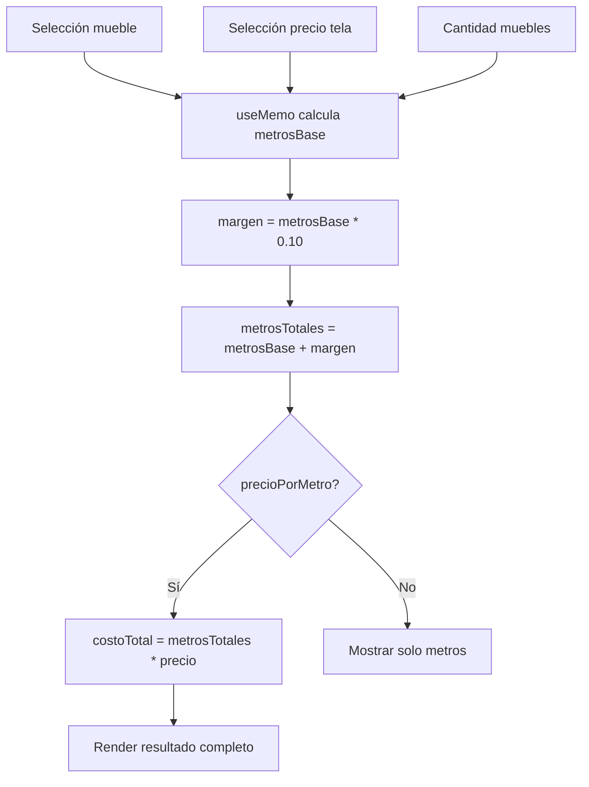

<!--
{
  "resource": "CalculadoraMetrajeTela",
  "technicalName": "CalculadoraMetrajeTela",
  "targetPath": "src/components/common/CalculadoraMetrajeTela.jsx",
  "type": "component",
  "niches": ["furniture_repair"],
  "dependencies": {
    "npm": {},
    "internal": [
      { "name": "CustomSelect", "link": "file:///D:/PROTOTIPE/Documentacion%20PROTOTIPE/06_Biblioteca_Componentes/Componentes_Atomicos/Selector_Desplegable/custom_select.md" }
    ]
  }
}
-->

# CalculadoraMetrajeTela

## 1. Propósito y Casos de Uso

Calcula la cantidad de metros de tela requeridos para tapizar un mueble específico, aplicando un margen de seguridad del 10% y estimando el costo total según el precio por metro de la tela seleccionada.

**Casos de uso:**
- Cotización automática en punto de atención al cliente.
- Integración con `SelectorTelasTexturas` para cálculo en tiempo real.
- Herramienta de planificación de compras de material en taller.

---

## 2. Especificación Visual

- CustomSelect para tipo de mueble.
- Resultado animado con deslizamiento al cambiar valores.
- Desglose: metros base → margen 10% → metros totales → costo estimado.
- Variables CSS estándar del ecosistema.

---

## 3. Código React Completo

```jsx
import { useState, useMemo } from 'react';

// Metros base por tipo de mueble (ancho estándar de tela 1.40m)
const MUEBLES = [
  { value: 'sofa_2p', label: 'Sofá 2 puestos', metros: 7.5 },
  { value: 'sofa_3p', label: 'Sofá 3 puestos', metros: 10.5 },
  { value: 'sofa_4p', label: 'Sofá 4 puestos (esquinero)', metros: 14 },
  { value: 'silla_comedor', label: 'Silla comedor', metros: 1.2 },
  { value: 'poltrona', label: 'Poltrona / Butaca', metros: 4.5 },
  { value: 'cabecero_sencillo', label: 'Cabecero sencillo', metros: 2.5 },
  { value: 'cabecero_doble', label: 'Cabecero doble', metros: 3.5 },
  { value: 'puf', label: 'Puf / Banqueta', metros: 1.8 },
  { value: 'sofa_cama', label: 'Sofá cama', metros: 12 },
];

const PRECIOS_TELA = [
  { value: 22000, label: 'Algodón - $22.000/m' },
  { value: 28000, label: 'Microfibra - $28.000/m' },
  { value: 32000, label: 'Lino - $32.000/m' },
  { value: 35000, label: 'Chenille - $35.000/m' },
  { value: 38000, label: 'Terciopelo - $38.000/m' },
  { value: 45000, label: 'Cuero sint. - $45.000/m' },
  { value: 52000, label: 'Antimanchas - $52.000/m' },
  { value: 120000, label: 'Cuero genuino - $120.000/m' },
];

function CustomSelect({ value, onChange, options, placeholder }) {
  const [open, setOpen] = useState(false);
  const selected = options.find(o => o.value === value);
  return (
    <div className="relative">
      <button
        onClick={() => setOpen(!open)}
        className="w-full flex items-center justify-between px-3 py-2.5 rounded-lg border border-[var(--color-border)] bg-[var(--color-surface)] text-sm text-[var(--color-text)] hover:border-[var(--color-primary)] transition-colors"
      >
        <span className={selected ? 'text-[var(--color-text)]' : 'text-[var(--color-text-muted)]'}>
          {selected ? selected.label : placeholder}
        </span>
        <svg className={`w-4 h-4 text-[var(--color-text-muted)] transition-transform ${open ? 'rotate-180' : ''}`} fill="none" viewBox="0 0 24 24" stroke="currentColor"><path strokeLinecap="round" strokeLinejoin="round" strokeWidth={2} d="M19 9l-7 7-7-7" /></svg>
      </button>
      {open && (
        <div className="absolute z-20 w-full mt-1 rounded-lg border border-[var(--color-border)] bg-[var(--color-surface)] shadow-xl max-h-52 overflow-y-auto">
          {options.map(opt => (
            <button
              key={opt.value}
              onClick={() => { onChange(opt.value); setOpen(false); }}
              className={`w-full text-left px-3 py-2 text-sm hover:bg-[var(--color-primary)] hover:text-[var(--color-text)] transition-colors ${opt.value === value ? 'text-[var(--color-primary)] font-semibold' : 'text-[var(--color-text)]'}`}
            >
              {opt.label}
            </button>
          ))}
        </div>
      )}
    </div>
  );
}

export default function CalculadoraMetrajeTela({ precioPorMetro: precioExterno }) {
  const [tipoMueble, setTipoMueble] = useState('');
  const [precioPorMetro, setPrecioPorMetro] = useState(precioExterno ?? '');
  const [cantidad, setCantidad] = useState(1);

  const resultado = useMemo(() => {
    const mueble = MUEBLES.find(m => m.value === tipoMueble);
    if (!mueble) return null;
    const metrosBase = mueble.metros * cantidad;
    const margen = metrosBase * 0.10;
    const metrosTotales = metrosBase + margen;
    const costoTotal = precioPorMetro ? metrosTotales * precioPorMetro : null;
    return { metrosBase, margen, metrosTotales, costoTotal, mueble };
  }, [tipoMueble, precioPorMetro, cantidad]);

  return (
    <div className="w-full space-y-4">
      <div className="p-4 rounded-xl border border-[var(--color-border)] bg-[var(--color-surface)] space-y-3">
        <h3 className="text-sm font-bold text-[var(--color-text)] flex items-center gap-2">
          <span>📐</span> Configuración
        </h3>

        <div className="space-y-1">
          <label className="text-xs text-[var(--color-text-muted)] font-medium">Tipo de mueble</label>
          <CustomSelect
            value={tipoMueble}
            onChange={setTipoMueble}
            options={MUEBLES}
            placeholder="Selecciona el mueble..."
          />
        </div>

        <div className="space-y-1">
          <label className="text-xs text-[var(--color-text-muted)] font-medium">Precio por metro (tela)</label>
          <CustomSelect
            value={precioPorMetro}
            onChange={val => setPrecioPorMetro(Number(val))}
            options={PRECIOS_TELA}
            placeholder="Selecciona la tela..."
          />
        </div>

        <div className="space-y-1">
          <label className="text-xs text-[var(--color-text-muted)] font-medium">Cantidad de muebles</label>
          <div className="flex items-center gap-3">
            <button
              onClick={() => setCantidad(c => Math.max(1, c - 1))}
              className="w-8 h-8 rounded-lg border border-[var(--color-border)] bg-[var(--color-surface)] text-[var(--color-text)] font-bold hover:border-[var(--color-primary)] transition-colors"
            >−</button>
            <span className="text-lg font-bold text-[var(--color-text)] w-8 text-center">{cantidad}</span>
            <button
              onClick={() => setCantidad(c => Math.min(20, c + 1))}
              className="w-8 h-8 rounded-lg border border-[var(--color-border)] bg-[var(--color-surface)] text-[var(--color-text)] font-bold hover:border-[var(--color-primary)] transition-colors"
            >+</button>
          </div>
        </div>
      </div>

      {/* Resultado */}
      {resultado ? (
        <div className="p-4 rounded-xl border-2 border-[var(--color-primary)] bg-[var(--color-surface)] space-y-3">
          <h3 className="text-sm font-bold text-[var(--color-primary)]">📊 Estimación de metraje</h3>
          <p className="text-xs text-[var(--color-text-muted)]">Mueble: <strong className="text-[var(--color-text)]">{resultado.mueble.label}</strong> × {cantidad} unidad{cantidad > 1 ? 'es' : ''}</p>

          <div className="space-y-2">
            {[
              { label: 'Metros base', value: `${resultado.metrosBase.toFixed(2)} m`, muted: true },
              { label: 'Margen seguridad (+10%)', value: `+${resultado.margen.toFixed(2)} m`, muted: true },
              { label: 'Total requerido', value: `${resultado.metrosTotales.toFixed(2)} m`, highlight: true },
            ].map(row => (
              <div key={row.label} className={`flex justify-between items-center py-1.5 px-2 rounded-lg ${row.highlight ? 'bg-[var(--color-primary)] bg-opacity-10' : ''}`}>
                <span className={`text-xs ${row.muted ? 'text-[var(--color-text-muted)]' : 'font-bold text-[var(--color-text)]'}`}>{row.label}</span>
                <span className={`text-sm font-bold ${row.highlight ? 'text-[var(--color-primary)]' : 'text-[var(--color-text)]'}`}>{row.value}</span>
              </div>
            ))}
          </div>

          {resultado.costoTotal && (
            <div className="pt-2 border-t border-[var(--color-border)]">
              <div className="flex justify-between items-center">
                <span className="text-sm font-semibold text-[var(--color-text)]">Costo estimado tela</span>
                <span className="text-xl font-black text-[var(--color-primary)]">
                  ${Math.ceil(resultado.costoTotal).toLocaleString()}
                </span>
              </div>
              <p className="text-[10px] text-[var(--color-text-muted)] mt-1">* Incluye margen de seguridad. No incluye mano de obra.</p>
            </div>
          )}
        </div>
      ) : (
        <div className="p-6 rounded-xl border border-dashed border-[var(--color-border)] text-center">
          <p className="text-2xl mb-2">🧵</p>
          <p className="text-sm text-[var(--color-text-muted)]">Selecciona el mueble para ver el estimado</p>
        </div>
      )}
    </div>
  );
}
```

---

## 4. Lógica de Estado

| Estado | Tipo | Descripción |
|---|---|---|
| `tipoMueble` | `string` | Valor de MUEBLES seleccionado |
| `precioPorMetro` | `number` | Precio en pesos por metro de tela |
| `cantidad` | `number` | Número de unidades del mismo mueble |
| `resultado` | `object\|null` | Calculado por `useMemo` |

- `resultado` se recalcula automáticamente con `useMemo` al cambiar cualquier input.
- Margen fijo del 10% aplicado siempre.

---

## 5. Flujo Operativo


