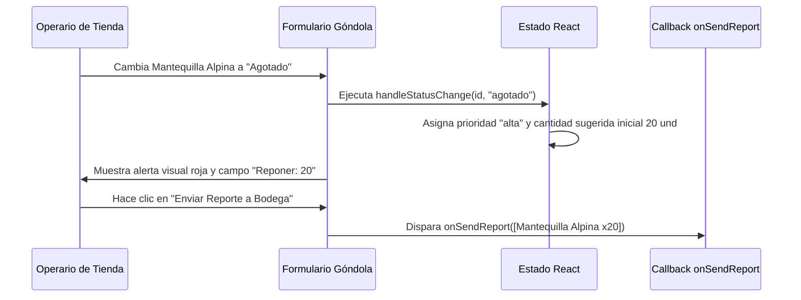

<!--
{
  "resource": "FormularioAbastecimientoGondolas",
  "technicalName": "FormularioAbastecimientoGondolas",
  "targetPath": "src/components/common/FormularioAbastecimientoGondolas.jsx",
  "type": "component",
  "niches": ["grocery_food"],
  "dependencies": {
    "npm": {
      "lucide-react": "^0.344.0"
    },
    "internal": [
      { "name": "CustomSelect", "link": "file:///D:/PROTOTIPE/Documentacion%20PROTOTIPE/06_Biblioteca_Componentes/Componentes_Atomicos/Selector_Desplegable/custom_select.md" }
    ]
  }
}
-->

# Formulario de Abastecimiento de Góndolas (`FormularioAbastecimientoGondolas`)

Permite al personal de piso del supermercado realizar auditorías rápidas en las estanterías (góndolas), reportando productos faltantes o agotados y generando automáticamente solicitudes de reabastecimiento priorizadas hacia la bodega principal.

## 1. Propósito y Casos de Uso
* **Control de Quiebres de Stock:** Evitar estantes vacíos notificando en tiempo real las mermas de exhibición.
* **Logística de Reposición Interna:** Facilitar al operario de bodega la consolidación de pedidos de surtido por pasillos.
* **Auditoría de Góndola:** Evaluar la presencia física de productos contra el inventario teórico del sistema.

## 2. Especificación Visual y Estilos
* **Filtrado por Pasillo:** Selector rápido del sector (ej: Lácteos, Granos, Bebidas, Aseo).
* **Control de Estatus por Producto:** Botones de alternancia interactivos (Abastecido, Bajo Stock, Agotado).
* **Control Numérico de Sugerido:** Input o botones incrementales para indicar la cantidad de cajas/unidades necesarias para reponer.
* **Priorización Inteligente:** Etiquetas de urgencia automáticas (Urgente = Agotado de alta rotación, Media = Bajo stock, Normal = Reposición preventiva).

## 3. Código React Completo

```jsx
import React, { useState } from 'react';
import { ClipboardList, Filter, ArrowUpRight, AlertCircle, CheckCircle, Plus, LayoutGrid } from 'lucide-react';
import CustomSelect from '../ui/CustomSelect';

const INITIAL_AISLE_PRODUCTS = [
  { id: 'P101', name: 'Leche Colanta Deslactosada 1L', category: 'Lácteos', status: 'abastecido', requestQty: 0, priority: 'normal' },
  { id: 'P102', name: 'Quesito Colanta 200g', category: 'Lácteos', status: 'bajo_stock', requestQty: 10, priority: 'media' },
  { id: 'P103', name: 'Mantequilla Alpina 250g', category: 'Lácteos', status: 'agotado', requestQty: 25, priority: 'alta' },
  { id: 'P104', name: 'Arroz Diana Premium 1Kg', category: 'Granos', status: 'abastecido', requestQty: 0, priority: 'normal' },
  { id: 'P105', name: 'Lenteja Seleccionada 500g', category: 'Granos', status: 'bajo_stock', requestQty: 15, priority: 'media' },
  { id: 'P106', name: 'Aceite de Oliva Extra Virgen', category: 'Granos', status: 'abastecido', requestQty: 0, priority: 'normal' },
  { id: 'P107', name: 'Coca-Cola Sabor Original 1.5L', category: 'Bebidas', status: 'agotado', requestQty: 30, priority: 'alta' },
  { id: 'P108', name: 'Jugo Hit Naranja 1L', category: 'Bebidas', status: 'abastecido', requestQty: 0, priority: 'normal' }
];

export default function FormularioAbastecimientoGondolas({
  onSendReport = () => {}
}) {
  const [products, setProducts] = useState(INITIAL_AISLE_PRODUCTS);
  const [selectedCategory, setSelectedCategory] = useState('Lácteos');
  const [customProductName, setCustomProductName] = useState('');

  // Filtrar productos por categoría/pasillo seleccionada
  const filteredProducts = products.filter(p => p.category === selectedCategory);

  const handleStatusChange = (id, newStatus) => {
    setProducts(prev => prev.map(p => {
      if (p.id === id) {
        let reqQty = p.requestQty;
        let priority = 'normal';
        
        if (newStatus === 'abastecido') {
          reqQty = 0;
          priority = 'normal';
        } else if (newStatus === 'bajo_stock') {
          reqQty = reqQty || 10;
          priority = 'media';
        } else if (newStatus === 'agotado') {
          reqQty = reqQty || 20;
          priority = 'alta';
        }
        
        return { ...p, status: newStatus, requestQty: reqQty, priority };
      }
      return p;
    }));
  };

  const handleQuantityChange = (id, val) => {
    const qty = parseInt(val) || 0;
    setProducts(prev => prev.map(p => {
      if (p.id === id) {
        return { ...p, requestQty: qty };
      }
      return p;
    }));
  };

  const handleAddCustomProduct = (e) => {
    e.preventDefault();
    if (!customProductName.trim()) return;

    const newProduct = {
      id: `CUST-${Date.now().toString().slice(-4)}`,
      name: customProductName.trim(),
      category: selectedCategory,
      status: 'agotado',
      requestQty: 10,
      priority: 'alta'
    };

    setProducts(prev => [...prev, newProduct]);
    setCustomProductName('');
  };

  const handleSend = () => {
    // Filtrar solicitudes activas de reposición
    const activeRequests = products.filter(p => p.status !== 'abastecido' && p.requestQty > 0);
    onSendReport(activeRequests);
  };

  const getPriorityBadgeColor = (prio) => {
    if (prio === 'alta') return 'text-red-500 bg-red-500/10 border-red-500/30';
    if (prio === 'media') return 'text-amber-500 bg-amber-500/10 border-amber-500/30';
    return 'text-[var(--color-text-muted)] bg-[var(--color-surface-2)] border-[var(--color-border)]';
  };

  const categoryOptions = [
    { value: 'Lácteos', label: 'Pasillo 1 - Lácteos y Quesos' },
    { value: 'Granos', label: 'Pasillo 2 - Granos y Aceites' },
    { value: 'Bebidas', label: 'Pasillo 3 - Refrescos y Bebidas' }
  ];

  return (
    <div className="bg-[var(--color-surface)] border border-[var(--color-border)] rounded-2xl shadow-xl w-full max-w-4xl mx-auto p-6 text-[var(--color-text)]">
      <div className="flex items-center gap-3 mb-5 border-b border-[var(--color-border)] pb-4">
        <div className="p-2 bg-[var(--color-primary)]/10 rounded-lg text-[var(--color-primary)]">
          <ClipboardList className="w-6 h-6" />
        </div>
        <div>
          <h3 className="font-semibold text-lg">Control de Abastecimiento de Góndolas</h3>
          <p className="text-xs text-[var(--color-text-muted)]">Reporte digital de quiebres de stock y requerimiento a bodega</p>
        </div>
      </div>

      {/* Filtro de Pasillo/Categoría */}
      <div className="mb-5 grid grid-cols-1 xl:grid-cols-2 gap-4">
        <div>
          <label className="block text-xs font-semibold uppercase tracking-wider text-[var(--color-text-muted)] mb-2">
            Seleccionar Góndola / Pasillo
          </label>
          <CustomSelect 
            value={selectedCategory}
            onChange={(val) => setSelectedCategory(val)}
            options={categoryOptions}
          />
        </div>

        {/* Añadir Producto Manual */}
        <form onSubmit={handleAddCustomProduct} className="flex flex-col justify-end">
          <label className="block text-xs font-semibold uppercase tracking-wider text-[var(--color-text-muted)] mb-2">
            ¿Falta otro producto en esta góndola?
          </label>
          <div className="flex flex-col gap-2">
            <input 
              type="text"
              placeholder="Nombre del faltante..."
              value={customProductName}
              onChange={(e) => setCustomProductName(e.target.value)}
              className="w-full px-4 py-2 text-xs bg-[var(--color-surface-2)] border border-[var(--color-border)] rounded-xl focus:outline-none focus:ring-1 focus:ring-[var(--color-primary)]"
            />
            <button
              type="submit"
              className="w-full py-2 bg-[var(--color-primary)] hover:bg-[var(--color-primary)]/90 text-[var(--color-text)] rounded-xl text-xs font-semibold flex items-center justify-center gap-1 transition"
            >
              <Plus className="w-4 h-4" />
              Añadir Producto
            </button>
          </div>
        </form>
      </div>

      {/* Lista de Auditoría */}
      <div className="border border-[var(--color-border)]/60 rounded-xl overflow-hidden mb-6">
        <div className="divide-y divide-[var(--color-border)]/50">
          {filteredProducts.map(p => (
            <div key={p.id} className="grid grid-cols-1 xl:grid-cols-12 gap-4 p-4 items-center bg-[var(--color-surface)] hover:bg-[var(--color-border)]/5 transition">
              {/* Info del producto: 5/12 cols */}
              <div className="xl:col-span-5">
                <span className="text-[10px] font-bold text-[var(--color-text-muted)] uppercase tracking-wider">{p.id}</span>
                <h5 className="font-bold text-sm text-[var(--color-text)] leading-tight">{p.name}</h5>
              </div>

              {/* Botones de Estatus: 4/12 cols */}
              <div className="xl:col-span-4 flex justify-start xl:justify-center">
                <div className="flex items-center gap-1 bg-[var(--color-surface-2)] p-1 rounded-xl border border-[var(--color-border)] w-full max-w-[240px]">
                  {[
                    { key: 'abastecido', label: 'Completo' },
                    { key: 'bajo_stock', label: 'Bajo' },
                    { key: 'agotado', label: 'Agotado' }
                  ].map(opt => {
                    const isActive = p.status === opt.key;
                    let colorClass = 'hover:bg-[var(--color-border)]/20';
                    if (isActive) {
                      if (opt.key === 'abastecido') colorClass = 'bg-emerald-500 text-[var(--color-text)] shadow-sm';
                      if (opt.key === 'bajo_stock') colorClass = 'bg-amber-500 text-[var(--color-text)] shadow-sm';
                      if (opt.key === 'agotado') colorClass = 'bg-red-500 text-[var(--color-text)] shadow-sm';
                    }
                    return (
                      <button
                        key={opt.key}
                        onClick={() => handleStatusChange(p.id, opt.key)}
                        className={`flex-1 py-1.5 rounded-lg text-[10px] font-bold transition ${colorClass}`}
                      >
                        {opt.label}
                      </button>
                    );
                  })}
                </div>
              </div>

              {/* Controles de Reposición: 3/12 cols */}
              <div className="xl:col-span-3 flex justify-start xl:justify-end">
                {p.status !== 'abastecido' ? (
                  <div className="flex items-center gap-1.5 bg-[var(--color-surface-2)] border border-[var(--color-border)] rounded-xl px-2 py-1 text-xs font-semibold">
                    <span className="text-[10px] text-[var(--color-text-muted)] font-semibold">Reponer</span>
                    <input 
                      type="number" 
                      min="1"
                      value={p.requestQty}
                      onChange={(e) => handleQuantityChange(p.id, e.target.value)}
                      className="w-10 text-center font-bold bg-transparent focus:outline-none text-[var(--color-text)]"
                    />
                    <span className="text-[10px] text-[var(--color-text-muted)]">und</span>
                    <span className={`px-1.5 py-0.5 text-[8px] font-bold rounded border uppercase ${getPriorityBadgeColor(p.priority)}`}>
                      {p.priority}
                    </span>
                  </div>
                ) : (
                  <span className="text-xs text-emerald-500 font-semibold flex items-center gap-1.5 bg-emerald-500/10 px-3 py-1.5 rounded-xl border border-emerald-500/20">
                    <CheckCircle className="w-4 h-4 text-emerald-500" />
                    Completo
                  </span>
                )}
              </div>
            </div>
          ))}
        </div>
      </div>

      {/* Enviar Solicitud */}
      <div className="border-t border-[var(--color-border)] pt-4 flex justify-between items-center">
        <span className="text-xs text-[var(--color-text-muted)]">
          Lotes activos para reabastecer: <span className="font-bold text-[var(--color-text)]">{products.filter(p => p.status !== 'abastecido' && p.requestQty > 0).length}</span>
        </span>
        <button
          onClick={handleSend}
          className="flex items-center justify-center gap-2 bg-[var(--color-primary)] text-[var(--color-text)] hover:bg-[var(--color-primary)]/90 px-6 py-2.5 rounded-xl font-bold shadow-md transition"
        >
          Enviar Reporte a Bodega
          <ArrowUpRight className="w-4 h-4" />
        </button>
      </div>
    </div>
  );
}
```

## 4. Lógica de Estado y Ciclo de Vida
* Conserva la lista de productos (`products`) en el estado local, computando de forma reactiva la urgencia de la reposición (`priority`) a partir de la criticidad del desabastecimiento.
* Expone un callback `onSendReport` que retorna el arreglo limpio conteniendo únicamente los ítems que requieren reabastecimiento con sus cantidades respectivas.

## 5. Secuencia de Interacción

