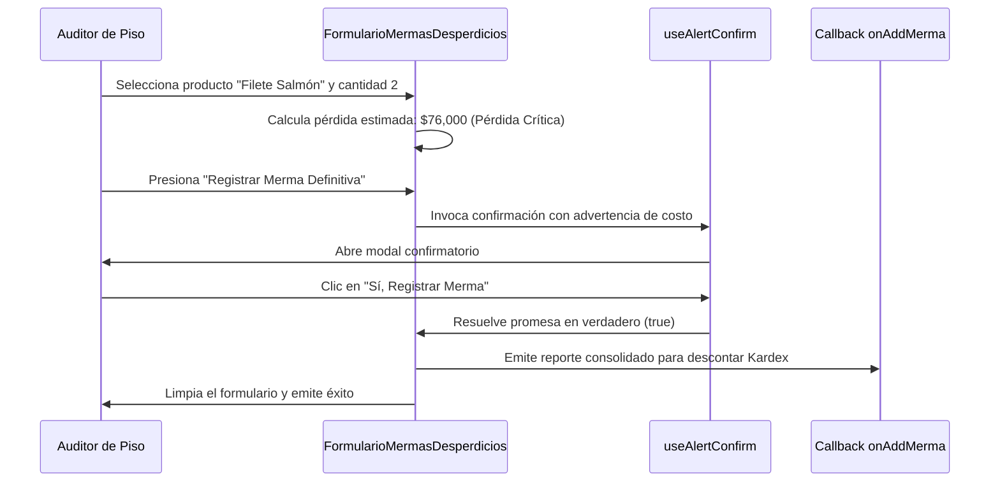

<!--
{
  "resource": "FormularioMermasDesperdicios",
  "technicalName": "FormularioMermasDesperdicios",
  "targetPath": "src/components/common/FormularioMermasDesperdicios.jsx",
  "type": "component",
  "niches": ["grocery_food"],
  "dependencies": {
    "npm": {
      "lucide-react": "^0.344.0"
    },
    "internal": [
      { "name": "CustomSelect", "link": "file:///D:/PROTOTIPE/Documentacion%20PROTOTIPE/06_Biblioteca_Componentes/Componentes_Atomicos/Selector_Desplegable/custom_select.md" }
    ]
  }
}
-->

# Formulario de Mermas y Desperdicios (`FormularioMermasDesperdicios`)

Permite documentar, clasificar y dar de baja productos defectuosos, rotos o expirados en el minimarket, calculando instantáneamente la pérdida financiera de costo de adquisición y requiriendo confirmaciones de seguridad antes de descontar las unidades del stock teórico.

## 1. Propósito y Casos de Uso
* **Auditoría de Inventarios:** Registrar mermas operativas por daño físico de empaques o cadena de frío.
* **Control Financiero:** Llevar un registro consolidado del costo neto de pérdidas comerciales para balances fiscales.
* **Saneamiento Físico:** Asegurar que los productos removidos del piso se descuenten debidamente en el Kardex.

## 2. Especificación Visual y Estilos
* **Selector del Motivo de Merma:** Campo desplegable para categorizar el incidente (Expiración, Daño de Empaque, Robo, Pérdida de Frío).
* **Buscador Predictivo de Producto:** Input de autocompletado rápido para seleccionar el artículo afectado.
* **Indicador de Pérdida Consolidada:** Bloque visual destacado en color carmesí/naranja que muestra el impacto financiero total del reporte.
* **Interceptación de Flujo Destructivo:** Uso mandatorio del hook `useAlertConfirm` antes de proceder al registro definitivo.

## 3. Código React Completo

```jsx
import React, { useState, useMemo } from 'react';
import { Trash2, AlertTriangle, AlertCircle, TrendingDown, DollarSign, Check } from 'lucide-react';
import { useAlertConfirm } from '../common/AlertConfirmContext';
import CustomSelect from '../ui/CustomSelect';

const PRODUCT_LIST = [
  { id: 'P01', name: 'Jamón Cuit Sándwich 500g', costPrice: 9500, category: 'Fiambrería' },
  { id: 'P02', name: 'Queso Mozzarella Colanta 1Kg', costPrice: 22000, category: 'Lácteos' },
  { id: 'P03', name: 'Manzana Verde Importada 1Kg', costPrice: 6800, category: 'Fruver' },
  { id: 'P04', name: 'Aceite de Girasol Premier 1L', costPrice: 7900, category: 'Granos' },
  { id: 'P05', name: 'Filete de Salmón Premium 500g', costPrice: 38000, category: 'Pescadería' }
];

const REASONS = [
  { value: 'vencimiento', label: 'Fecha de Vencimiento Expirada' },
  { value: 'rotura', label: 'Rotura / Daño Físico de Empaque' },
  { value: 'frio', label: 'Pérdida de Cadena de Frío' },
  { value: 'robo', label: 'Robo / Pérdida Desconocida' }
];

export default function FormularioMermasDesperdicios({
  onAddMerma = () => {}
}) {
  const [selectedProductId, setSelectedProductId] = useState(PRODUCT_LIST[0].id);
  const [selectedReason, setSelectedReason] = useState(REASONS[0].value);
  const [quantity, setQuantity] = useState(1);
  const [notes, setNotes] = useState('');
  const confirm = useAlertConfirm();

  const selectedProduct = useMemo(() => {
    return PRODUCT_LIST.find(p => p.id === selectedProductId) || PRODUCT_LIST[0];
  }, [selectedProductId]);

  const lossValue = useMemo(() => {
    return selectedProduct.costPrice * quantity;
  }, [selectedProduct, quantity]);

  const formatCurrency = (val) => {
    return new Intl.NumberFormat('es-CO', { style: 'currency', currency: 'COP', maximumFractionDigits: 0 }).format(val);
  };

  const handleRegisterMerma = async (e) => {
    e.preventDefault();
    
    const reasonLabel = REASONS.find(r => r.value === selectedReason)?.label || selectedReason;

    const accepted = await confirm({
      title: '¿Confirmar Baja de Inventario?',
      message: `Esta acción descontará definitivamente ${quantity} unidades de "${selectedProduct.name}" del inventario. El costo de pérdida registrado será de ${formatCurrency(lossValue)} bajo el motivo: "${reasonLabel}".`,
      variant: 'error',
      confirmText: 'Sí, Registrar Merma',
      cancelText: 'Cancelar'
    });

    if (accepted) {
      onAddMerma({
        id: `M-${Date.now().toString().slice(-4)}`,
        product: selectedProduct,
        reason: selectedReason,
        reasonLabel: reasonLabel,
        quantity,
        lossValue,
        notes: notes.trim(),
        timestamp: new Date().toLocaleTimeString()
      });
      // Reset form
      setQuantity(1);
      setNotes('');
    }
  };

  const isHighLoss = lossValue >= 50000;

  const productOptions = PRODUCT_LIST.map(p => ({
    value: p.id,
    label: `${p.name} (${formatCurrency(p.costPrice)}/u)`
  }));

  return (
    <div className="bg-[var(--color-surface)] border border-[var(--color-border)] rounded-2xl shadow-xl w-full max-w-2xl mx-auto p-6 text-[var(--color-text)]">
      <div className="flex items-center gap-3 mb-5 border-b border-[var(--color-border)] pb-4">
        <div className="p-2 bg-red-500/10 rounded-lg text-red-500">
          <Trash2 className="w-6 h-6" />
        </div>
        <div>
          <h3 className="font-semibold text-lg">Registro de Mermas y Averías</h3>
          <p className="text-xs text-[var(--color-text-muted)]">Reporte técnico de pérdidas y descarte de productos físicos</p>
        </div>
      </div>

      <form onSubmit={handleRegisterMerma} className="flex flex-col gap-4">
        {/* Producto */}
        <div>
          <label className="block text-xs font-semibold uppercase tracking-wider text-[var(--color-text-muted)] mb-2">
            Producto Afectado
          </label>
          <CustomSelect 
            value={selectedProductId}
            onChange={(val) => setSelectedProductId(val)}
            options={productOptions}
          />
        </div>

        <div className="grid grid-cols-1 md:grid-cols-2 gap-4">
          {/* Motivo */}
          <div>
            <label className="block text-xs font-semibold uppercase tracking-wider text-[var(--color-text-muted)] mb-2 h-8 flex items-end">
              Motivo del Descarte
            </label>
            <CustomSelect 
              value={selectedReason}
              onChange={(val) => setSelectedReason(val)}
              options={REASONS}
            />
          </div>

          {/* Cantidad */}
          <div>
            <label className="block text-xs font-semibold uppercase tracking-wider text-[var(--color-text-muted)] mb-2 h-8 flex items-end">
              Cantidad a Descartar
            </label>
            <input 
              type="number"
              min="1"
              value={quantity}
              onChange={(e) => setQuantity(Math.max(1, parseInt(e.target.value) || 1))}
              className="w-full px-4 py-2.5 bg-[var(--color-surface-2)] border border-[var(--color-border)] rounded-xl text-xs font-bold text-[var(--color-text)] focus:outline-none"
            />
          </div>
        </div>

        {/* Notas */}
        <div>
          <label className="block text-xs font-semibold uppercase tracking-wider text-[var(--color-text-muted)] mb-2">
            Observaciones Adicionales
          </label>
          <textarea
            placeholder="Detalla cómo ocurrió el daño o especificaciones del lote..."
            value={notes}
            onChange={(e) => setNotes(e.target.value)}
            rows="3"
            className="w-full px-4 py-3 bg-[var(--color-surface-2)] border border-[var(--color-border)] rounded-xl text-xs focus:outline-none text-[var(--color-text)]"
          />
        </div>

        {/* Panel de Cálculo Financiero de Pérdida */}
        <div className={`p-4 rounded-xl border flex justify-between items-center transition ${isHighLoss ? 'bg-red-500/10 border-red-500/35 text-red-500' : 'bg-[var(--color-surface-2)] border-[var(--color-border)]/55'}`}>
          <div className="flex items-center gap-2">
            {isHighLoss ? <AlertTriangle className="w-5 h-5 animate-bounce shrink-0" /> : <AlertCircle className="w-5 h-5 text-[var(--color-primary)] shrink-0" />}
            <div>
              <span className="text-[9px] uppercase font-bold tracking-wider opacity-85">Pérdida Financiera Estimada</span>
              <p className="text-[10px] opacity-75">Calculado sobre costo de adquisición de tienda</p>
            </div>
          </div>
          <div className="text-right">
            <span className="text-[10px] opacity-75">{quantity} x {formatCurrency(selectedProduct.costPrice)}</span>
            <p className="font-extrabold text-lg !text-[var(--color-primary)] leading-none mt-1">{formatCurrency(lossValue)}</p>
          </div>
        </div>

        <button
          type="submit"
          className="w-full flex items-center justify-center gap-2 bg-red-500 text-[var(--color-text)] hover:bg-red-600 py-3 rounded-xl font-bold shadow-lg transition duration-200"
        >
          <Trash2 className="w-4 h-4" />
          Registrar Merma Definitiva
        </button>
      </form>
    </div>
  );
}
```

## 4. Lógica de Estado y Ciclo de Vida
* Utiliza estados controlados para las variables de entrada (`quantity`, `selectedProductId`, `notes`), computando reactivamente el valor total de la pérdida (`lossValue`) mediante `useMemo`.
* Delega la autorización destructiva de baja al hook `useAlertConfirm` garantizando trazabilidad y seguridad frente a clics accidentales.

## 5. Secuencia de Interacción

