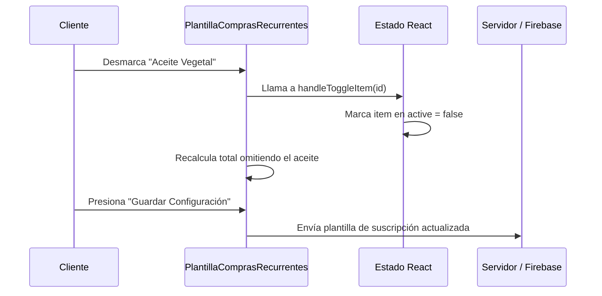

<!--
{
  "resource": "PlantillaComprasRecurrentes",
  "technicalName": "PlantillaComprasRecurrentes",
  "targetPath": "src/components/common/PlantillaComprasRecurrentes.jsx",
  "type": "component",
  "niches": ["grocery_food"],
  "dependencies": {
    "npm": {
      "lucide-react": "^0.344.0"
    },
    "internal": [
      { "name": "CustomSelect", "link": "file:///D:/PROTOTIPE/Documentacion%20PROTOTIPE/06_Biblioteca_Componentes/Componentes_Atomicos/Selector_Desplegable/custom_select.md" }
    ]
  }
}
-->

# Plantillas de Compras Recurrentes (`PlantillaComprasRecurrentes`)

Permite al cliente estructurar, guardar y calendarizar pedidos repetitivos de canasta familiar (ej: compra mensual, básicos semanales de lácteos), facilitando la edición interactiva de productos y la automatización del checkout periódico.

## 1. Propósito y Casos de Uso
* **Suscripción de Alimentos:** Recibir automáticamente insumos perecederos todas las semanas sin rehacer la orden.
* **Lista de Deseos / Favoritos:** Mantener plantillas temáticas (ej: "Asado de Fin de Semana", "Despensa Mensual") listas para un solo clic de compra.
* **Ahorro de Tiempo:** Automatizar el proceso de compra periódica para clientes recurrentes del minimarket.

## 2. Especificación Visual y Estilos
* **Selector de Frecuencia:** Desplegable o chips interactivos para calendarizar (Semanal, Quincenal, Mensual).
* **Editor del Contenido de la Lista:** Listado de artículos de la plantilla con checkbox de exclusión temporal e input incremental de cantidades.
* **Sumatoria e Indicador de Total:** Panel inferior con el subtotal estimado dinámico basado en los productos marcados.

## 3. Código React Completo

```jsx
import React, { useState, useMemo } from 'react';
import { CalendarRange, RotateCcw, Check, Plus, Minus, Trash2, ShoppingBag, Bell } from 'lucide-react';
import CustomSelect from '../ui/CustomSelect';

const INITIAL_TEMPLATES = [
  {
    id: 'T01',
    name: 'Mercado Quincenal Básico',
    frequency: 'quincenal',
    nextDelivery: '2026-07-16',
    items: [
      { id: 'I101', name: 'Arroz Diana Premium 1Kg', qty: 5, price: 3800, active: true },
      { id: 'I102', name: 'Leche Colanta Deslactosada 1L', qty: 12, price: 4200, active: true },
      { id: 'I103', name: 'Aceite Vegetal Premier 1L', qty: 2, price: 9500, active: true },
      { id: 'I104', name: 'Lentejas Seleccionadas 500g', qty: 3, price: 3400, active: true }
    ]
  },
  {
    id: 'T02',
    name: 'Desayunos de la Semana',
    frequency: 'semanal',
    nextDelivery: '2026-07-09',
    items: [
      { id: 'I105', name: 'Huevos AA x30 unidades', qty: 1, price: 16500, active: true },
      { id: 'I106', name: 'Pan Tajado Familiar Bimbo', qty: 2, price: 7800, active: true },
      { id: 'I107', name: 'Café Sello Rojo 500g', qty: 1, price: 11500, active: true }
    ]
  }
];

const FREQUENCIES = [
  { value: 'semanal', label: 'Cada Semana (7 días)' },
  { value: 'quincenal', label: 'Cada Quincena (15 días)' },
  { value: 'mensual', label: 'Cada Mes (30 días)' }
];

export default function PlantillaComprasRecurrentes({
  onSaveTemplate = () => {},
  onOrderNow = () => {}
}) {
  const [templates, setTemplates] = useState(INITIAL_TEMPLATES);
  const [activeTemplateId, setActiveTemplateId] = useState(INITIAL_TEMPLATES[0].id);

  const activeTemplate = useMemo(() => {
    return templates.find(t => t.id === activeTemplateId) || templates[0];
  }, [templates, activeTemplateId]);

  const handleFrequencyChange = (val) => {
    setTemplates(prev => prev.map(t => {
      if (t.id === activeTemplateId) {
        return { ...t, frequency: val };
      }
      return t;
    }));
  };

  const handleToggleItem = (itemId) => {
    setTemplates(prev => prev.map(t => {
      if (t.id === activeTemplateId) {
        const updatedItems = t.items.map(item => {
          if (item.id === itemId) return { ...item, active: !item.active };
          return item;
        });
        return { ...t, items: updatedItems };
      }
      return t;
    }));
  };

  const handleQtyChange = (itemId, increment) => {
    setTemplates(prev => prev.map(t => {
      if (t.id === activeTemplateId) {
        const updatedItems = t.items.map(item => {
          if (item.id === itemId) {
            const newQty = Math.max(1, item.qty + (increment ? 1 : -1));
            return { ...item, qty: newQty };
          }
          return item;
        });
        return { ...t, items: updatedItems };
      }
      return t;
    }));
  };

  const handleDeleteItem = (itemId) => {
    setTemplates(prev => prev.map(t => {
      if (t.id === activeTemplateId) {
        const updatedItems = t.items.filter(item => item.id !== itemId);
        return { ...t, items: updatedItems };
      }
      return t;
    }));
  };

  // Calcular precio sumado dinámico de los activos
  const templateTotal = useMemo(() => {
    return activeTemplate.items
      .filter(item => item.active)
      .reduce((sum, item) => sum + (item.price * item.qty), 0);
  }, [activeTemplate]);

  const formatCurrency = (val) => {
    return new Intl.NumberFormat('es-CO', { style: 'currency', currency: 'COP', maximumFractionDigits: 0 }).format(val);
  };

  return (
    <div className="bg-[var(--color-surface)] border border-[var(--color-border)] rounded-2xl shadow-xl w-full max-w-4xl mx-auto p-6 text-[var(--color-text)]">
      <div className="flex flex-col md:flex-row md:items-center justify-between gap-4 mb-6 border-b border-[var(--color-border)] pb-4">
        <div className="flex items-center gap-3">
          <div className="p-2 bg-[var(--color-primary)]/10 rounded-lg text-[var(--color-primary)]">
            <CalendarRange className="w-6 h-6" />
          </div>
          <div>
            <h3 className="font-semibold text-lg">Listas y Compras Recurrentes</h3>
            <p className="text-xs text-[var(--color-text-muted)]">Gestiona y automatiza tus despachos periódicos de despensa</p>
          </div>
        </div>

        {/* Selector de Listas */}
        <div className="flex gap-2">
          {templates.map(t => (
            <button
              key={t.id}
              onClick={() => setActiveTemplateId(t.id)}
              className={`px-4 py-2 rounded-xl text-xs font-bold transition ${t.id === activeTemplateId ? 'bg-[var(--color-primary)] text-[var(--color-text)] shadow-sm' : 'bg-[var(--color-surface-2)] border border-[var(--color-border)] hover:bg-[var(--color-border)]/20'}`}
            >
              {t.name}
            </button>
          ))}
        </div>
      </div>

      <div className="grid grid-cols-1 lg:grid-cols-12 gap-6">
        {/* Editor de Productos de la Lista */}
        <div className="lg:col-span-8 flex flex-col gap-4">
          <div className="flex justify-between items-center bg-[var(--color-surface-2)] px-4 py-3 rounded-xl border border-[var(--color-border)]/50">
            <span className="text-xs font-semibold text-[var(--color-text-muted)]">Productos en Plantilla</span>
            <span className="text-xs font-bold text-[var(--color-primary)]">
              {activeTemplate.items.filter(i => i.active).length} activos
            </span>
          </div>

          <div className="flex flex-col gap-2.5 max-h-[320px] overflow-y-auto pr-1">
            {activeTemplate.items.length === 0 ? (
              <div className="py-12 text-center text-[var(--color-text-muted)]">
                <ShoppingBag className="w-10 h-10 mx-auto stroke-1 mb-2" />
                <p className="text-xs">No hay productos en esta plantilla</p>
              </div>
            ) : (
              activeTemplate.items.map(item => (
                <div 
                  key={item.id}
                  className={`p-3.5 rounded-xl border flex justify-between items-center transition ${item.active ? 'bg-[var(--color-surface)] border-[var(--color-border)]' : 'bg-[var(--color-surface-2)] border-[var(--color-border)]/40 opacity-50'}`}
                >
                  <div className="flex items-center gap-3">
                    <input 
                      type="checkbox"
                      checked={item.active}
                      onChange={() => handleToggleItem(item.id)}
                      className="w-4 h-4 rounded border-[var(--color-border)] text-[var(--color-primary)] focus:ring-[var(--color-primary)]"
                    />
                    <div>
                      <p className="font-bold text-xs">{item.name}</p>
                      <p className="text-[10px] text-[var(--color-text-muted)]">{formatCurrency(item.price)} por unidad</p>
                    </div>
                  </div>

                  <div className="flex items-center gap-4">
                    {/* Controles de Cantidad */}
                    <div className="flex items-center gap-2 bg-[var(--color-surface-2)] p-1 rounded-lg border border-[var(--color-border)]">
                      <button
                        onClick={() => handleQtyChange(item.id, false)}
                        disabled={!item.active}
                        className="p-1 hover:bg-[var(--color-border)]/30 rounded disabled:opacity-30"
                      >
                        <Minus className="w-3 h-3" />
                      </button>
                      <span className="text-xs font-bold w-4 text-center">{item.qty}</span>
                      <button
                        onClick={() => handleQtyChange(item.id, true)}
                        disabled={!item.active}
                        className="p-1 hover:bg-[var(--color-border)]/30 rounded disabled:opacity-30"
                      >
                        <Plus className="w-3 h-3" />
                      </button>
                    </div>

                    <button
                      onClick={() => handleDeleteItem(item.id)}
                      className="p-1.5 hover:bg-red-500/10 text-red-500 rounded-lg transition"
                    >
                      <Trash2 className="w-4 h-4" />
                    </button>
                  </div>
                </div>
              ))
            )}
          </div>
        </div>

        {/* Panel lateral: Configuración y Automatización */}
        <div className="lg:col-span-4 bg-[var(--color-surface-2)] border border-[var(--color-border)]/60 rounded-xl p-5 flex flex-col justify-between min-h-[300px]">
          <div className="flex flex-col gap-4">
            <div>
              <label className="block text-xs font-bold uppercase tracking-wider text-[var(--color-text-muted)] mb-2">
                Frecuencia de Despacho
              </label>
              <CustomSelect 
                value={activeTemplate.frequency}
                onChange={handleFrequencyChange}
                options={FREQUENCIES}
              />
            </div>

            <div className="p-3 bg-[var(--color-surface)] border border-[var(--color-border)]/50 rounded-xl text-xs flex flex-col gap-2">
              <div className="flex justify-between">
                <span className="text-[var(--color-text-muted)]">Próximo Envío:</span>
                <span className="font-bold">{activeTemplate.nextDelivery}</span>
              </div>
              <div className="flex items-center gap-1.5 text-[10px] text-amber-500 font-semibold mt-1">
                <Bell className="w-3.5 h-3.5" />
                <span>Te avisaremos 24h antes del cobro</span>
              </div>
            </div>
          </div>

          <div className="mt-6 border-t border-[var(--color-border)] pt-4 flex flex-col gap-3">
            <div className="flex justify-between items-baseline">
              <span className="text-xs font-semibold text-[var(--color-text-muted)]">Total Estimado:</span>
              <span className="text-2xl font-extrabold text-[var(--color-primary)] !text-[var(--color-primary)]">{formatCurrency(templateTotal)}</span>
            </div>

            <button
              onClick={() => onOrderNow(activeTemplate, templateTotal)}
              className="w-full flex items-center justify-center gap-2 bg-[var(--color-primary)] text-[var(--color-text)] hover:bg-[var(--color-primary)]/90 py-2.5 rounded-xl text-xs font-bold shadow-md transition"
            >
              <ShoppingBag className="w-4 h-4" />
              Pedir Ahora
            </button>
            <button
              onClick={() => onSaveTemplate(activeTemplate)}
              className="w-full py-2.5 border border-[var(--color-border)] hover:bg-[var(--color-border)]/20 text-xs font-semibold rounded-xl text-center transition"
            >
              Guardar Configuración
            </button>
          </div>
        </div>
      </div>
    </div>
  );
}
```

## 4. Lógica de Estado y Ciclo de Vida
* Mantiene el estado de las plantillas (`templates`) en memoria reactiva local, posibilitando la mutación de parámetros como periodicidad, cantidades de productos individuales o estatus activo.
* Calcula la sumatoria financiera mediante `useMemo`, ignorando aquellos productos excluidos temporalmente por el cliente (desmarcados con el checkbox).

## 5. Secuencia de Interacción

