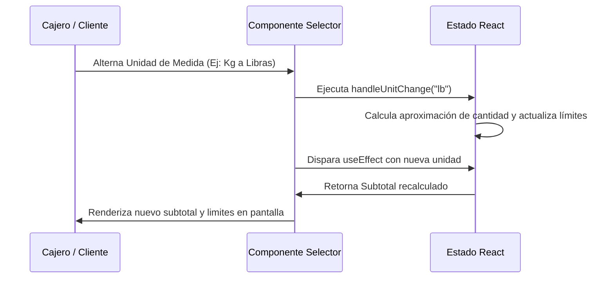

<!--
{
  "resource": "SelectorCantidadGranel",
  "technicalName": "SelectorCantidadGranel",
  "targetPath": "src/components/common/SelectorCantidadGranel.jsx",
  "type": "component",
  "niches": ["grocery_food"],
  "dependencies": {
    "npm": {
      "lucide-react": "^0.344.0"
    },
    "internal": [
      { "name": "CustomSelect", "link": "file:///D:/PROTOTIPE/Documentacion%20PROTOTIPE/06_Biblioteca_Componentes/Componentes_Atomicos/Selector_Desplegable/custom_select.md" }
    ]
  }
}
-->

# Selector de Cantidad a Granel (`SelectorCantidadGranel`)

Permite al cliente o cajero registrar y calcular interactivamente la cantidad exacta de un producto que se vende por peso (kilogramos, libras, gramos) o unidades sueltas, computando reactivamente el subtotal de acuerdo con el precio unitario configurado.

## 1. Propósito y Casos de Uso
* **Venta de Frutas y Verduras:** Permite pesar artículos (ej. tomates, manzanas) y calcular subtotales dinámicos.
* **Venta a Granel (Semillas, Cereales):** Configurar y simular el surtido en bolsas ingresando gramos directos o usando el deslizador.
* **Facturación POS Express:** Facilita al cajero el ingreso rápido de peso recibido de balanzas manuales.

## 2. Especificación Visual y Estilos
* **Muestrario de Unidad Activa:** Pestañas visuales o selectores rápidos para alternar entre Kg, Lb, Gramos y Unidades.
* **Control Deslizador (Slider):** Control de arrastre táctil con respuesta inmediata.
* **Validación de Capacidad:** Alertas de color si el peso excede el límite máximo por empaque/bolsa.
* **Ajuste Fino:** Botones `+` / `-` laterales para incrementos milimétricos (ej. de 0.05 kg en 0.05 kg).

## 3. Código React Completo

```jsx
import React, { useState, useEffect } from 'react';
import { Scale, Plus, Minus, AlertTriangle, ShoppingCart } from 'lucide-react';
import CustomSelect from '../ui/CustomSelect';

export default function SelectorCantidadGranel({
  productName = "Tomate Chonto Orgánico",
  pricePerKg = 4500, // Precio base por Kg
  maxCapacityKg = 15, // Capacidad máxima por bolsa
  onAdd = () => {},
}) {
  const [unit, setUnit] = useState('kg'); // kg, lb, g, und
  const [quantity, setQuantity] = useState(1.0);
  const [subtotal, setSubtotal] = useState(0);

  // Conversiones de precio según unidad activa
  const getPricePerUnit = () => {
    switch (unit) {
      case 'lb': return pricePerKg / 2; // 1 kg = 2 lb aproximadamente en comercio local
      case 'g': return pricePerKg / 1000;
      case 'und': return pricePerKg / 5; // Suponiendo 5 unidades promedio por Kg
      default: return pricePerKg;
    }
  };

  const getUnitName = () => {
    switch (unit) {
      case 'lb': return 'Libra (lb)';
      case 'g': return 'Gramo (g)';
      case 'und': return 'Unidad (und)';
      default: return 'Kilogramo (kg)';
    }
  };

  const getStep = () => {
    switch (unit) {
      case 'g': return 50;
      case 'und': return 1;
      default: return 0.05;
    }
  };

  const getMaxLimit = () => {
    switch (unit) {
      case 'lb': return maxCapacityKg * 2;
      case 'g': return maxCapacityKg * 1000;
      case 'und': return maxCapacityKg * 5;
      default: return maxCapacityKg;
    }
  };

  // Recalcular subtotal
  useEffect(() => {
    const calculated = quantity * getPricePerUnit();
    setSubtotal(calculated);
  }, [quantity, unit, pricePerKg]);

  // Manejar cambio de unidad
  const handleUnitChange = (val) => {
    const oldUnit = unit;
    setUnit(val);
    
    // Adaptar cantidad aproximada para evitar saltos bruscos
    if (oldUnit === 'kg' && val === 'lb') setQuantity(q => Math.min(q * 2, maxCapacityKg * 2));
    else if (oldUnit === 'lb' && val === 'kg') setQuantity(q => Math.min(q / 2, maxCapacityKg));
    else if (oldUnit === 'kg' && val === 'g') setQuantity(q => Math.min(q * 1000, maxCapacityKg * 1000));
    else if (oldUnit === 'g' && val === 'kg') setQuantity(q => Math.min(q / 1000, maxCapacityKg));
    else if (val === 'und') setQuantity(5);
    else setQuantity(1.0);
  };

  const handleIncrement = () => {
    setQuantity(prev => {
      const next = prev + getStep();
      return Math.min(next, getMaxLimit());
    });
  };

  const handleDecrement = () => {
    setQuantity(prev => {
      const next = prev - getStep();
      return Math.max(next, unit === 'g' ? 50 : (unit === 'und' ? 1 : 0.05));
    });
  };

  const handleSliderChange = (e) => {
    setQuantity(parseFloat(e.target.value));
  };

  const handleInputChange = (e) => {
    const val = parseFloat(e.target.value);
    if (!isNaN(val) && val >= 0) {
      setQuantity(Math.min(val, getMaxLimit()));
    } else if (e.target.value === '') {
      setQuantity(0);
    }
  };

  const unitOptions = [
    { value: 'kg', label: 'Kilogramos (kg)' },
    { value: 'lb', label: 'Libras (lb)' },
    { value: 'g', label: 'Gramos (g)' },
    { value: 'und', label: 'Unidades (und)' }
  ];

  const priceFormatted = new Intl.NumberFormat('es-CO', { style: 'currency', currency: 'COP', maximumFractionDigits: 0 }).format(getPricePerUnit());
  const subtotalFormatted = new Intl.NumberFormat('es-CO', { style: 'currency', currency: 'COP', maximumFractionDigits: 0 }).format(subtotal);
  const basePriceFormatted = new Intl.NumberFormat('es-CO', { style: 'currency', currency: 'COP', maximumFractionDigits: 0 }).format(pricePerKg);

  const isNearingLimit = quantity >= getMaxLimit() * 0.9;

  return (
    <div className="p-6 bg-[var(--color-surface)] border border-[var(--color-border)] rounded-2xl shadow-xl w-full max-w-md mx-auto text-[var(--color-text)]">
      <div className="flex items-center gap-3 mb-4">
        <div className="p-2 bg-[var(--color-primary)]/10 rounded-lg text-[var(--color-primary)]">
          <Scale className="w-6 h-6" />
        </div>
        <div>
          <h3 className="font-semibold text-lg">{productName}</h3>
          <p className="text-xs text-[var(--color-text-muted)]">Base: {basePriceFormatted} / kg</p>
        </div>
      </div>

      {/* Selector de Unidad */}
      <div className="mb-5">
        <label className="block text-xs font-semibold uppercase tracking-wider text-[var(--color-text-muted)] mb-2">
          Unidad de Medida
        </label>
        <CustomSelect 
          value={unit}
          onChange={handleUnitChange}
          options={unitOptions}
        />
      </div>

      {/* Ajustador de Cantidad */}
      <div className="bg-[var(--color-surface-2)] p-4 rounded-xl border border-[var(--color-border)]/50 mb-4">
        <div className="flex justify-between items-center mb-3">
          <span className="text-xs text-[var(--color-text-muted)]">Cantidad</span>
          <span className="text-xs font-semibold text-[var(--color-primary)]">{priceFormatted} por {unit}</span>
        </div>

        <div className="flex items-center justify-between gap-4">
          <button 
            type="button"
            onClick={handleDecrement}
            className="p-3 bg-[var(--color-surface)] border border-[var(--color-border)] hover:bg-[var(--color-border)]/20 rounded-xl transition duration-200"
          >
            <Minus className="w-4 h-4" />
          </button>
          
          <div className="flex-1 flex items-center justify-center gap-1">
            <input 
              type="number" 
              value={quantity === 0 ? '' : Number(quantity.toFixed(2))}
              onChange={handleInputChange}
              className="w-24 text-center bg-transparent font-bold text-2xl focus:outline-none focus:ring-b-2 focus:ring-[var(--color-primary)]"
            />
            <span className="font-semibold text-lg text-[var(--color-text-muted)]">{unit}</span>
          </div>

          <button 
            type="button"
            onClick={handleIncrement}
            className="p-3 bg-[var(--color-surface)] border border-[var(--color-border)] hover:bg-[var(--color-border)]/20 rounded-xl transition duration-200"
          >
            <Plus className="w-4 h-4" />
          </button>
        </div>

        {/* Deslizador Slider */}
        <div className="mt-5">
          <input 
            type="range"
            min={unit === 'g' ? 50 : (unit === 'und' ? 1 : 0.1)}
            max={getMaxLimit()}
            step={getStep()}
            value={quantity}
            onChange={handleSliderChange}
            className="w-full h-2 rounded-lg appearance-none cursor-pointer bg-[var(--color-border)] accent-[var(--color-primary)]"
          />
          <div className="flex justify-between text-[10px] text-[var(--color-text-muted)] mt-1">
            <span>Mín: {unit === 'g' ? '50g' : (unit === 'und' ? '1 und' : `0.1${unit}`)}</span>
            <span>Máx: {getMaxLimit()} {unit}</span>
          </div>
        </div>
      </div>

      {/* Alerta de Límite de Peso */}
      {isNearingLimit && (
        <div className="flex items-center gap-2 bg-amber-500/10 border border-amber-500/30 text-amber-500 p-3 rounded-xl mb-4 text-xs">
          <AlertTriangle className="w-4 h-4 shrink-0" />
          <span>Capacidad recomendada para una bolsa simple casi al límite ({getMaxLimit()} {unit}).</span>
        </div>
      )}

      {/* Subtotal y Acción */}
      <div className="border-t border-[var(--color-border)] pt-4 flex flex-col gap-3">
        <div className="flex justify-between items-baseline">
          <span className="text-sm font-medium text-[var(--color-text-muted)]">Subtotal Estimado:</span>
          <span className="text-2xl font-extrabold text-[var(--color-primary)] !text-[var(--color-primary)]">{subtotalFormatted}</span>
        </div>

        <button
          type="button"
          onClick={() => onAdd({ productName, unit, quantity, subtotal })}
          className="w-full flex items-center justify-center gap-2 bg-[var(--color-primary)] text-[var(--color-text)] hover:bg-[var(--color-primary)]/90 py-3 rounded-xl font-semibold shadow-lg transition duration-200"
        >
          <ShoppingCart className="w-4 h-4" />
          Agregar al Pesaje
        </button>
      </div>
    </div>
  );
}
```

## 4. Lógica de Estado y Ciclo de Vida
* El hook `useEffect` recalcula de manera síncrona el `subtotal` cada vez que el usuario modifica la `quantity`, la unidad de medida (`unit`) o el precio base del producto.
* El manejador `handleUnitChange` intercepta la transición de unidades de pesaje y aplica factores de conversión (conversión a libras, gramos o unidades fijas) para mantener una experiencia sin saltos abruptos de escala.

## 5. Secuencia de Interacción

