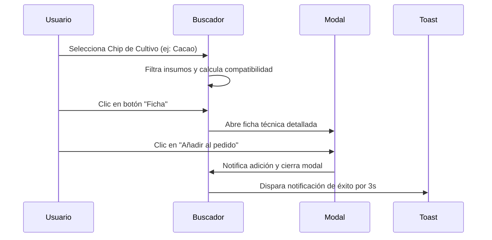

<!--
{
  "resource": "BuscadorCompatibilidadInsumos",
  "technicalName": "BuscadorCompatibilidadInsumos",
  "targetPath": "src/components/common/BuscadorCompatibilidadInsumos.jsx",
  "type": "component",
  "niches": ["insumos-agricolas"],
  "dependencies": {
    "npm": {
      "lucide-react": "^0.294.0"
    },
    "internal": [
      {
        "name": "CustomSelect",
        "link": "file:///D:/PROTOTIPE/Documentacion%20PROTOTIPE/06_Biblioteca_Componentes/Componentes_Atomicos/Selector_Desplegable/custom_select.md"
      }
    ]
  }
}
-->

# Buscador de Compatibilidad de Insumos

Componente interactivo diseñado para agricultores y asesores técnicos que permite buscar y verificar de manera visual la compatibilidad de agroquímicos, abonos, semillas y herramientas con cultivos específicos, previniendo errores costosos de dosificación o aplicación cruzada.

## 1. Propósito y Casos de Uso
- **Filtrado por Cultivo:** Identificar rápidamente qué fertilizantes y plaguicidas son aptos para Café, Papa, Hortalizas o Cacao.
- **Validación de Mezclas:** Analizar de forma inmediata el nivel de compatibilidad física/química y la tasa de fitotoxicidad en el cultivo.
- **Prevención de Pérdidas:** Alertar mediante indicadores visuales semánticos de advertencias de mezcla o periodos de carencia obligatorios.

## 2. Especificación Visual y Estilos (Tailwind CSS)
- **Tema HSL:** Uso estricto de variables cromáticas premium (verde esmeralda, dorado/ámbar y rojizo) integradas con las variables del tema (`var(--color-bg)`, `var(--color-surface)`).
- **Diseño Móvil Apilado:** Chips de cultivos organizados en scroll horizontal elástico, tarjetas dispuestas en una sola columna con botones táctiles amplios, y modal responsivo que se expande a pantalla completa.

## 3. Código React Completo y 100% Funcional

```jsx
import React, { useState, useMemo } from 'react';
import { Search, CheckCircle, AlertTriangle, XCircle, Info, Plus, X } from 'lucide-react';

// Datos Mock del catálogo de insumos agrícolas
const INSUMOS_MOCK = [
  {
    id: 'ins-01',
    nombre: 'Abono NPK FertiCampo',
    categoria: 'Fertilizantes',
    precio: 85000,
    imagen: 'https://images.unsplash.com/photo-1592417817098-8f3d6eb19675?auto=format&fit=crop&w=400&q=80',
    compatibilidades: {
      cafe: { nivel: 'alta', score: 98, notas: 'Acelera el crecimiento radicular y estimula la floración precoz.' },
      papa: { nivel: 'alta', score: 95, notas: 'Ideal para la fase de tuberización de la papa.' },
      hortalizas: { nivel: 'media', score: 75, notas: 'Aplicar a dosis media para evitar quemado de follaje.' },
      cacao: { nivel: 'alta', score: 90, notas: 'Aplicar al inicio del periodo de lluvias.' }
    }
  },
  {
    id: 'ins-02',
    nombre: 'Plaguicida ControlPlaga Bio',
    categoria: 'Plaguicidas',
    precio: 120000,
    imagen: 'https://images.unsplash.com/photo-1599940824399-b87987ceb72a?auto=format&fit=crop&w=400&q=80',
    compatibilidades: {
      cafe: { nivel: 'alta', score: 92, notas: 'Efectivo contra la broca sin afectar la calidad de la cereza.' },
      papa: { nivel: 'media', score: 60, notas: 'No mezclar con aceites minerales.' },
      hortalizas: { nivel: 'alta', score: 90, notas: 'Excelente control de áfidos en lechuga y tomate.' },
      cacao: { nivel: 'no_compatible', score: 0, notas: 'Riesgo extremo de marchitamiento foliar y residuos.' }
    }
  },
  {
    id: 'ins-03',
    nombre: 'Cal Dolomita Mineral',
    categoria: 'Acondicionadores',
    precio: 45000,
    imagen: 'https://images.unsplash.com/photo-1605001011156-cbf0b0f67a51?auto=format&fit=crop&w=400&q=80',
    compatibilidades: {
      cafe: { nivel: 'alta', score: 96, notas: 'Reduce la acidez del suelo óptimo para el crecimiento de plántulas.' },
      papa: { nivel: 'alta', score: 94, notas: 'Aporte de calcio y magnesio estructural.' },
      hortalizas: { nivel: 'alta', score: 92, notas: 'Excelente para regular pH previo a siembra.' },
      cacao: { nivel: 'alta', score: 95, notas: 'Favorece la estructura del suelo arcilloso.' }
    }
  },
  {
    id: 'ins-04',
    nombre: 'Fungicida CobreMax',
    categoria: 'Fungicidas',
    precio: 78000,
    imagen: 'https://images.unsplash.com/photo-1595974482597-4b8da8879bc5?auto=format&fit=crop&w=400&q=80',
    compatibilidades: {
      cafe: { nivel: 'media', score: 70, notas: 'Controla la roya. No aplicar bajo pleno sol del mediodía.' },
      papa: { nivel: 'alta', score: 88, notas: 'Previene tizón tardío en hojas bajas.' },
      hortalizas: { nivel: 'no_compatible', score: 0, notas: 'Fitotoxicidad severa en hortalizas de hoja tierna.' },
      cacao: { nivel: 'alta', score: 93, notas: 'Ideal para combatir la moniliasis de la mazorca.' }
    }
  }
];

const CULTIVOS = [
  { id: 'all', label: 'Todos los Cultivos' },
  { id: 'cafe', label: '☕ Café' },
  { id: 'papa', label: '🥔 Papa' },
  { id: 'hortalizas', label: '🥦 Hortalizas' },
  { id: 'cacao', label: '🍫 Cacao' }
];

export default function BuscadorCompatibilidadInsumos({ onAddProduct }) {
  const [searchTerm, setSearchTerm] = useState('');
  const [selectedCultivo, setSelectedCultivo] = useState('all');
  const [modalProduct, setModalProduct] = useState(null);
  const [toastMessage, setToastMessage] = useState('');

  // Filtrado reactivo de productos
  const filteredProducts = useMemo(() => {
    return INSUMOS_MOCK.filter(product => {
      const matchSearch = product.nombre.toLowerCase().includes(searchTerm.toLowerCase()) ||
                          product.categoria.toLowerCase().includes(searchTerm.toLowerCase());
      
      if (selectedCultivo === 'all') return matchSearch;
      
      const comp = product.compatibilidades[selectedCultivo];
      return matchSearch && comp;
    });
  }, [searchTerm, selectedCultivo]);

  const handleAdd = (product) => {
    if (onAddProduct) {
      onAddProduct(product);
    }
    setToastMessage(`Insumo "${product.nombre}" añadido al pedido`);
    setTimeout(() => setToastMessage(''), 3000);
  };

  const getBadgeStyle = (nivel) => {
    switch (nivel) {
      case 'alta':
        return 'bg-emerald-500/10 text-emerald-400 border-emerald-500/20';
      case 'media':
        return 'bg-amber-500/10 text-amber-400 border-amber-500/20';
      default:
        return 'bg-rose-500/10 text-rose-400 border-rose-500/20';
    }
  };

  const getBadgeLabel = (nivel) => {
    switch (nivel) {
      case 'alta': return 'Apto y Recomendado';
      case 'media': return 'Compatibilidad Limitada';
      default: return 'No Compatible / Tóxico';
    }
  };

  const getIcon = (nivel) => {
    switch (nivel) {
      case 'alta': return <CheckCircle className="w-4 h-4 text-emerald-400 shrink-0" />;
      case 'media': return <AlertTriangle className="w-4 h-4 text-amber-400 shrink-0" />;
      default: return <XCircle className="w-4 h-4 text-rose-400 shrink-0" />;
    }
  };

  return (
    <div className="w-full max-w-5xl mx-auto p-4 bg-[var(--color-bg)] text-[var(--color-text)] rounded-2xl border border-[var(--color-border)] shadow-xl relative min-w-0">
      
      {/* Toast Notification */}
      {toastMessage && (
        <div className="absolute top-4 left-1/2 -translate-x-1/2 z-50 bg-emerald-600 text-[var(--color-text)] px-4 py-2 rounded-full text-sm font-medium shadow-lg animate-fade-in flex items-center gap-2 whitespace-nowrap">
          <CheckCircle className="w-4 h-4" />
          <span>{toastMessage}</span>
        </div>
      )}

      {/* Header */}
      <div className="mb-6">
        <h2 className="text-xl font-bold text-[var(--color-text)]">Buscador de Compatibilidad de Insumos</h2>
        <p className="text-xs text-[var(--color-text-muted)] mt-1">
          Busca insumos agrícolas y comprueba al instante su nivel de compatibilidad según el tipo de cultivo.
        </p>
      </div>

      {/* Barra de Filtros y Búsqueda */}
      <div className="flex flex-col gap-4 mb-6">
        {/* Input Búsqueda */}
        <div className="relative w-full">
          <Search className="absolute left-3.5 top-1/2 -translate-y-1/2 w-4 h-4 text-[var(--color-text-muted)]" />
          <input
            type="text"
            placeholder="Buscar por abono, plaguicida, acondicionador..."
            value={searchTerm}
            onChange={(e) => setSearchTerm(e.target.value)}
            className="w-full pl-10 pr-4 py-2.5 bg-[var(--color-surface)] border border-[var(--color-border)] rounded-xl text-sm focus:outline-none focus:border-[var(--color-primary)] text-[var(--color-text)]"
          />
        </div>

        {/* Chips de Selección de Cultivo */}
        <div className="w-full overflow-x-auto scrollbar-none flex gap-2 pb-1 shrink-0 -mx-4 px-4">
          {CULTIVOS.map((cultivo) => (
            <button
              key={cultivo.id}
              onClick={() => setSelectedCultivo(cultivo.id)}
              className={`px-4 py-2 text-xs font-semibold rounded-full border transition-all whitespace-nowrap ${
                selectedCultivo === cultivo.id
                  ? 'bg-[var(--color-primary)] text-[var(--color-text)] border-[var(--color-primary)]'
                  : 'bg-[var(--color-surface-2)] text-[var(--color-text-muted)] border-[var(--color-border)] hover:border-[var(--color-text-muted)]'
              }`}
            >
              {cultivo.label}
            </button>
          ))}
        </div>
      </div>

      {/* Listado de Productos */}
      {filteredProducts.length > 0 ? (
        <div className="grid grid-cols-1 sm:grid-cols-2 md:grid-cols-3 gap-4">
          {filteredProducts.map((product) => {
            // Extraer la compatibilidad del cultivo seleccionado
            const compKey = selectedCultivo === 'all' ? 'cafe' : selectedCultivo;
            const comp = product.compatibilidades[compKey] || { nivel: 'no_compatible', score: 0 };
            
            return (
              <div
                key={product.id}
                className="bg-[var(--color-surface)] border border-[var(--color-border)] rounded-xl overflow-hidden flex flex-col h-full shadow-sm hover:shadow-md transition-shadow"
              >
                {/* Imagen del Producto */}
                <div className="h-32 w-full relative bg-[var(--color-surface-2)]">
                  
                  <span className="absolute top-2 right-2 bg-black/60 text-[var(--color-text)] text-[10px] px-2 py-0.5 rounded-full font-bold">
                    {product.categoria}
                  </span>
                </div>

                {/* Info Cuerpo */}
                <div className="p-4 flex flex-col flex-grow gap-3">
                  <div>
                    <h3 className="text-sm font-bold text-[var(--color-text)] truncate">{product.nombre}</h3>
                    <p className="text-xs text-[var(--color-text-muted)] mt-1">
                      Precio: <span className="font-semibold text-[var(--color-text)]">${product.precio.toLocaleString()} / saco</span>
                    </p>
                  </div>

                  {/* Estado de Compatibilidad */}
                  <div className={`p-2.5 rounded-lg border flex items-center gap-2 ${getBadgeStyle(comp.nivel)}`}>
                    {getIcon(comp.nivel)}
                    <div className="min-w-0">
                      <p className="text-[10px] uppercase font-bold tracking-wide">
                        {selectedCultivo === 'all' ? 'Ficha de Café (Base)' : `Cultivo ${CULTIVOS.find(c => c.id === selectedCultivo).label}`}
                      </p>
                      <p className="text-xs font-semibold truncate leading-none mt-0.5">
                        {getBadgeLabel(comp.nivel)} {comp.score > 0 && `(${comp.score}%)`}
                      </p>
                    </div>
                  </div>

                  {/* Controles de Acción (No huérfanos) */}
                  <div className="flex gap-3 mt-auto">
                    <button
                      onClick={() => setModalProduct({ ...product, compKey })}
                      className="flex-1 bg-[var(--color-surface-2)] hover:bg-[var(--color-border)] border border-[var(--color-border)] text-xs font-semibold py-2 rounded-lg transition-colors flex items-center justify-center gap-1.5"
                    >
                      <Info className="w-3.5 h-3.5" />
                      Ficha
                    </button>
                    <button
                      onClick={() => handleAdd(product)}
                      disabled={comp.nivel === 'no_compatible'}
                      className={`flex-1 text-xs font-semibold py-2 rounded-lg transition-all flex items-center justify-center gap-1.5 ${
                        comp.nivel === 'no_compatible'
                          ? 'bg-red-950/20 text-red-700 cursor-not-allowed border border-red-950/30'
                          : 'bg-[var(--color-primary)] text-[var(--color-text)] hover:opacity-90'
                      }`}
                    >
                      <Plus className="w-3.5 h-3.5" />
                      Pedir
                    </button>
                  </div>
                </div>
              </div>
            );
          })}
        </div>
      ) : (
        <div className="p-8 text-center bg-[var(--color-surface)] border border-[var(--color-border)] rounded-xl">
          <Info className="w-8 h-8 text-[var(--color-text-muted)] mx-auto mb-2" />
          <p className="text-sm font-semibold text-[var(--color-text-muted)]">No se encontraron insumos compatibles.</p>
        </div>
      )}

      {/* Modal Ficha Técnica */}
      {modalProduct && (
        <div className="fixed inset-0 bg-black/60 backdrop-blur-sm z-50 flex items-center justify-center p-4">
          <div className="bg-[var(--color-surface)] border border-[var(--color-border)] w-full max-w-md rounded-2xl overflow-hidden shadow-2xl p-5 relative animate-scale-in">
            <button
              onClick={() => setModalProduct(null)}
              className="absolute top-4 right-4 p-1 rounded-full bg-[var(--color-surface-2)] hover:bg-[var(--color-border)] text-[var(--color-text-muted)]"
            >
              <X className="w-4 h-4" />
            </button>

            <h3 className="text-base font-bold text-[var(--color-text)] pr-6">{modalProduct.nombre}</h3>
            <p className="text-xs text-[var(--color-text-muted)] mt-0.5">Categoría: {modalProduct.categoria}</p>

            <div className="my-4 border-t border-[var(--color-border)]" />

            <div className="space-y-4">
              <div>
                <p className="text-[10px] text-[var(--color-text-muted)] uppercase font-bold">Nivel de Compatibilidad</p>
                <div className={`mt-1.5 p-3 rounded-xl border flex items-start gap-2.5 ${getBadgeStyle(modalProduct.compatibilidades[modalProduct.compKey].nivel)}`}>
                  {getIcon(modalProduct.compatibilidades[modalProduct.compKey].nivel)}
                  <div>
                    <h4 className="text-xs font-bold leading-none">
                      {getBadgeLabel(modalProduct.compatibilidades[modalProduct.compKey].nivel)}
                    </h4>
                    <p className="text-xs text-[var(--color-text-muted)] mt-1 font-medium leading-normal">
                      {modalProduct.compatibilidades[modalProduct.compKey].notas}
                    </p>
                  </div>
                </div>
              </div>

              <div className="grid grid-cols-1 sm:grid-cols-2 gap-3">
                <div className="bg-[var(--color-surface-2)] p-3 rounded-xl border border-[var(--color-border)]">
                  <p className="text-[9px] text-[var(--color-text-muted)] uppercase font-bold">Score Químico</p>
                  <p className="text-lg font-bold text-[var(--color-text)] mt-0.5">
                    {modalProduct.compatibilidades[modalProduct.compKey].score}%
                  </p>
                </div>
                <div className="bg-[var(--color-surface-2)] p-3 rounded-xl border border-[var(--color-border)]">
                  <p className="text-[9px] text-[var(--color-text-muted)] uppercase font-bold">Carencia</p>
                  <p className="text-lg font-bold text-[var(--color-text)] mt-0.5">15 Días</p>
                </div>
              </div>
            </div>

            <div className="mt-6 flex gap-2">
              <button
                onClick={() => setModalProduct(null)}
                className="flex-1 bg-[var(--color-surface-2)] hover:bg-[var(--color-border)] text-xs font-semibold py-2.5 rounded-xl transition-colors"
              >
                Cerrar
              </button>
              <button
                onClick={() => {
                  handleAdd(modalProduct);
                  setModalProduct(null);
                }}
                disabled={modalProduct.compatibilidades[modalProduct.compKey].nivel === 'no_compatible'}
                className="flex-1 bg-[var(--color-primary)] disabled:bg-red-950/20 disabled:text-red-700 text-[var(--color-text)] text-xs font-semibold py-2.5 rounded-xl transition-opacity hover:opacity-90"
              >
                Añadir al pedido
              </button>
            </div>
          </div>
        </div>
      )}
    </div>
  );
}
```

## 4. Lógica de Estado y Ciclo de Vida
El componente se gestiona a través de los siguientes estados reactivos:
- `searchTerm`: Captura la cadena ingresada por el usuario para filtrar la lista de insumos.
- `selectedCultivo`: Controla el chip activo para filtrar compatibilidades.
- `modalProduct`: Almacena el insumo seleccionado para ver su ficha técnica extendida en un modal flotante.
- `toastMessage`: Maneja las notificaciones de éxito de corta duración.

## 5. Secuencia de Interacción (Mermaid)



## 6. Ejemplo de Integración

```jsx
import React, { useState } from 'react';
import BuscadorCompatibilidadInsumos from './BuscadorCompatibilidadInsumos';

export default function MiAppAgricola() {
  const [carrito, setCarrito] = useState([]);

  const handleAdd = (item) => {
    setCarrito(prev => [...prev, item]);
  };

  return (
    <div className="p-6 bg-[var(--color-bg)] min-h-screen">
      <BuscadorCompatibilidadInsumos onAddProduct={handleAdd} />
    </div>
  );
}
```
