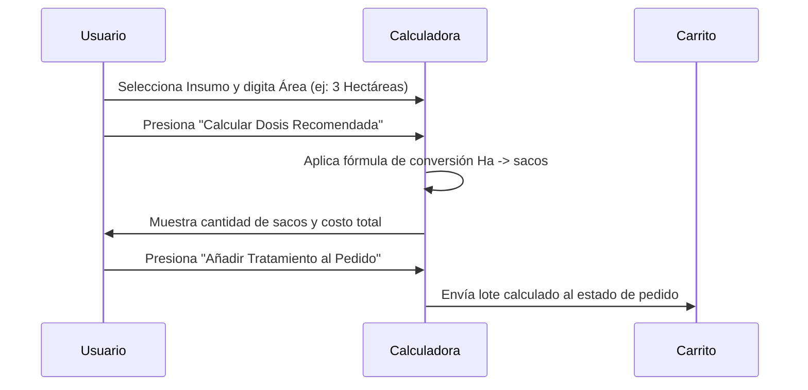

<!--
{
  "resource": "CalculadoraRendimientoDosificacion",
  "technicalName": "CalculadoraRendimientoDosificacion",
  "targetPath": "src/components/common/CalculadoraRendimientoDosificacion.jsx",
  "type": "component",
  "niches": ["insumos-agricolas"],
  "dependencies": {
    "npm": {
      "lucide-react": "^0.294.0"
    },
    "internal": [
      {
        "name": "CustomSelect",
        "link": "file:///D:/PROTOTIPE/Documentacion%20PROTOTIPE/06_Biblioteca_Componentes/Componentes_Atomicos/Selector_Desplegable/custom_select.md"
      }
    ]
  }
}
-->

# Calculadora de Rendimiento y Dosificación de Insumos

Componente matemático y visual que permite estimar la cantidad exacta de fertilizante o acondicionador de suelo requerida según las dimensiones de un lote de cultivo y el tipo de producto, calculando costos e inyectando la dosificación sugerida de forma automática.

## 1. Propósito y Casos de Uso
- **Cálculo de Área de Siembra:** Determinar la cantidad de producto requerida ingresando el área del lote en Hectáreas o Metros Cuadrados (m²).
- **Dosificación por Producto:** Aplicar concentraciones específicas de catálogo (ej. 4Kg por Hectárea de fertilizante o 100g por m² de cal dolomita).
- **Fórmulas Matemáticas de Costo:** Obtener precio por saco, peso total en kilogramos y empaques necesarios a comprar.

## 2. Especificación Visual y Estilos (Tailwind CSS)
- **Grid Colapsable de Columnas:** Layout de dos columnas que divide el panel de configuración (izquierda) y el panel de resultados de simulación (derecha). En dispositivos móviles se colapsa a una única columna.
- **Variables HSL:** Bordes suaves `border-[var(--color-border)]`, fondos `bg-[var(--color-surface)]` y textos contrastados de marca `text-[var(--color-primary)]` y `!text-white` en botones principales.

## 3. Código React Completo y 100% Funcional

```jsx
import React, { useState, useMemo } from 'react';
import { Sparkles, Trash2, ShoppingCart, HelpCircle, Check } from 'lucide-react';
import CustomSelect from '../../ui/CustomSelect';

const PRODUCTOS_AGRO = [
  { value: 'p-01', label: 'Fertilizante Triple 15 (Saco 50Kg)', dosePerHa: 200, pricePerUnit: 110000, unitName: 'Saco 50Kg' },
  { value: 'p-02', label: 'Cal Dolomita Mineral (Saco 40Kg)', dosePerHa: 500, pricePerUnit: 35000, unitName: 'Saco 40Kg' },
  { value: 'p-03', label: 'Abono Orgánico Compost (Saco 25Kg)', dosePerHa: 800, pricePerUnit: 25000, unitName: 'Saco 25Kg' },
  { value: 'p-04', label: 'Urea Activada Nitrógeno (Saco 50Kg)', dosePerHa: 150, pricePerUnit: 145000, unitName: 'Saco 50Kg' }
];

const UNIDADES_AREA = [
  { value: 'ha', label: 'Hectáreas (Ha)' },
  { value: 'm2', label: 'Metros Cuadrados (m²)' }
];

export default function CalculadoraRendimientoDosificacion({ onAddProduct }) {
  const [selectedProductVal, setSelectedProductVal] = useState(PRODUCTOS_AGRO[0].value);
  const [areaInput, setAreaInput] = useState(1);
  const [unitVal, setUnitVal] = useState('ha');
  const [results, setResults] = useState(null);
  const [toast, setToast] = useState('');

  const selectedProduct = useMemo(() => {
    return PRODUCTOS_AGRO.find(p => p.value === selectedProductVal) || PRODUCTOS_AGRO[0];
  }, [selectedProductVal]);

  const handleCalculate = () => {
    if (areaInput <= 0 || isNaN(areaInput)) return;

    // Convertir m2 a Hectáreas si es el caso (1 Ha = 10,000 m2)
    const areaInHa = unitVal === 'm2' ? areaInput / 10000 : areaInput;
    
    // Dosis total requerida en Kilogramos
    const totalDoseKg = Math.round(areaInHa * selectedProduct.dosePerHa * 10) / 10;
    
    // Peso de un saco individual del producto
    const sacoWeight = selectedProduct.unitName.includes('50Kg') ? 50 : selectedProduct.unitName.includes('40Kg') ? 40 : 25;
    
    // Cantidad de sacos necesarios (redondeado hacia arriba)
    const unitsRequired = Math.max(1, Math.ceil(totalDoseKg / sacoWeight));
    
    // Costo Total
    const totalCost = unitsRequired * selectedProduct.pricePerUnit;

    setResults({
      doseKg: totalDoseKg,
      units: unitsRequired,
      cost: totalCost,
      productName: selectedProduct.label,
      unitName: selectedProduct.unitName
    });
  };

  const handleAdd = () => {
    if (!results || !onAddProduct) return;
    onAddProduct({
      id: selectedProduct.value,
      nombre: results.productName,
      precio: selectedProduct.pricePerUnit,
      cant: results.units
    });

    setToast(`Agregados ${results.units} sacos al pedido`);
    setTimeout(() => setToast(''), 3000);
  };

  return (
    <div className="w-full bg-[var(--color-surface)] text-[var(--color-text)] rounded-2xl border border-[var(--color-border)] shadow-xl p-4 sm:p-5 relative min-w-0">
      
      {/* Toast */}
      {toast && (
        <div className="absolute top-4 left-1/2 -translate-x-1/2 z-50 bg-emerald-600 text-[var(--color-text)] px-4 py-2 rounded-full text-xs font-semibold shadow-lg flex items-center gap-2 whitespace-nowrap">
          <Check className="w-4 h-4" />
          <span>{toast}</span>
        </div>
      )}

      {/* Header */}
      <div className="mb-6 border-b border-[var(--color-border)] pb-4 flex items-center gap-3">
        <div className="p-2 bg-[var(--color-primary)]/10 rounded-lg text-[var(--color-primary)]">
          <Sparkles className="w-6 h-6" />
        </div>
        <div>
          <h3 className="font-bold text-base">Calculadora de Rendimiento y Dosis</h3>
          <p className="text-xs text-[var(--color-text-muted)] mt-0.5">Estima los insumos necesarios para tu lote de cultivo</p>
        </div>
      </div>

      <div className="grid grid-cols-1 md:grid-cols-2 gap-5">
        {/* Formulario Inputs */}
        <div className="space-y-4 flex flex-col">
          {/* Producto */}
          <div>
            <label className="block text-xs font-bold uppercase tracking-wider text-[var(--color-text-muted)] mb-2">
              Seleccionar Producto
            </label>
            <CustomSelect
              options={PRODUCTOS_AGRO}
              value={selectedProductVal}
              onChange={(val) => {
                setSelectedProductVal(val);
                setResults(null); // Resetear resultados al cambiar
              }}
            />
          </div>

          {/* Área del lote */}
          <div className="grid grid-cols-1 sm:grid-cols-2 gap-3">
            <div>
              <label className="flex items-end text-xs font-bold uppercase tracking-wider text-[var(--color-text-muted)] mb-2 h-8 leading-tight">
                Área de Lote
              </label>
              <input
                type="number"
                min="0.1"
                step="any"
                value={areaInput}
                onChange={(e) => {
                  setAreaInput(parseFloat(e.target.value) || 0);
                  setResults(null);
                }}
                className="w-full px-3 py-2 bg-[var(--color-surface-2)] border border-[var(--color-border)] rounded-xl text-sm focus:outline-none focus:border-[var(--color-primary)] text-[var(--color-text)]"
              />
            </div>
            <div>
              <label className="flex items-end text-xs font-bold uppercase tracking-wider text-[var(--color-text-muted)] mb-2 h-8 leading-tight">
                Unidad de Medida
              </label>
              <CustomSelect
                options={UNIDADES_AREA}
                value={unitVal}
                onChange={(val) => {
                  setUnitVal(val);
                  setResults(null);
                }}
              />
            </div>
          </div>

          {/* Botón de Cálculo */}
          <button
            onClick={handleCalculate}
            disabled={areaInput <= 0}
            className="w-full mt-auto bg-[var(--color-surface-2)] hover:bg-[var(--color-border)] text-xs font-bold py-2.5 rounded-xl border border-[var(--color-border)] transition-colors text-[var(--color-text)]"
          >
            Calcular Dosis Recomendada
          </button>
        </div>

        {/* Panel de Resultados */}
        <div className="bg-[var(--color-surface-2)] border border-[var(--color-border)] rounded-2xl p-4 flex flex-col justify-between">
          {results ? (
            <div className="space-y-4">
              <h4 className="text-xs font-bold uppercase tracking-wider text-[var(--color-text-muted)] border-b border-[var(--color-border)] pb-2">
                Resultados de Dosificación
              </h4>
              <div className="space-y-3">
                <div className="flex justify-between items-baseline">
                  <span className="text-xs text-[var(--color-text-muted)]">Dosis Requerida:</span>
                  <span className="font-bold text-sm text-[var(--color-text)]">{results.doseKg.toLocaleString()} Kg total</span>
                </div>
                <div className="flex justify-between items-baseline">
                  <span className="text-xs text-[var(--color-text-muted)]">Empaques Sugeridos:</span>
                  <span className="font-bold text-sm text-[var(--color-text)]">{results.units} saco{results.units > 1 && 's'}</span>
                </div>
                <div className="flex justify-between items-baseline">
                  <span className="text-xs text-[var(--color-text-muted)] font-semibold">Costo Total:</span>
                  <span className="font-extrabold text-lg text-[var(--color-primary)]">${results.cost.toLocaleString()}</span>
                </div>
              </div>

              {/* Botones de acción */}
              <div className="pt-4 border-t border-[var(--color-border)]">
                <button
                  onClick={handleAdd}
                  className="w-full bg-[var(--color-primary)] text-[var(--color-text)] hover:opacity-95 font-bold py-2.5 rounded-xl text-xs flex items-center justify-center gap-2 shadow transition-all !text-[var(--color-text)]"
                >
                  <ShoppingCart className="w-4 h-4 text-[var(--color-text)]" />
                  Añadir Tratamiento al Pedido
                </button>
              </div>
            </div>
          ) : (
            <div className="flex-1 flex flex-col items-center justify-center text-center p-4 text-[var(--color-text-muted)]">
              <HelpCircle className="w-8 h-8 stroke-1 mb-2" />
              <p className="text-xs font-semibold">Calculadora Lista</p>
              <p className="text-[10px] mt-1 max-w-[200px]">Ingresa los datos de tu terreno y presiona "Calcular Dosis Recomendada" para estimar el pedido.</p>
            </div>
          )}
        </div>
      </div>
    </div>
  );
}
```

## 4. Lógica de Estado y Ciclo de Vida
El componente se gestiona con los siguientes estados locales:
- `selectedProductVal`: Controla el identificador del producto seleccionado del dropdown.
- `areaInput`: Número decimal correspondiente al área de cultivo.
- `unitVal`: Unidad de área elegida ("ha" o "m2").
- `results`: Objeto de cálculo final que se actualiza únicamente al presionar el botón "Calcular".

## 5. Secuencia de Interacción (Mermaid)



## 6. Ejemplo de Integración

```jsx
import React, { useState } from 'react';
import CalculadoraRendimientoDosificacion from './CalculadoraRendimientoDosificacion';

export default function MiAppAgricola() {
  const [carrito, setCarrito] = useState([]);

  const handleAdd = (loteCalculado) => {
    setCarrito(prev => [...prev, loteCalculado]);
  };

  return (
    <div className="p-6 bg-[var(--color-bg)] min-h-screen">
      <CalculadoraRendimientoDosificacion onAddProduct={handleAdd} />
    </div>
  );
}
```
