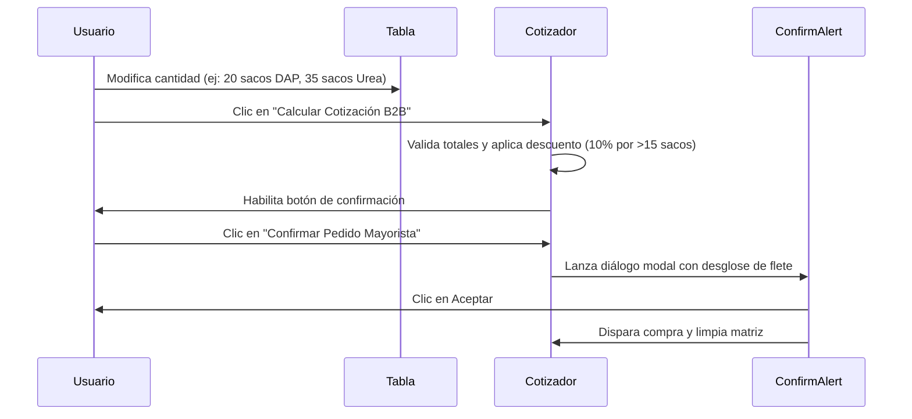

<!--
{
  "resource": "FormularioPedidoMayorista",
  "technicalName": "FormularioPedidoMayorista",
  "targetPath": "src/components/common/FormularioPedidoMayorista.jsx",
  "type": "component",
  "niches": ["insumos-agricolas"],
  "dependencies": {
    "npm": {
      "lucide-react": "^0.294.0"
    },
    "internal": [
      {
        "name": "CustomSelect",
        "link": "file:///D:/PROTOTIPE/Documentacion%20PROTOTIPE/06_Biblioteca_Componentes/Componentes_Atomicos/Selector_Desplegable/custom_select.md"
      },
      {
        "name": "AlertConfirmContext",
        "link": "file:///D:/PROTOTIPE/Documentacion%20PROTOTIPE/06_Biblioteca_Componentes/Logica_y_Hooks/Alertas_Confirmaciones_Globales/alert_confirm_context.md"
      }
    ]
  }
}
-->

# Formulario de Pedido Mayorista Agrícola

Matriz de pedidos rápidos en lote optimizada para clientes corporativos, cooperativas o grandes agricultores que compran bultos y palés de insumos. Calcula descuentos por volumen en tiempo real y gestiona fletes pesados con confirmación previa.

## 1. Propósito y Casos de Uso
- **Compra en Lote Simplificada:** Evitar navegar ficha por ficha de catálogo; el cliente digita cantidades directamente en una sola pantalla.
- **Descuentos Escalonados:** Aplicar tasas de ahorro del 10% y 20% según el tonelaje o número de sacos comprados.
- **Logística Pesada:** Configuración del flete y tipo de vehículo de despacho (ej. Camión Cama Baja o Turbina).

## 2. Especificación Visual y Estilos (Tailwind CSS)
- **Tabla Responsiva:** Envase de la grilla de productos en un contenedor `w-full overflow-x-auto scrollbar-thin`.
- **Control de Celda Protegida:** Clases `whitespace-nowrap` en cabeceras de tabla, precios unitarios, y totales acumulados para prevenir divisiones de renglón en móviles.

## 3. Código React Completo y 100% Funcional

```jsx
import React, { useState, useMemo } from 'react';
import { Truck, Check, HelpCircle, AlertCircle, RefreshCw, ShoppingCart } from 'lucide-react';
import CustomSelect from '../../ui/CustomSelect';
import { useAlertConfirm } from '../common/AlertConfirmContext';

const PRODUCTOS_B2B = [
  { id: 'b2b-01', nombre: 'Saco Nitrógeno Urea (50Kg)', precioBase: 140000, stock: 500 },
  { id: 'b2b-02', nombre: 'Saco Fósforo DAP (50Kg)', precioBase: 165000, stock: 350 },
  { id: 'b2b-03', nombre: 'Saco Potasio KCI (50Kg)', precioBase: 130000, stock: 600 },
  { id: 'b2b-04', nombre: 'Rollo Alambre Púas 400m', precioBase: 195000, stock: 120 }
];

const METODOS_ENVIO = [
  { value: 'camion', label: '🚚 Camión Cama Baja (Flete Pesado - $250.000)' },
  { value: 'turbina', label: '🚛 Camión Turbina Mediano (Flete - $120.000)' },
  { value: 'retiro', label: '🏬 Retiro en Bodega Principal (Sin flete)' }
];

export default function FormularioPedidoMayorista({ onAddOrder }) {
  const confirm = useAlertConfirm();
  const [quantities, setQuantities] = useState(
    PRODUCTOS_B2B.reduce((acc, p) => ({ ...acc, [p.id]: 0 }), {})
  );
  const [envioVal, setEnvioVal] = useState('camion');
  const [orderSummary, setOrderSummary] = useState(null);

  const handleQtyChange = (productId, val, maxStock) => {
    const num = Math.min(maxStock, Math.max(0, parseInt(val) || 0));
    setQuantities(prev => ({ ...prev, [productId]: num }));
    setOrderSummary(null); // Resetear cotización
  };

  const handleIncrement = (productId, maxStock) => {
    setQuantities(prev => {
      const current = prev[productId] || 0;
      if (current >= maxStock) return prev;
      setOrderSummary(null);
      return { ...prev, [productId]: current + 1 };
    });
  };

  const handleDecrement = (productId) => {
    setQuantities(prev => {
      const current = prev[productId] || 0;
      if (current <= 0) return prev;
      setOrderSummary(null);
      return { ...prev, [productId]: current - 1 };
    });
  };

  const totals = useMemo(() => {
    let subtotal = 0;
    let totalItems = 0;
    
    PRODUCTOS_B2B.forEach(p => {
      const qty = quantities[p.id] || 0;
      subtotal += p.precioBase * qty;
      totalItems += qty;
    });

    // Calcular descuento escalonado por volumen
    let dctoPercent = 0;
    if (totalItems >= 50) {
      dctoPercent = 20; // 20% descuento por >50 bultos
    } else if (totalItems >= 15) {
      dctoPercent = 10; // 10% descuento por >15 bultos
    }

    const discountAmount = Math.round(subtotal * (dctoPercent / 100));
    
    // Valor flete
    let flete = 0;
    if (envioVal === 'camion') flete = 250000;
    else if (envioVal === 'turbina') flete = 120000;

    const total = subtotal - discountAmount + flete;

    return {
      subtotal,
      totalItems,
      dctoPercent,
      discountAmount,
      flete,
      total
    };
  }, [quantities, envioVal]);

  const handleQuote = () => {
    if (totals.totalItems === 0) return;
    setOrderSummary({ ...totals });
  };

  const handleConfirmOrder = async () => {
    if (totals.totalItems === 0) return;

    // Uso de confirmación context-promesificado obligatorio
    const approved = await confirm.show({
      title: '¿Confirmar Pedido Mayorista?',
      message: `Estás a punto de registrar un pedido de ${totals.totalItems} insumos por valor de $${totals.total.toLocaleString()}. Se despachará mediante ${
        envioVal === 'camion' ? 'Camión Cama Baja' : envioVal === 'turbina' ? 'Camión Turbina' : 'Retiro en Bodega'
      }.`,
      variant: 'warning'
    });

    if (approved) {
      if (onAddOrder) {
        onAddOrder({
          id: 'ord-' + Date.now(),
          items: quantities,
          summary: totals,
          envio: envioVal
        });
      }
      // Resetear cantidades
      setQuantities(PRODUCTOS_B2B.reduce((acc, p) => ({ ...acc, [p.id]: 0 }), {}));
      setOrderSummary(null);
    }
  };

  return (
    <div className="w-full bg-[var(--color-surface)] text-[var(--color-text)] rounded-2xl border border-[var(--color-border)] shadow-xl p-4 sm:p-5 relative min-w-0">
      
      {/* Header */}
      <div className="mb-6 border-b border-[var(--color-border)] pb-4 flex items-center gap-3">
        <div className="p-2 bg-[var(--color-primary)]/10 rounded-lg text-[var(--color-primary)]">
          <Truck className="w-6 h-6" />
        </div>
        <div>
          <h3 className="font-bold text-base">Pedido Mayorista B2B</h3>
          <p className="text-xs text-[var(--color-text-muted)] mt-0.5">Ingresa cantidades de insumos y gestiona el envío pesado</p>
        </div>
      </div>

      {/* Tabla de Insumos */}
      <div className="w-full overflow-x-auto scrollbar-thin border border-[var(--color-border)] rounded-xl mb-6">
        <table className="w-full text-left text-xs border-collapse">
          <thead>
            <tr className="bg-[var(--color-surface-2)] border-b border-[var(--color-border)]">
              <th className="p-3 font-bold whitespace-nowrap">Insumo / Producto</th>
              <th className="p-3 font-bold whitespace-nowrap text-right">Precio Unitario</th>
              <th className="p-3 font-bold whitespace-nowrap text-center">Cantidad (Sacos/Rollos)</th>
              <th className="p-3 font-bold whitespace-nowrap text-right">Total Parcial</th>
            </tr>
          </thead>
          <tbody>
            {PRODUCTOS_B2B.map(product => {
              const qty = quantities[product.id] || 0;
              return (
                <tr key={product.id} className="border-b border-[var(--color-border)] hover:bg-[var(--color-surface-2)]/30 transition-colors">
                  <td className="p-3 min-w-0">
                    <p className="font-bold text-[var(--color-text)] truncate max-w-[200px] sm:max-w-none">{product.nombre}</p>
                    <p className="text-[10px] text-[var(--color-text-muted)]">Stock: {product.stock} unds</p>
                  </td>
                  <td className="p-3 text-right whitespace-nowrap font-medium">
                    ${product.precioBase.toLocaleString()}
                  </td>
                  <td className="p-3">
                    <div className="flex items-center justify-center gap-1">
                      <button
                        onClick={() => handleDecrement(product.id)}
                        className="w-7 h-7 bg-[var(--color-surface-2)] hover:bg-[var(--color-border)] border border-[var(--color-border)] rounded-lg font-bold text-sm text-[var(--color-text)] flex items-center justify-center transition-colors"
                      >
                        -
                      </button>
                      <input
                        type="number"
                        value={qty}
                        onChange={(e) => handleQtyChange(product.id, e.target.value, product.stock)}
                        className="w-12 py-1 text-center bg-[var(--color-surface-2)] border border-[var(--color-border)] rounded-lg font-bold text-[var(--color-text)] focus:outline-none focus:border-[var(--color-primary)] [appearance:textfield] [&::-webkit-outer-spin-button]:appearance-none [&::-webkit-inner-spin-button]:appearance-none"
                      />
                      <button
                        onClick={() => handleIncrement(product.id, product.stock)}
                        className="w-7 h-7 bg-[var(--color-surface-2)] hover:bg-[var(--color-border)] border border-[var(--color-border)] rounded-lg font-bold text-sm text-[var(--color-text)] flex items-center justify-center transition-colors"
                      >
                        +
                      </button>
                    </div>
                  </td>
                  <td className="p-3 text-right whitespace-nowrap font-bold text-[var(--color-text)]">
                    ${(product.precioBase * qty).toLocaleString()}
                  </td>
                </tr>
              );
            })}
          </tbody>
        </table>
      </div>

      <div className="grid grid-cols-1 md:grid-cols-12 gap-5 items-stretch">
        {/* Selector Despacho */}
        <div className="md:col-span-6 space-y-4 flex flex-col justify-between">
          <div>
            <label className="block text-xs font-bold uppercase tracking-wider text-[var(--color-text-muted)] mb-2">
              Método de Despacho y Flete
            </label>
            <CustomSelect
              options={METODOS_ENVIO}
              value={envioVal}
              onChange={(val) => {
                setEnvioVal(val);
                setOrderSummary(null);
              }}
            />
          </div>
          <button
            onClick={handleQuote}
            disabled={totals.totalItems === 0}
            className="w-full bg-[var(--color-surface-2)] hover:bg-[var(--color-border)] text-xs font-bold py-2.5 rounded-xl border border-[var(--color-border)] transition-colors text-[var(--color-text)] flex items-center justify-center gap-1.5"
          >
            <RefreshCw className="w-3.5 h-3.5" />
            Calcular Cotización B2B
          </button>
        </div>

        {/* Resumen Final */}
        <div className="md:col-span-6 bg-[var(--color-surface-2)] border border-[var(--color-border)] rounded-2xl p-4 flex flex-col justify-between">
          {orderSummary ? (
            <div className="space-y-4">
              <h4 className="text-xs font-bold uppercase tracking-wider text-[var(--color-text-muted)] border-b border-[var(--color-border)] pb-2">
                Resumen de Cotización
              </h4>
              <div className="space-y-2 text-xs">
                <div className="flex justify-between">
                  <span className="text-[var(--color-text-muted)]">Subtotal ({orderSummary.totalItems} insumos):</span>
                  <span className="font-bold text-[var(--color-text)]">${orderSummary.subtotal.toLocaleString()}</span>
                </div>
                {orderSummary.dctoPercent > 0 && (
                  <div className="flex justify-between text-emerald-500 font-semibold">
                    <span>Descuento por Volumen ({orderSummary.dctoPercent}%):</span>
                    <span>-${orderSummary.discountAmount.toLocaleString()}</span>
                  </div>
                )}
                <div className="flex justify-between">
                  <span className="text-[var(--color-text-muted)]">Costo Despacho/Flete:</span>
                  <span className="font-bold text-[var(--color-text)]">${orderSummary.flete.toLocaleString()}</span>
                </div>
                <div className="flex justify-between items-baseline border-t border-[var(--color-border)] pt-2 mt-1">
                  <span className="font-bold text-sm text-[var(--color-text)]">Total Neto:</span>
                  <span className="font-extrabold text-base text-[var(--color-primary)]">${orderSummary.total.toLocaleString()}</span>
                </div>
              </div>

              {/* Botón de Confirmación */}
              <div className="pt-2">
                <button
                  onClick={handleConfirmOrder}
                  className="w-full bg-[var(--color-primary)] text-[var(--color-text)] hover:opacity-95 font-bold py-2.5 rounded-xl text-xs flex items-center justify-center gap-2 shadow transition-all !text-[var(--color-text)]"
                >
                  <ShoppingCart className="w-4 h-4 text-[var(--color-text)]" />
                  Confirmar Pedido Mayorista
                </button>
              </div>
            </div>
          ) : (
            <div className="flex-1 flex flex-col items-center justify-center text-center p-4 text-[var(--color-text-muted)]">
              <HelpCircle className="w-8 h-8 stroke-1 mb-2" />
              <p className="text-xs font-semibold">Pedido Vacío o Sin Cotizar</p>
              <p className="text-[10px] mt-1 max-w-[200px]">Establece cantidades superiores a cero en la tabla y presiona "Calcular Cotización B2B".</p>
            </div>
          )}
        </div>
      </div>
    </div>
  );
}
```

## 4. Lógica de Estado y Ciclo de Vida
El componente encapsula los siguientes flujos de estados locales:
- `quantities`: Objeto clave-valor que mapea los IDs de productos con la cantidad ingresada.
- `envioVal`: Valor del select que determina el flete del transporte pesado.
- `orderSummary`: Almacena el resultado de cotización calculado. Se limpia automáticamente a `null` ante cualquier edición en cantidades o envío para obligar al usuario a cotizar antes de confirmar la compra.

## 5. Secuencia de Interacción (Mermaid)



## 6. Ejemplo de Integración

```jsx
import React, { useState } from 'react';
import FormularioPedidoMayorista from './FormularioPedidoMayorista';
import { AlertConfirmProvider } from '../common/AlertConfirmContext';

export default function MiAppB2B() {
  const [pedidosRecibidos, setPedidosRecibidos] = useState([]);

  const handleOrder = (nuevaOrden) => {
    setPedidosRecibidos(prev => [...prev, nuevaOrden]);
  };

  return (
    <AlertConfirmProvider>
      <div className="p-6 bg-[var(--color-bg)] min-h-screen">
        <FormularioPedidoMayorista onAddOrder={handleOrder} />
      </div>
    </AlertConfirmProvider>
  );
}
```
