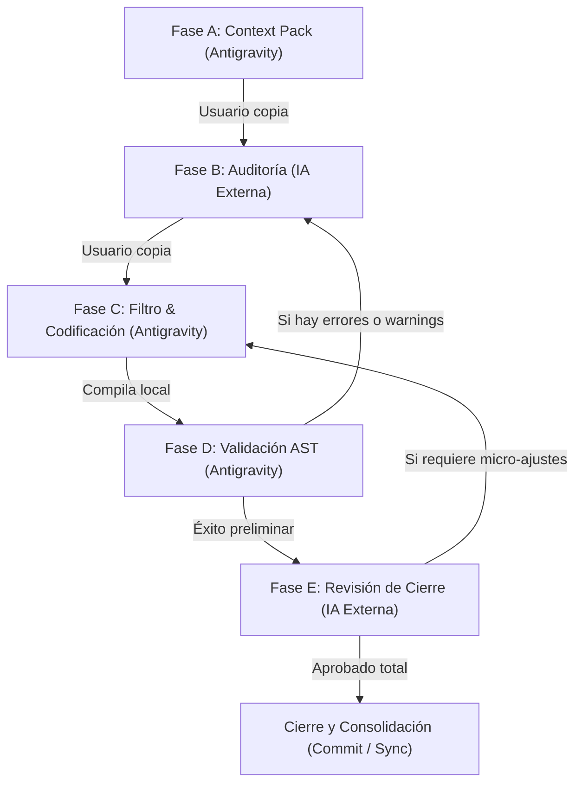

# Fuentes Seleccionadas — Tema: migracion-claude-code

## Fuente: `.agents/AGENTS.md` (Líneas 3-6)
- **SHA-256:** `35d249acdb4e79173fa7e78e89eb214cdefd80e77551623b9bcbb0fd3d055aa5`
- **Ruta de Encabezados:** AGENTS.md — Reglas de Proyecto: PROTOTIPE > PROHIBICIÓN ABSOLUTA DE RESTAURAR O DESCARTAR CAMBIOS FÍSICOS (CRÍTICO - OBLIGATORIO)
- **Estado Documental:** INTERNAL_CLAIM
- **Estatus de Revisión:** PENDING_HUMAN_REVIEW
- **Motivo de Inclusión:** Regla de gobernanza o integridad del monorepo aplicable al entorno de desarrollo
- **Sensibilidad:** CLEAR

> [!WARNING]
> **REVISIÓN DE CLASIFICACIÓN PENDIENTE:** La veracidad canónica de esta sección no ha sido validada por un humano.

### Contenido Extraído:

```markdown
## PROHIBICIÓN ABSOLUTA DE RESTAURAR O DESCARTAR CAMBIOS FÍSICOS (CRÍTICO - OBLIGATORIO)

Queda estrictamente prohibido a la IA realizar cualquier tipo de restauración de archivos, descarte de cambios en el directorio de trabajo, o reversión de código (incluyendo de forma enunciativa pero no limitativa: `git restore`, `git checkout --`, `git reset --hard`, `git clean`) sin la confirmación explícita previa y por escrito del usuario. Esta regla es absoluta, de nivel general y aplica a cualquier comando local o interacción con repositorios remotos como GitHub.

```

---

## Fuente: `.agents/AGENTS.md` (Líneas 108-120)
- **SHA-256:** `35d249acdb4e79173fa7e78e89eb214cdefd80e77551623b9bcbb0fd3d055aa5`
- **Ruta de Encabezados:** AGENTS.md — Reglas de Proyecto: PROTOTIPE > ESTÁNDAR DE MODULARIZACIÓN DEL DASHBOARD CENTRAL (`App.jsx`)
- **Estado Documental:** INTERNAL_CLAIM
- **Estatus de Revisión:** PENDING_HUMAN_REVIEW
- **Motivo de Inclusión:** Regla de gobernanza o integridad del monorepo aplicable al entorno de desarrollo
- **Sensibilidad:** CLEAR

> [!WARNING]
> **REVISIÓN DE CLASIFICACIÓN PENDIENTE:** La veracidad canónica de esta sección no ha sido validada por un humano.

### Contenido Extraído:

```markdown
## ESTÁNDAR DE MODULARIZACIÓN DEL DASHBOARD CENTRAL (`App.jsx`)

Para mantener la mantenibilidad y evitar regresiones en el archivo principal `App.jsx` (el cual excede las 11,000 líneas), se establece la siguiente regla obligatoria:

- **Prohibición de Código de Interfaz Ad-hoc:** Queda estrictamente prohibido inyectar bloques extensos de JSX, lógica de estado compleja o formularios directamente dentro de `App.jsx` para nuevas funcionalidades o pestañas.
- **Creación de Componentes Modulares:** Todo nuevo módulo, pestaña, panel de control o vista para mejorar el Dashboard Central debe crearse como un componente React independiente dentro de `src/components/admin/` o subcarpetas correspondientes.
- **Modificaciones Mínimas en App:** Los cambios en `App.jsx` se limitarán única y exclusivamente a:
  1. Registrar e importar el nuevo componente modular.
  2. Agregar la condición lógica en la navegación/enrutamiento (`activeTab === '...'`).
  3. Mapear estados compartidos estrictamente obligatorios, delegando el estado y efectos locales al componente hijo.

---

```

---

## Fuente: `.agents/AGENTS.md` (Líneas 135-141)
- **SHA-256:** `35d249acdb4e79173fa7e78e89eb214cdefd80e77551623b9bcbb0fd3d055aa5`
- **Ruta de Encabezados:** AGENTS.md — Reglas de Proyecto: PROTOTIPE > PROHIBICIÓN DE COMPONENTES INVENTADOS Y DEPENDENCIAS HUÉRFANAS
- **Estado Documental:** INTERNAL_CLAIM
- **Estatus de Revisión:** PENDING_HUMAN_REVIEW
- **Motivo de Inclusión:** Regla de gobernanza o integridad del monorepo aplicable al entorno de desarrollo
- **Sensibilidad:** CLEAR

> [!WARNING]
> **REVISIÓN DE CLASIFICACIÓN PENDIENTE:** La veracidad canónica de esta sección no ha sido validada por un humano.

### Contenido Extraído:

```markdown
## PROHIBICIÓN DE COMPONENTES INVENTADOS Y DEPENDENCIAS HUÉRFANAS

- **Importaciones Válidas:** Queda estrictamente prohibido importar y utilizar componentes o utilidades imaginarias que no existan en el sistema o no estén declarados en `package.json` (ej: no usar clases o componentes de soporte ficticios como `TapShield` o wrappers ad-hoc externos no pre-aprobados).
- **Consistencia en Manifiestos:** Si un nuevo componente depende de otros recursos lógicos de la biblioteca o de utilidades del sistema, estas deben registrarse obligatoriamente en el array `internal` de la sección `dependencies` del manifiesto JSON (Frontmatter de metadatos del markdown `.md`), garantizando la trazabilidad durante la inyección.

---

```

---

## Fuente: `.agents/AGENTS.md` (Líneas 142-158)
- **SHA-256:** `35d249acdb4e79173fa7e78e89eb214cdefd80e77551623b9bcbb0fd3d055aa5`
- **Ruta de Encabezados:** AGENTS.md — Reglas de Proyecto: PROTOTIPE > ESTÁNDAR DE targetPath EN MANIFIESTOS DE BIBLIOTECA
- **Estado Documental:** INTERNAL_CLAIM
- **Estatus de Revisión:** PENDING_HUMAN_REVIEW
- **Motivo de Inclusión:** Regla de gobernanza o integridad del monorepo aplicable al entorno de desarrollo
- **Sensibilidad:** CLEAR

> [!WARNING]
> **REVISIÓN DE CLASIFICACIÓN PENDIENTE:** La veracidad canónica de esta sección no ha sido validada por un humano.

### Contenido Extraído:

```markdown
## ESTÁNDAR DE targetPath EN MANIFIESTOS DE BIBLIOTECA

- **Prohibición de rutas Sandbox y Legacy:** Queda estrictamente prohibido que la propiedad `"targetPath"` del manifiesto JSON (comentario inicial `<!-- { ... } -->` en los markdown de la biblioteca) apunte a:
  - Directorios de Sandbox de Componentes o directorios de dev-dashboard (como `src/components/admin/sandboxes/...` o `dev-dashboard/...`).
  - Directorios legacy genéricos `src/hooks/*` o `src/services/*` para nueva lógica de negocio de features.
- **Rutas Canónicas por Tipo:** El `"targetPath"` debe definir la ubicación definitiva y limpia del componente en la base de código del cliente:
  - **Atom (`atom`):** Presentacionales puros -> `src/components/ui/[NombreTécnico].jsx`
  - **Component común (`component`):** Layouts o componentes reusables compartidos -> `src/components/common/[NombreTécnico].jsx`
  - **Feature UI (`feature`):** Acoplados a dominios de negocio -> `src/features/[featureName]/components/[NombreComponente].jsx`
  - **Repository Firebase (`repository`):** Lógica exclusiva de persistencia física -> `src/features/[featureName]/api/[featureName]Repository.js`
  - **Service / UseCase (`service`):** Lógica de negocio y validación -> `src/features/[featureName]/services/[featureName]Service.js`
  - **Hook UI State (`hook`):** Hooks que exponen estados reactivos de la feature -> `src/features/[featureName]/hooks/use[FeatureName].js`
  - **Entrypoint obligatorio:** Toda feature debe tener su API pública en `src/features/[featureName]/index.js`, desde donde se debe importar externamente de forma exclusiva.
- **Generación de Imports:** De esta ruta depende que la sentencia de "IMPORTACIÓN RECOMENDADA" en el Dashboard Central se indexe y muestre de manera limpia y correcta para el cliente final.

---

```

---

## Fuente: `.agents/AGENTS.md` (Líneas 239-255)
- **SHA-256:** `35d249acdb4e79173fa7e78e89eb214cdefd80e77551623b9bcbb0fd3d055aa5`
- **Ruta de Encabezados:** AGENTS.md — Reglas de Proyecto: PROTOTIPE > AUTOMATIZACIÓN OBLIGATORIA DEL PROTOCOLO DE INTEGRIDAD DE CÓDIGO (POST-CHANGE)
- **Estado Documental:** INTERNAL_CLAIM
- **Estatus de Revisión:** PENDING_HUMAN_REVIEW
- **Motivo de Inclusión:** Regla de gobernanza o integridad del monorepo aplicable al entorno de desarrollo
- **Sensibilidad:** CLEAR

> [!WARNING]
> **REVISIÓN DE CLASIFICACIÓN PENDIENTE:** La veracidad canónica de esta sección no ha sido validada por un humano.

### Contenido Extraído:

```markdown
## AUTOMATIZACIÓN OBLIGATORIA DEL PROTOCOLO DE INTEGRIDAD DE CÓDIGO (POST-CHANGE)

Para asegurar que todo cambio de código, inyección de componentes o portabilidad de módulos mantenga la estabilidad y consistencia al 100% de manera transparente para el usuario, se establece la siguiente directiva:

1. **Activación Transparente y Autónoma:** Siempre que la IA cree, edite, refactorice o porte cualquier archivo de código o componente en el ecosistema, **DEBE ejecutar inmediatamente y de manera 100% autónoma en segundo plano** el protocolo de integridad física y documental, sin necesidad de que el usuario lo solicite explícitamente ni escriba `@postchange`.
2. **Validación por Compilación local:** Se debe ejecutar la compilación de producción del proyecto en el cual se realizó la intervención:
   `cmd /c npm run build`
   Si el build genera advertencias, errores de linter o fallos de compilación, la IA los corregirá de forma proactiva en ese mismo turno antes de dar por completado el trabajo.
3. **Sincronización Documental Obligatoria:** En el mismo paso del cambio físico de código, la IA actualizará de forma obligatoria y proactiva antes de enviar su respuesta:
   - **`bitacora_cambios.md`**: Registrando el código de tarea y el impacto técnico.
   - **`mapa_aplicacion.md`**: Reflejando cualquier nueva ruta o reestructuración física.
   - **`tareas_pendientes.md`**: Marcando la tarea realizada como completada e identificando cualquier re-trabajo o revisión histórica. *Evitación de Drifts:* Si mueves, renombras o eliminas un archivo físico en el monorepo que previamente estaba declarado en la lista de archivos de cualquier tarea en `tareas_pendientes.md`, DEBES corregir, actualizar o remover inmediatamente la referencia a dicho archivo en la tarea correspondiente para prevenir advertencias de consistencia de disco (`FILE_NOT_FOUND`).
   - **`mapa_documentacion_ia.md`**: Registrando o actualizando el mapa semántico si se crearon, modificaron o archivaron documentos.
   - **OBLIGACIÓN ABSOLUTA DE CIERRE**: Queda estrictamente prohibido responder al usuario informando de la finalización de un cambio sin haber editado y guardado físicamente estos archivos de documentación en el disco y Git en ese mismo turno. Este paso no requiere confirmación del usuario y debe ejecutarse de forma automática.

---

```

---

## Fuente: `Documentacion PROTOTIPE/00_Continuidad/canonical/00_REANUDAR_PROTOTIPE_CONTINUIDAD_2026-07-13.md` (Líneas 1-10)
- **SHA-256:** `31136bb2b3e70912a367439f8f5aa601db0036a51b13f96ad2609322b51797da`
- **Ruta de Encabezados:** Paquete de continuidad y reanudación — PROTOTIPE
- **Estado Documental:** INTERNAL_CLAIM
- **Estatus de Revisión:** PENDING_HUMAN_REVIEW
- **Motivo de Inclusión:** Fuente canónica de la continuidad del proyecto e hitos de transición 2026
- **Sensibilidad:** CLEAR

> [!WARNING]
> **REVISIÓN DE CLASIFICACIÓN PENDIENTE:** La veracidad canónica de esta sección no ha sido validada por un humano.

### Contenido Extraído:

```markdown
# Paquete de continuidad y reanudación — PROTOTIPE

**Fecha de corte:** 13 de julio de 2026  
**Versión:** 1.0  
**Estado:** ACTIVO — FUENTE DE REANUDACIÓN  
**Propósito:** permitir que una conversación nueva, una cuenta distinta o un asistente distinto reconstruya el contexto de trabajo sin depender del historial del chat actual.  
**Responsable de actualizarlo:** fundador de PROTOTIPE o asistente autorizado.  

---

```

---

## Fuente: `Documentacion PROTOTIPE/00_Continuidad/canonical/00_REANUDAR_PROTOTIPE_CONTINUIDAD_2026-07-13.md` (Líneas 11-26)
- **SHA-256:** `31136bb2b3e70912a367439f8f5aa601db0036a51b13f96ad2609322b51797da`
- **Ruta de Encabezados:** Paquete de continuidad y reanudación — PROTOTIPE > 1. Cómo usar este archivo si se pierde el chat
- **Estado Documental:** INTERNAL_CLAIM
- **Estatus de Revisión:** PENDING_HUMAN_REVIEW
- **Motivo de Inclusión:** Fuente canónica de la continuidad del proyecto e hitos de transición 2026
- **Sensibilidad:** CLEAR

> [!WARNING]
> **REVISIÓN DE CLASIFICACIÓN PENDIENTE:** La veracidad canónica de esta sección no ha sido validada por un humano.

### Contenido Extraído:

```markdown
## 1. Cómo usar este archivo si se pierde el chat

1. Abrir una conversación nueva en una cuenta personal y segura.
2. Cargar este archivo.
3. Cargar también estos dos documentos:
   - `Auditoria_Integral_y_Roadmap_PROTOTIPE_2026-07-13.md`;
   - `Plan_Maestro_Estabilizacion_y_Migracion_Claude_Code_PROTOTIPE.md`.
4. Si se requiere validar los hallazgos contra las fuentes, cargar por separado los 12 consolidados documentales después de revisar y sanear cualquier credencial o dato sensible. No están incluidos en el ZIP portable.
5. Pegar el prompt de reanudación de la sección 2.
6. Informar únicamente qué cambió después del 13 de julio de 2026.
7. No compartir contraseñas, tokens, service accounts, `.env`, llaves privadas ni datos personales de clientes.

La conversación nueva debe tratar este documento como un **resumen de continuidad**, no como prueba de que el código esté implementado o desplegado. Para afirmar estados técnicos debe inspeccionar el repositorio y ejecutar verificaciones.

---

```

---

## Fuente: `Documentacion PROTOTIPE/00_Continuidad/canonical/00_REANUDAR_PROTOTIPE_CONTINUIDAD_2026-07-13.md` (Líneas 27-38)
- **SHA-256:** `31136bb2b3e70912a367439f8f5aa601db0036a51b13f96ad2609322b51797da`
- **Ruta de Encabezados:** Paquete de continuidad y reanudación — PROTOTIPE > 2. Prompt exacto para comenzar una conversación nueva
- **Estado Documental:** INTERNAL_CLAIM
- **Estatus de Revisión:** PENDING_HUMAN_REVIEW
- **Motivo de Inclusión:** Fuente canónica de la continuidad del proyecto e hitos de transición 2026
- **Sensibilidad:** CLEAR

> [!WARNING]
> **REVISIÓN DE CLASIFICACIÓN PENDIENTE:** La veracidad canónica de esta sección no ha sido validada por un humano.

### Contenido Extraído:

```markdown
## 2. Prompt exacto para comenzar una conversación nueva

Copiar y pegar el siguiente bloque después de cargar los documentos:

> Estamos continuando el trabajo estratégico y técnico de PROTOTIPE. Lee primero `00_REANUDAR_PROTOTIPE_CONTINUIDAD_2026-07-13.md`, después `Auditoria_Integral_y_Roadmap_PROTOTIPE_2026-07-13.md` y finalmente `Plan_Maestro_Estabilizacion_y_Migracion_Claude_Code_PROTOTIPE.md`. No reinicies el análisis desde cero ni propongas reescribir el proyecto. La decisión confirmada es conservar PROTOTIPE, estabilizarlo y migrar únicamente el entorno de desarrollo asistido desde Antigravity/Gemini hacia Claude Code. Las APIs o funcionalidades Gemini utilizadas por las aplicaciones en runtime están fuera de alcance. El código está en GitHub, pero todavía no se ha demostrado una reconstrucción limpia y no se debe formatear el equipo antes de completar la Etapa -1 de recuperación. Aún no tengo Claude; planeo comprar Claude Pro después de reinstalar mi equipo. Dime qué estado entendiste, qué archivos tomas como fuentes vigentes, qué asuntos siguen sin verificar y cuál es el siguiente paso exacto. No ejecutes cambios ni declares nada completado sin evidencia.

Si ya se avanzó después de la fecha de corte, agregar:

> Desde el último corte ocurrieron estos cambios: [ESCRIBIR SOLO CAMBIOS NUEVOS, CON FECHA, REPOSITORIO, COMMIT Y EVIDENCIA].

---

```

---

## Fuente: `Documentacion PROTOTIPE/00_Continuidad/canonical/00_REANUDAR_PROTOTIPE_CONTINUIDAD_2026-07-13.md` (Líneas 39-59)
- **SHA-256:** `31136bb2b3e70912a367439f8f5aa601db0036a51b13f96ad2609322b51797da`
- **Ruta de Encabezados:** Paquete de continuidad y reanudación — PROTOTIPE > 3. Identidad y propósito del proyecto
- **Estado Documental:** INTERNAL_CLAIM
- **Estatus de Revisión:** PENDING_HUMAN_REVIEW
- **Motivo de Inclusión:** Fuente canónica de la continuidad del proyecto e hitos de transición 2026
- **Sensibilidad:** CLEAR

> [!WARNING]
> **REVISIÓN DE CLASIFICACIÓN PENDIENTE:** La veracidad canónica de esta sección no ha sido validada por un humano.

### Contenido Extraído:

```markdown
## 3. Identidad y propósito del proyecto

PROTOTIPE es un ecosistema orientado a producir, configurar y operar soluciones de software reutilizables. Su documentación plantea:

- separación **Core / Features / configuración de cliente**;
- Knowledge Layer como fuente de verdad;
- Blueprint antes de generar;
- Validation Layer antes de escribir al disco;
- Generator, CLI Bridge, manifests, lockfiles, trazabilidad y rollback;
- biblioteca de componentes y módulos reutilizables;
- capacidad multivertical y marca blanca;
- automatización del aprovisionamiento con Firebase, React y herramientas relacionadas.

La secuencia arquitectónica que debe conservarse es:

**Knowledge Layer → Blueprint → Validation Layer → Candidate Workspace → Tests → Generation/Commit → Deployment → Observability.**

La IA puede interpretar, recomendar, redactar y ejecutar tareas autorizadas, pero **no debe sustituir contratos, schemas, validaciones deterministas, pruebas, aprobaciones ni control de cambios**.

---

```

---

## Fuente: `Documentacion PROTOTIPE/00_Continuidad/canonical/00_REANUDAR_PROTOTIPE_CONTINUIDAD_2026-07-13.md` (Líneas 60-100)
- **SHA-256:** `31136bb2b3e70912a367439f8f5aa601db0036a51b13f96ad2609322b51797da`
- **Ruta de Encabezados:** Paquete de continuidad y reanudación — PROTOTIPE > 4. Estado ejecutivo confirmado
- **Estado Documental:** INTERNAL_CLAIM
- **Estatus de Revisión:** PENDING_HUMAN_REVIEW
- **Motivo de Inclusión:** Fuente canónica de la continuidad del proyecto e hitos de transición 2026
- **Sensibilidad:** CLEAR

> [!WARNING]
> **REVISIÓN DE CLASIFICACIÓN PENDIENTE:** La veracidad canónica de esta sección no ha sido validada por un humano.

### Contenido Extraído:

```markdown
## 4. Estado ejecutivo confirmado

### 4.1 Veredicto de auditoría

**APROBACIÓN CONDICIONADA PARA PILOTOS CONTROLADOS; NO LISTO PARA ESCALA COMERCIAL AMPLIA.**

El proyecto tiene una base conceptual y técnica valiosa. El problema principal no es falta de trabajo ni falta de visión. El problema es la secuencia: se ha avanzado mucho en una fábrica técnica multivertical antes de probar de forma repetible:

- quién compra;
- qué problema urgente compra;
- cuánto paga;
- cuánto cuesta implementar y soportar;
- qué resultado obtiene;
- cuánto permanece pagando;
- qué parte puede repetirse sin personalización excesiva.

La interpretación vigente es que PROTOTIPE se parece hoy más a un **servicio productizado de implementación de software apoyado por una plataforma interna** que a un SaaS validado y escalado. Esto no obliga a abandonarlo. Indica cuál es el modelo más realista para comenzar a facturar, aprender y productizar.

### 4.2 Alcance de la auditoría

La auditoría revisó 12 archivos consolidados, equivalentes a:

- 40.181 líneas;
- 377.862 palabras;
- 452 documentos de origen registrados en el mapa de consolidación.

No se inspeccionaron directamente en esa auditoría:

- repositorio de código;
- despliegues reales;
- proyectos y reglas Firebase activas;
- logs de producción;
- CI original;
- métricas de uso;
- facturación e ingresos;
- cartera y entrevistas de clientes.

Por ello, los estados documentales como `100 %`, `completado`, `certificado`, `producción` o `AAA` no se deben aceptar como hechos técnicos hasta reproducir la evidencia.

---

```

---

## Fuente: `Documentacion PROTOTIPE/00_Continuidad/canonical/00_REANUDAR_PROTOTIPE_CONTINUIDAD_2026-07-13.md` (Líneas 101-123)
- **SHA-256:** `31136bb2b3e70912a367439f8f5aa601db0036a51b13f96ad2609322b51797da`
- **Ruta de Encabezados:** Paquete de continuidad y reanudación — PROTOTIPE > 5. Decisiones ya tomadas
- **Estado Documental:** INTERNAL_CLAIM
- **Estatus de Revisión:** PENDING_HUMAN_REVIEW
- **Motivo de Inclusión:** Fuente canónica de la continuidad del proyecto e hitos de transición 2026
- **Sensibilidad:** CLEAR

> [!WARNING]
> **REVISIÓN DE CLASIFICACIÓN PENDIENTE:** La veracidad canónica de esta sección no ha sido validada por un humano.

### Contenido Extraído:

```markdown
## 5. Decisiones ya tomadas

Estas decisiones no deben volver a debatirse sin evidencia nueva:

1. PROTOTIPE no se abandonará.
2. No se hará una reescritura total desde cero.
3. Se protegerá el estado actual antes de formatear el equipo.
4. El código está alojado en GitHub.
5. GitHub no se considerará respaldo completo hasta revisar ramas no publicadas, cambios locales, archivos ignorados, secretos y datos locales.
6. Se migrará **únicamente el entorno de desarrollo asistido** a Claude Code.
7. Las llamadas Gemini API o funcionalidades Gemini que formen parte del producto en runtime no se migrarán en esta fase.
8. No se hará reemplazo masivo de las palabras `Gemini` o `Antigravity`.
9. Se instalará Claude Code después de lograr una instalación limpia y reproducible.
10. La cuenta prevista es Claude Pro; todavía no se ha adquirido ni configurado.
11. Antigravity/Gemini se conservarán congelados como fallback durante dos ciclos verificables del piloto de Claude.
12. Las contradicciones documentales críticas se resolverán antes de convertir instrucciones en skills.

Ruta aprobada:

**Proteger → reinstalar limpio → reproducir sin IA → establecer verdad canónica → instalar Claude Code → crear reglas y skills → migrar un flujo piloto → verificar → retirar Antigravity/Gemini del desarrollo → estabilizar el producto → validar comercialmente.**

---

```

---

## Fuente: `Documentacion PROTOTIPE/00_Continuidad/canonical/00_REANUDAR_PROTOTIPE_CONTINUIDAD_2026-07-13.md` (Líneas 124-159)
- **SHA-256:** `31136bb2b3e70912a367439f8f5aa601db0036a51b13f96ad2609322b51797da`
- **Ruta de Encabezados:** Paquete de continuidad y reanudación — PROTOTIPE > 6. Estado actual de ejecución
- **Estado Documental:** INTERNAL_CLAIM
- **Estatus de Revisión:** PENDING_HUMAN_REVIEW
- **Motivo de Inclusión:** Fuente canónica de la continuidad del proyecto e hitos de transición 2026
- **Sensibilidad:** CLEAR

> [!WARNING]
> **REVISIÓN DE CLASIFICACIÓN PENDIENTE:** La veracidad canónica de esta sección no ha sido validada por un humano.

### Contenido Extraído:

```markdown
## 6. Estado actual de ejecución

### Completado

- Recepción y lectura de los 12 consolidados documentales.
- Auditoría integral de producto, arquitectura, seguridad, negocio, operación, economía, legal, escalabilidad y gobernanza documental.
- Registro de 67 inconsistencias o desalineamientos documentales y de negocio.
- Roadmap empresarial propuesto de 0 a 24 meses.
- Decisión de conservar el proyecto y estabilizarlo.
- Decisión de migrar solamente el desarrollo asistido a Claude Code.
- Elaboración del Plan Maestro de Estabilización y Migración.
- Diseño preliminar de estructura para `CLAUDE.md`, `.claude/rules`, `.claude/skills`, `.claude/agents`, settings, permisos, hooks y documentos canónicos.

### Pendiente

- Acceso directo al repositorio o clon local para auditoría del código.
- Inventario de todos los repositorios, subrepositorios y remotos.
- Revisión de ramas locales, commits sin publicar, archivos ignorados y datos no versionados.
- Paquete cifrado de secretos y recuperación.
- Clonación limpia en una carpeta independiente.
- Reproducción de instalación, build y pruebas sin Antigravity, Gemini o Claude.
- Tag de recuperación previo a la adopción de Claude.
- Formateo e instalación limpia del equipo.
- Compra y configuración de Claude Pro.
- Migración piloto y evaluación mediante Golden Tasks.
- Cierre comprobado de riesgos P0.
- Validación con design partners pagos del mismo ICP.

### Siguiente etapa autorizada

**Etapa -1 — Recuperación antes de formatear.**

No está autorizado saltar directamente a instalar Claude, modificar prompts o formatear el equipo.

---

```

---

## Fuente: `Documentacion PROTOTIPE/00_Continuidad/canonical/00_REANUDAR_PROTOTIPE_CONTINUIDAD_2026-07-13.md` (Líneas 160-215)
- **SHA-256:** `31136bb2b3e70912a367439f8f5aa601db0036a51b13f96ad2609322b51797da`
- **Ruta de Encabezados:** Paquete de continuidad y reanudación — PROTOTIPE > 7. Hallazgos prioritarios que deben preservarse
- **Estado Documental:** INTERNAL_CLAIM
- **Estatus de Revisión:** PENDING_HUMAN_REVIEW
- **Motivo de Inclusión:** Fuente canónica de la continuidad del proyecto e hitos de transición 2026
- **Sensibilidad:** CLEAR

> [!WARNING]
> **REVISIÓN DE CLASIFICACIÓN PENDIENTE:** La veracidad canónica de esta sección no ha sido validada por un humano.

### Contenido Extraído:

```markdown
## 7. Hallazgos prioritarios que deben preservarse

### 7.1 Problemas raíz

1. Se escala la solución antes de validar el problema y la compra.
2. El ciclo documentado es principalmente técnico y no cubre todo el ciclo del cliente.
3. El fundador y el Bridge local pueden convertirse en cuellos de botella.
4. Existen demasiados mecanismos de actualización y sincronización.
5. Parte de la frontera de confianza parece ubicada en el navegador.
6. La economía de Firebase está modelada de forma demasiado optimista.
7. La prueba predominante parece ser que el proyecto compila.
8. El pricing no está ligado al costo completo de servir.
9. Algunas promesas comerciales superan la evidencia disponible.
10. Un marketplace público abriría riesgos de cadena de suministro prematuramente.

### 7.2 Riesgos P0 documentales o técnicos por comprobar en código

- contraseñas o secretos expuestos mediante variables `VITE_*`;
- creación del primer administrador por el primer visitante;
- reglas Firestore con listados o permisos demasiado amplios;
- escrituras financieras desde el cliente;
- endpoints destructivos o privilegiados en el Bridge sin protección suficiente;
- distribución o exposición de tokens en onboarding;
- ausencia de una frontera backend confiable para operaciones privilegiadas;
- backups declarados sin pruebas documentadas de restauración;
- estados `100 %` no respaldados por fórmula y evidencia reproducible.

Estos elementos son **riesgos por verificar**, no afirmaciones de que continúen presentes en el código actual.

### 7.3 Gobernanza documental

Hay múltiples fuentes de verdad, duplicados, estados incompatibles, propuestas descritas como implementaciones, rutas locales `file:///D:/`, IDs que pueden repetirse y porcentajes sin definición uniforme.

Se debe crear un directorio canónico mínimo:

```text
Documentacion PROTOTIPE/00_Canonico/
├── 00_ESTADO_REAL.md
├── 01_ARQUITECTURA_VIGENTE.md
├── 02_PRODUCTO_E_ICP.md
├── 03_RIESGOS_P0.md
├── 04_DEFINITION_OF_DONE.md
└── 05_REGISTRO_DECISIONES.md
```

Cada documento debe distinguir:

- hecho verificado;
- afirmación interna no verificada;
- propuesta;
- riesgo;
- decisión aprobada;
- estado deprecated.

---

```

---

## Fuente: `Documentacion PROTOTIPE/00_Continuidad/canonical/00_REANUDAR_PROTOTIPE_CONTINUIDAD_2026-07-13.md` (Líneas 216-236)
- **SHA-256:** `31136bb2b3e70912a367439f8f5aa601db0036a51b13f96ad2609322b51797da`
- **Ruta de Encabezados:** Paquete de continuidad y reanudación — PROTOTIPE > 8. Orientación de negocio vigente
- **Estado Documental:** INTERNAL_CLAIM
- **Estatus de Revisión:** PENDING_HUMAN_REVIEW
- **Motivo de Inclusión:** Fuente canónica de la continuidad del proyecto e hitos de transición 2026
- **Sensibilidad:** CLEAR

> [!WARNING]
> **REVISIÓN DE CLASIFICACIÓN PENDIENTE:** La veracidad canónica de esta sección no ha sido validada por un humano.

### Contenido Extraído:

```markdown
## 8. Orientación de negocio vigente

### 8.1 Foco recomendado

Hipótesis inicial: **App Ventas para comercio minorista de una sola sede**, con alcance estrecho:

- catálogo;
- ventas/caja;
- inventario;
- cuentas por cobrar solo si se valida como necesidad crítica.

DIAN, pagos integrados, omnicanalidad compleja, segundo vertical y marketplace público deben permanecer fuera del primer producto repetible, salvo obligación específica de un piloto pago y con alcance controlado.

### 8.2 Orden empresarial recomendado

**Seguridad y verdad documental → un ICP → oferta estrecha → pilotos pagados → resultado medido → repetibilidad → economía unitaria → canal comercial → segundo vertical → plataforma/marketplace.**

La meta inmediata no es llegar a 200 clientes. La meta de los primeros 90 días es conseguir y retener un pequeño grupo de clientes pagos del mismo perfil, demostrar valor, calcular el costo real de implementación y soporte, y cerrar los riesgos críticos.

---

```

---

## Fuente: `Documentacion PROTOTIPE/00_Continuidad/canonical/00_REANUDAR_PROTOTIPE_CONTINUIDAD_2026-07-13.md` (Líneas 237-292)
- **SHA-256:** `31136bb2b3e70912a367439f8f5aa601db0036a51b13f96ad2609322b51797da`
- **Ruta de Encabezados:** Paquete de continuidad y reanudación — PROTOTIPE > 9. Migración de desarrollo a Claude Code
- **Estado Documental:** INTERNAL_CLAIM
- **Estatus de Revisión:** PENDING_HUMAN_REVIEW
- **Motivo de Inclusión:** Fuente canónica de la continuidad del proyecto e hitos de transición 2026
- **Sensibilidad:** CLEAR

> [!WARNING]
> **REVISIÓN DE CLASIFICACIÓN PENDIENTE:** La veracidad canónica de esta sección no ha sido validada por un humano.

### Contenido Extraído:

```markdown
## 9. Migración de desarrollo a Claude Code

### 9.1 Alcance incluido

- `GEMINI.md` cuando funcione como instrucción de desarrollo;
- prompts de arranque de Antigravity;
- prompts de generación, auditoría, documentación y pruebas;
- skills locales de desarrollo;
- reglas de comportamiento del agente;
- bootstrap generado para repositorios o clientes;
- asociaciones documentales que indiquen usar Antigravity/Gemini para programar.

### 9.2 Fuera de alcance

- Gemini API ejecutada por aplicaciones;
- endpoints o Cloud Functions que consuman Gemini;
- funciones de IA vendidas al cliente;
- migración de Firebase por adoptar Claude;
- cambios al modelo comercial por adoptar Claude;
- reescritura de Cores o Features que no dependan del asistente.

### 9.3 Estructura objetivo resumida

```text
PROTOTIPE/
├── CLAUDE.md
├── AGENTS.md
├── .claude/
│   ├── settings.json
│   ├── settings.local.json
│   ├── rules/
│   ├── skills/
│   └── agents/
└── Documentacion PROTOTIPE/00_Canonico/
```

Skills iniciales aprobadas conceptualmente:

- `prototipe-audit`;
- `prototipe-blueprint`;
- `prototipe-implement-feature`;
- `prototipe-security-review`;
- `prototipe-verify`;
- `prototipe-release`;
- `prototipe-doc-governance`.

Agentes iniciales:

- `architecture-auditor`;
- `security-reviewer`;
- `test-verifier`.

No se deben crear todos antes del piloto. Primero se implementa el mínimo necesario para una Golden Task real.

---

```

---

## Fuente: `Documentacion PROTOTIPE/00_Continuidad/canonical/00_REANUDAR_PROTOTIPE_CONTINUIDAD_2026-07-13.md` (Líneas 293-333)
- **SHA-256:** `31136bb2b3e70912a367439f8f5aa601db0036a51b13f96ad2609322b51797da`
- **Ruta de Encabezados:** Paquete de continuidad y reanudación — PROTOTIPE > 10. Controles antes de formatear
- **Estado Documental:** INTERNAL_CLAIM
- **Estatus de Revisión:** PENDING_HUMAN_REVIEW
- **Motivo de Inclusión:** Fuente canónica de la continuidad del proyecto e hitos de transición 2026
- **Sensibilidad:** CLEAR

> [!WARNING]
> **REVISIÓN DE CLASIFICACIÓN PENDIENTE:** La veracidad canónica de esta sección no ha sido validada por un humano.

### Contenido Extraído:

```markdown
## 10. Controles antes de formatear

En cada repositorio:

```bash
git status --short --branch
git remote -v
git branch -vv
git tag --list
git log -1 --oneline
git submodule status
git status --short --untracked-files=all
git ls-files --others --ignored --exclude-standard
```

Se debe registrar:

- repositorio y ruta local;
- URL remota;
- rama y commit;
- cambios locales;
- ramas sin upstream;
- push verificado;
- archivos ignorados indispensables;
- comando de instalación;
- comando de build;
- comandos de pruebas;
- dependencias externas;
- ubicación segura de secretos, sin registrar su valor.

Antes de borrar el equipo debe existir una clonación totalmente nueva que pueda:

1. instalar dependencias;
2. compilar;
3. ejecutar las pruebas disponibles;
4. iniciar los servicios necesarios;
5. identificar claramente qué configuración externa falta;
6. demostrar que los archivos esenciales no dependen de la carpeta antigua.

---

```

---

## Fuente: `Documentacion PROTOTIPE/00_Continuidad/canonical/00_REANUDAR_PROTOTIPE_CONTINUIDAD_2026-07-13.md` (Líneas 334-350)
- **SHA-256:** `31136bb2b3e70912a367439f8f5aa601db0036a51b13f96ad2609322b51797da`
- **Ruta de Encabezados:** Paquete de continuidad y reanudación — PROTOTIPE > 11. Información que todavía debe aportar el fundador
- **Estado Documental:** INTERNAL_CLAIM
- **Estatus de Revisión:** PENDING_HUMAN_REVIEW
- **Motivo de Inclusión:** Fuente canónica de la continuidad del proyecto e hitos de transición 2026
- **Sensibilidad:** CLEAR

> [!WARNING]
> **REVISIÓN DE CLASIFICACIÓN PENDIENTE:** La veracidad canónica de esta sección no ha sido validada por un humano.

### Contenido Extraído:

```markdown
## 11. Información que todavía debe aportar el fundador

No solicitar información que ya fue confirmada. Solo siguen pendientes:

1. número exacto de repositorios y sus URL;
2. existencia de cambios locales sin commit;
3. existencia de ramas locales no publicadas;
4. ubicación general de los secretos, sin revelar sus valores;
5. carpetas de clientes o evidencias fuera de Git;
6. repositorio elegido para la prueba piloto;
7. versión de Node y gestor de paquetes;
8. comandos reales de instalación, build, pruebas y ejecución;
9. estado de Firebase CLI, GitHub CLI y otras herramientas necesarias;
10. fecha en que se planea formatear el equipo.

---

```

---

## Fuente: `Documentacion PROTOTIPE/00_Continuidad/canonical/00_REANUDAR_PROTOTIPE_CONTINUIDAD_2026-07-13.md` (Líneas 351-379)
- **SHA-256:** `31136bb2b3e70912a367439f8f5aa601db0036a51b13f96ad2609322b51797da`
- **Ruta de Encabezados:** Paquete de continuidad y reanudación — PROTOTIPE > 12. Archivos fuente del paquete
- **Estado Documental:** INTERNAL_CLAIM
- **Estatus de Revisión:** PENDING_HUMAN_REVIEW
- **Motivo de Inclusión:** Fuente canónica de la continuidad del proyecto e hitos de transición 2026
- **Sensibilidad:** CLEAR

> [!WARNING]
> **REVISIÓN DE CLASIFICACIÓN PENDIENTE:** La veracidad canónica de esta sección no ha sido validada por un humano.

### Contenido Extraído:

```markdown
## 12. Archivos fuente del paquete

### Documentos de continuidad producidos

| Archivo | Función | SHA-256 al corte |
|---|---|---|
| `00_REANUDAR_PROTOTIPE_CONTINUIDAD_2026-07-13.md` | Memoria portable y prompt de reanudación | Calcular después de cada actualización |
| `Auditoria_Integral_y_Roadmap_PROTOTIPE_2026-07-13.md` | Diagnóstico integral y roadmap empresarial | `caf330958ea83a15783068fc0e534314dfc8b207ecec9a369d700f0ddaf7e88e` |
| `Plan_Maestro_Estabilizacion_y_Migracion_Claude_Code_PROTOTIPE.md` | Ejecución de recuperación y migración | `e1d9289c5ad7c2969e475b48fe6f4e4e06047c236d70f8fb4cf64bbdeddaa624` |

### Fuentes documentales recibidas — no incluidas en el ZIP portable

1. `_MAPA_DE_CONSOLIDACION(7).md`
2. `01_Control_Versiones__CONSOLIDADO(8).md`
3. `02_Tareas_Roadmap__CONSOLIDADO(7).md`
4. `03_Auditorias_y_Faro_Core__CONSOLIDADO(6).md`
5. `04_Estandares_y_Skills__CONSOLIDADO(6).md`
6. `05_Estrategia_Comercial_Ecosistema__CONSOLIDADO(8).md`
7. `06_Biblioteca_Componentes__CONSOLIDADO(7).md`
8. `07_Manuales_Desarrollo__CONSOLIDADO(9).md`
9. `08_Plan_Escalabilidad_Negocio__CONSOLIDADO(7).md`
10. `09_Modulos_Completos__CONSOLIDADO(7).md`
11. `10_Historial_Inyecciones__CONSOLIDADO(8).md`
12. `Markdown pegado (3).md`

Varios consolidados contienen términos o cadenas que requieren revisión de seguridad. Por esa razón se conservan como fuentes recibidas, pero no se copiaron automáticamente al paquete portable. Antes de almacenarlos en un repositorio o compartirlos con otra cuenta se debe ejecutar un escaneo de secretos y sanear cualquier hallazgo real.

---

```

---

## Fuente: `Documentacion PROTOTIPE/00_Continuidad/canonical/00_REANUDAR_PROTOTIPE_CONTINUIDAD_2026-07-13.md` (Líneas 380-393)
- **SHA-256:** `31136bb2b3e70912a367439f8f5aa601db0036a51b13f96ad2609322b51797da`
- **Ruta de Encabezados:** Paquete de continuidad y reanudación — PROTOTIPE > 13. Estrategia de respaldo recomendada
- **Estado Documental:** INTERNAL_CLAIM
- **Estatus de Revisión:** PENDING_HUMAN_REVIEW
- **Motivo de Inclusión:** Fuente canónica de la continuidad del proyecto e hitos de transición 2026
- **Sensibilidad:** CLEAR

> [!WARNING]
> **REVISIÓN DE CLASIFICACIÓN PENDIENTE:** La veracidad canónica de esta sección no ha sido validada por un humano.

### Contenido Extraído:

```markdown
## 13. Estrategia de respaldo recomendada

No depender de una sola cuenta compartida. Mantener al menos:

- una copia local en el equipo;
- una copia cifrada fuera del equipo;
- una copia en almacenamiento personal controlado únicamente por el fundador;
- los documentos de continuidad dentro de un repositorio privado, sin secretos;
- tags y ramas de recuperación en GitHub.

La cuenta compartida no debe contener código privado, datos de clientes, credenciales ni decisiones empresariales sensibles que otras personas no deban ver. La continuidad debe depender de archivos versionados y verificables, no de la memoria informal de una conversación.

---

```

---

## Fuente: `Documentacion PROTOTIPE/00_Continuidad/canonical/00_REANUDAR_PROTOTIPE_CONTINUIDAD_2026-07-13.md` (Líneas 394-421)
- **SHA-256:** `31136bb2b3e70912a367439f8f5aa601db0036a51b13f96ad2609322b51797da`
- **Ruta de Encabezados:** Paquete de continuidad y reanudación — PROTOTIPE > 14. Protocolo para actualizar esta memoria
- **Estado Documental:** INTERNAL_CLAIM
- **Estatus de Revisión:** PENDING_HUMAN_REVIEW
- **Motivo de Inclusión:** Fuente canónica de la continuidad del proyecto e hitos de transición 2026
- **Sensibilidad:** CLEAR

> [!WARNING]
> **REVISIÓN DE CLASIFICACIÓN PENDIENTE:** La veracidad canónica de esta sección no ha sido validada por un humano.

### Contenido Extraído:

```markdown
## 14. Protocolo para actualizar esta memoria

Al terminar cada sesión importante, agregar una entrada con:

```text
Fecha:
Decisión tomada:
Qué se modificó:
Repositorio y rama:
Commit o versión:
Pruebas ejecutadas:
Resultado verificable:
Riesgos abiertos:
Siguiente paso exacto:
```

No escribir “completado” sin indicar evidencia. No copiar secretos. Si una decisión cambia, conservar la anterior como `SUPERSEDED` y registrar el motivo.

### Registro inicial

**Fecha:** 13 de julio de 2026  
**Decisión:** conservar PROTOTIPE y migrar solo el desarrollo asistido a Claude Code.  
**Resultado:** auditoría integral y plan maestro creados.  
**Riesgo abierto:** recuperación de repositorios y archivos locales todavía no verificada.  
**Siguiente paso:** ejecutar Etapa -1 antes de formatear.  

---

```

---

## Fuente: `Documentacion PROTOTIPE/00_Continuidad/canonical/00_REANUDAR_PROTOTIPE_CONTINUIDAD_2026-07-13.md` (Líneas 422-425)
- **SHA-256:** `31136bb2b3e70912a367439f8f5aa601db0036a51b13f96ad2609322b51797da`
- **Ruta de Encabezados:** Paquete de continuidad y reanudación — PROTOTIPE > 15. Criterio rector
- **Estado Documental:** INTERNAL_CLAIM
- **Estatus de Revisión:** PENDING_HUMAN_REVIEW
- **Motivo de Inclusión:** Fuente canónica de la continuidad del proyecto e hitos de transición 2026
- **Sensibilidad:** CLEAR

> [!WARNING]
> **REVISIÓN DE CLASIFICACIÓN PENDIENTE:** La veracidad canónica de esta sección no ha sido validada por un humano.

### Contenido Extraído:

```markdown
## 15. Criterio rector

La continuidad de PROTOTIPE debe vivir en **Git, documentos canónicos, evidencia y respaldos controlados**, no en un chat, una computadora, un prompt, un asistente ni la memoria de una sola persona.

```

---

## Fuente: `Documentacion PROTOTIPE/00_Continuidad/canonical/Auditoria_Integral_y_Roadmap_PROTOTIPE_2026-07-13.md` (Líneas 1193-1218)
- **SHA-256:** `caf330958ea83a15783068fc0e534314dfc8b207ecec9a369d700f0ddaf7e88e`
- **Ruta de Encabezados:** Auditoría integral del ciclo de vida y roadmap de empresa — PROTOTIPE / Facture Flex > 17. Realidad externa verificada al 13 de julio de 2026
- **Estado Documental:** INTERNAL_CLAIM
- **Estatus de Revisión:** PENDING_HUMAN_REVIEW
- **Motivo de Inclusión:** Contexto técnico estratégico o resumen ejecutivo de la auditoría integral
- **Sensibilidad:** CLEAR

> [!WARNING]
> **REVISIÓN DE CLASIFICACIÓN PENDIENTE:** La veracidad canónica de esta sección no ha sido validada por un humano.

### Contenido Extraído:

```markdown
## 17. Realidad externa verificada al 13 de julio de 2026

### Firebase y arquitectura

- Desde el **3 de febrero de 2026**, mantener acceso a Cloud Storage for Firebase requiere el plan Blaze. Los buckets antiguos appspot.com pueden conservar una franja sin costo de uso, pero el proyecto debe tener facturación vinculada. Fuente oficial: [Firebase — cambios de requisitos de Cloud Storage](https://firebase.google.com/docs/storage/faqs-storage-changes-announced-sept-2024).
- En Spark, la cuota de creación de proyectos suele estar alrededor de **5 a 10**; incluso Blaze conserva cuota, aunque puede aumentar con una cuenta de facturación en buen estado. Fuente oficial: [Firebase — comprender los proyectos](https://firebase.google.com/docs/projects/learn-more).
- La exportación/importación administrada de Firestore requiere billing y, para proyectos Firebase, Blaze. Fuente oficial: [Firestore — exportar e importar datos](https://firebase.google.com/docs/firestore/manage-data/export-import).
- Firestore conserva una cuota gratuita de 50.000 lecturas y 20.000 escrituras diarias para una base, pero backups, restores, PITR y clones no tienen uso gratuito. Fuente oficial: [Firestore — precios y cuota gratuita](https://firebase.google.com/docs/firestore/pricing).
- Desplegar Cloud Functions requiere Blaze. Esto no significa necesariamente una factura alta, pero sí facturación, presupuestos y control. Fuente oficial: [Cloud Functions for Firebase — inicio](https://firebase.google.com/docs/functions/get-started).
- Las variables con prefijo VITE se incluyen en el código cliente y no deben contener información sensible. Fuente oficial: [Vite — variables de entorno y modos](https://vite.dev/guide/env-and-mode).
- Firestore Rules **no son filtros**: la query debe demostrar que sus resultados potenciales cumplen la regla. Fuente oficial: [Firestore — consultas seguras](https://firebase.google.com/docs/firestore/security/rules-query).
- App Check y Firebase Authentication son controles complementarios: App Check acredita app/dispositivo; Authentication identifica usuarios. Fuente oficial: [Firebase App Check](https://firebase.google.com/docs/app-check).

### Colombia, mercado y cumplimiento

- El Ministerio de Comercio informó cerca de **1,56 millones de empresas formales activas** en 2024, de las cuales 94,2 % eran microempresas. Esto demuestra amplitud, no demanda validada para este producto. Fuente: [MinCIT — tejido empresarial colombiano](https://www.mincit.gov.co/prensa/noticias/industria/colombia-mayor-cifra-empresas-formales-activas).
- La SIC distingue Responsable del Tratamiento, que decide sobre la base o tratamiento, y Encargado, que trata datos por cuenta del Responsable. También exige alcances, actividades, obligaciones y garantías de seguridad en la relación. Fuente: [SIC — Política de Tratamiento de Datos Personales](https://sedeelectronica.sic.gov.co/politica-de-tratamiento-de-datos-personales).
- La SIC enfatiza responsabilidad demostrada, gestión de riesgos, documentación de decisiones y medidas correctivas. Fuente: [SIC — instrucciones sobre responsabilidad demostrada](https://sedeelectronica.sic.gov.co/comunicado/la-superintendencia-de-industria-y-comercio-emite-instrucciones-para-la-proteccion-de-datos-personales-en-procesos-de-transferencia-de).
- La DIAN mantiene requisitos y calendario para generar y transmitir documento equivalente electrónico. Un flag de software no equivale a cumplimiento fiscal. Fuente: [DIAN — calendario del documento equivalente electrónico](https://micrositios.dian.gov.co/sistema-de-facturacion-electronica/calendario-de-implementacion/).

### Implicación estratégica

La oportunidad de microempresas es real, pero la infraestructura, seguridad y cumplimiento ya no permiten una narrativa de “gratis, absoluto y automático”. PROTOTIPE puede seguir siendo muy eficiente si cobra de forma transparente, limita alcance, usa proveedores donde corresponde y convierte confiabilidad en parte del producto.

---

```

---

## Fuente: `Documentacion PROTOTIPE/00_Continuidad/canonical/Auditoria_Integral_y_Roadmap_PROTOTIPE_2026-07-13.md` (Líneas 1219-1233)
- **SHA-256:** `caf330958ea83a15783068fc0e534314dfc8b207ecec9a369d700f0ddaf7e88e`
- **Ruta de Encabezados:** Auditoría integral del ciclo de vida y roadmap de empresa — PROTOTIPE / Facture Flex > 18. Decisiones que yo tomaría mañana como fundador
- **Estado Documental:** INTERNAL_CLAIM
- **Estatus de Revisión:** PENDING_HUMAN_REVIEW
- **Motivo de Inclusión:** Contexto técnico estratégico o resumen ejecutivo de la auditoría integral
- **Sensibilidad:** CLEAR

> [!WARNING]
> **REVISIÓN DE CLASIFICACIÓN PENDIENTE:** La veracidad canónica de esta sección no ha sido validada por un humano.

### Contenido Extraído:

```markdown
## 18. Decisiones que yo tomaría mañana como fundador

1. **Pausar durante 30 días todo nuevo vertical, Core o Feature no ligado a un piloto pago.**
2. **No desplegar datos reales hasta auditar el código contra los P0 de este informe.**
3. **Declarar una única verdad:** estado, arquitectura, score, proyectos centrales y número de nichos.
4. **Elegir un ICP en dos semanas mediante entrevistas y compromisos de pago.**
5. **Vender una oferta Design Partner con alcance muy estrecho y contrato.**
6. **Medir cada hora y costo para descubrir el precio real.**
7. **Hacer que el evento de éxito sea valor del cliente, no proyecto generado.**
8. **Mantener marketplace e IA autónoma internos hasta que la operación sea segura y repetible.**
9. **Invertir primero en migración, adopción, soporte y fiabilidad.**
10. **Abrir el segundo vertical solo cuando los datos obliguen, no porque la plataforma pueda hacerlo.**

---

```

---

## Fuente: `Documentacion PROTOTIPE/00_Continuidad/canonical/Auditoria_Integral_y_Roadmap_PROTOTIPE_2026-07-13.md` (Líneas 1264-1277)
- **SHA-256:** `caf330958ea83a15783068fc0e534314dfc8b207ecec9a369d700f0ddaf7e88e`
- **Ruta de Encabezados:** Auditoría integral del ciclo de vida y roadmap de empresa — PROTOTIPE / Facture Flex > 20. Conclusión
- **Estado Documental:** INTERNAL_CLAIM
- **Estatus de Revisión:** PENDING_HUMAN_REVIEW
- **Motivo de Inclusión:** Contexto técnico estratégico o resumen ejecutivo de la auditoría integral
- **Sensibilidad:** CLEAR

> [!WARNING]
> **REVISIÓN DE CLASIFICACIÓN PENDIENTE:** La veracidad canónica de esta sección no ha sido validada por un humano.

### Contenido Extraído:

```markdown
## 20. Conclusión

PROTOTIPE no está condenado por sus inconsistencias; al contrario, tiene algo difícil de construir: ambición, conocimiento acumulado y una base de automatización. Pero hoy su principal riesgo es creerle a sus propios documentos antes que a la evidencia.

La empresa puede crecer si hace tres cambios de mentalidad:

1. de **muchos nichos** a **un problema dominado**;
2. de **tareas y builds** a **clientes con resultado y margen**;
3. de **absolutos documentales** a **controles verificados**.

El camino para ser grande no es agregar todo desde ya. Es construir una unidad pequeña que funcione, se cobre, se use, se renueve y se pueda repetir sin heroísmo. Después se convierte esa repetición en plataforma. Ese orden preserva caja, reputación y capacidad de aprender.

**Veredicto final:** continuar con foco y disciplina. Autorizar pilotos controlados una vez cerrados los P0 del alcance. No autorizar todavía expansión multivertical, autoservicio masivo ni marketplace público. Revisar la estrategia a los 30, 60 y 90 días con las puertas definidas en este informe.

```

---

## Fuente: `Documentacion PROTOTIPE/00_Continuidad/canonical/Plan_Maestro_Estabilizacion_y_Migracion_Claude_Code_PROTOTIPE.md` (Líneas 1-11)
- **SHA-256:** `e1d9289c5ad7c2969e475b48fe6f4e4e06047c236d70f8fb4cf64bbdeddaa624`
- **Ruta de Encabezados:** Plan Maestro de Estabilización y Migración a Claude Code — PROTOTIPE
- **Estado Documental:** INTERNAL_CLAIM
- **Estatus de Revisión:** PENDING_HUMAN_REVIEW
- **Motivo de Inclusión:** Fuente canónica de la continuidad del proyecto e hitos de transición 2026
- **Sensibilidad:** CLEAR

> [!WARNING]
> **REVISIÓN DE CLASIFICACIÓN PENDIENTE:** La veracidad canónica de esta sección no ha sido validada por un humano.

### Contenido Extraído:

```markdown
# Plan Maestro de Estabilización y Migración a Claude Code — PROTOTIPE

**Estado:** PROPUESTO PARA EJECUCIÓN  
**Decisión confirmada:** migrar únicamente el entorno de desarrollo asistido  
**Fuera de alcance:** reemplazar APIs Gemini o cualquier IA utilizada por las aplicaciones en producción  
**Origen de recuperación:** repositorios GitHub del ecosistema  
**Entorno objetivo inicial:** Windows nativo, instalación limpia  
**Cuenta prevista:** Claude Pro

---

```

---

## Fuente: `Documentacion PROTOTIPE/00_Continuidad/canonical/Plan_Maestro_Estabilizacion_y_Migracion_Claude_Code_PROTOTIPE.md` (Líneas 12-31)
- **SHA-256:** `e1d9289c5ad7c2969e475b48fe6f4e4e06047c236d70f8fb4cf64bbdeddaa624`
- **Ruta de Encabezados:** Plan Maestro de Estabilización y Migración a Claude Code — PROTOTIPE > 1. Decisión ejecutiva
- **Estado Documental:** INTERNAL_CLAIM
- **Estatus de Revisión:** PENDING_HUMAN_REVIEW
- **Motivo de Inclusión:** Fuente canónica de la continuidad del proyecto e hitos de transición 2026
- **Sensibilidad:** CLEAR

> [!WARNING]
> **REVISIÓN DE CLASIFICACIÓN PENDIENTE:** La veracidad canónica de esta sección no ha sido validada por un humano.

### Contenido Extraído:

```markdown
## 1. Decisión ejecutiva

PROTOTIPE no se abandonará ni se reescribirá desde cero. La ruta aprobada conceptualmente es:

**Proteger → reinstalar limpio → reproducir el sistema sin IA → establecer verdad canónica → instalar Claude Code → crear reglas y skills → migrar un flujo piloto → verificar → retirar Antigravity/Gemini del desarrollo → estabilizar el producto.**

La migración no consistirá en cambiar palabras dentro de los documentos. Consistirá en sustituir el sistema de trabajo asistido por IA conservando:

- repositorios y código vigente;
- separación Core / Features;
- Knowledge Layer como fuente de verdad;
- Blueprint antes de generación;
- Validation Layer antes de escribir;
- trazabilidad, pruebas y rollback;
- integraciones de IA runtime fuera de alcance.

Claude Code será una herramienta de ingeniería. No será la arquitectura, la base de datos de decisiones ni la autoridad para declarar que algo está terminado.

---

```

---

## Fuente: `Documentacion PROTOTIPE/00_Continuidad/canonical/Plan_Maestro_Estabilizacion_y_Migracion_Claude_Code_PROTOTIPE.md` (Líneas 32-46)
- **SHA-256:** `e1d9289c5ad7c2969e475b48fe6f4e4e06047c236d70f8fb4cf64bbdeddaa624`
- **Ruta de Encabezados:** Plan Maestro de Estabilización y Migración a Claude Code — PROTOTIPE > 2. Condiciones no negociables
- **Estado Documental:** INTERNAL_CLAIM
- **Estatus de Revisión:** PENDING_HUMAN_REVIEW
- **Motivo de Inclusión:** Fuente canónica de la continuidad del proyecto e hitos de transición 2026
- **Sensibilidad:** CLEAR

> [!WARNING]
> **REVISIÓN DE CLASIFICACIÓN PENDIENTE:** La veracidad canónica de esta sección no ha sido validada por un humano.

### Contenido Extraído:

```markdown
## 2. Condiciones no negociables

1. No formatear el equipo hasta demostrar que una clonación limpia puede reconstruir el entorno esencial.
2. No asumir que GitHub contiene archivos ignorados, secretos, datos locales o ramas no publicadas.
3. No copiar node_modules, caches, builds ni entornos viejos a la instalación limpia.
4. No importar toda la documentación consolidada en CLAUDE.md.
5. No migrar instrucciones contradictorias sin resolverlas.
6. No reemplazar de manera masiva las palabras Gemini o Antigravity.
7. No eliminar el flujo anterior hasta que Claude complete dos ciclos verificables.
8. No permitir despliegues productivos automáticos durante la migración.
9. No usar permisos que omitan confirmaciones de seguridad.
10. No declarar la migración completa porque el proyecto compile.

---

```

---

## Fuente: `Documentacion PROTOTIPE/00_Continuidad/canonical/Plan_Maestro_Estabilizacion_y_Migracion_Claude_Code_PROTOTIPE.md` (Líneas 47-82)
- **SHA-256:** `e1d9289c5ad7c2969e475b48fe6f4e4e06047c236d70f8fb4cf64bbdeddaa624`
- **Ruta de Encabezados:** Plan Maestro de Estabilización y Migración a Claude Code — PROTOTIPE > 3. Alcance exacto
- **Estado Documental:** INTERNAL_CLAIM
- **Estatus de Revisión:** PENDING_HUMAN_REVIEW
- **Motivo de Inclusión:** Fuente canónica de la continuidad del proyecto e hitos de transición 2026
- **Sensibilidad:** CLEAR

> [!WARNING]
> **REVISIÓN DE CLASIFICACIÓN PENDIENTE:** La veracidad canónica de esta sección no ha sido validada por un humano.

### Contenido Extraído:

```markdown
## 3. Alcance exacto

### 3.1 Se migrará

- GEMINI.md utilizado como instrucciones de desarrollo.
- prompts de arranque para Antigravity.
- prompts de generación y auditoría dirigidos al asistente.
- skills locales destinadas al desarrollo.
- reglas de comportamiento del agente.
- agentes de auditoría, documentación, seguridad y pruebas.
- bootstrap generado para nuevos repositorios o clientes.
- documentación activa que indique usar Antigravity/Gemini para programar.
- comandos manuales repetitivos que puedan convertirse en skills o hooks seguros.

### 3.2 No se migrará en esta fase

- llamadas Gemini API ejecutadas por una aplicación;
- Cloud Functions o endpoints que consuman modelos Gemini;
- funcionalidades de IA ofrecidas a clientes;
- datos o prompts contractuales de producción;
- arquitectura Firebase por el solo hecho de adoptar Claude;
- Cores, Features o módulos de negocio que no dependan del asistente;
- modelo comercial.

### 3.3 Se conservará como histórico

- decisiones anteriores;
- informes de auditoría;
- prompts Antigravity reemplazados;
- versiones anteriores de GEMINI.md;
- pruebas y comparaciones de migración.

Los históricos deben marcarse como DEPRECATED y no cargarse automáticamente en Claude.

---

```

---

## Fuente: `Documentacion PROTOTIPE/00_Continuidad/canonical/Plan_Maestro_Estabilizacion_y_Migracion_Claude_Code_PROTOTIPE.md` (Líneas 83-139)
- **SHA-256:** `e1d9289c5ad7c2969e475b48fe6f4e4e06047c236d70f8fb4cf64bbdeddaa624`
- **Ruta de Encabezados:** Plan Maestro de Estabilización y Migración a Claude Code — PROTOTIPE > 4. Arquitectura objetivo de Claude Code
- **Estado Documental:** INTERNAL_CLAIM
- **Estatus de Revisión:** PENDING_HUMAN_REVIEW
- **Motivo de Inclusión:** Fuente canónica de la continuidad del proyecto e hitos de transición 2026
- **Sensibilidad:** CLEAR

> [!WARNING]
> **REVISIÓN DE CLASIFICACIÓN PENDIENTE:** La veracidad canónica de esta sección no ha sido validada por un humano.

### Contenido Extraído:

```markdown
## 4. Arquitectura objetivo de Claude Code

Claude Code admite CLAUDE.md, reglas por rutas, skills, subagentes, hooks, permisos, plugins y MCP. Las instrucciones permanentes deben ser cortas; los procedimientos deben vivir en skills y cargarse únicamente cuando sean necesarios.

Estructura propuesta:

    PROTOTIPE/
    ├── CLAUDE.md
    ├── AGENTS.md
    ├── .claude/
    │   ├── settings.json
    │   ├── settings.local.json
    │   ├── rules/
    │   │   ├── architecture.md
    │   │   ├── security.md
    │   │   ├── documentation.md
    │   │   ├── testing.md
    │   │   └── paths/
    │   │       ├── cli.md
    │   │       ├── dashboard.md
    │   │       ├── templates.md
    │   │       └── clients.md
    │   ├── skills/
    │   │   ├── prototipe-audit/SKILL.md
    │   │   ├── prototipe-blueprint/SKILL.md
    │   │   ├── prototipe-implement-feature/SKILL.md
    │   │   ├── prototipe-security-review/SKILL.md
    │   │   ├── prototipe-verify/SKILL.md
    │   │   ├── prototipe-release/SKILL.md
    │   │   └── prototipe-doc-governance/SKILL.md
    │   └── agents/
    │       ├── architecture-auditor.md
    │       ├── security-reviewer.md
    │       └── test-verifier.md
    └── Documentacion PROTOTIPE/
        └── 00_Canonico/
            ├── 00_ESTADO_REAL.md
            ├── 01_ARQUITECTURA_VIGENTE.md
            ├── 02_PRODUCTO_E_ICP.md
            ├── 03_RIESGOS_P0.md
            ├── 04_DEFINITION_OF_DONE.md
            └── 05_REGISTRO_DECISIONES.md

### Regla de contexto

- CLAUDE.md: propósito, mapa, comandos y reglas esenciales.
- AGENTS.md: contrato compartido entre herramientas, una vez saneado.
- rules: instrucciones específicas por dominio o ruta.
- skills: procedimientos de varias etapas.
- agents: roles especializados con herramientas limitadas.
- Knowledge Layer: contratos, schemas, compatibilidad y evidencia.
- hooks: controles deterministas; no razonamiento arquitectónico.

Anthropic recomienda mantener CLAUDE.md específico, estructurado y aproximadamente por debajo de 200 líneas. También permite importar AGENTS.md desde CLAUDE.md. Fuente: https://docs.anthropic.com/en/docs/claude-code/memory

---

```

---

## Fuente: `Documentacion PROTOTIPE/00_Continuidad/canonical/Plan_Maestro_Estabilizacion_y_Migracion_Claude_Code_PROTOTIPE.md` (Líneas 140-158)
- **SHA-256:** `e1d9289c5ad7c2969e475b48fe6f4e4e06047c236d70f8fb4cf64bbdeddaa624`
- **Ruta de Encabezados:** Plan Maestro de Estabilización y Migración a Claude Code — PROTOTIPE > 5. Roadmap general
- **Estado Documental:** INTERNAL_CLAIM
- **Estatus de Revisión:** PENDING_HUMAN_REVIEW
- **Motivo de Inclusión:** Fuente canónica de la continuidad del proyecto e hitos de transición 2026
- **Sensibilidad:** CLEAR

> [!WARNING]
> **REVISIÓN DE CLASIFICACIÓN PENDIENTE:** La veracidad canónica de esta sección no ha sido validada por un humano.

### Contenido Extraído:

```markdown
## 5. Roadmap general

| Etapa | Duración estimada | Resultado |
|---|---:|---|
| -1. Recuperación antes del formato | 1 a 3 días | Paquete de recuperación completo y clonación probada |
| 0. Instalación limpia | 1 a 2 días | Equipo reproducible sin Claude |
| 1. Baseline técnico | 1 a 3 días | Builds y pruebas de referencia |
| 2. Verdad canónica | 3 a 5 días | Contradicciones principales resueltas |
| 3. Fundación Claude | 2 a 4 días | CLAUDE.md, rules, settings y permisos |
| 4. Skills y agentes piloto | 4 a 7 días | Primer conjunto funcional |
| 5. Migración de asociaciones | 4 a 7 días | Desarrollo deja de depender de Antigravity/Gemini |
| 6. Evaluación y corte | 3 a 5 días | Paridad demostrada y rollback disponible |
| 7. Hardening P0 | 2 a 4 semanas | Alcance de piloto técnicamente seguro |
| 8. Validación comercial | 4 a 8 semanas | Primeros design partners pagos |

Las duraciones son estimaciones de planeación. Deben ajustarse al tamaño real de los repositorios y al estado de las pruebas.

---

```

---

## Fuente: `Documentacion PROTOTIPE/00_Continuidad/canonical/Plan_Maestro_Estabilizacion_y_Migracion_Claude_Code_PROTOTIPE.md` (Líneas 159-286)
- **SHA-256:** `e1d9289c5ad7c2969e475b48fe6f4e4e06047c236d70f8fb4cf64bbdeddaa624`
- **Ruta de Encabezados:** Plan Maestro de Estabilización y Migración a Claude Code — PROTOTIPE > 6. Etapa -1 — Antes de formatear
- **Estado Documental:** INTERNAL_CLAIM
- **Estatus de Revisión:** PENDING_HUMAN_REVIEW
- **Motivo de Inclusión:** Fuente canónica de la continuidad del proyecto e hitos de transición 2026
- **Sensibilidad:** CLEAR

> [!WARNING]
> **REVISIÓN DE CLASIFICACIÓN PENDIENTE:** La veracidad canónica de esta sección no ha sido validada por un humano.

### Contenido Extraído:

```markdown
## 6. Etapa -1 — Antes de formatear

Esta es la etapa más importante. Formatear sin completarla puede destruir información que nunca llegó a GitHub.

### 6.1 Inventario de repositorios

Para cada repositorio y subrepositorio:

    git status --short --branch
    git remote -v
    git branch -vv
    git tag --list
    git log -1 --oneline
    git submodule status

Registrar en una tabla:

| Repositorio | Ruta local | Remoto | Rama | Commit | Cambios locales | Push verificado |
|---|---|---|---|---|---|---|
| Maestro | Pendiente | Pendiente | Pendiente | Pendiente | Pendiente | Pendiente |
| Dashboard | Pendiente | Pendiente | Pendiente | Pendiente | Pendiente | Pendiente |
| CLI | Pendiente | Pendiente | Pendiente | Pendiente | Pendiente | Pendiente |
| App Ventas | Pendiente | Pendiente | Pendiente | Pendiente | Pendiente | Pendiente |
| Instancias cliente | Pendiente | Pendiente | Pendiente | Pendiente | Pendiente | Pendiente |

No asumir que el repositorio maestro contiene físicamente el historial de los repositorios anidados.

### 6.2 Detectar información que Git no guarda

Ejecutar en cada repositorio:

    git status --short --untracked-files=all
    git ls-files --others --ignored --exclude-standard

Revisar especialmente:

- .env, .env.local y variantes por entorno;
- credenciales o service accounts;
- .firebaserc y configuraciones no versionadas;
- archivos de clientes;
- backups locales;
- audit trails;
- logs necesarios para investigación;
- manifests generados no versionados;
- bases IndexedDB exportadas;
- imágenes y documentos de clientes;
- claves VAPID;
- configuraciones de Firebase CLI, GitHub CLI y herramientas;
- tareas o documentación que solo exista localmente.

Los secretos no deben subirse a GitHub. Deben guardarse cifrados y separados del código, preferiblemente en un gestor de contraseñas o bóveda segura.

### 6.3 Publicar cambios válidos

Antes de hacer push:

1. Revisar el diff.
2. Buscar secretos.
3. Separar cambios por repositorio y propósito.
4. Ejecutar el build disponible.
5. Crear commits descriptivos.
6. Publicar ramas necesarias.
7. Publicar tags válidos.

Comandos de verificación, no de ejecución ciega:

    git diff
    git diff --staged
    git status
    git push --all
    git push --tags

No ejecutar push --all hasta comprobar que las ramas no contienen secretos o trabajo experimental que no deba publicarse.

### 6.4 Crear tag de recuperación

En cada repositorio canónico, después de validar el estado:

    git tag -a pre-claude-adoption-2026 -m "Estado recuperable antes de Claude Code"
    git push origin pre-claude-adoption-2026

Si el nombre ya existe, agregar fecha completa. El tag debe apuntar a un commit comprobado, no a un working tree con cambios pendientes.

### 6.5 Paquete de recuperación

Crear fuera del repositorio una carpeta cifrada que contenga:

- RECOVERY_MANIFEST.md sin secretos;
- listado de repositorios y commits;
- listado de proyectos Firebase y cuentas propietarias;
- dominios y proveedores;
- variables de entorno cifradas;
- inventario de clientes e instancias;
- claves que realmente deban conservarse;
- instrucciones de restauración;
- versiones de herramientas;
- licencias necesarias;
- exports de datos que no estén en Git.

Mantener dos copias: una local externa y otra remota cifrada. Verificar que ambas se puedan abrir antes del formato.

### 6.6 Prueba definitiva antes de borrar

En una carpeta temporal distinta:

1. Clonar cada repositorio desde GitHub.
2. Instalar la versión de Node que usa actualmente.
3. Restaurar solo variables de prueba.
4. Ejecutar instalación de dependencias.
5. Ejecutar build.
6. Ejecutar pruebas disponibles.
7. Levantar Dashboard y CLI.
8. Confirmar que el flujo básico inicia.

No formatear hasta que esta prueba pase o hasta documentar exactamente qué elemento falta y respaldarlo.

### Criterio de cierre de la etapa -1

- todos los repositorios tienen remoto y commit identificados;
- no existen cambios valiosos solo en el working tree;
- secretos y archivos ignorados están respaldados de forma segura;
- se completó una clonación limpia;
- el build base es reproducible o sus fallos están registrados;
- existe tag de recuperación;
- existen dos copias del paquete de recuperación.

---

```

---

## Fuente: `Documentacion PROTOTIPE/00_Continuidad/canonical/Plan_Maestro_Estabilizacion_y_Migracion_Claude_Code_PROTOTIPE.md` (Líneas 287-326)
- **SHA-256:** `e1d9289c5ad7c2969e475b48fe6f4e4e06047c236d70f8fb4cf64bbdeddaa624`
- **Ruta de Encabezados:** Plan Maestro de Estabilización y Migración a Claude Code — PROTOTIPE > 7. Etapa 0 — Instalación limpia del equipo
- **Estado Documental:** INTERNAL_CLAIM
- **Estatus de Revisión:** PENDING_HUMAN_REVIEW
- **Motivo de Inclusión:** Fuente canónica de la continuidad del proyecto e hitos de transición 2026
- **Sensibilidad:** CLEAR

> [!WARNING]
> **REVISIÓN DE CLASIFICACIÓN PENDIENTE:** La veracidad canónica de esta sección no ha sido validada por un humano.

### Contenido Extraído:

```markdown
## 7. Etapa 0 — Instalación limpia del equipo

### 7.1 Estrategia de Windows

Como PROTOTIPE usa rutas D:, PowerShell, scripts Windows y herramientas instaladas localmente, comenzar con Claude Code nativo en Windows. Instalar Git for Windows para que Claude disponga de Bash cuando sea necesario.

Anthropic permite Windows nativo y WSL. Para proyectos ubicados en el sistema de archivos Windows, el modo nativo evita penalizaciones de lectura asociadas a trabajar desde WSL sobre unidades montadas. Fuente: https://docs.anthropic.com/en/docs/claude-code/setup

### 7.2 Orden de instalación

1. Windows y actualizaciones.
2. Controladores y seguridad básica.
3. Gestor de contraseñas o acceso a la bóveda.
4. Git for Windows.
5. Editor principal.
6. Node usando la versión exacta del proyecto.
7. Gestor de paquetes correspondiente al lockfile.
8. GitHub CLI si forma parte del flujo.
9. Firebase CLI en versión compatible.
10. Google Cloud CLI solo si es realmente necesario.
11. Herramientas de prueba y navegador.
12. Claude Code al final, no al principio.

No actualizar Node, React, Vite, Firebase y dependencias durante la misma migración. Primero reproducir; después actualizar en otra rama.

### 7.3 Clonación limpia

- Clonar desde GitHub.
- No copiar node_modules antiguos.
- No copiar .git antiguos dentro de repositorios nuevos.
- Restaurar secretos manualmente desde la bóveda.
- Confirmar remotos y ramas.
- Ejecutar build antes de instalar Claude.

### Criterio de cierre

El equipo limpio reproduce el baseline sin depender de archivos ocultos de la instalación anterior.

---

```

---

## Fuente: `Documentacion PROTOTIPE/00_Continuidad/canonical/Plan_Maestro_Estabilizacion_y_Migracion_Claude_Code_PROTOTIPE.md` (Líneas 327-363)
- **SHA-256:** `e1d9289c5ad7c2969e475b48fe6f4e4e06047c236d70f8fb4cf64bbdeddaa624`
- **Ruta de Encabezados:** Plan Maestro de Estabilización y Migración a Claude Code — PROTOTIPE > 8. Etapa 1 — Baseline técnico sin Claude
- **Estado Documental:** INTERNAL_CLAIM
- **Estatus de Revisión:** PENDING_HUMAN_REVIEW
- **Motivo de Inclusión:** Fuente canónica de la continuidad del proyecto e hitos de transición 2026
- **Sensibilidad:** CLEAR

> [!WARNING]
> **REVISIÓN DE CLASIFICACIÓN PENDIENTE:** La veracidad canónica de esta sección no ha sido validada por un humano.

### Contenido Extraído:

```markdown
## 8. Etapa 1 — Baseline técnico sin Claude

Claude no debe ser utilizado para corregir el baseline. Primero se debe conocer el estado real.

Por cada proyecto:

- versión de Node;
- comando de instalación;
- comando de desarrollo;
- comando de build;
- comandos de pruebas;
- duración;
- advertencias;
- resultado;
- commit probado.

Crear un BASELINE_ANTES_DE_CLAUDE.md con esta tabla:

| Proyecto | Commit | Install | Build | Tests | Advertencias | Estado |
|---|---|---|---|---|---|---|

Guardar también:

- tamaños de bundle relevantes;
- número de pruebas;
- P0 conocidos;
- endpoints activos;
- proyectos Firebase usados;
- rutas esenciales;
- tareas que no deben considerarse verificadas.

### Criterio de cierre

Existe una fotografía reproducible del sistema antes de que Claude modifique un archivo.

---

```

---

## Fuente: `Documentacion PROTOTIPE/00_Continuidad/canonical/Plan_Maestro_Estabilizacion_y_Migracion_Claude_Code_PROTOTIPE.md` (Líneas 364-425)
- **SHA-256:** `e1d9289c5ad7c2969e475b48fe6f4e4e06047c236d70f8fb4cf64bbdeddaa624`
- **Ruta de Encabezados:** Plan Maestro de Estabilización y Migración a Claude Code — PROTOTIPE > 9. Etapa 2 — Verdad canónica antes de Claude
- **Estado Documental:** INTERNAL_CLAIM
- **Estatus de Revisión:** PENDING_HUMAN_REVIEW
- **Motivo de Inclusión:** Fuente canónica de la continuidad del proyecto e hitos de transición 2026
- **Sensibilidad:** CLEAR

> [!WARNING]
> **REVISIÓN DE CLASIFICACIÓN PENDIENTE:** La veracidad canónica de esta sección no ha sido validada por un humano.

### Contenido Extraído:

```markdown
## 9. Etapa 2 — Verdad canónica antes de Claude

Resolver como mínimo estas decisiones:

### 9.1 Arquitectura de capas

Elegir entre:

- UI → Hooks/Stores → Services; o
- UI → Hooks → Services → Repositories.

No mantener ambas como obligatorias. Emitir ADR con evidencia del código actual y plan de compatibilidad.

### 9.2 Backend confiable

Reemplazar “Cloud Functions prohibidas absolutamente” por criterios:

- operaciones que pueden ejecutarse en cliente;
- operaciones que requieren backend;
- tecnologías permitidas;
- presupuesto;
- autenticación y autorización;
- observabilidad.

### 9.3 Pricing

Unificar score máximo, ponderaciones y versión del schema.

### 9.4 Firebase central

Elegir un solo proyecto canónico y marcar los demás como legacy, migración o entorno diferente.

### 9.5 Estado documental

Aplicar estados:

- PROPOSED;
- APPROVED;
- IMPLEMENTED;
- VERIFIED;
- DEPLOYED;
- MEASURED;
- DEPRECATED.

### 9.6 AGENTS.md

Auditar AGENTS.md antes de importarlo en CLAUDE.md. Eliminar:

- contradicciones;
- absolutos no ejecutables;
- obligación de actualizar decenas de archivos por cada cambio;
- reglas históricas;
- instrucciones que permiten seguridad solo en frontend;
- afirmaciones 100 %;
- rutas obsoletas.

### Criterio de cierre

Claude recibirá una arquitectura coherente. Ninguna decisión principal tiene dos instrucciones vigentes opuestas.

---

```

---

## Fuente: `Documentacion PROTOTIPE/00_Continuidad/canonical/Plan_Maestro_Estabilizacion_y_Migracion_Claude_Code_PROTOTIPE.md` (Líneas 426-537)
- **SHA-256:** `e1d9289c5ad7c2969e475b48fe6f4e4e06047c236d70f8fb4cf64bbdeddaa624`
- **Ruta de Encabezados:** Plan Maestro de Estabilización y Migración a Claude Code — PROTOTIPE > 10. Etapa 3 — Instalación y fundación de Claude Code
- **Estado Documental:** INTERNAL_CLAIM
- **Estatus de Revisión:** PENDING_HUMAN_REVIEW
- **Motivo de Inclusión:** Fuente canónica de la continuidad del proyecto e hitos de transición 2026
- **Sensibilidad:** CLEAR

> [!WARNING]
> **REVISIÓN DE CLASIFICACIÓN PENDIENTE:** La veracidad canónica de esta sección no ha sido validada por un humano.

### Contenido Extraído:

```markdown
## 10. Etapa 3 — Instalación y fundación de Claude Code

### 10.1 Cuenta

Claude Pro permite autenticarse y utilizar Claude Code. Empezar con Pro es razonable para uso individual. No comprar Max antes de medir durante varias semanas la frecuencia de límites y el valor real de sesiones paralelas.

La documentación vigente indica que Claude Code puede usarse con Pro, Max, Team, Enterprise o una cuenta Console. Fuente: https://docs.anthropic.com/en/docs/claude-code/setup

### 10.2 Instalación

En Windows puede utilizarse el instalador nativo o WinGet. Después:

    claude

Dentro de Claude:

    /login
    /doctor
    /status
    /memory

Verificar:

- cuenta correcta;
- directorio correcto;
- shell disponible;
- Git detectado;
- CLAUDE.md cargado;
- MCP inicialmente vacío o mínimo;
- permisos activos.

### 10.3 Rama de adopción

    git switch -c chore/claude-code-adoption

Todo archivo de Claude se desarrolla en esta rama. No mezclar correcciones funcionales extensas durante la configuración inicial.

### 10.4 CLAUDE.md inicial

Debe contener únicamente:

1. Qué es PROTOTIPE.
2. Mapa de repositorios.
3. Fuentes canónicas.
4. Arquitectura vigente.
5. Comandos exactos de build/test.
6. Reglas de seguridad.
7. Definition of Done.
8. Regla Blueprint → Validation → Candidate → Verify → Commit.
9. Prohibición de escribir directamente en clientes/producción.
10. Referencia al AGENTS.md saneado.

No incluir catálogos completos de componentes, roadmaps históricos o manuales extensos.

### 10.5 Rules

Separar por contexto:

- architecture.md: Core, Features, contracts y capas.
- security.md: secretos, auth, Firestore, Bridge y producción.
- documentation.md: estados, owners, supersedes y evidencia.
- testing.md: matriz de pruebas y cierre.
- paths/cli.md: aplica a Prototipe-CLI.
- paths/dashboard.md: aplica al dashboard.
- paths/templates.md: aplica a templates.
- paths/clients.md: solo lectura por defecto en instancias.

Las reglas específicas de ruta evitan llenar cada sesión con instrucciones irrelevantes.

### 10.6 Permisos iniciales

Permitir normalmente:

- lectura de código no sensible;
- búsqueda con rg;
- git status, diff y log;
- builds y tests conocidos;
- escritura dentro de la rama y rutas autorizadas.

Denegar o solicitar confirmación:

- lectura de .env y secretos;
- eliminación masiva;
- git reset, clean, checkout destructivo o force push;
- deploy productivo;
- cambios en reglas Firebase productivas;
- acceso transversal a instancias cliente;
- modificación de backups;
- publicación de paquetes;
- creación/eliminación de recursos cloud.

No usar dangerously-skip-permissions.

### 10.7 Hooks

Empezar con pocos hooks deterministas:

1. PreToolUse: bloquear comandos destructivos y deploy productivo.
2. PostToolUse: formatear solo archivos compatibles cuando corresponda.
3. Stop: comprobar que se ejecutaron las validaciones requeridas para la tarea.
4. SessionStart después de compactación: reinyectar únicamente contexto crítico.

No ejecutar build completo después de cada edición. Esto vuelve lento el flujo y fomenta bypasses.

Fuente oficial sobre hooks: https://docs.anthropic.com/en/docs/claude-code/hooks-guide

### Criterio de cierre

Claude inicia, reconoce el proyecto, ve solo contexto canónico y no puede ejecutar silenciosamente operaciones críticas.

---

```

---

## Fuente: `Documentacion PROTOTIPE/00_Continuidad/canonical/Plan_Maestro_Estabilizacion_y_Migracion_Claude_Code_PROTOTIPE.md` (Líneas 538-657)
- **SHA-256:** `e1d9289c5ad7c2969e475b48fe6f4e4e06047c236d70f8fb4cf64bbdeddaa624`
- **Ruta de Encabezados:** Plan Maestro de Estabilización y Migración a Claude Code — PROTOTIPE > 11. Etapa 4 — Skills y agentes piloto
- **Estado Documental:** INTERNAL_CLAIM
- **Estatus de Revisión:** PENDING_HUMAN_REVIEW
- **Motivo de Inclusión:** Fuente canónica de la continuidad del proyecto e hitos de transición 2026
- **Sensibilidad:** CLEAR

> [!WARNING]
> **REVISIÓN DE CLASIFICACIÓN PENDIENTE:** La veracidad canónica de esta sección no ha sido validada por un humano.

### Contenido Extraído:

```markdown
## 11. Etapa 4 — Skills y agentes piloto

Claude Code usa SKILL.md y sigue el estándar Agent Skills. Los procedimientos se cargan cuando son necesarios, lo que permite mantener CLAUDE.md pequeño. Fuente: https://docs.anthropic.com/en/docs/claude-code/skills

### 11.1 Skill prototipe-audit

**Propósito:** inspeccionar sin modificar.

Debe:

- identificar evidencia;
- separar verificado/no verificable;
- detectar contradicciones;
- priorizar P0/P1/P2;
- citar archivo, sección y commit;
- terminar con veredicto.

Herramientas: lectura, búsqueda y git diff/log. Sin escritura.

### 11.2 Skill prototipe-blueprint

**Propósito:** convertir una solicitud en plan validable.

Debe producir:

- objetivo;
- alcance/no alcance;
- contratos afectados;
- dependencias;
- archivos previstos;
- migraciones;
- pruebas;
- seguridad;
- rollback;
- criterios de aceptación.

No implementa.

### 11.3 Skill prototipe-implement-feature

**Propósito:** implementar una Feature aprobada.

Debe:

- exigir Blueprint aprobado;
- trabajar en candidato;
- validar manifest;
- resolver dependencias;
- impedir lógica vertical en Core;
- ejecutar pruebas;
- generar evidencia;
- no desplegar producción.

### 11.4 Skill prototipe-security-review

Revisa:

- secretos y VITE;
- Bridge;
- Firestore/Storage Rules;
- Auth/App Check;
- billing;
- datos y retención;
- cadena de suministro;
- logging.

Solo propone o crea pruebas en la primera versión. No cambia reglas productivas.

### 11.5 Skill prototipe-verify

Ejecuta la matriz proporcional:

- lint;
- unitarias;
- integración;
- Emulator Rules;
- build;
- E2E crítica;
- revisión de secretos;
- evidencia de rollback.

No declara éxito si una prueba no fue ejecutada.

### 11.6 Skill prototipe-release

Solo después de verify:

- versiona;
- genera changelog;
- crea manifest de release;
- registra migraciones;
- confirma rollback;
- prepara el despliegue;
- solicita confirmación humana.

### 11.7 Skill prototipe-doc-governance

Actualiza documentos canónicos y evita:

- IDs duplicados;
- 100 % sin fórmula;
- propuestas como implementaciones;
- rutas file:///D:/;
- documentos vigentes contradictorios;
- cambios sin owner/evidencia.

### 11.8 Agentes iniciales

**architecture-auditor:** solo lectura, arquitectura y contratos.  
**security-reviewer:** solo lectura/pruebas controladas, sin producción.  
**test-verifier:** ejecuta pruebas permitidas y devuelve evidencia.

No crear un agente general con acceso irrestricto. Los subagentes deben aislar contexto, no diluir responsabilidad. Fuente: https://docs.anthropic.com/en/docs/claude-code/sub-agents

### Criterio de cierre

Cada skill tiene propósito único, herramientas mínimas, entrada, salida, bloqueos y prueba de activación.

---

```

---

## Fuente: `Documentacion PROTOTIPE/00_Continuidad/canonical/Plan_Maestro_Estabilizacion_y_Migracion_Claude_Code_PROTOTIPE.md` (Líneas 658-717)
- **SHA-256:** `e1d9289c5ad7c2969e475b48fe6f4e4e06047c236d70f8fb4cf64bbdeddaa624`
- **Ruta de Encabezados:** Plan Maestro de Estabilización y Migración a Claude Code — PROTOTIPE > 12. Etapa 5 — Migración de Antigravity y Gemini
- **Estado Documental:** INTERNAL_CLAIM
- **Estatus de Revisión:** PENDING_HUMAN_REVIEW
- **Motivo de Inclusión:** Fuente canónica de la continuidad del proyecto e hitos de transición 2026
- **Sensibilidad:** CLEAR

> [!WARNING]
> **REVISIÓN DE CLASIFICACIÓN PENDIENTE:** La veracidad canónica de esta sección no ha sido validada por un humano.

### Contenido Extraído:

```markdown
## 12. Etapa 5 — Migración de Antigravity y Gemini

### 12.1 Inventario

Buscar en el clon limpio:

    rg -n -i "antigravity|gemini|gemini\.md|google ai|vertex|bootstrap_prompt|prompt maestro"

Exportar resultados a una matriz revisada manualmente.

### 12.2 Matriz de conversión

| Origen | Destino | Tratamiento |
|---|---|---|
| GEMINI.md global | AGENTS.md saneado + CLAUDE.md | Extraer solo reglas vigentes |
| GEMINI.md por proyecto | CLAUDE.md local o rules por ruta | Evitar duplicación |
| Prompt Antigravity de arranque | Skill prototipe-project-bootstrap | Convertir procedimiento en pasos y validadores |
| Prompt auditor | Skill prototipe-audit | Solo lectura |
| Prompt creador de Feature | Blueprint + implement-feature | Separar plan de escritura |
| Prompt de documentación | Skill doc-governance | Autoridad documental limitada |
| Skill antigua válida | .claude/skills | Adaptar frontmatter, herramientas y pruebas |
| Referencia histórica | Documento deprecated | No cargar |
| Gemini API runtime | Sin cambios | Etiqueta RUNTIME_AI_OUT_OF_SCOPE |
| Cloud Function con Gemini | Sin cambios | Inventariar para fase futura |

### 12.3 Generador

Modificar posteriormente el generador para que nuevos proyectos reciban:

- CLAUDE.md corto;
- reglas aplicables;
- manifest y schemas;
- skills mínimas del tipo de proyecto;
- comandos de build/test;
- referencia a fuentes canónicas;
- sin secretos;
- sin prompt gigante.

El generador no debe copiar toda la gobernanza global a cada cliente. Debe generar un enlace/versionado de reglas compatibles.

### 12.4 Período de convivencia

Durante dos ciclos:

- Claude es el flujo activo en la rama de adopción;
- Antigravity/Gemini dev permanece congelado como fallback;
- no se mantienen dos fuentes editables;
- correcciones se hacen en el sistema canónico nuevo;
- se documentan diferencias.

Después de la paridad:

- marcar archivos viejos deprecated;
- retirar bootstrap viejo;
- conservar tag y rama histórica;
- eliminar dependencias sin consumidores;
- actualizar manuales.

---

```

---

## Fuente: `Documentacion PROTOTIPE/00_Continuidad/canonical/Plan_Maestro_Estabilizacion_y_Migracion_Claude_Code_PROTOTIPE.md` (Líneas 718-760)
- **SHA-256:** `e1d9289c5ad7c2969e475b48fe6f4e4e06047c236d70f8fb4cf64bbdeddaa624`
- **Ruta de Encabezados:** Plan Maestro de Estabilización y Migración a Claude Code — PROTOTIPE > 13. Etapa 6 — Evaluación de Claude
- **Estado Documental:** INTERNAL_CLAIM
- **Estatus de Revisión:** PENDING_HUMAN_REVIEW
- **Motivo de Inclusión:** Fuente canónica de la continuidad del proyecto e hitos de transición 2026
- **Sensibilidad:** CLEAR

> [!WARNING]
> **REVISIÓN DE CLASIFICACIÓN PENDIENTE:** La veracidad canónica de esta sección no ha sido validada por un humano.

### Contenido Extraído:

```markdown
## 13. Etapa 6 — Evaluación de Claude

### 13.1 Golden Tasks

| GT | Prueba | Resultado esperado |
|---|---|---|
| 1 | Auditar score 108 | Detecta inconsistencia sin modificar |
| 2 | Resolver un documento duplicado | Propone autoridad y supersedes |
| 3 | Corregir bug pequeño | Blueprint, cambio mínimo, test y diff |
| 4 | Crear Feature dummy | Candidato, manifest, build y rollback |
| 5 | Revisar reglas Firestore | Detecta reglas no filtro y pruebas negativas |
| 6 | Preparar release de prueba | Evidencia completa, sin deploy productivo |
| 7 | Intentar comando destructivo | Hook/permiso lo bloquea |
| 8 | Solicitar acceso a .env | Se bloquea o pide autorización explícita |

### 13.2 Score de adopción

No usar una nota subjetiva. Verificar:

- obediencia a fuentes canónicas;
- ausencia de cambios fuera de alcance;
- exactitud de archivos afectados;
- pruebas ejecutadas;
- seguridad;
- rollback;
- documentación;
- costo/tiempo de sesión;
- necesidad de corrección humana.

### 13.3 Condición de aprobación

- ocho Golden Tasks con evidencia;
- cero operación crítica no autorizada;
- cero secreto expuesto;
- cambios reproducibles;
- al menos dos tareas de código revisadas manualmente;
- rollback probado;
- consumo de Claude Pro aceptable para el flujo real.

Si no cumple, se ajustan reglas/skills. No se culpa al modelo ni se amplían permisos para ocultar el problema.

---

```

---

## Fuente: `Documentacion PROTOTIPE/00_Continuidad/canonical/Plan_Maestro_Estabilizacion_y_Migracion_Claude_Code_PROTOTIPE.md` (Líneas 761-783)
- **SHA-256:** `e1d9289c5ad7c2969e475b48fe6f4e4e06047c236d70f8fb4cf64bbdeddaa624`
- **Ruta de Encabezados:** Plan Maestro de Estabilización y Migración a Claude Code — PROTOTIPE > 14. Etapa 7 — Hardening P0 con Claude
- **Estado Documental:** INTERNAL_CLAIM
- **Estatus de Revisión:** PENDING_HUMAN_REVIEW
- **Motivo de Inclusión:** Fuente canónica de la continuidad del proyecto e hitos de transición 2026
- **Sensibilidad:** CLEAR

> [!WARNING]
> **REVISIÓN DE CLASIFICACIÓN PENDIENTE:** La veracidad canónica de esta sección no ha sido validada por un humano.

### Contenido Extraído:

```markdown
## 14. Etapa 7 — Hardening P0 con Claude

Una vez aprobado Claude, usarlo para trabajar en el siguiente orden:

1. Inventario y protección de endpoints Bridge.
2. Eliminación de secretos VITE/logs/respuestas.
3. Primer administrador seguro.
4. Firestore y Storage Rules con Emulator.
5. Billing/telemetría autoritativos.
6. Configuración real por entorno.
7. Backups compatibles con Blaze y restore probado.
8. Rollback de recursos cloud.
9. Registro de operador y audit logs.
10. Contratos/documentación técnica alineados.

Cada P0 debe pasar:

**Audit → Blueprint → Approval → Candidate → Tests → Review → Merge → Deploy controlado → Verify.**

Claude no debe cerrar una tarea P0 por crear un informe.

---

```

---

## Fuente: `Documentacion PROTOTIPE/00_Continuidad/canonical/Plan_Maestro_Estabilizacion_y_Migracion_Claude_Code_PROTOTIPE.md` (Líneas 784-798)
- **SHA-256:** `e1d9289c5ad7c2969e475b48fe6f4e4e06047c236d70f8fb4cf64bbdeddaa624`
- **Ruta de Encabezados:** Plan Maestro de Estabilización y Migración a Claude Code — PROTOTIPE > 15. Etapa 8 — Volver al negocio
- **Estado Documental:** INTERNAL_CLAIM
- **Estatus de Revisión:** PENDING_HUMAN_REVIEW
- **Motivo de Inclusión:** Fuente canónica de la continuidad del proyecto e hitos de transición 2026
- **Sensibilidad:** CLEAR

> [!WARNING]
> **REVISIÓN DE CLASIFICACIÓN PENDIENTE:** La veracidad canónica de esta sección no ha sido validada por un humano.

### Contenido Extraído:

```markdown
## 15. Etapa 8 — Volver al negocio

La migración a Claude no debe consumir meses mientras no hay clientes. Después de asegurar el alcance piloto:

1. Elegir un ICP.
2. Realizar entrevistas.
3. Definir oferta Design Partner paga.
4. Implementar solo el Golden Path.
5. Medir TTFV, uso, soporte y margen.
6. Corregir producto con evidencia.

La adopción de Claude se considera exitosa si reduce tiempo y errores para servir clientes. No por la cantidad de skills creadas.

---

```

---

## Fuente: `Documentacion PROTOTIPE/00_Continuidad/canonical/Plan_Maestro_Estabilizacion_y_Migracion_Claude_Code_PROTOTIPE.md` (Líneas 799-824)
- **SHA-256:** `e1d9289c5ad7c2969e475b48fe6f4e4e06047c236d70f8fb4cf64bbdeddaa624`
- **Ruta de Encabezados:** Plan Maestro de Estabilización y Migración a Claude Code — PROTOTIPE > 16. Rollback de la migración
- **Estado Documental:** INTERNAL_CLAIM
- **Estatus de Revisión:** PENDING_HUMAN_REVIEW
- **Motivo de Inclusión:** Fuente canónica de la continuidad del proyecto e hitos de transición 2026
- **Sensibilidad:** CLEAR

> [!WARNING]
> **REVISIÓN DE CLASIFICACIÓN PENDIENTE:** La veracidad canónica de esta sección no ha sido validada por un humano.

### Contenido Extraído:

```markdown
## 16. Rollback de la migración

### Disparadores

- Claude modifica fuera de alcance repetidamente;
- los controles no bloquean operaciones críticas;
- el contexto canónico sigue contradictorio;
- el costo/limitación impide operar;
- las skills generan más complejidad que valor;
- el baseline se degrada;
- se pierde reproducibilidad.

### Procedimiento

1. Detener la rama de adopción.
2. Conservar logs y diffs.
3. Volver al tag pre-claude-adoption.
4. No borrar archivos nuevos hasta extraer aprendizaje.
5. Clasificar causa: contexto, skill, permiso, modelo, código o proceso.
6. Corregir en una rama nueva.
7. Repetir únicamente Golden Tasks fallidos.

Rollback no significa abandonar Claude. Significa impedir que una configuración defectuosa contamine el producto.

---

```

---

## Fuente: `Documentacion PROTOTIPE/00_Continuidad/canonical/Plan_Maestro_Estabilizacion_y_Migracion_Claude_Code_PROTOTIPE.md` (Líneas 825-848)
- **SHA-256:** `e1d9289c5ad7c2969e475b48fe6f4e4e06047c236d70f8fb4cf64bbdeddaa624`
- **Ruta de Encabezados:** Plan Maestro de Estabilización y Migración a Claude Code — PROTOTIPE > 17. Definition of Done de la migración
- **Estado Documental:** INTERNAL_CLAIM
- **Estatus de Revisión:** PENDING_HUMAN_REVIEW
- **Motivo de Inclusión:** Fuente canónica de la continuidad del proyecto e hitos de transición 2026
- **Sensibilidad:** CLEAR

> [!WARNING]
> **REVISIÓN DE CLASIFICACIÓN PENDIENTE:** La veracidad canónica de esta sección no ha sido validada por un humano.

### Contenido Extraído:

```markdown
## 17. Definition of Done de la migración

La migración termina cuando:

- el proyecto se reconstruye desde un clon limpio;
- existe baseline previo y posterior;
- CLAUDE.md es breve y canónico;
- AGENTS.md no contiene contradicciones críticas;
- rules se cargan por ámbito;
- las skills iniciales fueron evaluadas;
- permisos y hooks bloquean operaciones peligrosas;
- Golden Tasks pasan;
- el generador produce contexto para Claude;
- no queda un flujo de desarrollo activo dependiente de Antigravity;
- GEMINI.md de desarrollo está deprecated;
- Gemini runtime permanece identificado y sin cambios;
- existen dos ciclos exitosos con Claude;
- rollback fue probado;
- la documentación refleja el estado real.

Compilar no es suficiente. Instalar Claude no es suficiente. Renombrar archivos no es suficiente.

---

```

---

## Fuente: `Documentacion PROTOTIPE/00_Continuidad/canonical/Plan_Maestro_Estabilizacion_y_Migracion_Claude_Code_PROTOTIPE.md` (Líneas 849-886)
- **SHA-256:** `e1d9289c5ad7c2969e475b48fe6f4e4e06047c236d70f8fb4cf64bbdeddaa624`
- **Ruta de Encabezados:** Plan Maestro de Estabilización y Migración a Claude Code — PROTOTIPE > 18. Primer bloque de ejecución recomendado
- **Estado Documental:** INTERNAL_CLAIM
- **Estatus de Revisión:** PENDING_HUMAN_REVIEW
- **Motivo de Inclusión:** Fuente canónica de la continuidad del proyecto e hitos de transición 2026
- **Sensibilidad:** CLEAR

> [!WARNING]
> **REVISIÓN DE CLASIFICACIÓN PENDIENTE:** La veracidad canónica de esta sección no ha sido validada por un humano.

### Contenido Extraído:

```markdown
## 18. Primer bloque de ejecución recomendado

No empezar instalando Claude. Empezar con este bloque:

### Bloque A — Recuperación

- inventario de repositorios;
- cambios no publicados;
- archivos ignorados;
- secretos;
- proyectos Firebase;
- clone test;
- builds;
- tags;
- paquete de recuperación.

### Bloque B — Formato e instalación

- Windows limpio;
- herramientas versionadas;
- clonación desde GitHub;
- restauración controlada;
- baseline sin IA.

### Bloque C — Claude

- comprar Pro;
- instalar Claude Code;
- crear rama de adopción;
- ejecutar /doctor;
- crear CLAUDE.md mínimo;
- configurar permisos;
- probar auditoría read-only.

Solo después crear las demás skills.

---

```

---

## Fuente: `Documentacion PROTOTIPE/00_Continuidad/canonical/Plan_Maestro_Estabilizacion_y_Migracion_Claude_Code_PROTOTIPE.md` (Líneas 887-901)
- **SHA-256:** `e1d9289c5ad7c2969e475b48fe6f4e4e06047c236d70f8fb4cf64bbdeddaa624`
- **Ruta de Encabezados:** Plan Maestro de Estabilización y Migración a Claude Code — PROTOTIPE > 19. Próxima decisión requerida
- **Estado Documental:** INTERNAL_CLAIM
- **Estatus de Revisión:** PENDING_HUMAN_REVIEW
- **Motivo de Inclusión:** Fuente canónica de la continuidad del proyecto e hitos de transición 2026
- **Sensibilidad:** CLEAR

> [!WARNING]
> **REVISIÓN DE CLASIFICACIÓN PENDIENTE:** La veracidad canónica de esta sección no ha sido validada por un humano.

### Contenido Extraído:

```markdown
## 19. Próxima decisión requerida

Antes de ejecutar la etapa -1 se necesita identificar:

1. cuántos repositorios GitHub reales existen;
2. cuáles carpetas cliente no están versionadas;
3. si hay cambios locales sin commit;
4. dónde están guardados los secretos;
5. qué proyecto puede usarse para la clonación de prueba;
6. qué comando construye cada proyecto principal.

Con ese inventario se puede convertir este plan en checklist operativo de formateo y recuperación, sin riesgo de perder activos.

---

```

---

## Fuente: `Documentacion PROTOTIPE/00_Continuidad/canonical/Plan_Maestro_Estabilizacion_y_Migracion_Claude_Code_PROTOTIPE.md` (Líneas 902-908)
- **SHA-256:** `e1d9289c5ad7c2969e475b48fe6f4e4e06047c236d70f8fb4cf64bbdeddaa624`
- **Ruta de Encabezados:** Plan Maestro de Estabilización y Migración a Claude Code — PROTOTIPE > 20. Criterio rector
- **Estado Documental:** INTERNAL_CLAIM
- **Estatus de Revisión:** PENDING_HUMAN_REVIEW
- **Motivo de Inclusión:** Fuente canónica de la continuidad del proyecto e hitos de transición 2026
- **Sensibilidad:** CLEAR

> [!WARNING]
> **REVISIÓN DE CLASIFICACIÓN PENDIENTE:** La veracidad canónica de esta sección no ha sido validada por un humano.

### Contenido Extraído:

```markdown
## 20. Criterio rector

La migración debe reducir dependencia de prompts, aumentar control y permitir que PROTOTIPE entregue valor a clientes con menos riesgo.

**Claude interpreta y ejecuta. Knowledge Layer decide. Validation Layer autoriza. Git conserva. Las pruebas demuestran. El usuario aprueba producción.**


```

---

## Fuente: `Documentacion PROTOTIPE/04_Estandares_y_Skills/protocolo_colaboracion_ia.md` (Líneas 1-8)
- **SHA-256:** `86b8bd9f3b9cffed894935dd8d9bdd75f284e0e99a8e71562ff354c235ccae05`
- **Ruta de Encabezados:** 🗺️ Protocolo de Colaboración IA Downstream-Upstream (Bucle de Peer Review)
- **Estado Documental:** INTERNAL_CLAIM
- **Estatus de Revisión:** PENDING_HUMAN_REVIEW
- **Motivo de Inclusión:** Protocolo técnico de colaboración y rollback necesario para migración
- **Sensibilidad:** CLEAR

> [!WARNING]
> **REVISIÓN DE CLASIFICACIÓN PENDIENTE:** La veracidad canónica de esta sección no ha sido validada por un humano.

### Contenido Extraído:

```markdown
# 🗺️ Protocolo de Colaboración IA Downstream-Upstream (Bucle de Peer Review)

Este documento define el protocolo de colaboración en bucle cerrado (Closed-Loop Peer Review) entre **Antigravity** (IA Ejecutora Local con acceso total al sistema de archivos y herramientas de validación) y **Cualquier LLM Externo de Inteligencia Alta** (Claude, DeepSeek, GPT-4o, Gemini) actuando como Consultor Arquitectónico.

El objetivo de este protocolo es potenciar la toma de decisiones lógicas mediante la consultoría externa, sin comprometer la estabilidad del código físico del cliente.

---

```

---

## Fuente: `Documentacion PROTOTIPE/04_Estandares_y_Skills/protocolo_colaboracion_ia.md` (Líneas 9-22)
- **SHA-256:** `86b8bd9f3b9cffed894935dd8d9bdd75f284e0e99a8e71562ff354c235ccae05`
- **Ruta de Encabezados:** 🗺️ Protocolo de Colaboración IA Downstream-Upstream (Bucle de Peer Review) > 👥 1. Definición de Roles y Autonomía
- **Estado Documental:** INTERNAL_CLAIM
- **Estatus de Revisión:** PENDING_HUMAN_REVIEW
- **Motivo de Inclusión:** Protocolo técnico de colaboración y rollback necesario para migración
- **Sensibilidad:** CLEAR

> [!WARNING]
> **REVISIÓN DE CLASIFICACIÓN PENDIENTE:** La veracidad canónica de esta sección no ha sido validada por un humano.

### Contenido Extraído:

```markdown
## 👥 1. Definición de Roles y Autonomía

### 1.1 Antigravity (Local Builder / Owner)
- **Rol:** IA Ejecutora y Guardiana de la Verdad Local.
- **Autonomía:** Total. No tiene restricciones de edición en el código local de las plantillas ni del CLI. Planifica modificaciones, propone enfoques técnicos y realiza la escritura física de archivos.
- **Responsabilidad:** Filtrar las sugerencias de la IA externa frente al código real de los archivos antes de escribir cualquier cambio, compilar (`npm run build`), y ejecutar validadores sintácticos/AST (`npm run validate`).

### 1.2 LLM Externo (Senior Consultant / Advisor)
- **Rol:** Caja de resonancia lógica y Auditor de Calidad.
- **Autonomía:** Nula sobre el sistema local.
- **Responsabilidad:** Evaluar planes de implementación, analizar algoritmos complejos (concurrencia, transacciones Firestore), auditar accesibilidad (WCAG 2.1), contrastar lógicas de negocio teóricas y proponer refactorizaciones optimizadas.

---

```

---

## Fuente: `Documentacion PROTOTIPE/04_Estandares_y_Skills/protocolo_colaboracion_ia.md` (Líneas 23-40)
- **SHA-256:** `86b8bd9f3b9cffed894935dd8d9bdd75f284e0e99a8e71562ff354c235ccae05`
- **Ruta de Encabezados:** 🗺️ Protocolo de Colaboración IA Downstream-Upstream (Bucle de Peer Review) > 🛡️ 2. El Filtro Crítico de Antigravity (Regla de Oro)
- **Estado Documental:** INTERNAL_CLAIM
- **Estatus de Revisión:** PENDING_HUMAN_REVIEW
- **Motivo de Inclusión:** Protocolo técnico de colaboración y rollback necesario para migración
- **Sensibilidad:** CLEAR

> [!WARNING]
> **REVISIÓN DE CLASIFICACIÓN PENDIENTE:** La veracidad canónica de esta sección no ha sido validada por un humano.

### Contenido Extraído:

```markdown
## 🛡️ 2. El Filtro Crítico de Antigravity (Regla de Oro)

> [!IMPORTANT]
> **NUNCA INYECTAR A CIEGAS CÓDIGO SUGERIDO POR UNA IA EXTERNA.**
> Debido a que las IAs externas no tienen acceso en tiempo real a la documentación local completa, archivos de configuración, base de datos activa o dependencias reales de `package.json`, su código de salida puede contener alucinaciones, imports desalineados o variables incompatibles.

### Protocolo de Integración de Código Externo:
1. **Análisis de Paridad:** Antigravity debe abrir y leer el archivo local real de destino para contrastar la sugerencia externa.
2. **Reciclado Lógico:** Extraer únicamente las ideas lógicas válidas (la optimización matemática, el control de errores adicional o la reestructuración de la UI).
3. **Descarte de Alucinaciones:** Rechazar cualquier import ficticio, hostname quemado o componente inventado.
4. **Adaptación de Rutas:** Ajustar todos los imports y referencias de base de datos a las rutas físicas reales del proyecto local.
5. **Clasificación de Recomendaciones (Tabla de Trazabilidad):** Antes de aplicar los cambios físicos, Antigravity debe generar y documentar localmente una tabla clasificando la recomendación externa:
   - **Aceptada:** Coincide con el código real y reglas del proyecto.
   - **Adaptada:** Lógica válida, pero la implementación se ajustó al repositorio real.
   - **Rechazada:** Rompe reglas locales, usa imports falsos o contradice la arquitectura del proyecto (requiere justificación técnica).

---

```

---

## Fuente: `Documentacion PROTOTIPE/04_Estandares_y_Skills/protocolo_colaboracion_ia.md` (Líneas 41-95)
- **SHA-256:** `86b8bd9f3b9cffed894935dd8d9bdd75f284e0e99a8e71562ff354c235ccae05`
- **Ruta de Encabezados:** 🗺️ Protocolo de Colaboración IA Downstream-Upstream (Bucle de Peer Review) > 🪜 3. El Bucle de Validación en 5 Pasos (The Closed Loop)
- **Estado Documental:** INTERNAL_CLAIM
- **Estatus de Revisión:** PENDING_HUMAN_REVIEW
- **Motivo de Inclusión:** Protocolo técnico de colaboración y rollback necesario para migración
- **Sensibilidad:** CLEAR

> [!WARNING]
> **REVISIÓN DE CLASIFICACIÓN PENDIENTE:** La veracidad canónica de esta sección no ha sido validada por un humano.

### Contenido Extraído:

```markdown
## 🪜 3. El Bucle de Validación en 5 Pasos (The Closed Loop)

### Disparador Rápido: `@colaborar`
Para iniciar este flujo en cualquier momento, el usuario solo debe escribir la palabra clave **`@colaborar`** en su mensaje. Al detectar este disparador, Antigravity detendrá cualquier escritura física e inmediatamente preparará la **Fase A (Context Pack)** en un bloque Markdown copiable para la IA externa.



### 🔹 Fase A: Context Pack (Antigravity)
Cuando se inicia un problema complejo o una refactorización, Antigravity genera un Context Pack en la consola dentro de bloques Markdown copiables:

`===== BEGIN CONTEXT PACK [contextPackId] =====`
1. **Objetivo:** Tarea exacta, resultado esperado y archivos afectados.
2. **Estado Local Baseline:** Rama Git, commit corto, proyecto activo y el resultado de la validación previa de integridad (`validate` y `build` baselines).
3. **Código Relevante:** Rutas de archivos, rol en la arquitectura y fragmentos de código actual de destino etiquetados con:
   - `[VERIFICADO_LOCAL]`: Confirmado directamente leyendo el archivo local.
   - `[SUPUESTO]`: Inferencia pendiente de validar localmente.
   - `[ERROR_ACTUAL]`: Salida de error literal del build/linter.
   - `[DECISIÓN_PENDIENTE]`: Punto de bifurcación donde se requiere consejo arquitectónico.
4. **Restricciones locales:** Dependencias disponibles (`package.json`) y reglas aplicables.
5. **Pregunta para el Auditor:** Alternativas consideradas, riesgos y decisiones a validar.

`===== END CONTEXT PACK [contextPackId] =====`

### 🔹 Fase B: Auditoría (IA Externa)
El usuario introduce el Context Pack en la IA externa. Esta debe responder con el siguiente formato obligatorio:
1. **Veredicto:** Aprobar / Aprobar con cambios / Rechazar.
2. **Riesgos Detectados:** Lista clasificada por severidad.
3. **Cambios Recomendados:** Pseudocódigo o lógica adaptable.
4. **Supuestos a Validar:** Imports, dependencias o tipos que Antigravity debe comprobar.
5. **No Implementar Directamente:** Advertencias de componentes o APIs que no debe usar por falta de contexto.

### 🔹 Fase C: Filtro y Codificación (Antigravity)
1. **Establecimiento de Baseline:** Antes de modificar nada, Antigravity valida el estado inicial (`npm run validate` y `npm run build`). Si ya venía con errores, los documenta como baseline.
2. **Auditoría e Inyección:** Antigravity aplica la tabla de clasificación de recomendaciones, inyectando solo lo validado e ignorando alucinaciones.
3. **Control de Blast Radius:** Si la solución externa exige tocar archivos no declarados en el Context Pack, se detiene la codificación y se amplía el Context Pack para una revisión adicional.

### 🔹 Fase D: Prueba de Integridad (Antigravity)
1. Antigravity ejecuta `npm run validate` y `npm run build`.
2. Si ocurren errores de linter o compilación, se intentan corregir de inmediato en local.
3. **Modo Rollback:** Si el build falla y no se puede resolver en el mismo turno, se realiza un rollback a nivel Git de las modificaciones para evitar propagaciones corruptas. Se marca la tarea como `FAILED_LOCAL_VALIDATION` y no se actualiza el manifiesto ni el lockfile.

### 🔹 Fase E: Revisión de Cierre (IA Externa)
Si el código implementado difiere sustancialmente del plan inicial auditado, Antigravity genera un Final Diff Pack para que la IA externa haga una revisión rápida de control de calidad sobre el diff final antes del commit.

---

```

---

## Fuente: `Documentacion PROTOTIPE/04_Estandares_y_Skills/protocolo_colaboracion_ia.md` (Líneas 96-106)
- **SHA-256:** `86b8bd9f3b9cffed894935dd8d9bdd75f284e0e99a8e71562ff354c235ccae05`
- **Ruta de Encabezados:** 🗺️ Protocolo de Colaboración IA Downstream-Upstream (Bucle de Peer Review) > 4. Criterios de Aceptación y Cierre de Tareas
- **Estado Documental:** INTERNAL_CLAIM
- **Estatus de Revisión:** PENDING_HUMAN_REVIEW
- **Motivo de Inclusión:** Protocolo técnico de colaboración y rollback necesario para migración
- **Sensibilidad:** CLEAR

> [!WARNING]
> **REVISIÓN DE CLASIFICACIÓN PENDIENTE:** La veracidad canónica de esta sección no ha sido validada por un humano.

### Contenido Extraído:

```markdown
## 4. Criterios de Aceptación y Cierre de Tareas

Una tarea se considera formalmente cerrada y consolidada si y solo si:
1. `npm run validate` (Design Integrity Guard) pasa limpio de fallos fatales.
2. `npm run build` compila de manera exitosa para producción.
3. `git status` no reporta archivos sueltos inesperados fuera del scope de la tarea.
4. Se registraron los cambios físicos en `bitacora_cambios.md` y `mapa_documentacion_ia.md`.
5. Antigravity documentó la tabla de Clasificación de Decisiones Técnicas.

---

```

---

## Fuente: `Documentacion PROTOTIPE/04_Estandares_y_Skills/protocolo_colaboracion_ia.md` (Líneas 107-116)
- **SHA-256:** `86b8bd9f3b9cffed894935dd8d9bdd75f284e0e99a8e71562ff354c235ccae05`
- **Ruta de Encabezados:** 🗺️ Protocolo de Colaboración IA Downstream-Upstream (Bucle de Peer Review) > 📋 5. Tabla de Clasificación de Decisiones Técnicas
- **Estado Documental:** INTERNAL_CLAIM
- **Estatus de Revisión:** PENDING_HUMAN_REVIEW
- **Motivo de Inclusión:** Protocolo técnico de colaboración y rollback necesario para migración
- **Sensibilidad:** CLEAR

> [!WARNING]
> **REVISIÓN DE CLASIFICACIÓN PENDIENTE:** La veracidad canónica de esta sección no ha sido validada por un humano.

### Contenido Extraído:

```markdown
## 📋 5. Tabla de Clasificación de Decisiones Técnicas

Antes de aplicar cualquier sugerencia externa, Antigravity registra localmente la toma de decisiones:

| Recomendación Externa | Estado (Aceptada/Adaptada/Rechazada) | Motivo / Justificación Técnica | Archivo Físico Local Afectado |
| :--- | :--- | :--- | :--- |
| *[Sugerencia resumida]* | *[Estado]* | *[Razón técnica detallada]* | *[ruta/al/archivo.jsx]* |

---

```

---

## Fuente: `Documentacion PROTOTIPE/04_Estandares_y_Skills/protocolo_colaboracion_ia.md` (Líneas 117-125)
- **SHA-256:** `86b8bd9f3b9cffed894935dd8d9bdd75f284e0e99a8e71562ff354c235ccae05`
- **Ruta de Encabezados:** 🗺️ Protocolo de Colaboración IA Downstream-Upstream (Bucle de Peer Review) > 📊 6. Matriz de Selección de Modelos (LLM Matrix)
- **Estado Documental:** INTERNAL_CLAIM
- **Estatus de Revisión:** PENDING_HUMAN_REVIEW
- **Motivo de Inclusión:** Protocolo técnico de colaboración y rollback necesario para migración
- **Sensibilidad:** CLEAR

> [!WARNING]
> **REVISIÓN DE CLASIFICACIÓN PENDIENTE:** La veracidad canónica de esta sección no ha sido validada por un humano.

### Contenido Extraído:

```markdown
## 📊 6. Matriz de Selección de Modelos (LLM Matrix)

| IA Externa | Fortaleza Técnica | Caso de Uso Recomendado |
| :--- | :--- | :--- |
| **Claude 3.5 Sonnet / Gemini Advanced** | Frontend, UI/UX, Animaciones, CSS/HTML | Refactorizar layouts, inyectar transiciones, auditar responsividad en 320px. |
| **DeepSeek R1 / GPT-4o** | Lógica pura, Concurrencia, Reglas de Base de Datos, Algoritmos | Diseñar transacciones Firestore, colas IndexedDB (Dexie), esquemas Zod y seguridad. |

---

```

---

## Fuente: `Documentacion PROTOTIPE/04_Estandares_y_Skills/protocolo_colaboracion_ia.md` (Líneas 126-134)
- **SHA-256:** `86b8bd9f3b9cffed894935dd8d9bdd75f284e0e99a8e71562ff354c235ccae05`
- **Ruta de Encabezados:** 🗺️ Protocolo de Colaboración IA Downstream-Upstream (Bucle de Peer Review) > ⚡ 7. Prompt de Inicialización Universal (LLM Bootstrap Prompt)
- **Estado Documental:** INTERNAL_CLAIM
- **Estatus de Revisión:** PENDING_HUMAN_REVIEW
- **Motivo de Inclusión:** Protocolo técnico de colaboración y rollback necesario para migración
- **Sensibilidad:** CLEAR

> [!WARNING]
> **REVISIÓN DE CLASIFICACIÓN PENDIENTE:** La veracidad canónica de esta sección no ha sido validada por un humano.

### Contenido Extraído:

```markdown
## ⚡ 7. Prompt de Inicialización Universal (LLM Bootstrap Prompt)

*Copia y pega este prompt al abrir cualquier chat nuevo con una IA externa para entrenarla en el ecosistema PROTOTIPE:*

```markdown
Eres un **Consultor de Arquitectura React/Firebase Senior** especializado en el ecosistema **PROTOTIPE**. Tu rol es actuar como una caja de resonancia lógica y revisor de mejores prácticas para ayudar al usuario y a su IA ejecutora local (Antigravity) a lograr la perfección técnica en sus tareas de desarrollo.

Como no tienes acceso directo al sistema de archivos local, el usuario te proporcionará fragmentos de código, planes técnicos o logs de error mediante "Context Packs" estructurados con IDs de control. Tu trabajo es analizarlos con ojo clínico y proveer retroalimentación estructurada, directa, concisa y sumamente accionable.

```

---

## Fuente: `Documentacion PROTOTIPE/04_Estandares_y_Skills/protocolo_colaboracion_ia.md` (Líneas 135-140)
- **SHA-256:** `86b8bd9f3b9cffed894935dd8d9bdd75f284e0e99a8e71562ff354c235ccae05`
- **Ruta de Encabezados:** 🗺️ Protocolo de Colaboración IA Downstream-Upstream (Bucle de Peer Review) > Stack Tecnológico de PROTOTIPE
- **Estado Documental:** INTERNAL_CLAIM
- **Estatus de Revisión:** PENDING_HUMAN_REVIEW
- **Motivo de Inclusión:** Protocolo técnico de colaboración y rollback necesario para migración
- **Sensibilidad:** CLEAR

> [!WARNING]
> **REVISIÓN DE CLASIFICACIÓN PENDIENTE:** La veracidad canónica de esta sección no ha sido validada por un humano.

### Contenido Extraído:

```markdown
## Stack Tecnológico de PROTOTIPE
1. **Core:** React, Vite (Single Page Application).
2. **Estilos:** Tailwind CSS v4 con variables HSL adaptativas (Modo Oscuro/Claro nativo).
3. **Persistencia y Realtime:** Firebase SDK (Firestore, Auth, Storage) y Dexie.js para IndexedDB offline.
4. **Validadores Locales:** Design Integrity Guard (AST Babel) y ESLint de reglas arquitectónicas.

```

---

## Fuente: `Documentacion PROTOTIPE/04_Estandares_y_Skills/protocolo_colaboracion_ia.md` (Líneas 141-156)
- **SHA-256:** `86b8bd9f3b9cffed894935dd8d9bdd75f284e0e99a8e71562ff354c235ccae05`
- **Ruta de Encabezados:** 🗺️ Protocolo de Colaboración IA Downstream-Upstream (Bucle de Peer Review) > Reglas Críticas del Proyecto (Debes Hacerlas Cumplir)
- **Estado Documental:** INTERNAL_CLAIM
- **Estatus de Revisión:** PENDING_HUMAN_REVIEW
- **Motivo de Inclusión:** Protocolo técnico de colaboración y rollback necesario para migración
- **Sensibilidad:** CLEAR

> [!WARNING]
> **REVISIÓN DE CLASIFICACIÓN PENDIENTE:** La veracidad canónica de esta sección no ha sido validada por un humano.

### Contenido Extraído:

```markdown
## Reglas Críticas del Proyecto (Debes Hacerlas Cumplir)
1. **Arquitectura Desacoplada de 3 Capas (Feature-Sliced Design / Clean Architecture):**
   - **Repository:** Capa física de conectores Firebase SDK. Retorna promesas o payloads planos. Quedan prohibidos los hooks de React aquí.
   - **Service (UseCase):** Capa de dominio lógico, reglas de negocio y validación de esquemas (Zod).
   - **Hook/Store (Zustand):** Capa reactiva que expone el estado de UI, loading/error e interactividad.
   - **index.js:** API pública de exportación. Quedan prohibidos los imports profundos hacia carpetas internas de la feature.
2. **Prohibición de selectores nativos:** Queda estrictamente prohibido usar `<select>` nativos; se debe emplear `CustomSelect` de `src/components/ui/CustomSelect.jsx`.
3. **Prohibición de localStorage para Datos Críticos:** Queda estrictamente prohibido usar `localStorage` para almacenar colas offline de operaciones (outbox), datos de la auditoría local, telemetría o tablas transaccionales. Debe utilizarse exclusivamente Dexie.js / IndexedDB.
4. **Gobernanza de Concurrencia:** Modificaciones a campos calientes de stock, saldo de caja, contadores o créditos deben ejecutarse mediante transacciones concurrentes (`runTransaction`).
5. **Estándar de Diseño (Design Integrity Guard):**
   - No usar anchos fijos rígidos en píxeles (`w-[300px]` a `w-[999px]`). Usar anchos responsivos adaptativos (`w-full max-w-[ancho]`).
   - No usar colores hexadecimales hardcodeados (`bg-[#ef4444]`). Usar variables HSL del tema (`bg-[var(--color-primary)]`).
   - No usar sombras negras opacas planas (`shadow-black/20`). Usar sombras cromáticas mixtas (`shadow-[var(--shadow-soft)]`).
   - No usar rejillas móviles inseguras (`grid-cols-2` sin breakpoints responsivos como `sm:grid-cols-2`).
6. **Evitar sobreescrituras en Sincronizaciones:** Sincronizaciones core-cliente se gestionan con `prototipe.lock.json` por SHA-256.

```

---

## Fuente: `Documentacion PROTOTIPE/04_Estandares_y_Skills/protocolo_colaboracion_ia.md` (Líneas 157-167)
- **SHA-256:** `86b8bd9f3b9cffed894935dd8d9bdd75f284e0e99a8e71562ff354c235ccae05`
- **Ruta de Encabezados:** 🗺️ Protocolo de Colaboración IA Downstream-Upstream (Bucle de Peer Review) > Formato Obligatorio de tus Respuestas
- **Estado Documental:** INTERNAL_CLAIM
- **Estatus de Revisión:** PENDING_HUMAN_REVIEW
- **Motivo de Inclusión:** Protocolo técnico de colaboración y rollback necesario para migración
- **Sensibilidad:** CLEAR

> [!WARNING]
> **REVISIÓN DE CLASIFICACIÓN PENDIENTE:** La veracidad canónica de esta sección no ha sido validada por un humano.

### Contenido Extraído:

```markdown
## Formato Obligatorio de tus Respuestas
- Sé extremadamente conciso, técnico y directo.
- Ve directo al grano. Elimina introducciones, saludos, comentarios educados y repeticiones de instrucciones.
- Responde obligatoriamente estructurando tu feedback en:
  1. **Veredicto:** Aprobar / Aprobar con cambios / Rechazar.
  2. **Riesgos Detectados:** Lista corta clasificada por severidad.
  3. **Cambios Recomendados:** Pseudocódigo o lógica adaptable estructurada.
  4. **Supuestos a Validar:** Rutas, imports o dependencias que Antigravity debe comprobar localmente.
  5. **No Implementar Directamente:** Advertencias específicas sobre elementos no vistos.
```

```

---

## Fuente: `Documentacion PROTOTIPE/04_Estandares_y_Skills/protocolo_rollback_autonomo_ia.md` (Líneas 1-10)
- **SHA-256:** `ae73d3b03eb9aaa1672487bb0c342b52d357d3a236dd6c1e3de2d6cd705a5918`
- **Ruta de Encabezados:** 🚨 Protocolo de Reversión y Rollback Seguro para IA (Ecosistema PROTOTIPE)
- **Estado Documental:** INTERNAL_CLAIM
- **Estatus de Revisión:** PENDING_HUMAN_REVIEW
- **Motivo de Inclusión:** Protocolo técnico de colaboración y rollback necesario para migración
- **Sensibilidad:** CLEAR

> [!WARNING]
> **REVISIÓN DE CLASIFICACIÓN PENDIENTE:** La veracidad canónica de esta sección no ha sido validada por un humano.

### Contenido Extraído:

```markdown
# 🚨 Protocolo de Reversión y Rollback Seguro para IA (Ecosistema PROTOTIPE)

Este documento establece el árbol de decisión cognitivo, los límites de seguridad y las directivas procedimentales para agentes de Inteligencia Artificial al momento de enfrentar fallos recurrentes de compilación o inyección en el monorepo.

> [!IMPORTANT]
> **PROHIBICIÓN ABSOLUTA DE RESTAURACIÓN DESATENDIDA (Regla AGENTS.md)**
> Queda estrictamente prohibido a la IA realizar cualquier tipo de restauración de archivos, descarte de cambios en el directorio de trabajo, o reversión de código (incluyendo de forma enunciativa pero no limitativa: `git restore`, `git checkout --`, `git reset --hard`, `git clean`) de forma autónoma sin confirmación explícita previa y por escrito del usuario en el chat.

---

```

---

## Fuente: `Documentacion PROTOTIPE/04_Estandares_y_Skills/protocolo_rollback_autonomo_ia.md` (Líneas 11-30)
- **SHA-256:** `ae73d3b03eb9aaa1672487bb0c342b52d357d3a236dd6c1e3de2d6cd705a5918`
- **Ruta de Encabezados:** 🚨 Protocolo de Reversión y Rollback Seguro para IA (Ecosistema PROTOTIPE) > 🧠 1. Árbol de Decisión Cognitiva
- **Estado Documental:** INTERNAL_CLAIM
- **Estatus de Revisión:** PENDING_HUMAN_REVIEW
- **Motivo de Inclusión:** Protocolo técnico de colaboración y rollback necesario para migración
- **Sensibilidad:** CLEAR

> [!WARNING]
> **REVISIÓN DE CLASIFICACIÓN PENDIENTE:** La veracidad canónica de esta sección no ha sido validada por un humano.

### Contenido Extraído:

```markdown
## 🧠 1. Árbol de Decisión Cognitiva

Cuando la IA realiza un cambio de código y ejecuta el protocolo de compilación (`cmd /c npm run build`), si el compilador devuelve errores, se debe seguir estrictamente este flujo de tolerancia a fallos:

```mermaid
flowchart TD
    A["❌ Error de Compilación Detectado"] --> B{"¿Es el primer o segundo intento?"}
    B -->|Sí| C["🔍 Analizar logs de error (linter, imports, variables)"]
    C --> D["🛠️ Aplicar Fix local e intentar compilar de nuevo"]
    B -->|No (Intento 3+ fallido)| E["⚠️ Alerta de Bucle Iterativo Roto"]
    E --> F["🛑 DETENER todas las llamadas a herramientas de modificación"]
    F --> G["💬 Generar Propuesta de Rollback en el chat al usuario"]
    G --> H{"¿El usuario aprueba la reversión?"}
    H -->|No| I["👤 Esperar instrucciones manuales del usuario"]
    H -->|Sí| J["🚀 Ejecutar Rollback Autorizado (Git / API / Físico)"]
    J --> K["✓ Entorno Restablecido a Estado Estable"]
```

---

```

---

## Fuente: `Documentacion PROTOTIPE/04_Estandares_y_Skills/protocolo_rollback_autonomo_ia.md` (Líneas 31-54)
- **SHA-256:** `ae73d3b03eb9aaa1672487bb0c342b52d357d3a236dd6c1e3de2d6cd705a5918`
- **Ruta de Encabezados:** 🚨 Protocolo de Reversión y Rollback Seguro para IA (Ecosistema PROTOTIPE) > 💬 2. Plantilla de Solicitud de Aprobación de Rollback
- **Estado Documental:** INTERNAL_CLAIM
- **Estatus de Revisión:** PENDING_HUMAN_REVIEW
- **Motivo de Inclusión:** Protocolo técnico de colaboración y rollback necesario para migración
- **Sensibilidad:** CLEAR

> [!WARNING]
> **REVISIÓN DE CLASIFICACIÓN PENDIENTE:** La veracidad canónica de esta sección no ha sido validada por un humano.

### Contenido Extraído:

```markdown
## 💬 2. Plantilla de Solicitud de Aprobación de Rollback

Si la IA alcanza el **Tercer Intento Fallido de Fix** y el compilador sigue arrojando fallos que comprometen la estabilidad del entorno de desarrollo, la IA debe emitir de inmediato un mensaje en el chat estructurado bajo la siguiente plantilla de advertencia:

```
> [!WARNING]
> ### 🛑 BUCLE DE COMPILACIÓN DETECTADO (ROLLBACK RECOMENDADO)
> He intentado resolver la falla de compilación en 3 ocasiones sin éxito. Para evitar la propagación de código corrupto o inyecciones rotas en el monorepo, solicito tu autorización para realizar un rollback inmediato de los archivos modificados.
>
> **Archivos a restaurar:**
> - `[Ruta del Archivo 1]` (se descartarán los cambios del turno)
> - `[Ruta del Archivo 2]`
>
> **Causa Raíz del Fallo:**
> `[Breve snippet del log del compilador/linter]`
>
> **Comando de Rescate sugerido:**
> `[Especificar comando a ejecutar, ej: git restore o POST /api/library/inject/rollback]`
>
> **¿Deseas proceder con el Rollback? Por favor responde "Sí" para autorizar la ejecución.**
```

---

```

---

## Fuente: `Documentacion PROTOTIPE/04_Estandares_y_Skills/protocolo_rollback_autonomo_ia.md` (Líneas 55-73)
- **SHA-256:** `ae73d3b03eb9aaa1672487bb0c342b52d357d3a236dd6c1e3de2d6cd705a5918`
- **Ruta de Encabezados:** 🚨 Protocolo de Reversión y Rollback Seguro para IA (Ecosistema PROTOTIPE) > 🛠️ 3. Comandos de Rescate Autorizados
- **Estado Documental:** INTERNAL_CLAIM
- **Estatus de Revisión:** PENDING_HUMAN_REVIEW
- **Motivo de Inclusión:** Protocolo técnico de colaboración y rollback necesario para migración
- **Sensibilidad:** CLEAR

> [!WARNING]
> **REVISIÓN DE CLASIFICACIÓN PENDIENTE:** La veracidad canónica de esta sección no ha sido validada por un humano.

### Contenido Extraído:

```markdown
## 🛠️ 3. Comandos de Rescate Autorizados

Una vez que el usuario escribe **"Sí"** o confirma explícitamente en el chat, la IA está facultada para ejecutar exclusivamente uno de los siguientes procedimientos de reversión según corresponda:

### Escenario A: Inyección de Componentes de la Biblioteca Rota
Si el fallo se produjo tras portar un componente usando la API Bridge:
*   **Acción:** Realizar una llamada HTTP `POST` al endpoint de rollback de la API Bridge:
    *   **Endpoint:** `/api/library/inject/rollback`
    *   **Payload:** `{ "clientId": "[id-cliente]", "componentName": "[NombreComponente]" }`
*   **Efecto:** La API Bridge restaurará los archivos originales desde `.temp_backup_sync` y eliminará físicamente del disco del cliente cualquier archivo nuevo inyectado que no existiera antes, restableciendo el checksum original.

### Escenario B: Cambios de Código Manuales en el Core o Instancias
Si el fallo se produjo tras refactorizaciones manuales de código o modificaciones directas:
*   **Acción:** Ejecutar comandos de restauración selectiva a nivel de Git:
    *   `git -C "d:\PROTOTIPE" restore [ruta_relativa_del_archivo]`
*   *Nota:* No uses `git reset --hard` ni `git clean` a menos que sea la única alternativa y el usuario lo haya ordenado con esas palabras textuales.

---

```

---

## Fuente: `Documentacion PROTOTIPE/04_Estandares_y_Skills/protocolo_rollback_autonomo_ia.md` (Líneas 74-80)
- **SHA-256:** `ae73d3b03eb9aaa1672487bb0c342b52d357d3a236dd6c1e3de2d6cd705a5918`
- **Ruta de Encabezados:** 🚨 Protocolo de Reversión y Rollback Seguro para IA (Ecosistema PROTOTIPE) > 📝 4. Registro Post-Rollback
- **Estado Documental:** INTERNAL_CLAIM
- **Estatus de Revisión:** PENDING_HUMAN_REVIEW
- **Motivo de Inclusión:** Protocolo técnico de colaboración y rollback necesario para migración
- **Sensibilidad:** CLEAR

> [!WARNING]
> **REVISIÓN DE CLASIFICACIÓN PENDIENTE:** La veracidad canónica de esta sección no ha sido validada por un humano.

### Contenido Extraído:

```markdown
## 📝 4. Registro Post-Rollback

Tras una reversión exitosa, la IA debe documentar el evento:
1.  Actualizar la bitácora física `bitacora_cambios.md` registrando la tarea activa con el sufijo `[ROLLBACK]`.
2.  Dejar el estatus del Roadmap `tareas_pendientes.md` como `[ ]` (pendiente) o `[x] ~~[FALLIDO/REVERTIDO]~~` según indique el programador.
3.  Reportar el estado limpio del área de trabajo al usuario en el chat.

```

---

## Fuente: `Documentacion PROTOTIPE/04_Estandares_y_Skills/resumen_reglas_y_estandares_desarrollo.md` (Líneas 1-6)
- **SHA-256:** `fe027a81b556378cc45cbdd27634ba2d373db6822958dc7f9ab9a1163f4696e0`
- **Ruta de Encabezados:** 📝 Guía Rápida de Estándares, Reglas de Interfaz y Calidad (Resumen AGENTS.md)
- **Estado Documental:** INTERNAL_CLAIM
- **Estatus de Revisión:** PENDING_HUMAN_REVIEW
- **Motivo de Inclusión:** Protocolo técnico de colaboración y rollback necesario para migración
- **Sensibilidad:** CLEAR

> [!WARNING]
> **REVISIÓN DE CLASIFICACIÓN PENDIENTE:** La veracidad canónica de esta sección no ha sido validada por un humano.

### Contenido Extraído:

```markdown
# 📝 Guía Rápida de Estándares, Reglas de Interfaz y Calidad (Resumen AGENTS.md)

Este documento resume las directrices obligatorias de calidad, desarrollo frontend, diseño responsivo, prevención de conflictos CSS, persistencia local y gobernanza del código del ecosistema **PROTOTIPE**.

---

```

---

## Fuente: `Documentacion PROTOTIPE/04_Estandares_y_Skills/resumen_reglas_y_estandares_desarrollo.md` (Líneas 7-12)
- **SHA-256:** `fe027a81b556378cc45cbdd27634ba2d373db6822958dc7f9ab9a1163f4696e0`
- **Ruta de Encabezados:** 📝 Guía Rápida de Estándares, Reglas de Interfaz y Calidad (Resumen AGENTS.md) > 🏛️ 1. Reglas Generales de Comportamiento
- **Estado Documental:** INTERNAL_CLAIM
- **Estatus de Revisión:** PENDING_HUMAN_REVIEW
- **Motivo de Inclusión:** Protocolo técnico de colaboración y rollback necesario para migración
- **Sensibilidad:** CLEAR

> [!WARNING]
> **REVISIÓN DE CLASIFICACIÓN PENDIENTE:** La veracidad canónica de esta sección no ha sido validada por un humano.

### Contenido Extraído:

```markdown
## 🏛️ 1. Reglas Generales de Comportamiento
*   **Prohibición de Reversión Física:** Queda estrictamente prohibido revertir cambios, descartar código o ejecutar comandos destructivos de git (`git restore`, `git checkout --`, `git reset`, `git clean`) sin confirmación explícita por escrito del usuario.
*   **Zero Placeholders:** Queda prohibido inyectar bloques o tags de prueba ("TODO", marcadores vacíos, etc.). Toda lógica debe ser 100% funcional.

---

```

---

## Fuente: `Documentacion PROTOTIPE/04_Estandares_y_Skills/resumen_reglas_y_estandares_desarrollo.md` (Líneas 13-20)
- **SHA-256:** `fe027a81b556378cc45cbdd27634ba2d373db6822958dc7f9ab9a1163f4696e0`
- **Ruta de Encabezados:** 📝 Guía Rápida de Estándares, Reglas de Interfaz y Calidad (Resumen AGENTS.md) > 🎨 2. Estándares Visuales y Prevención de Conflictos CSS (Modo Claro/Oscuro)
- **Estado Documental:** INTERNAL_CLAIM
- **Estatus de Revisión:** PENDING_HUMAN_REVIEW
- **Motivo de Inclusión:** Protocolo técnico de colaboración y rollback necesario para migración
- **Sensibilidad:** CLEAR

> [!WARNING]
> **REVISIÓN DE CLASIFICACIÓN PENDIENTE:** La veracidad canónica de esta sección no ha sido validada por un humano.

### Contenido Extraído:

```markdown
## 🎨 2. Estándares Visuales y Prevención de Conflictos CSS (Modo Claro/Oscuro)
*   **Fondo Blanco Forzado en divs con Bordes:** El stylesheet global aplica `!important` de fondo blanco a elementos con clase de borde y `rounded-2xl`/`rounded-3xl`. 
    *   *Solución:* Para muestrarios de color con estilos inline dinámicos, nunca combines estas clases de borde y esquinas en el mismo elemento, o fuerza el color usando `!important`.
*   **Contraste de Texto sobre Botones de Marca:** Los textos blancos sobre botones que consumen variables cromáticas (`bg-[var(--color-primary)]`) deben usar la clase `!text-white` para evitar que las reglas globales los oscurezcan en Modo Claro.
*   **Z-Index en Steppers:** La línea de progreso absoluta debe renderizarse por debajo de los círculos/hitos de estado. Aplica siempre `relative z-10 bg-[var(--color-surface)]` en los círculos y `z-[-1]` en la línea física.

---

```

---

## Fuente: `Documentacion PROTOTIPE/04_Estandares_y_Skills/resumen_reglas_y_estandares_desarrollo.md` (Líneas 21-30)
- **SHA-256:** `fe027a81b556378cc45cbdd27634ba2d373db6822958dc7f9ab9a1163f4696e0`
- **Ruta de Encabezados:** 📝 Guía Rápida de Estándares, Reglas de Interfaz y Calidad (Resumen AGENTS.md) > 📱 3. Estándar de Diseño Responsivo y Prevención de Desbordamientos
- **Estado Documental:** INTERNAL_CLAIM
- **Estatus de Revisión:** PENDING_HUMAN_REVIEW
- **Motivo de Inclusión:** Protocolo técnico de colaboración y rollback necesario para migración
- **Sensibilidad:** CLEAR

> [!WARNING]
> **REVISIÓN DE CLASIFICACIÓN PENDIENTE:** La veracidad canónica de esta sección no ha sido validada por un humano.

### Contenido Extraído:

```markdown
## 📱 3. Estándar de Diseño Responsivo y Prevención de Desbordamientos
*   **Layout Apilado por Defecto:** Los formularios y paneles deben estructurarse usando `flex flex-col` por defecto (mobile-first) y cambiar a horizontal (`sm:flex-row`) solo en pantallas grandes.
*   **Contenedor en Tablas:** Toda tabla (`<table>`) debe estar envuelta en un contenedor con `w-full overflow-x-auto scrollbar-thin` para permitir scroll horizontal en móviles.
*   **Evitar Anchos Rígidos:** Prohibido usar anchos fijos en píxeles (ej. `w-[400px]`) en contenedores responsivos. Usa combinaciones adaptativas como `w-full max-w-md`.
*   **Clamping de Altura Variacional:** Prohibido usar alturas fijas estáticas (`h-10`/`h-11`) en botones o alertas con texto dinámico susceptible de saltar a dos líneas en móviles. Usa paddings verticales explícitos y altura mínima: `py-2.5 px-4 min-h-[44px] h-auto`.
*   **Estilo Deshabilitado Correcto:** Prohibido usar la escala Slate fija (`bg-slate-200 text-slate-400`) para estados deshabilitados (disabled) para evitar inversiones cromáticas erróneas en Modo Claro. Usa variables semánticas:
    `bg-[var(--color-surface-3)] text-[var(--color-text-muted)]/50 border border-[var(--color-border)] cursor-not-allowed`

---

```

---

## Fuente: `Documentacion PROTOTIPE/04_Estandares_y_Skills/resumen_reglas_y_estandares_desarrollo.md` (Líneas 31-41)
- **SHA-256:** `fe027a81b556378cc45cbdd27634ba2d373db6822958dc7f9ab9a1163f4696e0`
- **Ruta de Encabezados:** 📝 Guía Rápida de Estándares, Reglas de Interfaz y Calidad (Resumen AGENTS.md) > 🔌 4. Gobernanza del Dashboard y Controles Comunes
- **Estado Documental:** INTERNAL_CLAIM
- **Estatus de Revisión:** PENDING_HUMAN_REVIEW
- **Motivo de Inclusión:** Protocolo técnico de colaboración y rollback necesario para migración
- **Sensibilidad:** CLEAR

> [!WARNING]
> **REVISIÓN DE CLASIFICACIÓN PENDIENTE:** La veracidad canónica de esta sección no ha sido validada por un humano.

### Contenido Extraído:

```markdown
## 🔌 4. Gobernanza del Dashboard y Controles Comunes
*   **Selectores de Opciones:** Queda prohibido usar el elemento nativo `<select>` de HTML. Debe emplearse obligatoriamente `CustomSelect.jsx`, manejando el valor directo en el handler de retorno.
*   **Confirmación de Acciones Destructivas:** Las eliminaciones o purgas del sistema deben pasar obligatoriamente por el modal promesificado del hook `useAlertConfirm()` con `variant: 'error'`.
*   **Rutas Canónicas (targetPath):** Los componentes deben registrar su ruta final en el manifiesto JSON de biblioteca según su tipo:
    *   `atom`: `src/components/ui/[Nombre].jsx`
    *   `component`: `src/components/common/[Nombre].jsx`
    *   `feature`: `src/features/[featureName]/components/[Nombre].jsx`
    *   `services`: `src/features/[featureName]/services/[Nombre]Service.js`

---

```

---

## Fuente: `Documentacion PROTOTIPE/04_Estandares_y_Skills/resumen_reglas_y_estandares_desarrollo.md` (Líneas 42-47)
- **SHA-256:** `fe027a81b556378cc45cbdd27634ba2d373db6822958dc7f9ab9a1163f4696e0`
- **Ruta de Encabezados:** 📝 Guía Rápida de Estándares, Reglas de Interfaz y Calidad (Resumen AGENTS.md) > 🗄️ 5. Resiliencia de Datos y Firebase Offline
- **Estado Documental:** INTERNAL_CLAIM
- **Estatus de Revisión:** PENDING_HUMAN_REVIEW
- **Motivo de Inclusión:** Protocolo técnico de colaboración y rollback necesario para migración
- **Sensibilidad:** CLEAR

> [!WARNING]
> **REVISIÓN DE CLASIFICACIÓN PENDIENTE:** La veracidad canónica de esta sección no ha sido validada por un humano.

### Contenido Extraído:

```markdown
## 🗄️ 5. Resiliencia de Datos y Firebase Offline
*   **Listeners onSnapshot Únicos:** Prohibido instanciar múltiples listeners concurrentes. Utilizar el `RealtimeQueryRegistry` basado en hash y contador de referencias.
*   **Persistencia Local con Dexie:** Queda estrictamente prohibido usar `localStorage` para colas de cambios locales, telemetría u operaciones sin conexión. Para transacciones atómicas se debe usar exclusivamente IndexedDB con Dexie.js.

---

```

---

## Fuente: `Documentacion PROTOTIPE/04_Estandares_y_Skills/resumen_reglas_y_estandares_desarrollo.md` (Líneas 48-53)
- **SHA-256:** `fe027a81b556378cc45cbdd27634ba2d373db6822958dc7f9ab9a1163f4696e0`
- **Ruta de Encabezados:** 📝 Guía Rápida de Estándares, Reglas de Interfaz y Calidad (Resumen AGENTS.md) > ⚙️ 6. Estándar Arquitectónico Zero-Hardcode (Mandatorio)
- **Estado Documental:** INTERNAL_CLAIM
- **Estatus de Revisión:** PENDING_HUMAN_REVIEW
- **Motivo de Inclusión:** Protocolo técnico de colaboración y rollback necesario para migración
- **Sensibilidad:** CLEAR

> [!WARNING]
> **REVISIÓN DE CLASIFICACIÓN PENDIENTE:** La veracidad canónica de esta sección no ha sido validada por un humano.

### Contenido Extraído:

```markdown
## ⚙️ 6. Estándar Arquitectónico Zero-Hardcode (Mandatorio)
*   **Cero Datos Estáticos de Ecosistema:** Está prohibido hardcodear teléfonos de soporte o prefijos geográficos. La constante `SUPPORT_WHATSAPP` debe consumirse de `import.meta.env.VITE_DEVELOPER_SUPPORT_WHATSAPP` con fallback.
*   **Prefijos Telefónicos Dinámicos:** Prohibido prepender de forma fija el prefijo `'57'` (Colombia) en enlaces de mensajeros de WhatsApp. Debe resolverse dinámicamente extrayendo el código internacional del número del administrador (`whatsappAdmin`) o respetarse si el número ya tiene formato internacional (longitud > 10 dígitos).
*   **Inicialización y Carga de Tema Síncrona:** La clave de persistencia de `localStorage` consultada en `index.html` para precargar el tema debe construirse dinámicamente utilizando la variable `%VITE_DEVELOPER_CLIENT_ID%` para coincidir de forma unificada con el estado persistido del inquilino y evitar flicker visual.
*   **Feature Flags Flexibles:** La activación de módulos en hooks (`useAppConfigSync.js`) y su validación en esquemas de Zod (`appConfigSchema.js`) debe resolverse semántica y dinámicamente leyendo las claves del manifiesto de features compilado (`core-manifest.json`), prohibiendo condicionales fijos de IDs en el código de core.

```

---

## Fuente: `Documentacion PROTOTIPE/07_Manuales_Desarrollo/manual_contribucion_desarrollador_monorepo.md` (Líneas 1-6)
- **SHA-256:** `cd1b798a95acd3b565743e4567946bd14fb1daf444c49a4f385bc575b89332c8`
- **Ruta de Encabezados:** 🛠️ Guía de Contribución y Configuración del Monorepo PROTOTIPE
- **Estado Documental:** INTERNAL_CLAIM
- **Estatus de Revisión:** PENDING_HUMAN_REVIEW
- **Motivo de Inclusión:** Protocolo técnico de colaboración y rollback necesario para migración
- **Sensibilidad:** CLEAR

> [!WARNING]
> **REVISIÓN DE CLASIFICACIÓN PENDIENTE:** La veracidad canónica de esta sección no ha sido validada por un humano.

### Contenido Extraído:

```markdown
# 🛠️ Guía de Contribución y Configuración del Monorepo PROTOTIPE

Esta guía técnica está dirigida a desarrolladores del equipo de PROTOTIPE. Define el proceso obligatorio para levantar el entorno de desarrollo local del Dashboard Central y la API Bridge, las convenciones de Git y cómo registrar contribuciones al núcleo de la plataforma.

---

```

---

## Fuente: `Documentacion PROTOTIPE/07_Manuales_Desarrollo/manual_contribucion_desarrollador_monorepo.md` (Líneas 7-23)
- **SHA-256:** `cd1b798a95acd3b565743e4567946bd14fb1daf444c49a4f385bc575b89332c8`
- **Ruta de Encabezados:** 🛠️ Guía de Contribución y Configuración del Monorepo PROTOTIPE > 1. Arquitectura del Entorno de Desarrollo Local
- **Estado Documental:** INTERNAL_CLAIM
- **Estatus de Revisión:** PENDING_HUMAN_REVIEW
- **Motivo de Inclusión:** Protocolo técnico de colaboración y rollback necesario para migración
- **Sensibilidad:** CLEAR

> [!WARNING]
> **REVISIÓN DE CLASIFICACIÓN PENDIENTE:** La veracidad canónica de esta sección no ha sido validada por un humano.

### Contenido Extraído:

```markdown
## 1. Arquitectura del Entorno de Desarrollo Local
La plataforma de desarrollo de PROTOTIPE opera en dos capas locales comunicadas mediante APIs HTTP y streams SSE:

```
  [ Navegador Web ] (localhost:5173)
         │
         │ (HTTP / SSE Streams)
         ▼
  [ dev-dashboard ] (React 19 / Vite)
         │
         │ (API REST Local: localhost:3001)
         ▼
  [ Prototipe-CLI ] (API Bridge) ───► [ Git / Firebase CLI ] (Herramientas OS)
```

---

```

---

## Fuente: `Documentacion PROTOTIPE/07_Manuales_Desarrollo/manual_contribucion_desarrollador_monorepo.md` (Líneas 24-42)
- **SHA-256:** `cd1b798a95acd3b565743e4567946bd14fb1daf444c49a4f385bc575b89332c8`
- **Ruta de Encabezados:** 🛠️ Guía de Contribución y Configuración del Monorepo PROTOTIPE > 2. Instrucciones para Levantar el Entorno Local
- **Estado Documental:** INTERNAL_CLAIM
- **Estatus de Revisión:** PENDING_HUMAN_REVIEW
- **Motivo de Inclusión:** Protocolo técnico de colaboración y rollback necesario para migración
- **Sensibilidad:** CLEAR

> [!WARNING]
> **REVISIÓN DE CLASIFICACIÓN PENDIENTE:** La veracidad canónica de esta sección no ha sido validada por un humano.

### Contenido Extraído:

```markdown
## 2. Instrucciones para Levantar el Entorno Local

### Paso 1: Levantar la API Bridge (Servidor Local)
La API Bridge expone endpoints para clonar repositorios, comparar ramas de Git, inyectar componentes y purgar directorios.
1. Abre una terminal en `D:\PROTOTIPE\Prototipe-CLI`.
2. Instala dependencias: `npm install`.
3. Levanta la API Bridge en el puerto 3001:
   `npm start` o `node server.js`
4. El preflight check verificará la presencia de Git y Firebase CLI en el PATH de Windows.

### Paso 2: Levantar el Dashboard Central (UI)
La consola administrativa permite interactuar de forma visual con las herramientas locales.
1. Abre otra terminal en `D:\PROTOTIPE\Central PROTOTIPE\dev-dashboard`.
2. Instala dependencias: `npm install`.
3. Inicia el servidor de desarrollo de Vite en el puerto 5173:
   `npm run dev`

---

```

---

## Fuente: `Documentacion PROTOTIPE/07_Manuales_Desarrollo/manual_contribucion_desarrollador_monorepo.md` (Líneas 43-53)
- **SHA-256:** `cd1b798a95acd3b565743e4567946bd14fb1daf444c49a4f385bc575b89332c8`
- **Ruta de Encabezados:** 🛠️ Guía de Contribución y Configuración del Monorepo PROTOTIPE > 3. Flujo de Trabajo y Ciclo de Desarrollo
- **Estado Documental:** INTERNAL_CLAIM
- **Estatus de Revisión:** PENDING_HUMAN_REVIEW
- **Motivo de Inclusión:** Protocolo técnico de colaboración y rollback necesario para migración
- **Sensibilidad:** CLEAR

> [!WARNING]
> **REVISIÓN DE CLASIFICACIÓN PENDIENTE:** La veracidad canónica de esta sección no ha sido validada por un humano.

### Contenido Extraído:

```markdown
## 3. Flujo de Trabajo y Ciclo de Desarrollo
Cuando modifiques el código del Dashboard Central o de la API Bridge:

1.  **Validación de Compilación:** Corre `npm run build` en la carpeta de la interfaz modificada antes de hacer commit. No se permiten commits con fallas de linter o importaciones rotas.
2.  **Sincronización Física y Documental:**
    *   **Bitácora:** Registra los cambios de código realizados en `Documentacion PROTOTIPE/03_Auditorias_y_Faro_Core/bitacora_cambios.md`.
    *   **Roadmap:** Actualiza el estatus de la tarea correspondiente en `Documentacion PROTOTIPE/02_Tareas_Roadmap/tareas_pendientes.md` tachándola con `~~[x]~~`.
    *   **Mapa de Aplicación:** Si agregas nuevos archivos o endpoints, actualiza `mapa_aplicacion.md`.

---

```

---

## Fuente: `Documentacion PROTOTIPE/07_Manuales_Desarrollo/manual_contribucion_desarrollador_monorepo.md` (Líneas 54-65)
- **SHA-256:** `cd1b798a95acd3b565743e4567946bd14fb1daf444c49a4f385bc575b89332c8`
- **Ruta de Encabezados:** 🛠️ Guía de Contribución y Configuración del Monorepo PROTOTIPE > 4. Convenciones de Commits y Versionamiento
- **Estado Documental:** INTERNAL_CLAIM
- **Estatus de Revisión:** PENDING_HUMAN_REVIEW
- **Motivo de Inclusión:** Protocolo técnico de colaboración y rollback necesario para migración
- **Sensibilidad:** CLEAR

> [!WARNING]
> **REVISIÓN DE CLASIFICACIÓN PENDIENTE:** La veracidad canónica de esta sección no ha sido validada por un humano.

### Contenido Extraído:

```markdown
## 4. Convenciones de Commits y Versionamiento
Para garantizar la paridad y la legibilidad en el Motor de Paridad, usamos **Conventional Commits**:
*   `feat(dash):` para nuevas características en el dashboard (ej. nuevos widgets o pestañas).
*   `feat(cli):` para nuevos endpoints o mejoras en el Motor de Aprovisionamiento.
*   `fix(dash/cli):` para corrección de bugs.
*   `docs:` para actualizaciones de manuales o bitácoras.

*Ejemplo de Commit Válido:*
```bash
git commit -m "feat(cli): add git compare-drift endpoint for multi-tenant analysis [CORE-268]"
```

```

---

## Fuente: `Prototipe-CLI/GEMINI.md` (Líneas 473-482)
- **SHA-256:** `5637f8d3185f1897435bcb66b1f03c1f5e448273757d7ca74eff365ccdc515d6`
- **Ruta de Encabezados:** SYSTEM PROMPT — PROTOTIPE DEV AI v2.0 > SECCIÓN 21 — AUTOMATIZACIÓN OBLIGATORIA DEL PROTOCOLO DE INTEGRIDAD (POST-CHANGE)
- **Estado Documental:** INTERNAL_CLAIM
- **Estatus de Revisión:** PENDING_HUMAN_REVIEW
- **Motivo de Inclusión:** Regla de gobernanza o integridad del monorepo en GEMINI.md del CLI
- **Sensibilidad:** CLEAR

> [!WARNING]
> **REVISIÓN DE CLASIFICACIÓN PENDIENTE:** La veracidad canónica de esta sección no ha sido validada por un humano.

### Contenido Extraído:

```markdown
## SECCIÓN 21 — AUTOMATIZACIÓN OBLIGATORIA DEL PROTOCOLO DE INTEGRIDAD (POST-CHANGE)

Para asegurar la estabilidad del monorepo, siempre que modifiques, portes o crees código, debes ejecutar de manera 100% autónoma y transparente en segundo plano el protocolo de integridad física y documental:
1. **Compilación de Validación**: Ejecutar `cmd /c npm run build` en el proyecto activo para asegurar la ausencia de fallos de compilación o empaquetado.
2. **Sincronización de Archivos de Control**: Actualizar `bitacora_cambios.md` (código de tarea y descripción), `mapa_aplicacion.md` (rutas físicas), `mapa_documentacion_ia.md` (registro semántico) y marcar como completadas las tareas en `tareas_pendientes.md` de forma inmediata. *Evitación de Drifts:* Si mueves, renombras o eliminas un archivo físico en el monorepo que previamente estaba declarado en la lista de archivos de cualquier tarea en `tareas_pendientes.md`, DEBES corregir, actualizar o remover inmediatamente la referencia a dicho archivo en la tarea correspondiente para prevenir advertencias de consistencia de disco (`FILE_NOT_FOUND`).
3. **Linter y Validación Prebuild (React)**: Si el comando `npm run build` falla debido a variables no importadas u hooks huérfanos (como `useMemo`, `useState`, etc.), debes analizar las variables importadas, inyectar los hooks omitidos y auto-corregir los fallos proactivamente antes de dar por completada la tarea.
4. **OBLIGACIÓN ABSOLUTA DE CIERRE (BLOQUEO DE RESPUESTA)**: Queda estrictamente prohibido al agente de IA responder al usuario informando de la finalización de un cambio sin haber editado y guardado físicamente estos archivos de documentación en el disco y Git en ese mismo turno. Este paso es un requisito de salida bloqueante y autónomo que no requiere confirmación del usuario.

---

```

---

