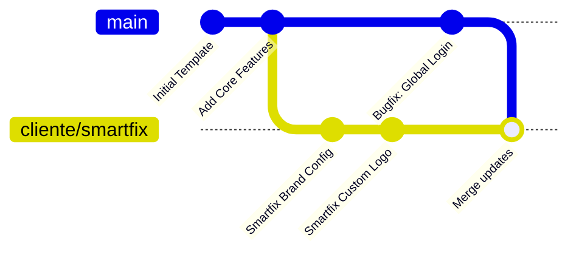

# Arquitectura de Control de Versiones con Git: Modelo Multi-Cliente

Esta guía documenta la estructura profesional de ramas (branching) para gestionar una aplicación plantilla base ("molde de oro") y derivar de ella múltiples instancias personalizadas para diferentes clientes, garantizando la posibilidad de propagar actualizaciones y correcciones globales con un solo comando.

---

## 1. El Concepto de Diseño: Rama Base vs. Ramas de Cliente

El flujo de trabajo se basa en mantener una separación limpia entre la lógica común del producto y las personalizaciones visuales/configuraciones de cada negocio.



* **Rama `main` (Plantilla de Oro / Rama Final):** Contiene la versión de producción estable y consolidada del molde base. Aquí no se desarrolla directamente; es la rama de la que se derivan o actualizan las ramas de clientes.
* **Rama `develop` (Rama de Desarrollo y Pruebas):** Rama donde se realizan los desarrollos activos, nuevas características y pruebas correspondientes antes de consolidar y fusionar los cambios estables hacia `main`.
* **Rama `cliente/[nombre-cliente]` (Instancia Cliente):** Rama creada a partir de `main` dedicada a un cliente específico (ej. `cliente/smartfix`). Contiene las adaptaciones de colores, logos, textos comerciales y variables de entorno particulares de ese negocio.

### 1.1. Manejo de Múltiples Productos Base (Repositorios Separados)
Si los clientes tienen bases de código completamente distintas (productos diferentes):
* Lo ideal es crear **repositorios de GitHub independientes** para cada producto base.
* Cada uno de estos repositorios tendrá su propia plantilla de oro (`main`), su rama de desarrollo (`develop`) y sus respectivas ramas de clientes.
* **Estándar de Nomenclatura del Repositorio:** El nombre de cualquier repositorio de GitHub que contenga una plantilla base del ecosistema debe crearse con contexto directo a dicha plantilla, siguiendo la estructura `prototipe-core-[nicho-o-contexto]` (ej. `prototipe-core-ventas`, `prototipe-core-servicios`, `prototipe-core-restaurante`).

---

## 2. Guía de Comandos: Ciclo de Vida del Proyecto

### A. Inicializar el Repositorio de la Plantilla (Solo la primera vez en la base)
Si el proyecto base aún no está bajo control de versiones:
```bash
git init
git add .
git commit -m "feat: inicializar plantilla base de oro"
```

### B. Crear una nueva instancia para un cliente
Cuando adquieras un nuevo cliente (ej. "Smartfix"), sitúate en la plantilla base limpia y crea una rama nueva:
```bash
# Asegurarse de estar en la base limpia y actualizada
git checkout main
git pull origin main

# Crear la rama del nuevo cliente
git checkout -b cliente/smartfix
```
A partir de este momento, en la rama `cliente/smartfix` realizarás la configuración de colores en el CSS, la inyección del logo y la configuración del archivo `.env.local` con las credenciales de Firebase correspondientes a este cliente.

### C. Propagar actualizaciones globales a todos los clientes
Si descubres un error o agregas una característica nueva y valiosa al núcleo de la aplicación, el proceso para actualizar a todos tus clientes es rápido y libre de errores manuales:

1. **Implementar el cambio en la plantilla base:**
   ```bash
   git checkout main
   # (Se programa el cambio o la solución del bug)
   git add .
   git commit -m "fix: corregir cálculo de impuestos en el carrito"
   ```

2. **Propagar el cambio a la rama del cliente:**
   ```bash
   git checkout cliente/smartfix
   git merge main -m "merge: actualizar base a versión más reciente"
   ```
   *Git fusionará automáticamente el código base con la rama del cliente. Las personalizaciones de colores y marcas del cliente no se perderán porque están localizadas en archivos que la rama `main` no modifica.*

---

## 3. Reglas de Oro para evitar Conflictos de Fusión (Merge Conflicts)

Para asegurar que los comandos `git merge` funcionen automáticamente y sin errores de colisión de código, sigue estrictamente estas prácticas de desarrollo senior:

1. **Centraliza las configuraciones de marca:** Nunca escribas el nombre del cliente directamente en componentes como el Footer, Header o correos. El nombre de la marca debe leerse de un archivo de configuración centralizado (ej. `src/config/brand.js`) que en `main` está en blanco y en la rama del cliente tiene sus datos.
2. **Usa variables de CSS (Custom Properties):** Define los colores corporativos como variables en `src/index.css` (ej. `--color-primary`, `--color-secondary`). En `main` tendrán colores por defecto, y en la rama de cada cliente solo modificarás esas variables CSS en lugar de editar el estilo de cada botón uno por uno.
3. **Nunca subas `.env.local` al repositorio base:** Agrega `.env.local` al archivo `.gitignore` de la rama `main`. De esta forma, cada rama de cliente mantendrá sus credenciales de base de datos Firebase locales en su computadora sin peligro de que se sobrescriban o se mezclen al fusionar ramas.
