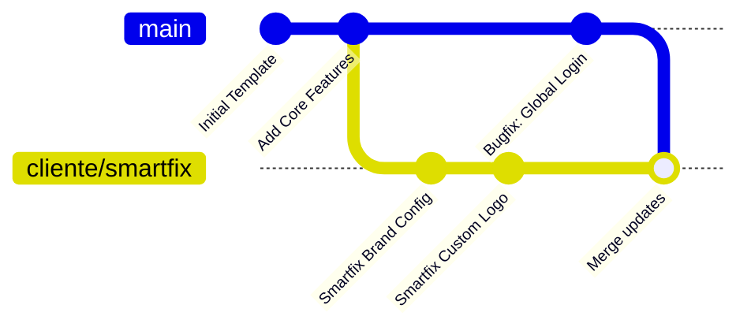

# Arquitectura de Control de Versiones con Git: Modelo Multi-Cliente

Esta guía documenta la estructura profesional de ramas (branching) para gestionar una aplicación plantilla base ("molde de oro") y derivar de ella múltiples instancias personalizadas para diferentes clientes, garantizando la posibilidad de propagar actualizaciones y correcciones globales con un solo comando.

---

## 1. El Concepto de Diseño: Rama Base vs. Ramas de Cliente

El flujo de trabajo se basa en mantener una separación limpia entre la lógica común del producto y las personalizaciones visuales/configuraciones de cada negocio.



* **Rama `main` (Plantilla de Oro / Rama Final):** Contiene la versión de producción estable y consolidada del molde base. Aquí no se desarrolla directamente; es la rama de la que se derivan o actualizan las ramas de clientes.
* **Rama `develop` (Rama de Desarrollo y Pruebas):** Rama donde se realizan los desarrollos activos, nuevas características y pruebas correspondientes antes de consolidar y fusionar los cambios estables hacia `main`.
* **Rama `cliente/[nombre-cliente]` (Instancia Cliente):** Rama creada a partir de `main` dedicada a un cliente específico (ej. `cliente/smartfix`). Contiene las adaptaciones de colores, logos, textos comerciales y variables de entorno particulares de ese negocio.

### 1.1. Manejo de Múltiples Productos Base (Repositorios Separados)
Si los clientes tienen bases de código completamente distintas (productos diferentes):
* Lo ideal es crear **repositorios de GitHub independientes** para cada producto base.
* Cada uno de estos repositorios tendrá su propia plantilla de oro (`main`), su rama de desarrollo (`develop`) y sus respectivas ramas de clientes.
* **Estándar de Nomenclatura del Repositorio:** El nombre de cualquier repositorio de GitHub que contenga una plantilla base del ecosistema debe crearse con contexto directo a dicha plantilla, siguiendo la estructura `prototipe-core-[nicho-o-contexto]` (ej. `prototipe-core-ventas`, `prototipe-core-servicios`, `prototipe-core-restaurante`).

---

## 2. Guía de Comandos: Ciclo de Vida del Proyecto

### A. Inicializar el Repositorio de la Plantilla (Solo la primera vez en la base)
Si el proyecto base aún no está bajo control de versiones:
```bash
git init
git add .
git commit -m "feat: inicializar plantilla base de oro"
```

### B. Crear una nueva instancia para un cliente
Cuando adquieras un nuevo cliente (ej. "Smartfix"), sitúate en la plantilla base limpia y crea una rama nueva:
```bash
# Asegurarse de estar en la base limpia y actualizada
git checkout main
git pull origin main

# Crear la rama del nuevo cliente
git checkout -b cliente/smartfix
```
A partir de este momento, en la rama `cliente/smartfix` realizarás la configuración de colores en el CSS, la inyección del logo y la configuración del archivo `.env.local` con las credenciales de Firebase correspondientes a este cliente.

### C. Propagar actualizaciones globales a todos los clientes
Si descubres un error o agregas una característica nueva y valiosa al núcleo de la aplicación, el proceso para actualizar a todos tus clientes es rápido y libre de errores manuales:

1. **Implementar el cambio en la plantilla base:**
   ```bash
   git checkout main
   # (Se programa el cambio o la solución del bug)
   git add .
   git commit -m "fix: corregir cálculo de impuestos en el carrito"
   ```

2. **Propagar el cambio a la rama del cliente:**
   ```bash
   git checkout cliente/smartfix
   git merge main -m "merge: actualizar base a versión más reciente"
   ```
   *Git fusionará automáticamente el código base con la rama del cliente. Las personalizaciones de colores y marcas del cliente no se perderán porque están localizadas en archivos que la rama `main` no modifica.*

---

## 3. Reglas de Oro para evitar Conflictos de Fusión (Merge Conflicts)

Para asegurar que los comandos `git merge` funcionen automáticamente y sin errores de colisión de código, sigue estrictamente estas prácticas de desarrollo senior:

1. **Centraliza las configuraciones de marca:** Nunca escribas el nombre del cliente directamente en componentes como el Footer, Header o correos. El nombre de la marca debe leerse de un archivo de configuración centralizado (ej. `src/config/brand.js`) que en `main` está en blanco y en la rama del cliente tiene sus datos.
2. **Usa variables de CSS (Custom Properties):** Define los colores corporativos como variables en `src/index.css` (ej. `--color-primary`, `--color-secondary`). En `main` tendrán colores por defecto, y en la rama de cada cliente solo modificarás esas variables CSS en lugar de editar el estilo de cada botón uno por uno.
3. **Nunca subas `.env.local` al repositorio base:** Agrega `.env.local` al archivo `.gitignore` de la rama `main`. De esta forma, cada rama de cliente mantendrá sus credenciales de base de datos Firebase locales en su computadora sin peligro de que se sobrescriban o se mezclen al fusionar ramas.

---

## 4. Automatización: Gestor Maestro de Respaldos (`backup.bat` / `menu_backup.ps1`)

> **Nota de vigencia (2026-07-16, `CORE-372`):** esta sección fue corregida
> tras leer el código real de `menu_backup.ps1`, `git_backup.ps1` y
> `subproject_backup.ps1` completos, y el panel web equivalente
> (`GitBackupPanel.jsx`). La versión anterior describía un flujo de "pull
> defensivo + merge interactivo con rollback" que **no coincide** con el
> comportamiento real de los scripts. Se documenta aquí lo verificado, no
> lo idealizado.

Para simplificar la ejecución diaria y garantizar la consistencia en todos los niveles del ecosistema PROTOTIPE, se dispone de una suite interactiva de comandos centralizada en [`backup.bat`](file:///d:/PROTOTIPE/backup.bat) (lanzador `.bat` de una línea que invoca `menu_backup.ps1`) y orquestada por PowerShell. **Esta misma suite tiene una segunda interfaz**: el panel "Control de Versiones" del Dashboard Central (`Central PROTOTIPE/dev-dashboard/src/components/admin/GitBackupPanel.jsx`) no reimplementa lógica Git propia — llama al endpoint `GET /api/git/backup-stream` del CLI Bridge (`Prototipe-CLI/server.js`), que hace `spawn('powershell.exe', ...)` sobre estos mismos `.ps1` y transmite su salida en vivo por SSE. Son el mismo motor con dos puertas de entrada (terminal interactiva vs. panel web), no dos sistemas distintos.

### 4.1. Modos de Respaldo Habilitados
Al ejecutar el lanzador, se presenta una consola premium interactiva controlada con las flechas del teclado `[↑ / ↓]` y selección con `[Enter]`:

* **Opción 0: Respaldo Maestro de todo PROTOTIPE (Snapshot Físico)** — ejecuta `git_backup.ps1` sobre el repositorio raíz `D:\PROTOTIPE`.
  * Captura el estado completo del disco `D:\PROTOTIPE` en el repositorio raíz.
  * Para evitar la creación de Git Links o submódulos vacíos indeseados, el script renombra temporalmente los directorios `.git` locales de los subproyectos a `.git-backup-temp` antes de indexar, restaurándolos inmediatamente al finalizar.
  * Cuenta con una **rutina de auto-recuperación** en el arranque: si el script es cancelado de forma abrupta a mitad de ejecución, al volver a abrirlo restaurará automáticamente cualquier carpeta `.git-backup-temp` huérfana de vuelta a `.git`.
* **Opciones de Subproyectos (dev-dashboard, Plantillas Core, Instancias)** — ejecutan `subproject_backup.ps1` sobre la carpeta física elegida.
  * Permiten aislar y respaldar componentes específicos de forma atómica en sus propios repositorios remotos.
  * **Para instancias de cliente específicamente**, el script hace algo adicional: detecta el nicho de la instancia, localiza la carpeta del Core correspondiente, lee el remoto `origin` de ESE Core, reconfigura el `origin` local de la instancia para que apunte al mismo remoto, y renombra la rama local de la instancia a la convención `cliente/<nombreProyecto>` antes de hacer push. Así es como nace en GitHub una rama como `cliente/ventas-moni-app` dentro del repositorio `prototipe-core-ventas` — la puebla la propia instancia física, no un merge hecho desde dentro del Core.

> **Actualización (`CORE-373`, 2026-07-16): resuelto.** El `CORE-372`
> encontró que ningún subproyecto tenía repositorio Git local (ni activo
> ni disfrazado) — probable efecto de la recuperación de disco del
> 2026-07-14. El fundador autorizó re-inicializarlos y ya se hizo, sin
> tocar ningún archivo físico (método: `git init` + `remote add` + `fetch`
> + `branch <rama> origin/<rama>` + `symbolic-ref HEAD` + `read-tree
> origin/<rama>`, este último en vez de `git reset` porque una regla de
> permisos del entorno lo bloquea). **Patrón general aplicado** (no
> específico de un cliente): el Core y el Dashboard quedan en `develop` →
> `origin/develop`; **cualquier instancia de cliente** queda en
> `cliente/<clientId>` → `origin/cliente/<clientId>` — este es el patrón
> a replicar para toda instancia presente o futura, no una excepción de
> un cliente en particular. Ejemplo puntual verificado en esta fecha (uno
> de posiblemente varios, cada instancia se verifica por separado):
> - Dashboard: base `a33bc84` (13-jul).
> - Core App Ventas: base `b24561e` (13-jul).
> - Instancia Moni (`cliente/ventas-moni-app`): base `ead11e1` (13-jul).
>
> Ningún commit ni push se ha hecho todavía sobre estos tres — quedaron
> listos para operar desde la suite de respaldo, pendientes de que el
> fundador autorice el primer commit de puesta al día. **No asumir sin
> comprobar `git status`/`git branch -vv`** que un subproyecto o instancia
> cualquiera sigue en este estado exacto en sesiones futuras — puede
> cambiar, y una instancia nueva que se cree después seguirá el mismo
> patrón general, no necesariamente estos commits base específicos.

### 4.2. Flujo Real de Push y Auto-Merge (verificado en el código, no idealizado)

El flujo real que ejecutan `git_backup.ps1` y `subproject_backup.ps1` es más directo que el descrito originalmente aquí — **no hay `git pull` defensivo previo al push ni rollback vía `git reset --soft`**:

1. **Commit y push directo:** los cambios se commitean con el mensaje provisto (o uno auto-generado) y se suben a la rama activa con `git push -u origin <rama> --no-verify`. Si la red no responde, el script hace un fallback silencioso a "solo commit local" sin bloquear al desarrollador.
2. **Auto-Merge por push remoto ("zero-checkout"), no por merge local:** cuando se activa la opción de consolidar a producción, el script **no** hace `checkout main` + `pull` + `merge` + `push` en el disco local. En su lugar ejecuta `git push origin <ramaActual>:main --no-verify` (sube la rama de desarrollo directamente como `main` en el remoto) y luego actualiza la referencia local con `git branch -f main <ramaActual>` — un fast-forward forzado sin checkout intermedio. Si el push remoto es rechazado (rama remota divergente), el comando falla y se reporta como error; no hay un abort/rollback automático adicional más allá de eso.
3. Ambos scripts alternan entre `.git` y `.git-backup-temp` para el subproyecto que están operando (necesario para no chocar con el `.git` de la raíz durante un Respaldo Maestro concurrente) y restauran el estado original en un bloque `finally`.

### 4.3. Filtros de Seguridad y Mensajes Contextuales
* **Fuga de Credenciales (Detector `.env`):** Un interceptor en caliente analiza la lista de archivos indexados. Si detecta archivos sensibles `.env` (excluyendo `.env.example`), detiene el respaldo inmediatamente para evitar subir secretos de bases de datos o Firebase a GitHub.
* **Mensajes Contextuales Inteligentes:** Si el usuario no redacta un mensaje de commit y presiona `Enter`, el script lee dinámicamente los estados (`git status --porcelain`) y autogenera un mensaje descriptivo de los archivos modificados, agregados o eliminados (ej. `Auto-Snapshot [develop]: Mod: index.html | Add: Button.jsx`).
* **Soporte Offline (Respaldos Locales):** Si el script no detecta conexión a internet o falla la autenticación remota, ofrece resguardar un commit puramente en el disco local para que el desarrollador no pierda su trabajo diario.

## 5. Motor de Propagación Core→Cliente vía `git merge` (retirado — `CORE-166` / `CORE-375`)

> **Estado: RETIRADO (`CORE-375`, 2026-07-16).** Esta sección se conserva
> como registro histórico de por qué existió y por qué se eliminó — no
> describe nada que exista hoy en el código.

Además de la suite de respaldo de la sección 4, existió un mecanismo, construido el 2026-07-02 (`CORE-166`), que implementaba literalmente el modelo de ramas de cliente descrito en la sección 1 de este documento con propagación automática vía `git merge`:

`GET /api/git/sync-core-to-clients-stream` (`Prototipe-CLI/server.js`) recibía un Core, una rama origen y una lista de ramas `cliente/<id>`, y para cada una: hacía `checkout` de la rama cliente **dentro del propio repositorio físico del Core**, ejecutaba `git merge <ramaOrigen> --no-verify`, hacía `push` de la rama actualizada, localizaba la carpeta física de esa instancia (`findProjectDir`), leía su `VITE_FIREBASE_PROJECT_ID`, corría `npm run build` y desplegaba con `firebase deploy --only hosting -P <projectId>` — un pipeline completo de propagar + reconstruir + redesplegar por cliente, con manejo de conflictos de merge.

**Por qué se retiró:** confirmado por búsqueda exhaustiva en `Central PROTOTIPE/dev-dashboard/src` (`CORE-372`) que ningún componente del Dashboard lo invocaba — estuvo completo y endurecido contra desconexiones SSE desde `CORE-166` pero sin ningún botón ni flujo que lo disparara durante dos semanas. Además, su modelo (merge dentro del `.git` del propio Core) competía con el modelo real en uso (la rama `cliente/<id>` la puebla la instancia física por su cuenta, sección 4.1) — mantener ambos habría sido exactamente la ambigüedad de "dos fuentes de verdad" que la propuesta de arquitectura (sección 3.2) advertía evitar. El mecanismo que decide qué propagar es, y sigue siendo, el Manifiesto de Overrides + sincronización por copia de archivos (`/api/instancias/sync-and-deploy-stream`, `CORE-371`).

**Verificación del retiro (`HECHO VERIFICADO`):** `node --check server.js` sin errores tras el borrado; cero referencias residuales (`grep -c "sync-core-to-clients-stream" server.js` = 0); `node scripts/test_bridge_health.js` confirma arranque limpio y health check HTTP 200 después del cambio.

---

## 6. Contrato Final: Nomenclatura y Alta de Nuevos Cores (`CORE-372`/`CORE-373`, 2026-07-16)

Esta sección cierra, con evidencia verificada en código (no solo en los scripts de respaldo, sino en el propio generador de proyectos `Prototipe-CLI/generator.js`), cómo debe nombrarse y darse de alta cualquier Core nuevo para que todo el ecosistema (generador, backup, Dashboard) lo reconozca sin fricciones.

### 6.1. Qué SÍ está automatizado hoy al crear un proyecto (`generator.js`, función `setupGitHub`)

El generador de proyectos (no la suite de respaldo) tiene su **propia** lógica de Git, independiente de `git_backup.ps1`/`subproject_backup.ps1`, que se ejecuta una sola vez al aprovisionar un proyecto nuevo. Se bifurca en dos casos reales, verificados en `generator.js` líneas 3436-3557:

* **Caso B — Core nuevo desde la semilla (`template-core-seed`):** ejecuta `gh repo create app-<clientId> --private --source=. --push`. **Crea un repositorio de GitHub privado e independiente automáticamente** y sube el commit inicial de scaffolding. No requiere ninguna configuración manual adicional.
* **Caso A — Instancia de cliente desde un Core comercial existente (ej. Ventas):** **NO crea un repo nuevo** (por diseño correcto). En su lugar: busca en `plantillas_registro.json` la entrada cuyo `destino` coincide con la plantilla usada, obtiene el `fuente` (carpeta física del Core), localiza su `.git` (o `.git-backup-temp`), lee su remoto `origin`, lo copia como el `origin` de la instancia nueva, renombra la rama local a `cliente/<clientId>` y hace `git push -u origin cliente/<clientId> --no-verify`. Esta ruta usa el **registro** (`plantillas_registro.json`), no una adivinanza por nombre de carpeta — es robusta ante Cores nuevos siempre que estén registrados correctamente.

**Dependencia crítica del Caso A (causa raíz real, confirmada hoy):** si el Core fuente no tiene `.git` ni `.git-backup-temp` en el momento de crear la instancia, este paso lanza una excepción que el código atrapa y convierte en una simple advertencia amarilla (`⚠️ No se pudo asociar o subir al repositorio del Core remoto... Continuando`) — **la creación de la instancia NO se detiene**, pero la instancia queda sin remoto configurado y sin nada subido a GitHub, sin ningún error visible al usuario. Esto explica por qué `Instancias Clientes/ventas/ventas-moni-app` apareció sin `.git` al auditar hoy: el Core de Ventas tampoco tenía `.git` en ese momento (ver `CORE-372`). Tras `CORE-373` (Core ya con `.git` real), este mecanismo debería funcionar correctamente para cualquier instancia nueva creada de ahora en adelante desde Ventas — **regla operativa: antes de generar una instancia nueva desde un Core, comprobar que ese Core tenga `.git` o `.git-backup-temp`; si no lo tiene, el push a GitHub fallará en silencio.**

### 6.2. Qué NO está automatizado: convertir una app en Core (`CorePromotionModal.jsx` → `CorePromotionService`/`CorePromotionPublisher`)

Verificado por búsqueda exhaustiva en `Prototipe-CLI/lib/CorePromotionPublisher.js` y `CorePromotionService.js`: **cero lógica de Git o GitHub.** El flujo de promoción (preflight → sanitización → validación → build/smoke test → publish → activate, con rollback en cada etapa) solo mueve carpetas físicas y actualiza `plantillas_registro.json`. A diferencia del Caso B de la sección 6.1 (Core desde semilla, que sí crea el repo solo), **promover una app a Core nuevo no crea ningún repositorio de GitHub** — hay que hacerlo manualmente (`gh repo create` o la web de GitHub) después de la promoción. Pendiente de decisión del fundador si se automatiza esto para que ambos caminos de creación de Core queden simétricos.

### 6.3. Regla de nomenclatura obligatoria

* **Repositorio de GitHub:** `prototipe-core-<slug>` (ej. `prototipe-core-ventas`). Privado salvo decisión explícita de hacerlo público.
* **Ramas dentro de un Core:** únicamente `main` (producción estable) y `develop` (desarrollo activo) — **no usar `master`**, los 3 repos reales del ecosistema usan `main` sin excepción; cualquier mención de "main o master" en documentación antigua queda obsoleta.
* **Rama de instancia de cliente:** `cliente/<clientId>`, siempre poblada por el **push automático del Caso A del generador** (sección 6.1) o, si se hace a mano, por `subproject_backup.ps1` — nunca por un merge hecho desde dentro del repositorio del Core (ver retiro del endpoint huérfano, sección 5).
* **Carpeta física del Core (`Plantillas Core/<Nombre Core>`):** el generador (`generator.js`) resuelve el Core correcto vía `plantillas_registro.json` (robusto). **Corregido en `CORE-375` (2026-07-16):** `subproject_backup.ps1` ahora usa el mismo mecanismo como método principal — lee `coreType`/`template` del `.prototipe.json` propio de la instancia y resuelve la carpeta física vía `plantillas_registro.json`. La heurística anterior (nombre de carpeta del Core debe contener el nombre del nicho, ej. `"App Ventas" -match "ventas"`) se conserva únicamente como respaldo, solo se usa si el registro no resuelve nada (instancia sin `.prototipe.json`, o entrada no encontrada). No depender de la heurística de nombre para Cores nuevos — el registro es la fuente autoritativa.

### 6.4. Runbook: cómo dar de alta un Core nuevo

1. Crear la carpeta física en `Plantillas Core/<Nombre Core>`, cumpliendo la regla de nomenclatura de la sección 6.3 (debe contener el nicho).
2. Aprovisionar desde `template-core-seed` vía el generador — esto ya crea el repo `app-<clientId>` en GitHub automáticamente (sección 6.1, Caso B). Renombrar ese repo a `prototipe-core-<slug>` desde GitHub si el nombre autogenerado no sigue la convención.
3. Confirmar que el nuevo Core tenga `main` y `develop` como ramas (crear `develop` desde `main` si el scaffolding solo dejó una).
4. Registrar la entrada correspondiente en `plantillas_registro.json` (fuente física ↔ nombre de plantilla) — el generador depende de esto para el Caso A.
5. Antes de crear la primera instancia de cliente desde este Core nuevo, verificar que el Core tenga `.git` (o `.git-backup-temp`) accesible — si no, el push automático de la instancia fallará en silencio (sección 6.1).
6. Documentar el nuevo Core en este archivo (tabla de la sección 1.1) y en `mapa_aplicacion.md`.

### 6.5. Retiro ejecutado (Fase E — `CORE-375`, 2026-07-16)

`GET /api/git/sync-core-to-clients-stream` (sección 5) fue eliminado de `Prototipe-CLI/server.js` — era un segundo modelo de propagación (merge dentro del Core) que competía con el modelo vigente (push desde la instancia), sin interfaz que lo disparara desde hace dos semanas. Verificado: servidor arranca limpio y responde health check tras el borrado.

