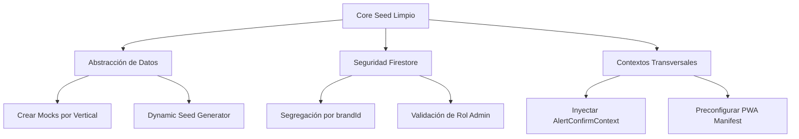

# 🏛️ Análisis de Adaptabilidad y Compatibilidad del Core Seed

Este documento presenta una auditoría técnica profunda sobre la plantilla base **`template-core-seed`** (`/Prototipe-CLI/templates/template-core-seed/`). Identifica las brechas de compatibilidad para el despliegue dinámico de cualquier nicho comercial en el ecosistema PROTOTIPE y define el plan de acción técnica para su resolución.

---

## 📊 1. Diagnóstico de Brechas y Limitaciones

### ⚠️ Brecha A: Datos de Siembra Rígidos y Drifts de Nicho (`seed.json`)
*   **Problema:** El archivo [seed.json](file:///d:/PROTOTIPE/Prototipe-CLI/templates/template-core-seed/seed.json) contiene colecciones de calzado y tecnología (productos mock como *"Tenis Run Ultra"* y *"Reloj Inteligente V2"*).
*   **Impacto:** Al aprovisionar instancias destinadas a servicios (ej: Tornerías, Bienestar/Podología, Lavanderías), se inyectan productos y categorías irrelevantes en la base de datos de producción. Esto obliga a realizar tareas destructivas manuales de limpieza.
*   **Solución:** Desacoplar el catálogo de productos de la semilla base y estructurar plantillas de datos dinámicas específicas para cada una de las 23 verticales de negocio oficiales (`niches.json`).

### 🔒 Brecha B: Falta de Seguridad Multi-Tenant en Reglas de Firestore
*   **Problema:** Las reglas en `firestore.rules` permiten el acceso sin restricciones a cualquier usuario autenticado:
    ```javascript
    match /{document=**} {
      allow read, write: if request.auth != null;
    }
    ```
*   **Impacto:** Fallo crítico de seguridad en producción. Cualquier cliente registrado de una marca podría modificar configuraciones del sistema, inventarios, o leer comisiones de empleados de otra instancia si comparten backend.
*   **Solución:** Rediseñar la jerarquía para validar el `brandId` o `tenantId` en la sesión de Auth y restringir escrituras administrativas mediante el rol (`request.auth.token.role == 'admin'`).

### 📦 Brecha C: Ausencia de Contextos Transversales y Dependencias Críticas
*   **Problema:** Componentes clave de la biblioteca importan hooks del sistema como `useAlertConfirm` o `useNotify` (Toast). Sin embargo, el archivo `AlertConfirmContext.jsx` y su correspondiente inyección en `App.jsx` no se encuentran en la estructura física del seed.
*   **Impacto:** Errores de compilación en caliente (`ReferenceError`) cuando se inyectan componentes interactivos de la biblioteca en la plantilla.
*   **Solución:** Pre-hidratar el seed con el set completo de contextos esenciales (`AlertConfirmContext.jsx`, `ThemeApplier`, `AuthGuard`).

### 🌐 Brecha D: Localización e Impuestos Rígidos
*   **Problema:** La configuración inicial asume valores por defecto de moneda COP y sin soporte de localización dinámico.
*   **Impacto:** Dificulta el aprovisionamiento de marcas internacionales o de nichos con lógicas de facturación complejas (ej: DIAN, impuestos regionales).
*   **Solución:** Añadir un nodo de localización y formato de moneda en la colección `config/settings`.

---

## 🛠️ Plan de Acción y Correcciones Propuestas



### 1. Reestructuración de la Base de Datos (`seed.json`)
Sugerimos estructurar `seed.json` en base a **metadatos de configuración de la marca** y desacoplar los productos:

```json
{
  "collections": {
    "config": [
      {
        "id": "settings",
        "fields": {
          "appName": "{{APP_NAME}}",
          "slogan": "{{APP_SLOGAN}}",
          "brandId": "{{BRAND_ID}}",
          "currency": {
            "code": "COP",
            "symbol": "$",
            "locale": "es-CO"
          },
          "primaryColor": "{{COLOR_PRIMARY}}",
          "secondaryColor": "{{COLOR_SECONDARY}}",
          "bgColor": "{{COLOR_BG}}"
        }
      }
    ]
  }
}
```

### 2. Endurecimiento de Seguridad en `firestore.rules`
Inyectar reglas que exijan validación de propiedad y roles:

```javascript
rules_version = '2';
service cloud.firestore {
  match /databases/{database}/documents {
    // Regla de oro: El usuario debe pertenecer al inquilino (brandId)
    function isTenantUser(brandId) {
      return request.auth != null && request.auth.token.brandId == brandId;
    }
    
    function isAdmin(brandId) {
      return isTenantUser(brandId) && request.auth.token.role == 'admin';
    }

    match /config/{document} {
      allow read: if true;
      allow write: if isAdmin(request.resource.data.brandId);
    }
  }
}
```

---

## 📝 Criterios de Decisión
*   **Aislamiento del Seed:** El Core Seed debe mantenerse como un cascarón con latencia de carga cero. Toda lógica de plugins de terceros (`jspdf`, `qrcode`) debe modularizarse y ser inyectada dinámicamente según la vertical del negocio solicitada.
*   **Paridad de Entornos:** Garantizar que los scripts de prueba en `package.json` utilicen los mismos estándares de Playwright que la plantilla de ventas para dar feedback de humo inmediato.
