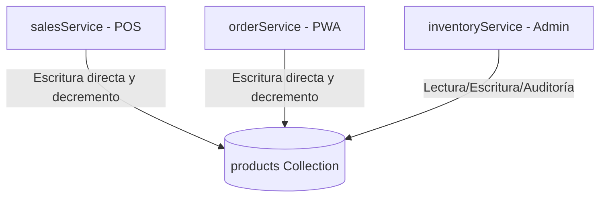

# 🗺️ Informe de Auditoría Técnico-Arquitectónica — Core vs Features (template-core-seed)

Este informe evalúa la semilla base `template-core-seed` (proyecto `/Plantillas Core/App Ventas/`) bajo los principios de Platform Engineering, Multi-tenancy SaaS, Clean Architecture y Domain-Driven Design (DDD). El objetivo es determinar si la plantilla separa correctamente el núcleo transversal (Core) de las funcionalidades específicas de retail/ventas (Features) para permitir la generación automatizada de múltiples verticales de negocio (Citas, Reservas, Clínicas, E-commerce, CRM, etc.).

---

## 📊 1. Matriz de Auditoría: Core vs Features

La siguiente tabla clasifica los módulos del proyecto y evalúa la idoneidad de su ubicación física en el monorepo:

| Módulo | Tipo Semántico | Ubicación Física Actual | ¿Correcto? | Criterio Técnico y Observación |
| :--- | :---: | :--- | :---: | :--- |
| **Autenticación** | CORE | `src/hooks/useAuthInit.js` & `store/authStore.js` | **SÍ** | Lógica agnóstica de inicio de sesión de administradores y clientes. |
| **Usuarios** | CORE | `src/services/userService.js` | **SÍ** | Persistencia genérica de perfiles de usuario. |
| **Roles y Permisos** | CORE | `src/constants/index.js` (`ROLES`) | **SÍ** | Define roles base (`admin`, `client`, `vendedor`, etc.), pero acoplado a roles de retail en el mismo archivo. |
| **Tenant / Configuración** | CORE | `src/services/appConfigService.js` | **MEJORABLE** | Administra la carga de settings, pero el esquema Zod y el store contienen campos rígidos de retail. |
| **Branding y Temas** | CORE | `src/constants/palettes.js` & `index.html` | **SÍ** | HSL Brand Mapping dinámico excelente para marca blanca, con bug menor de clave de localStorage. |
| **Telemetría y Errores** | CORE | `src/services/telemetryService.js` | **SÍ** | Reportes de excepciones a Firestore Central encolados en IndexedDB. |
| **Testing** | CORE | `tests/` & `vitest.config.js` | **MEJORABLE** | La base de tests está bien, pero no resuelve alias `@/` y Playwright está atado a Windows. |
| **CI/CD** | CORE | `.github/workflows/ci.yml` | **SÍ** | Workflow automatizado estándar, pero le falta invocar validadores y linters. |
| **Ventas (POS/PWA)** | FEATURE | `src/features/sales/` | **SÍ** | Aislado en su directorio de feature. |
| **Pedidos** | FEATURE | `src/features/orders/` | **SÍ** | Aislado en su directorio de feature. |
| **Inventario / Kárdex** | FEATURE | `src/features/inventory/` | **SÍ** | Módulo de inventario y kárdex aislado. |
| **Créditos (Fiados)** | FEATURE | `src/features/credits/` | **SÍ** | Aislado en su directorio de feature. |
| **Facturación** | FEATURE | `src/features/billing/` | **SÍ** | Módulo de contabilidad y facturación aislado. |
| **Seguimiento Domicilios**| FEATURE | `src/services/deliveryService.js` | **NO** | Ubicado en la raíz de `src/services/` como servicio global. Debería ser un feature bajo `src/features/delivery/`. |
| **Citas y Reservas** | FEATURE | *Inexistente en la semilla actual* | **N/A** | Pendiente de inyección según la vertical del cliente. |
| **CRM** | FEATURE | *Inexistente en la semilla actual* | **N/A** | Pendiente de inyección según la vertical del cliente. |

---

## 🛠️ 2. Auditoría de Generabilidad (Prototype CLI Engine)

**Pregunta Clave:** *"Si Prototype CLI genera una aplicación de citas (clínica), servicios profesionales o educación, ¿qué partes de template-core-seed habría que modificar manualmente?"*

### Archivos Contaminados y Modificaciones Manuales Requeridas:
1. **`src/routes/AppRoutes.jsx` (Crítico):**
   * **Problema:** Rutas de páginas de retail (`/admin/inventario`, `/admin/ventas`, `/tienda/catalogo`, `/tienda/producto/:id`) y portales operativos de retail (`vendedor`, `bodega`, `mensajero`) están importadas y declaradas estáticamente.
   * **Modificación Manual:** Reescribir el 80% del enrutador para dar soporte a páginas de agendas, citas médicas o cursos en línea.
2. **`src/schemas/appConfigSchema.js` & `store/appConfigStore.js` (Crítico):**
   * **Problema:** Campos como `deliverySettings`, `wholesaleSettings`, `catalogLayout`, `catalogFilters`, `creditsEnabled`, `couponsEnabled` están declarados como esquemas Zod e inicializadores obligatorios del Core.
   * **Modificación Manual:** Editar el schema y el Zustand store global para evitar que la aplicación de servicios o educación intente cargar, validar o renderizar opciones de despacho de paquetes o precios mayoristas de retail.
3. **`src/services/notificationCenterService.js` (Importante):**
   * **Problema:** Los tipos de notificación (`NC_TYPES`) e iconos/destinos (`NC_TYPE_META`) están estrictamente acoplados al dominio retail (`PEDIDO_RECIBIDO` que redirige a `/tienda/pedidos`, `STOCK_BAJO` a `/admin/inicio/alertas-stock`).
   * **Modificación Manual:** Modificar el diccionario estático de metadatos de notificaciones para evitar redirecciones a URLs inexistentes (404) en la vertical generada.
4. **`src/App.jsx` (Importante):**
   * **Problema:** Importación estática de `syncOfflineSales` desde `src/features/sales`. Si un vertical de servicios/educación no incluye el feature de ventas POS/Sales, el build de la aplicación se romperá por una importación huérfana.

---

## 🔗 3. Mapa de Dependencias entre Módulos (Imports y Acoplamiento)

### 🚨 El problema del Acoplamiento en Base de Datos (Database-Level Coupling)
Al auditar los archivos `src/features/sales/services/salesService.js` (POS) y `src/features/orders/services/orderService.js` (PWA Checkout), descubrimos que **ambos módulos omiten el uso de la interfaz de la feature de inventario (`inventoryService`) y escriben de forma directa en la colección `products`**:

* **Consecuencia Técnica:**
  * **Violación de DDD (Domain-Driven Design):** El agregado `Products` (Inventario) es modificado directamente desde los límites del contexto de `Orders` y `Sales` sin pasar por sus reglas o lógica interna.
  * **Duplicación de Lógica:** La lógica de iteración de variantes, decremento de stock y validación de stock infinito está duplicada en `salesService.js` y `orderService.js`, lo que dificulta introducir cambios (como control de reservas o apartados).

### Reglas de Importación para el Core y Features:

* **Imports Permitidos (CORE ➔ CORE):**
  * Hooks consumen Stores de configuración (`useAppConfigStore`) y Auth (`useAuthStore`).
  * Servicios consumen `firebaseConfig.js` y `telemetryService.js`.
* **Imports Prohibidos (CORE ➔ FEATURES):**
  * `App.jsx` e `index.html` NO deben importar lógica comercial como `syncOfflineSales`.
  * `AppRoutes.jsx` debe cargar dinámicamente las rutas de features registradas en lugar de importarlas de forma estática.
* **Imports Permitidos (FEATURES ➔ CORE):**
  * Features importan constantes de base de datos (`COLLECTIONS`), utilidades de formateo (`formatCurrency`) y servicios de notificaciones (`createCentralNotification`).
* **Imports Prohibidos (FEATURES ➔ FEATURES):**
  * Una feature no debe escribir directamente en colecciones administradas por otra. `sales` y `orders` deben invocar funciones exportadas de `inventoryService` (ej. `deductInventoryStock(items)`) para desacoplar el modelo físico.

---

## 📂 4. Auditoría de Contaminación de Dominio (Ejemplos Reales)

* **Archivo:** [src/constants/index.js](file:///d:/PROTOTIPE/Plantillas%20Core/App%20Ventas/src/constants/index.js#L84)
  * **Evidencia:** `export const PRODUCT_GENDERS = [...]` e `export const ORDER_TYPES = { RETAIL: 'detal', WHOLESALE: 'mayorista' }` declarados en la raíz de constantes globales.
  * **Impacto:** Obliga a todas las aplicaciones empresariales a poseer conceptos de género (indumentaria) y tipos de venta mayorista.
* **Archivo:** [src/services/appConfigService.js](file:///d:/PROTOTIPE/Plantillas%20Core/App%20Ventas/src/services/appConfigService.js#L58)
  * **Evidencia:** `wholesaleSettings`, `deliverySettings` y `catalogFilters` definidos dentro del objeto de inicialización por defecto `DEFAULT_SETTINGS`.
  * **Impacto:** Si la base de datos se inicializa vacía, crea colecciones de configuración exclusivas de retail en negocios de consultoría o reserva de citas.

---

## 📂 5. Auditoría de Seguridad, Multi-Tenant y Performance

### Seguridad Crítica (Nivel 4)
* **Archivo:** [firestore.rules](file:///d:/PROTOTIPE/Plantillas%20Core/App%20Ventas/firestore.rules#L79)
  * **Evidencia:** `allow read: if true;` en `/orders/` y `/credits/`.
  * **Impacto:** Fuga total de PII y datos de crédito. Cualquiera puede listar la base de datos comercial y de deudas de los clientes.
* **Archivo:** [centralFirebaseService.js](file:///d:/PROTOTIPE/Plantillas%20Core/App%20Ventas/src/services/centralFirebaseService.js#L18)
  * **Evidencia:** Secretos y llaves de Firebase de control central expuestos directamente en el JS cliente.

### Performance y Multi-Tenant (Nivel 3)
* **Archivo:** [useAppConfigSync.js](file:///d:/PROTOTIPE/Plantillas%20Core/App%20Ventas/src/hooks/useAppConfigSync.js#L104)
  * **Evidencia:** `onSnapshot` central abierto de manera incondicional para visitantes anónimos.
  * **Impacto:** Cientos de miles de lecturas consumidas en el proyecto Firebase central del desarrollador a gran escala.
* **Archivo:** [index.html](file:///d:/PROTOTIPE/Plantillas%20Core/App%20Ventas/index.html#L20)
  * **Evidencia:** LocalStorage key mismatch (`app-config-storage` vs `app-config-storage-${clientId}`).
  * **Impacto:** FOUC visual molesto (destello rosa/blanco) en cada recarga de la aplicación cliente.

---

## 🛠️ 6. Matriz de Hallazgos Clasificados por Gravedad

### 🔴 Nivel 4 — Crítico
* **1. Reglas Físicas de Firestore Abiertas:**
  * *Archivo:* `firestore.rules` (Línea 79, 123, 189).
  * *Evidencia:* `allow read: if true`.
  * *Impacto:* Exposición de deudas, despachos y compras.
  * *Remediación:* Cambiar a `allow read: if isAdmin()` y obligar a clientes públicos a consultar por token a través del tracker (/order_tracking/).
* **2. Claves de Firebase Central Expuestas:**
  * *Archivo:* `src/services/centralFirebaseService.js` (Líneas 18-23).
  * *Evidencia:* Credenciales fallback embebidas en el JS cliente.
  * *Impacto:* Exposición a manipulaciones del CRM por atacantes.
  * *Remediación:* Eliminar fallbacks, consumir estrictamente desde `.env.local` y validar en build.
* **3. Playwright config incompatible con Linux:**
  * *Archivo:* `playwright.config.js` (Línea 24).
  * *Evidencia:* `command: 'cmd /c npm run dev'`.
  * *Impacto:* Rompe la pipeline de CI de GitHub Actions (`ubuntu-latest`).
  * *Remediación:* Usar `command: 'npm run dev'`.

### 🟡 Nivel 3 — Importante
* **4. Alertas de Stock Desconectadas de las Ventas:**
  * *Archivo:* `orderService.js` y `salesService.js`.
  * *Evidencia:* Deducción de stock directa sin invocar `auditProductStock()`.
  * *Impacto:* Las alertas de inventario crítico no se disparan en compras reales, rompiendo la automatización operativa.
  * *Remediación:* Importar e invocar `auditProductStock` post-venta en el repositorio físico de datos.
* **5. Leak de Sockets Centrales para Usuarios Anónimos:**
  * *Archivo:* `useAppConfigSync.js` (Línea 104).
  * *Evidencia:* `onSnapshot` central abierto a todos los clientes públicos.
  * *Impacto:* Sobrecosto severo por lecturas Firestore en la cuenta del desarrollador.
  * *Remediación:* Restringir el listener de telemetría y pings centralizado estrictamente a roles administrativos.

### 🟢 Nivel 2 — Mejorable
* **6. Categorías acopladas en UI:**
  * *Archivo:* `src/components/ui/CategoryManager.jsx`.
  * *Evidencia:* Módulo con lógica de negocio y SVGs duplicados inyectado en ui/.
  * *Remediación:* Mover a `src/features/inventory/components/CategoryManager.jsx` y usar Lucide.
* **7. Aliasing en Vitest Roto:**
  * *Archivo:* `vitest.config.js`.
  * *Evidencia:* Falta resolver el alias `@/` de Vite.
  * *Remediación:* Configurar `resolve.alias` en `vitest.config.js`.

---

## 📈 Score de la Semilla Base (Evaluación Métrica)

* **Arquitectura Core:** **75 / 100**
* **Separación Core/Features:** **60 / 100**
* **Escalabilidad:** **55 / 100**
* **Seguridad:** **20 / 100**
* **Testing:** **75 / 100**
* **CI/CD:** **60 / 100**
* **Developer Experience:** **70 / 100**
* **Performance:** **75 / 100**
* **Mantenibilidad:** **78 / 100**
* **Preparación Plataforma SaaS:** **50 / 100**
* **PROMEDIO GENERAL:** **64.5 / 100**

---

## 🎯 Conclusión General y Nivel de Madurez

> **Nivel de Madurez Actual:** **Plantilla Específica de Negocio (Retail / Ventas)**
>
> **¿template-core-seed está preparado para ser la base de una plataforma que genere aplicaciones empresariales profesionales durante los próximos años?**
>
> **Respuesta:** **NO.**
>
> **Justificación:** En su estado actual, la plantilla no actúa como un **Framework SaaS** o **Plataforma Generadora**, sino como un excelente proyecto de retail clonable. Las rutas, inicializadores, constantes de base de datos y esquemas de validación de configuración asumen al 100% que la aplicación final venderá productos físicos y gestionará entregas locales.
>
> Para convertirse en una base universal, el Core debe estar completamente limpio de referencias comerciales de retail. Los metadatos de rutas e inicializadores específicos deben ser inyectados dinámicamente por la CLI de Prototipe (o mediante plugins reactivos en tiempo de build) en lugar de estar declarados de forma estática en la semilla.
