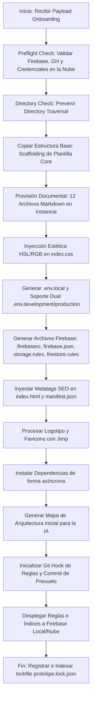

# 🏗️ Auditoría Técnica Detallada del Generador de Proyectos (`generator.js`)

**ID de Documento:** AUDIT-CLI-GENERATOR-DEEP-2026  
**Fecha de Registro:** 2026-07-04  
**Estatus:** Completado y Solidificado  
**Objetivo:** Analizar la arquitectura, capacidades, flujos de seguridad y control de errores del motor de aprovisionamiento de PROTOTIPE (`Prototipe-CLI/generator.js`), proporcionando un diagnóstico técnico senior y un prompt maestro para guiar futuras optimizaciones con inteligencia artificial externa.

---

## 1. Mapa de Flujo y Capacidades del Generador

El archivo `generator.js` actúa como el orquestador principal de marca blanca. Ejecuta de forma secuencial los siguientes pasos cuando el Dashboard Central le transfiere un payload de onboarding:



### 1.1 Detalle de Acciones Específicas Realizadas:
* **Validación de Credenciales Firebase en Nube:** Mediante consultas directas a la REST API de Google Cloud, comprueba si el API Key y el Project ID provistos por el usuario son correctos antes de realizar cualquier copia física de archivos.
* **Seguridad Aislada (Zero Shell):** En entornos Windows, evita el uso de `shell: true` en comandos ejecutados con `spawn` para mitigar vulnerabilidades de inyección de comandos shell por cmd.exe. Resuelve dinámicamente archivos `.js` directos de herramientas como `npm`, `npx` y `firebase` para evitar wrappers `.cmd` inseguros.
* **Inyección Estética y Adaptativa:**
  - Calcula en caliente el brillo y saturación cromática (`neonLightness` de 52-68% y `neonSaturation` de 72-100%) para la sombra de neón.
  - Implementa `glowGain` adaptativo basado en la luminosidad de la marca (`baseLightness < 45 ? 1.25 : baseLightness > 72 ? 0.82 : 1`) para evitar halos invisibles u opacos.
  - Escribe el bloque `:root` de variables CSS directo en `index.css` respetando y balanceando llaves de bloques como `@layer` o `@theme` mediante un parser de balanceo (evitando expresiones regulares codiciosas).
* **Hardening de PWA:** Inyecta cabeceras de caché estrictas para activos y service worker (`Cache-Control: no-cache, no-store, must-revalidate` para `index.html`, `sw.js` y `manifest.json`, y caché de larga duración `immutable` para `assets/**`) directo en `firebase.json`.
* **Alineación Documental (12 Archivos de Guía):** Copia una suite estructurada de archivos Markdown en la subcarpeta del cliente para instruir y guiar a cualquier IA que trabaje en el código de forma localizada, inyectando los requerimientos de preventa, nicho e historial del briefing.

---

## 2. Diagnóstico Técnico y Áreas de Mejora (Auditoría Senior)

Aunque el motor se encuentra solidificado y pasa al 100% las pruebas de integridad locales (`test_provision.js`), se identificaron las siguientes brechas de robustez a nivel de arquitectura de producción:

### 2.1 Puntos Críticos de Robustez y Recuperación (Blast Radius)
* **Ausencia de Transacciones Atómicas en Sistema de Archivos (Rollback Completo):**
  - **Problema:** Si ocurre un error en un paso tardío (como fallo de red durante el despliegue de reglas de Firebase o durante la instalación de dependencias npm), el generador se detiene pero deja la carpeta física de la instancia creada en un estado inconsistente o roto.
  - **Recomendación:** Implementar un gestor transaccional en `generator.js`. Todo cambio físico debe realizarse en un directorio temporal (`.temp-provision-xxx`). Una vez que todos los pasos (incluyendo validaciones locales y compilación en seco `npm run build`) terminen exitosamente, se realiza un renombrado atómico (`fs.rename`) de la carpeta final al directorio de clientes.
* **Manejo Silencioso de Errores en Operaciones de Git y CLI:**
  - **Problema:** En caso de fallas durante el `git init` o el hook de pre-vuelo (por ejemplo, si el entorno de desarrollo local no tiene git en el PATH o tiene bloqueos de permisos de archivo), el error es capturado e ignorado, lo que puede provocar que la instancia no cuente con control de cambios desde el primer día.
  - **Recomendación:** Escalar la severidad. Si Git falla, se debe advertir de forma crítica en el log del CLI para que el administrador intervenga.

### 2.2 Optimización Cromática y Accesibilidad (WCAG AA/AAA)
* **Acoplamiento de Colores sobre Contenedores Claros:**
  - **Problema:** Aunque `glowGain` y `neonLightness` optimizan el brillo de las sombras de neón en fondos oscuros, el generador no valida si el color primario de marca seleccionado cumple con la relación de contraste mínima de 4.5:1 (WCAG AA) para textos legibles en el modo claro.
  - **Recomendación:** Incorporar una función de contraste en `generator.js` que evalúe el color de texto resultante y, si no cumple la relación mínima, ajuste dinámicamente la luminosidad de los tokens de texto sobre el fondo o sugiera una paleta de contraste adaptativa.

### 2.3 Frame Budget Dinámico en Canvas
* **Optimización de Partículas en Dispositivos Móviles:**
  - **Problema:** El componente de fondo dinámico (`BackgroundCanvas`) tiene un número de partículas limitado para móviles, pero no cuenta con detección en caliente del presupuesto de fotogramas (Frame Budget) si la GPU del dispositivo se satura.
  - **Recomendación:** Inyectar en el código del componente generado una fórmula de descarte dinámico: si el tiempo transcurrido en el bucle `requestAnimationFrame` excede los 18ms durante 3 fotogramas seguidos, reducir temporalmente el conteo de partículas activas en un 25% para estabilizar los FPS.

---

## 3. Prompt Maestro para la IA Externa (Consultor de Optimización)

> [!TIP]
> Copia y pega el siguiente prompt a tu IA consultora (Claude, GPT, o DeepSeek) junto con el archivo de código [`generator.js`](file:///d:/PROTOTIPE/Prototipe-CLI/generator.js) para que formule recomendaciones precisas de optimización basadas en esta auditoría.

```markdown
Hola. Actúa como un Ingeniero de Software Principal y Experto en Arquitectura de Sistemas Node.js. 
Te presento el archivo de código `generator.js` del ecosistema PROTOTIPE (un CLI de marca blanca para aprovisionar aplicaciones React + Firebase en Windows) junto con un reporte de auditoría técnica.

Tu objetivo es analizar minuciosamente el código de `generator.js` y proponer mejoras concretas, robustas y de nivel de producción enfocadas en:
1. **Transaccionalidad y Rollback (Blast Radius):** ¿Cómo reestructurar el flujo de `createProject` para que use una carpeta temporal (por ejemplo, `.temp-provision-[clientId]`) y realice una migración atómica al final, garantizando que un error a mitad de camino no deje archivos huérfanos o inconsistentes en "Instancias Clientes/"? Proporciona la implementación de código Node.js limpia para este flujo de try/catch/rollback.
2. **Accesibilidad Cromática en Caliente (WCAG 2.1):** Escribe una función de cálculo de contraste en JS para inyectar en el proceso de normalización de colores. Si el color primario choca con los fondos seleccionados, debe ajustar el HSL del texto o borde para asegurar el cumplimiento AA (4.5:1).
3. **Optimización de Jimp y Fallbacks de Logo:** Revisa el procesamiento de imágenes con Jimp (líneas 1130+). ¿Cómo hacer que sea más tolerante a errores si el usuario sube un formato corrupto o incompatible, asegurando la creación de favicons consistentes?
4. **Validaciones de Configuración firebase.json:** Evalúa cómo se inyectan las cabeceras de caché estrictas para la PWA. ¿Hay alguna incompatibilidad potencial con los deploys de Firebase Hosting multientorno?

Muestra únicamente los fragmentos de código modificados (diffs) o las funciones refactorizadas de forma limpia, directa y sumamente técnica, evitando introducciones o explicaciones teóricas redundantes.
```

---

*Fin del Informe. Este documento forma parte de la suite de estándares e integridad del Faro Core de PROTOTIPE.*
