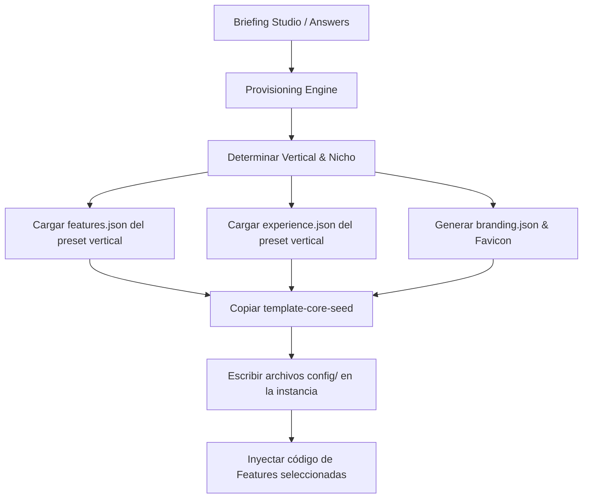

# Auditoría Técnica y Diseño: Fase 7 — Experience Framework + Provisioning Intelligence

Este documento presenta la auditoría de acoplamiento visual y el diseño arquitectónico conceptual para convertir a `template-core-seed` en una plataforma de generación de experiencias de producto personalizadas por vertical, manteniendo la infraestructura de **Core v2.8** intacta.

---

## 1. Biblioteca de Componentes Existente

### Elementos Reutilizables (Core Universal)
Son componentes UI presentacionales o utilidades lógicas genéricas de `06_Biblioteca_Componentes` que son 100% agnósticos y listos para actuar como bloques fundamentales:
* **UI/Feedback:** `ModalConfirm`, `GuidedToast`, `SwipeableBottomSheet`, `ConnectivityToast`, `GlobalSkeletonLoader`, `EmptyState`.
* **Interactividad:** `DatePickerPremium`, `RadialInteractiveMenu`, `MagneticButton`, `CommandPaletteKBar`, `InteractiveTutorialTour`, `CustomCursor`, `HolographicTiltCard`, `SwipeableCardStack`, `InteractiveAmbientGlow`.
* **Servicios & Lógica:** `AlertConfirmContext` (`useAlertConfirm`), `useInactivityTimer`, `useDebounceValue`, `useLocalStorageState`, `ErrorDiagnosticConsole`, `DeveloperDiagnosticsModal`.

### Elementos Contaminados (Features E-commerce/Retail)
Componentes actualmente indexados en la biblioteca que asumen una estructura transaccional de venta. Deben pertenecer única y exclusivamente a la **Feature Retail**:
* **UI Comercial:** `CartDrawer`, `CheckoutModal`, `ProductCard`, `CatalogBanner`, `CatalogGrid`, `FilterPanel`, `CatalogFiltersCreator`, `OrderTrackingTimeline`, `CircularDishMenu`.
* **Lógica & Persistencia:** `useCartStore`, `useSavedLocation`, `useGuidedStore`, `InventoryTransactionService`, `couponService`, `deliveryService`, `AdminStockAlerts`.

---

## 2. Layouts y Menús Actuales

### Estado Actual (`MainLayout.jsx` y `ClientLayout.jsx`)
* **`MainLayout.jsx`:** Tras la refactorización v2.8, `MainLayout` ya es agnóstico. Lee las pestañas administrativas desde `NavigationRegistry` dinámicamente. **Es 100% reutilizable.**
* **`ClientLayout.jsx`:** No está presente en `template-core-seed`, pero en las aplicaciones de Retail (como App Ventas) representa el shell público del e-commerce. 
  * **Problema:** Un CRM o una clínica de citas no usan un catálogo público de compras como landing/client view principal.
  * **Solución:** `ClientLayout.jsx` debe ser un layout provisto dinámicamente por el **Vertical Pack** o la Feature correspondiente, en lugar de estar hardcodeado en el Core de la aplicación generada.

---

## 3. Sistema de Branding y Personalización

### Estado Actual
El generador del CLI (`generator.js`) lee los colores primario/secundario elegidos del Briefing y los inyecta físicamente en `src/index.css` reemplazando variables CSS customizadas de Tailwind. El logo/favicon se autogenera mediante un script local usando Canvas en NodeJS.

### Mejoras para Experiencia Premium
* **Densidad Visual:** Introducir tres modos de densidad visual a nivel de clase de root CSS (`density-compact`, `density-comfortable`, `density-spacious`) que controlen variables de espaciado (`--spacing-factor`, padding y font-sizes) para adaptarse al tipo de app:
  * **Clínica / CRM:** Requieren densidad *Compact* (más información en pantalla, tablas densas).
  * **Retail / Landing:** Requieren densidad *Comfortable* o *Spacious* (mayor aire y enfoque en imágenes).
* **Tipografías de Vertical:** Permitir que el briefing o preset vertical defina la fuente tipográfica de Google Fonts (ej. *Inter* para CRM corporativo, *Playfair Display* para spas/estética, *Outfit* para Retail tecnológico).

---

## 4. App Experience Manifest (`experience.json`)

Para desacoplar el diseño visual del Core, proponemos la especificación de un nuevo manifiesto de experiencia inyectado en `src/config/experience.json` durante el aprovisionamiento:

```json
{
  "layout": {
    "type": "sidebar",          // "sidebar" | "topbar" | "tabs-mobile" | "dual-panel"
    "density": "comfortable",   // "compact" | "comfortable" | "spacious"
    "themeMode": "dark-detect", // "dark" | "light" | "dark-detect" (sistema)
    "typography": "Inter"
  },
  "navigation": {
    "entrypoint": "/admin",     // Ruta de arranque inicial de la app
    "publicHome": "/home",       // Vista pública inicial
    "showNavbar": true
  },
  "dashboard": {
    "welcomeWidget": "StatsGrid",
    "widgets": [
      { "id": "StatsGrid", "size": "col-span-12" },
      { "id": "ActivityTimeline", "size": "col-span-6" }
    ]
  }
}
```

El Core de la UI leerá este archivo para estructurar el Shell (Layout principal) y renderizar dinámicamente los componentes del Dashboard.

---

## 5. Component Registry & Dynamic Dashboard

El Core proveerá un contenedor dinámico (`DynamicDashboard.jsx`) en `/admin` que actuará como host de widgets.
Para evitar que el Core importe componentes del negocio de forma rígida, se implementará un **Component Registry** en runtime en `src/core/config/ComponentRegistry.js`:

```javascript
// ComponentRegistry.js
class ComponentRegistryClass {
  constructor() {
    this.registry = {}
  }

  registerWidget(id, componentPromise) {
    this.registry[id] = componentPromise
  }

  getWidget(id) {
    return this.registry[id]
  }
}
export const ComponentRegistry = new ComponentRegistryClass()
```

* Las Features (ej: `appointments` o `sales`) invocarán a `ComponentRegistry.registerWidget('RevenueCard', () => import('../../features/sales/components/RevenueCard'))` en su ciclo de vida `install`.
* El `DynamicDashboard` del Core consultará `ComponentRegistry.getWidget(widgetId)`, importándolo de forma diferida (lazy loading) e inyectándolo en la rejilla.

---

## 6. Vertical Experience Packs

Los paquetes verticales residirán en el CLI en `Prototipe-CLI/verticals/` y contendrán los presets de composición y branding para cada nicho comercial:

```
verticals/
├── clinica/
│   ├── features.json      // ["appointments", "patients", "billing"]
│   ├── experience.json    // layout: sidebar, density: compact, widgets: ["calendar"]
│   └── branding.json      // palette: violet, typography: Outfit
│
├── retail/
│   ├── features.json      // ["inventory", "sales", "orders", "delivery", "billing"]
│   ├── experience.json    // layout: topbar, density: comfortable, widgets: ["revenue"]
│   └── branding.json      // palette: emerald, typography: Inter
│
└── crm/
    ├── features.json      // ["leads", "tasks", "billing"]
    ├── experience.json    // layout: sidebar, density: compact, widgets: ["timeline"]
    └── branding.json      // palette: slate, typography: Roboto
```

---

## 7. Provisioning Intelligence (CLI Evolution)

El flujo de `generator.js` evolucionará para automatizar y orquestar el Briefing:



### Elementos Reutilizables en `generator.js`
* El flujo de copia de archivos, el generador de favicon por canvas y la inicialización de Git se conservan al 100%.
* La inyección de variables de entorno `.env.local` se parametrizará dinámicamente con los campos del `experience.json` y del preset vertical.

---

## 8. Plan de Implementación Propuesto

### Paso 1: Infraestructura de Experiencia en template-core-seed
* Crear `src/core/config/ComponentRegistry.js` y el componente presentacional `DynamicDashboard.jsx`.
* Modificar `AppRoutes.jsx` para que la ruta raíz (`/`) y el inicio de la app redirijan al `navigation.entrypoint` configurado en `experience.json`.

### Paso 2: Creación de los Vertical Packs en el CLI
* Crear el directorio `Prototipe-CLI/verticals/` con los presets de `clinica`, `retail`, `crm` y `vacio`.

### Paso 3: Evolución de `generator.js`
* Adaptar el flujo de generación física para copiar las carpetas del preset vertical e inyectar `experience.json` en `src/config/`.
