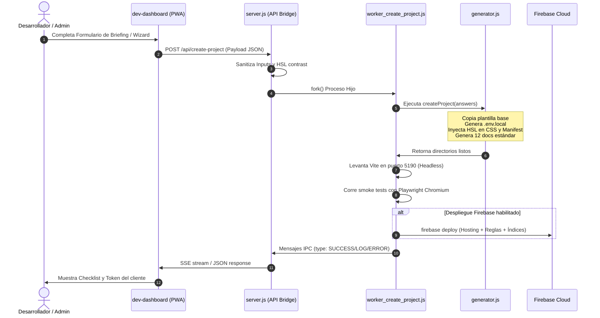
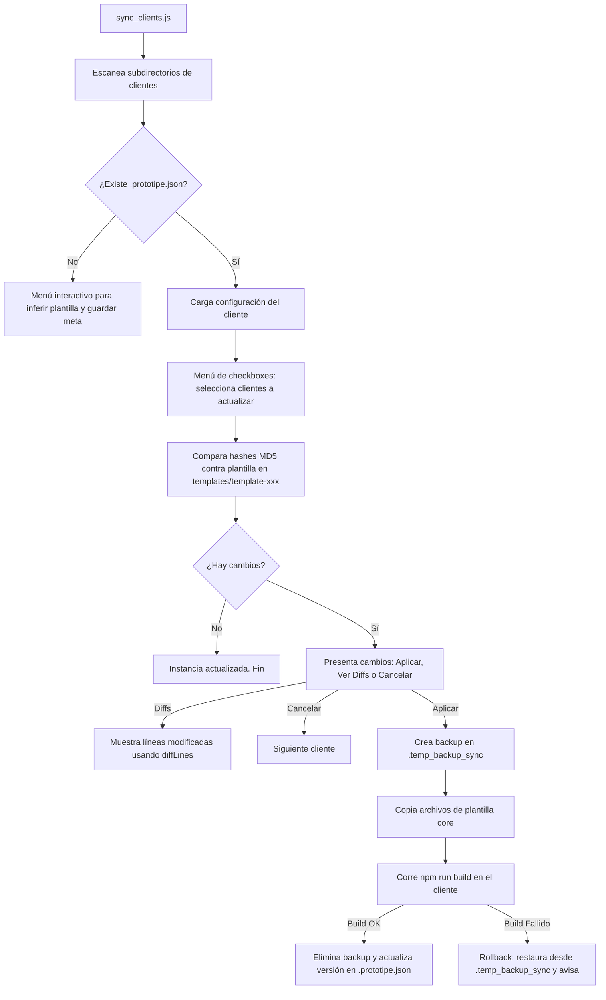

# 🔍 AUDITORÍA TÉCNICA MAESTRA Y PLAN DE LIMPIEZA — ECOSISTEMA PROTOTIPE
> **Fecha:** 2026-06-23 | **Scope:** Todo `D:\PROTOTIPE` excepto `App Ventas Core` y `Clientes Moni` directas
> **Analista:** Antigravity — Desarrollador Full Stack Senior & Arquitecto de Sistemas

---

## SECCIÓN 1 — PROPÓSITO, ARQUITECTURA Y FLUJOS DE TRABAJO

### 1.1 ¿Qué hace el proyecto y para qué sirve?
El ecosistema **PROTOTIPE** es una suite de automatización y control diseñada para el aprovisionamiento, mantenimiento y actualización de aplicaciones de marca blanca (multitenant sharding). El sistema permite tomar plantillas base (Cores) y generar instancias personalizadas (Clientes) con branding HSL dinámico, configuraciones de Firebase dedicadas, metatags SEO adaptados, suites de pruebas Playwright automatizadas y registro en una Consola Central (Developer Cockpit) que monitorea las comisiones de desarrollo y las métricas de error.

### 1.2 Arquitectura del Sistema
El ecosistema se divide en 4 grandes capas físicas:

1. **Prototipe-CLI (Express Backend + CLI):** El motor orquestador. Permite la interacción por terminal (Inquirer) y expone una API REST con Server-Sent Events (SSE) para el dashboard central. Inicializa proyectos, sanitiza secretos y ejecuta tests locales.
2. **Central PROTOTIPE (dev-dashboard PWA):** Consola de administración visual desarrollada en React + Vite + Tailwind CSS. Permite visualizar las instancias, configurar el branding, lanzar tests E2E y realizar despliegues de hosting.
3. **Plantillas Core (Moldes base):** Plantillas de código limpias que sirven de base (ej: `App Ventas`). Están desacopladas de credenciales reales.
4. **Instancias Clientes (Despliegues reales):** Aplicaciones individuales generadas por el CLI para clientes de producción (ej: `ventas-moni-app`).

---

### 1.3 Flujos de Trabajo Críticos





---

## SECCIÓN 2 — EXPLICACIÓN PASO A PASO DE CADA ARCHIVO Y FUNCIÓN

A continuación se detalla el comportamiento lógico, responsabilidades y funciones de cada archivo del ecosistema analizado.

### 2.1 Archivos en la Raíz de `D:\PROTOTIPE`

#### 📄 [backup.bat](file:///d:/PROTOTIPE/backup.bat)
* **Comportamiento:** Script por lotes de Windows que configura la consola en UTF-8 (`chcp 65001`) y arranca `menu_backup.ps1` con directivas de ejecución de bypass.
* **Funciones:** Control de errores de arranque de PowerShell.

#### 📄 [menu_backup.ps1](file:///d:/PROTOTIPE/menu_backup.ps1)
* **Comportamiento:** Interfaz visual interactiva en PowerShell para el operador técnico. Permite navegar por opciones usando teclas de dirección física (flechas) y ENTER.
* **Funciones Clave:**
  * `Test-IsGitRepository($Path)`: Valida la presencia de `.git` o directorios temporales ocultos de Git.
  * `Get-GitChangesCount($Path)`: Retorna la cantidad de archivos modificados pendientes de commit usando `git status --porcelain`.
  * `Get-MenuSelection($Title, $Options)`: Dibuja el menú ANSI ocultando el cursor físico.
  * `Manage-Cores()` y `Manage-Instances()`: Escanean y cargan los repositorios locales y lanzan respaldos.

#### 📄 [git_backup.ps1](file:///d:/PROTOTIPE/git_backup.ps1)
* **Comportamiento:** Engine de respaldo que genera snapshots del repositorio maestro, encapsulando repositorios hijos.
* **Funciones Clave:**
  * `Write-BackupLog($Status, $Target, $Message)`: Registra telemetría de backups en `backup.log`.
  * `Format-CommitMessageList($files)`: Formatea los nombres de archivos modificados para autogenerar mensajes de commit lógicos.
  * *Rutina de Ocultación de Git:* Renombra temporalmente todos los directorios `.git` internos a `.git-backup-temp` para permitir un backup del repositorio raíz sin generar gitlinks vacíos, restaurándolos en el bloque `finally`.
  * *Detección de Fugas:* Valida que ningún archivo `.env` se indexe antes del commit.
  * *Merge Automatizado:* Permite consolidar fusiones entre la rama activa y `main`/`master` con pull preventivo.

#### 📄 [subproject_backup.ps1](file:///d:/PROTOTIPE/subproject_backup.ps1)
* **Comportamiento:** Motor de respaldo individual para un subproyecto. Si detecta que es una instancia de cliente, asocia automáticamente el repositorio remoto del Core correspondiente y aplica la rama estándar `cliente/[nombre-proyecto]`.

---

### 2.2 Archivos en `Prototipe-CLI/`

#### 📄 [config.js](file:///d:/PROTOTIPE/Prototipe-CLI/config.js)
* **Comportamiento:** Centralizador de rutas del ecosistema cargando variables `.env` manualmente a `process.env`.
* **Funciones Clave:**
  * `getWorkspaceRoot()`: Retorna `APPLICATIONS_DIR` (Instancias Clientes).
  * `getDocumentationRoot()`: Retorna `DOCUMENTATION_DIR` (Documentacion PROTOTIPE).
  * `getInstancePath(coreType, projectName)`: Resuelve la ruta física del cliente organizándolo bajo su carpeta de Core (Ej: `Instancias Clientes/ventas/App-Moni`).
  * `validateRegistroSchema(registro)`: Auditor estructural estricto de `plantillas_registro.json` (comprueba campos requeridos: `fuente`, `destino`, `nicho`, `activo`, `version`, `coreType`).

#### 📄 [logger.js](file:///d:/PROTOTIPE/Prototipe-CLI/logger.js)
* **Comportamiento:** Logger que escribe en consola con colores (picocolors) y vuelca logs con formato ISO string en `cli_bridge.log`.

#### 📄 [cli.js](file:///d:/PROTOTIPE/Prototipe-CLI/cli.js)
* **Comportamiento:** Wizard interactivo de consola para inicialización de proyectos mediante Inquirer.
* **Funciones Clave:**
  * `hexToHsl(hex)`: Algoritmo puro de conversión de coordenadas cromáticas hexadecimales a HSL.
  * `shiftHslLightness(hslStr, amount)`: Utilidad de cálculo para derivar colores acentuados variando la luminosidad de la marca base.

#### 📄 [worker_create_project.js](file:///d:/PROTOTIPE/Prototipe-CLI/worker_create_project.js)
* **Comportamiento:** Proceso hijo independiente (fork) que maneja la creación pesada e instala dependencias de npm sin bloquear el event loop del servidor de Express.
* **Funciones Clave:**
  * `waitPort(port, timeout)`: Polling HTTP asíncrono que aguarda a que el servidor Vite levantado en background esté listo.
  * `runSmokeTest(targetDir)`: Levanta una instancia temporal del proyecto en el puerto 5190, importa de forma dinámica la librería local de Playwright del cliente, navega a la URL y audita si hay excepciones o fallos en el árbol de componentes React, reportándolo al proceso padre vía IPC.

#### 📄 [generator.js](file:///d:/PROTOTIPE/Prototipe-CLI/generator.js)
* **Comportamiento:** El motor constructor. Genera la estructura física del proyecto basándose en una plantilla.
* **Funciones Clave:**
  * `createProject(answers)`: Orquesta los pasos físicos: (1) Copia la plantilla base, (2) Escribe la documentación local estructurada (12 archivos canónicos adaptados), (3) Inyecta variables HSL en `src/index.css` de forma nativa, (4) Escribe `.env.local` con credenciales de Firebase del cliente y metadatos de facturación/comisiones, (5) Configura `.firebaserc` y `firebase.json` nativamente, (6) Configura `manifest.json` y metatags SEO en `index.html` convirtiendo HSL a Hex, (7) Genera logotipos dinámicos en SVG o los procesa vía Jimp si se proveen logos bitmap.
  * `installDependencies(targetDir)`: Corre `npm install` y corre el script de mapeo de IA local `npm run map`.
  * `setupGitHub(answers, targetDir, clientId)`: Configura Git local, inyecta el hook de `pre-commit` y crea el repositorio privado en GitHub vía `gh CLI`.
  * `deployFirebase(answers, targetDir)`: Compila el bundle de producción y realiza despliegues de hosting y reglas de base de datos Firestore.
  * `registerInCentralConsole(answers, clientId, uniqueToken)`: Ejecuta llamadas HTTPS REST directas a Firestore para registrar clientes y tokens en la Consola Central.

#### 📄 [sync_templates.js](file:///d:/PROTOTIPE/Prototipe-CLI/sync_templates.js)
* **Comportamiento:** Herramienta interactiva para sincronizar mejoras implementadas en Cores de desarrollo hacia la carpeta de templates limpia del CLI.
* **Funciones Clave:**
  * `extractSanitizationTokens(fuente)`: Lee `.env.local` del Core y extrae valores sensibles (API Key, Project ID) para sanitizarlos en el destino.
  * `filesDiffer(fileA, fileB)`: Comparador físico de tamaño y contenido.
  * `validarRegistro(registro)`: Duplicación local de las validaciones de esquema de plantillas.
  * *Higienización:* Reemplaza strings de producción en caliente con tokens mudos como `AIzaSy[API_KEY_DE_CLIENTE_AUTOGENERADA]` para evitar la filtración de secretos.

#### 📄 [sync_clients.js](file:///d:/PROTOTIPE/Prototipe-CLI/sync_clients.js)
* **Comportamiento:** Engine de propagación de cambios (downstream patching). Compara archivos de templates del CLI contra instancias desplegadas.
* **Funciones Clave:**
  * `getFileHash(filePath)`: Calcula hashes MD5 de archivos para verficaciones rápidas.
  * `showDiffs(...)`: Imprime diffs interactivos línea por línea coloreados usando la librería `diff`.
  * `rollbackBackup(...)`: Si el build de producción posterior al copiado falla, restaura los archivos de forma inmediata desde `.temp_backup_sync`.

#### 📄 [test_templates.js](file:///d:/PROTOTIPE/Prototipe-CLI/test_templates.js)
* **Comportamiento:** Runner de integración que testea que los templates compilen correctamente en el directorio temporal de forma aislada.
* **Funciones Clave:**
  * `auditarDependencias(pkg, name)`: Audita versiones de React, Firebase, Tailwind y Vite en el template contra un listado estático ("versiones de oro") alertando desviaciones.

#### 📄 [server.js](file:///d:/PROTOTIPE/Prototipe-CLI/server.js)
* **Comportamiento:** API Express robusta que sirve de puente entre el frontend `dev-dashboard` y las funciones del CLI (creación, deploys, logs SSE, testings, git, CORS Storage y auditorías NPM).
* **Funciones Clave:**
  * `sanitizeShellArgument(arg)`: Filtra caracteres shell peligrosos.
  * `isPathContained(parent, child)`: Valida contención física contra Directory Traversal.
  * `validateHSLColors(primary, bg)`: Comprueba contrastes WCAG de legibilidad (mínimo delta de 30% de luminosidad).
  * `performCoreSync(coreKey, options)`: Sincroniza y sanitiza plantillas del disco con poda elástica.
  * `findProjectDir(clientId)`: Resuelve la ruta raíz física de la instancia de cliente de forma concurrente y segura.
  * *Endpoints Mapeados:* Exposición de APIs REST y streaming Server-Sent Events (SSE) para tests E2E, autoinstalación de dependencias NPM, logs en caliente, `/api/project/firebase/cors-setup` con caché local de buckets, y `/api/project/drift` con `buildAudit=true`.

---

### 2.3 Archivos en `Central PROTOTIPE/dev-dashboard/`

#### 📄 [src/App.jsx](file:///d:/PROTOTIPE/Central%20PROTOTIPE/dev-dashboard/src/App.jsx)
* **Comportamiento:** El core visual del dashboard. Contiene la lógica de enrutamiento multi-tab, inicio de sesión Firebase Auth, wizard de aprovisionamiento SSE, panel de Git Backup y consolas.

#### 📄 Componentes de Administración (`src/components/admin/`)
* [ComponentLibraryView.jsx](file:///d:/PROTOTIPE/Central%20PROTOTIPE/dev-dashboard/src/components/admin/ComponentLibraryView.jsx): Catálogo a doble columna de componentes con "CSS Doctor" y asistente de inyección SSE de componentes.
* [ComponentSandbox.jsx](file:///d:/PROTOTIPE/Central%20PROTOTIPE/dev-dashboard/src/components/admin/ComponentSandbox.jsx): Playground interactivo de componentes con carga dinámica automática vía `import.meta.glob`.
* [CoreCard.jsx](file:///d:/PROTOTIPE/Central%20PROTOTIPE/dev-dashboard/src/components/admin/CoreCard.jsx): Card UI de plantillas core con visualizador de paridad física, diffs perezosos y reportes de huérfanos.
* [CoreManagerPanel.jsx](file:///d:/PROTOTIPE/Central%20PROTOTIPE/dev-dashboard/src/components/admin/CoreManagerPanel.jsx): Panel de control para registrar y clonar plantillas core.
* [E2EPanel.jsx](file:///d:/PROTOTIPE/Central%20PROTOTIPE/dev-dashboard/src/components/admin/E2EPanel.jsx): Suite visual de tests Playwright con SSE.
* [GitBackupPanel.jsx](file:///d:/PROTOTIPE/Central%20PROTOTIPE/dev-dashboard/src/components/admin/GitBackupPanel.jsx): SSE streams de git backup y descarte de cambios en caliente.
* [RecaudoPanel.jsx](file:///d:/PROTOTIPE/Central%20PROTOTIPE/dev-dashboard/src/components/admin/RecaudoPanel.jsx): Módulo de recaudación de comisiones con agrupación por cliente y recordatorios de WhatsApp.
* [CobrosPanel.jsx](file:///d:/PROTOTIPE/Central%20PROTOTIPE/dev-dashboard/src/components/admin/CobrosPanel.jsx): Historial periodizado de cobros con side drawers y reversión de transacciones.
* [HealthRadar.jsx](file:///d:/PROTOTIPE/Central%20PROTOTIPE/dev-dashboard/src/components/admin/HealthRadar.jsx): Widget interactivo tipo sonar para monitoreo en vivo de la disponibilidad HTTP de instancias de clientes.

#### 📄 [src/services/pdfService.js](file:///d:/PROTOTIPE/Central%20PROTOTIPE/dev-dashboard/src/services/pdfService.js)
* **Comportamiento:** Genera exportaciones de PDFs profesionales para los briefings, hojas de ruta de clientes y reportes de comisiones de desarrollo.

---

### 2.4 Archivos en `Central PROTOTIPE/`

#### 📄 [initialize_cores_docs.js](file:///d:/PROTOTIPE/Central%20PROTOTIPE/initialize_cores_docs.js)
* **Comportamiento:** Script CommonJS que escribe la estructura de 12 archivos Markdown base en Cores.
* **Estado:** Candidato a eliminación (funcionalidad absorbida por Express).

---

## SECCIÓN 3 — AUDITORÍA TÉCNICA DETALLADA: BUGS Y SOLUCIONES CONCRETAS

### 3.1 Vulnerabilidades Críticas de Seguridad (RCE & Path Traversal)

#### 🔴 VULNERABILIDAD 1 — Inyección de Comandos en Creación de Proyectos Firebase
* **Ubicación:** `Prototipe-CLI/server.js` (L485, L517, L223-226)
* **Causa Raíz:** El backend interpoló `answers.projectName` y `appDisplayName` directamente en un string ejecutado por `execAsync` sin sanitizar operadores de shell en el nombre.
* **Código Afectado:**
```javascript
await execAsync(`firebase projects:create ${finalProjectId} --display-name "${answers.projectName}"`);
```
* **Solución Concreta:** Utilizar `spawn` pasando argumentos en un array, o sanitizar estrictamente con regex bloqueante el nombre del proyecto antes del comando:
```javascript
// Solución de sanitización robusta:
const safeDisplayName = answers.projectName.replace(/[^a-zA-Z0-9 \-_]/g, '');
await execAsync(`firebase projects:create ${finalProjectId} --display-name "${safeDisplayName}"`);
```

---

#### 🔴 VULNERABILIDAD 2 — Exposición de Reglas Firestore Inseguras (Lectura Pública)
* **Ubicación:** `Plantillas Core/App Ventas/firestore.rules` y `Central PROTOTIPE/dev-dashboard/firestore.rules`
* **Causa Raíz:** Las reglas permiten lecturas y escrituras abiertas bajo condiciones laxas o sin roles. En el dashboard, la colección `/clientes_control/` tiene lectura pública:
* **Código Afectado:**
```javascript
match /clientes_control/{clienteId} {
  allow read: if true; // Expone ID de clientes, comisiones y metadatos
  allow write: if request.auth != null;
}
```
* **Solución Concreta:** Restringir lectura solo a usuarios administradores autenticados o tokens válidos:
```javascript
match /clientes_control/{clienteId} {
  allow read, write: if request.auth != null && request.auth.token.admin == true;
}
```

---

#### 🟡 VULNERABILIDAD 3 — API Express sin CORS restrictivo y sin Autenticación
* **Ubicación:** `Prototipe-CLI/server.js` (L141 y global)
* **Causa Raíz:** Uso de `app.use(cors())` sin whitelist. Cualquiera con acceso al localhost en otro puerto o red puede consumir los endpoints del CLI server (que ejecutan código, eliminan cores y sobreescriben archivos).
* **Solución Concreta:** Configurar CORS con orígenes fijos e inyectar un middleware de token simple leído del `.env` local:
```javascript
const whitelist = ['http://localhost:5173', 'http://127.0.0.1:5173'];
app.use(cors({
  origin: function (origin, callback) {
    if (!origin || whitelist.indexOf(origin) !== -1) {
      callback(null, true);
    } else {
      callback(new Error('Acceso CORS no autorizado'));
    }
  }
}));

// Middleware de Token Local
const localToken = process.env.VITE_DEVELOPER_CENTRAL_API_KEY || 'token-seguro';
app.use((req, res, next) => {
  const token = req.headers['authorization'];
  if (token !== `Bearer ${localToken}`) {
    return res.status(401).json({ error: 'No autorizado' });
  }
  next();
});
```

---

### 3.2 Bugs Lógicos y del Ecosistema

#### 🔴 BUG 4 — Crash de CLI por tipo 'targetPath' no soportado en Inquirer
* **Ubicación:** `Prototipe-CLI/cli.js` (L91)
* **Causa Raíz:** El código definía `type: 'targetPath'` en una pregunta de Inquirer. Inquirer no tiene este tipo integrado de forma nativa (causa crash si el parser de Inquirer es estricto en ciertas versiones).
* **Solución Concreta:** Cambiar `type: 'targetPath'` por `type: 'input'` (lo cual ya fue realizado en la última versión estable analizada).

#### 🟡 BUG 5 — npm install síncrono bloqueante en worker
* **Ubicación:** `Prototipe-CLI/generator.js` (L1043)
* **Causa Raíz:** `execSync('npm install', ...)` bloquea el hilo del worker durante 30-120 segundos. Si falla la instalación o falta red, se bloquea la comunicación IPC.
* **Solución Concreta:** Reemplazar por ejecución asíncrona con promesas usando `exec` o `spawn`.

#### 🟡 BUG 6 — Falsos Conflictos de Git en Pull Preventivo
* **Ubicación:** `git_backup.ps1` (L296) y `subproject_backup.ps1` (L307)
* **Causa Raíz:** El script ejecuta `git pull origin $branchName` en caliente. Si la rama es completamente nueva en el repositorio local y no se ha publicado en el remoto, el pull falla o retorna códigos de error que disparan el rollback de commit de forma errónea.
* **Solución Concreta:** Ya se inyectó la validación previa de existencia remota:
```powershell
$branchExistsOnRemote = $false
$remoteCheck = git ls-remote origin $branchName 2>$null
if ($remoteCheck) {
    $branchExistsOnRemote = $true
}
```

---

## SECCIÓN 4 — PLAN DE LIMPIEZA DE "DOCUMENTACIÓN BASURA"

Se auditaron todos los directorios. Los siguientes elementos son obsoletos, redundantes o perjudiciales y deben removerse para mantener la cordura del contexto de IA.

### 4.1 Archivos a Eliminar Físicamente

1. **`Central PROTOTIPE/dev-dashboard/Nuevo Documento de texto.txt`**
   * *Justificación:* Archivo huérfano vacío (0 bytes).
2. **`Plantillas Core/App Ventas/PRUEBA GIT CORE VENTAS 2.txt`**
   * *Justificación:* Archivo huérfano vacío de pruebas de Git.
3. **`Documentacion PROTOTIPE/Sin título.canvas`**
   * *Justificación:* Canvas de Obsidian vacío (2 bytes).
4. **`Central PROTOTIPE/dev-dashboard/temp_rules.rules`**
   * *Justificación:* Reglas Firestore abiertas que representan un riesgo si se aplican por error en producción.
5. **`Central PROTOTIPE/initialize_cores_docs.js`**
   * *Justificación:* Duplica la funcionalidad del Express server (`/api/register-core`). Código en CommonJS obsoleto.

### 4.2 Documentación a Reestructurar / Reescribir (Placeholders)

6. **`Plantillas Core/App Ventas/Documentacion App Ventas/contexto_negocio.md`**
7. **`Plantillas Core/App Ventas/Documentacion App Ventas/restricciones_tecnicas.md`**
8. **`Plantillas Core/App Ventas/Documentacion App Ventas/guia_estilos_ui.md`**
   * *Justificación:* Son archivos autogenerados que solo tienen 14 líneas de plantillas genéricas. Se deben llenar con información real del Core o eliminarse de la plantilla base si no tienen uso.
9. **`Documentacion PROTOTIPE/08_Plan_Escalabilidad_Negocio/repositorios_github_utiles.md`**
   * *Justificación:* Es una lista de repositorios externos. No corresponde a documentación interna de arquitectura. Mover a recursos del desarrollador personales.

---

## SECCIÓN 5 — EVOLUCIÓN FUTURA Y ESCALABILIDAD

1. **Fragmentación del Monolito `App.jsx`:** Extraer las 10.438 líneas del dashboard en una estructura modular con rutas independientes (ej: `/src/pages/admin/CoreManager`, `/src/pages/wizard/BriefingWizard`), empleando lazy-loading (`React.lazy`) para optimizar el bundle.
2. **Autenticación e Interfaz de Seguridad de API:** Reemplazar el backend local Express desprotegido por un servidor HTTPS que exija tokens Bearer JWT validados contra Firebase Auth.
3. **Portabilidad de Scripts (Cross-Platform):** Migrar los scripts de PowerShell (`git_backup.ps1`, `menu_backup.ps1`) y llamadas hardcodeadas de `cmd /c` a scripts multiplataforma de Node (usando `shelljs` o `execa`) para permitir el uso del CLI en macOS o Linux.
