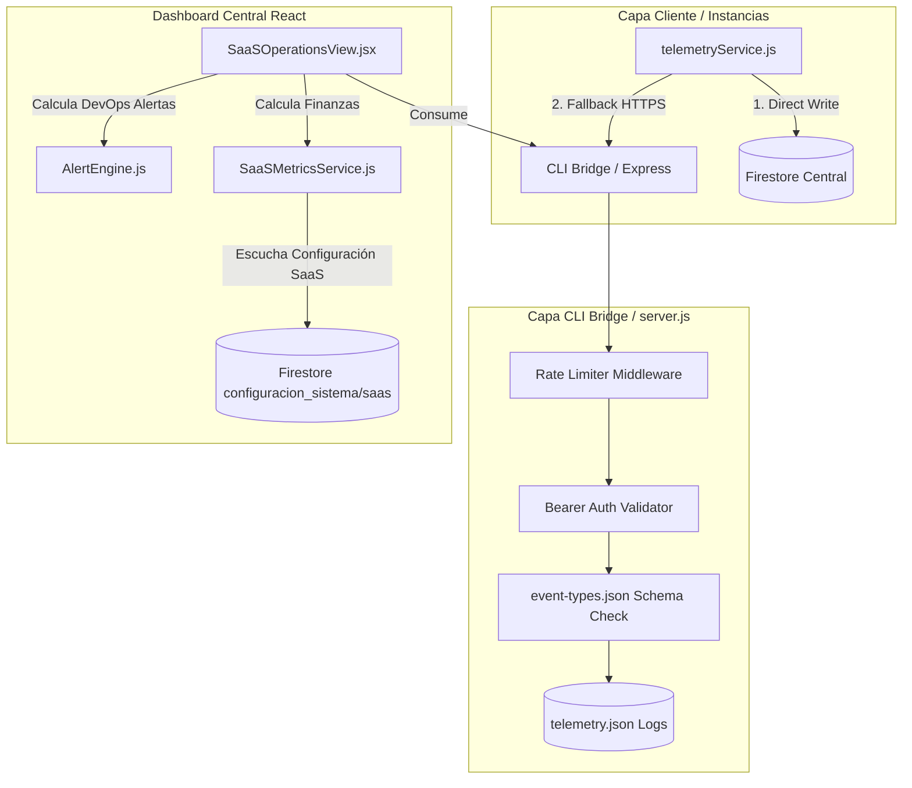

# Estado de la Arquitectura de la Plataforma: Post-Fase 9.4

Este documento técnico consolida el estado del arte de la arquitectura del ecosistema PROTOTIPE al finalizar la **Fase 9.4 (SaaS Operations Dashboard & Telemetry Pipeline)**. Establece la base técnica de referencia definitiva para el monitoreo de operaciones, gobernanza de incidentes y facturación híbrida.

---

## 1. Arquitectura Consolidada del Ecosistema (Fases 9.3 & 9.4)

La plataforma ha evolucionado de un generador de código estático a una **plataforma SaaS multitenant controlada y monitoreada**. La arquitectura se divide en 4 capas operativas principales:



### Capa 1: Núcleo Lógico de Aprovisionamiento y Actualización (CLI Engine)
* **FeatureRegistry (`lib/FeatureRegistry.js`):** Catálogo universal de features que elimina el escaneo directo de directorios en disco. Resuelve features por id y capabilities asociadas.
* **VersionManager (`lib/VersionManager.js`):** Motor de control de versiones y drifts. Genera planes de cambios en archivos (Update Blueprint Plan) y gestiona los ciclos de inyección y restauración física.
* **PackageMerger (`lib/PackageMerger.js`):** Fusionador de dependencias NPM basado en rangos semánticos SemVer.
* **ProvisioningValidator (`lib/ProvisioningValidator.js`):** Preflight checks de integridad física previos a la generación.

### Capa 2: Ingesta y API de Comunicación (Express server.js)
* Expone interfaces de telemetría de salud, incidentes en tiempo real, control de versiones y SSE para actualizaciones.
* **Pipeline de Reportes Protegido (`POST /api/project/telemetry/report`):** Ingesta gobernada que autentica al tenant con su token secreto, valida el tipo de incidente contra un catálogo estricto y aplica rate-limiting en memoria (60 req/min por IP) para proteger los logs.

### Capa 3: Servicios de Negocio y Alertas (Dashboard Central Logic)
* **SaaSMetricsService (`src/services/SaaSMetricsService.js`):** Módulo desacoplado de analíticas financieras. Calcula de forma sincrónica el MRR comisional híbrido analizando el `billingMode` de cada cliente (`flat_monthly`, `percentage` con comisiones entre 1% y 5%, o `fixed_per_service` transaccional).
* **AlertEngine (`src/services/AlertEngine.js`):** Motor DevOps de evaluación de salud. Examina latencias, pings HTTP y conteo de logs de excepciones críticas para generar la cola de alertas DevOps en segundo plano.

### Capa 4: Consola Central de Operaciones (Dashboard Central UI)
* **SaaSOperationsView (`src/components/admin/SaaSOperationsView.jsx`):** Vista de visualización ejecutiva. Expone KPIs financieros con desglose de facturación, popularidad de módulos, pings en vivo, y un visor/filtro terminal de logs de telemetría.
* **Homologación de Divisas (COP/USD):** Toggle de conversión bidireccional de valores en la vista para consolidar la visualización en la moneda deseada en base a la tasa de cambio global.
* **VersionManagerView (`src/components/admin/VersionManagerView.jsx`):** Interfaz DevOps con semáforo de drifts, modal preflight, y logs SSE con DevOps Guard RBAC integrado.

---

## 2. Contratos de Datos, Gobernanza y Telemetría

### Contrato Ampliado: `prototipe.lock.json`
Ubicado en la raíz de cada instancia cliente. Sirve como la firma de verdad física del estado de la aplicación:
```json
{
  "clientId": "app-clinic-e2e-app",
  "coreVersion": "2.8.5",
  "schemaVersion": "1.0.0",
  "telemetryToken": "app-clinic-e2e-app-token-1783779692398",
  "lastUpdate": {
    "date": "2026-07-11T05:00:00.000Z",
    "operator": "devops_senior",
    "updateId": "up_1783740083049"
  },
  "featuresInstalled": {
    "appointments": {
      "version": "1.2.1",
      "installedAt": "2026-07-11T04:20:00.000Z"
    }
  }
}
```

### Catálogo Gobernado de Eventos: `event-types.json`
El receptor de telemetría valida rigurosamente los payloads entrantes contra este esquema:
* **Tipos de Eventos Permitidos:** `error`, `performance`, `audit_status`, `heartbeat`.
* **Severidades Soportadas:** `low`, `medium`, `high`, `critical`.
* **Orígenes Autorizados:** `client-runtime`, `build-pipeline`, `cli`.
* **Ambientes Permitidos:** `production`, `staging`, `development`.

---

## 3. Endpoints Expuestos de la API Bridge

| Método | Endpoint | Acción Técnica |
|:---|:---|:---|
| **GET** | `/api/project/versions` | Compara las versiones actuales del Core y del Feature Registry contra los lockfiles de los clientes, y retorna el estado de drift unificado. |
| **POST** | `/api/project/update/preflight` | Construye en memoria y retorna el **Update Blueprint Plan** (manifiesto de cambios) para confirmación de la interfaz. |
| **GET** | `/api/project/update/apply` | **SSE Stream** que ejecuta el pipeline de actualización en la instancia cliente y transmite logs de compilación y progreso. |
| **POST** | `/api/project/update/rollback` | Ejecuta un rollback manual restaurando el backup correspondiente al `updateId`. |
| **POST** | `/api/project/telemetry/report` | Recibe, valida, autentica y registra los reportes de incidentes y logs de telemetría desde los clientes. |
| **GET** | `/api/project/telemetry/adoption` | Analiza el uso de features y módulos cruzando los lockfiles físicos de las instancias. |
| **GET** | `/api/project/telemetry/pings` | Ejecuta peticiones HTTP concurrentes no bloqueantes hacia los manifests de los clientes para monitorear latencia y uptime. |

---

## 4. Control de Permisos DevOps (RBAC Guard)

Las operaciones críticas del ciclo de vida y versionamiento se encuentran protegidas mediante validaciones explícitas de roles de seguridad:
* **`platform.update.preview`:** Habilita la visualización del Update Blueprint Plan y las derivas físicas del cliente.
* **`platform.update.execute`:** Permite inyectar parches, actualizar dependencias y disparar el build de producción.
* **`platform.rollback.execute`:** Otorga permisos para sobreescribir físicamente el disco del cliente restaurando un punto de restauración anterior.

---

## 5. Módulos Terminados vs Pendientes

### Completado al 100%:
* **FeatureRegistry & VersionManager:** Motor de drifts, planes preflight, backups versionados y SSE updater.
* **SaaSMetricsService & AlertEngine:** Cálculos financieros desacoplados del front, alertas DevOps basadas en latencia y excepciones.
* **Telemetría y Catálogo de Eventos:** Receptor seguro con rate-limiting, validación y control por token.
* **Dashboard Central Operaciones:** Vistas integradas de Version Manager, Marketplace y SaaSOperations con toggle de divisas y formulario de configuración global en Firestore.

### Pendiente:
* **Evolución a Heartbeat Activo (Fase 10):** Reemplazar el escaneo de pings de la CLI por un flujo de heartbeats empujados activamente por el cliente en intervalos definidos en background.

---

## 6. Deudas Técnicas Abiertas y Próximos Pasos

1. **Agente Remoto Pull-Based:**
   * La API actual ya guarda los planes de actualización en memoria en `activeUpdatePlans[updateId]`. El siguiente paso es estructurar el agente cliente para que pueda consultar esta API periódicamente y aplicar los cambios localmente en su propio entorno.
2. **Poda de Backups Antiguos:**
   * Al crear backups físicos por cada actualización, a largo plazo la carpeta `scratch/backups/` acumulará peso. Se recomienda implementar una rutina de limpieza automática que mantenga únicamente los últimos 5 backups por cliente.
3. **Optimización de Pings HTTP:**
   * Sustituir los pings periódicos iniciados desde el Bridge por un sistema push de *Heartbeats* transmitidos por las instancias cliente en producción, lo cual reduce el consumo de ancho de banda del backend central.
