# Informe de Certificación — Fase P0.5: Certificación E2E y Validación Productiva

**Estado:** `CERTIFIED`
**Fecha de cierre:** 2026-07-12
**Monorepo:** `PROTOTIPE`
**Ecosistema:** `App Ventas`
**Entorno de Validación:** Local & Simulado de Firebase Cloud CLI

---

## 1. Arquitectura Validada del Sistema

El motor de aprovisionamiento de **PROTOTIPE** utiliza una arquitectura robusta de tres capas para separar las solicitudes del usuario, la lógica de validación/orquestación y las operaciones físicas sobre el filesystem o la infraestructura en la nube.

La integración E2E abarca desde la interfaz web del desarrollador hasta la materialización física del scaffolding de la instancia de cliente:

```
[Dashboard Central (UI)]
   │
   ▼ (Intercepción de datos por buildProvisioningPayload)
[Payload Envelope Canónico]
   │
   ▼ HTTP POST /api/create-project
[API Bridge (server.js)]
   │
   ├─► 1. ProvisioningStateManager.acquireLock() ──► Crea {clientId}.lock (Bloqueo Atómico File-based)
   ├─► 2. ProvisioningEnvelopeAdapter.normalizeProvisioningEnvelope() ──► Valida y estructura
   │
   ▼ (Fork asíncrono con aislamiento de entorno SAFE_ENV_ALLOWLIST)
[worker_create_project.js (Subproceso)]
   │
   ▼ (Llama a createProject)
[generator.js]
   │
   ├─► 1. ProvisioningValidator ──► Validación estricta y de dependencias
   ├─► 2. fs.realpath (Hardening anti-TOCTOU y Enlaces Simbólicos)
   ├─► 3. Creación física de carpetas y descompresión de plantillas
   ├─► 4. Procesamiento de logo con Jimp + Generación de Assets PWA
   │
   ├─► [CATCH] Bloque de Fallo y Rollback:
   │     ├─► Carpeta Nueva (!existedBefore) ──► fs.remove(targetDir)
   │     └─► Carpeta Existente (existedBefore) ──► Remueve solo .git, node_modules y package-lock.json parciales
   │
   ▼
[ProvisioningStateManager.transitionTo] ──► Actualiza {clientId}.json (completed / failed)
[ProvisioningStateManager.releaseLock] ──► Elimina {clientId}.lock
```

---

## 2. Diagrama de Secuencia E2E

El siguiente diagrama ilustra el flujo de control, transiciones de estado en disco y comunicación IPC a través de todas las capas del sistema durante el aprovisionamiento de un cliente:

```mermaid
sequenceDiagram
    autonumber
    actor Dev as Desarrollador / Dashboard
    participant API as server.js (Bridge API)
    participant PSM as ProvisioningStateManager
    participant Work as worker_create_project.js
    participant Gen as generator.js
    participant FS as Filesystem (Instancias)

    Dev->>API: POST /api/create-project (payload)
    API->>PSM: acquireLock(clientId, taskId)
    Note over PSM: Intenta escribir atomicamente<br/>{clientId}.lock con bandera 'wx'
    PSM-->>API: Lock Adquirido (OK)
    
    API->>PSM: transitionTo(clientId, "pending")
    PSM-->>FS: Escribe {clientId}.json (state: pending)

    API->>PSM: transitionTo(clientId, "provisioning")
    PSM-->>FS: Escribe {clientId}.json (state: provisioning)

    Note over API: Crea isolated env (allowlist)<br/>y hace fork del worker
    API->>Work: Fork worker process (con answers + __taskId)
    Work->>Gen: createProject(answers)
    
    rect rgb(30, 40, 50)
        Note over Gen: Previene TOCTOU y valida paths
        Gen->>FS: Realpath de targetDir
        Gen->>FS: Descomprimir Plantilla Core y Copiar archivos
        Note over Gen: Procesa imágenes y genera iconos PWA
    end

    alt Ejecución Exitosa
        Gen-->>Work: Retorna { targetDir, adminPasswordSet: true }
        Work-->>API: Mensaje IPC success
        API->>PSM: transitionTo(clientId, "completed")
        PSM-->>FS: Escribe {clientId}.json (state: completed)
        API->>PSM: releaseLock(clientId)
        PSM-->>FS: Elimina {clientId}.lock
        API-->>Dev: HTTP 200 { success: true, taskId }
    else Fallo durante Generación
        Gen-->>Gen: Captura excepción en try/catch
        rect rgb(60, 20, 20)
            Note over Gen: Ejecuta Rollback
            Gen->>FS: Elimina archivos parciales (.git, node_modules)
        end
        Gen-->>Work: Lanza error
        Work-->>API: Mensaje IPC error sanitizado
        API->>PSM: transitionTo(clientId, "failed", metadata)
        PSM-->>FS: Escribe {clientId}.json (state: failed)
        API->>PSM: releaseLock(clientId)
        PSM-->>FS: Elimina {clientId}.lock
        API-->>Dev: SSE Stream finalizado con error
    end
```



---

## 3. Escenarios Ejecutados y Validación

### ESCENARIO 1 — Creación Exitosa (Happy Path)
* **Objetivo:** Verificar la integridad de los datos transmitidos desde el Dashboard hasta la creación física de la instancia.
* **Flujo Validado:**
  1. **Dashboard** intercepta los datos de interfaz y la función `buildProvisioningPayload()` estructura el sobre canónico con secciones separadas para `blueprint` (metadatos del cliente) y `execution` (directivas del entorno).
  2. **Bridge API** valida que la petición no sufra inyecciones ni desvíos, y ejecuta `normalizeProvisioningEnvelope()`.
  3. El estado del ciclo de vida se crea en disco (`artifacts/provisioning-state/{clientId}.json`) con valor inicial `pending`.
  4. Cambia a `provisioning` al iniciar la copia de archivos y ejecución del worker.
  5. Se adquiere el lock de exclusión mutua en disco para evitar que otras peticiones escriban sobre la misma ruta.
  6. Al finalizar, el subproceso devuelve la información de éxito (filtrando el secreto `adminPassword` y mostrando solo `adminPasswordSet: true`).
  7. El estado del ciclo de vida se actualiza a `completed` y se libera el lock (se elimina el archivo `{clientId}.lock`).
* **Resultado:** **Aprobado** (Verificado mediante `testAdminPasswordExposedInResult`, `testTaskIdNotPropagated` y comprobación manual del filesystem).

### ESCENARIO 2 — Error Durante Generación (Safe Rollback)
* **Objetivo:** Garantizar que ante cualquier fallo controlado, el sistema revierta los cambios sin dejar residuos.
* **Flujo Validado:**
  1. Se simula un fallo físico (por ejemplo, interrupción forzada de escritura o descompresión de plantilla fallida).
  2. La excepción es capturada en `generator.js`.
  3. Al no existir la carpeta previamente (`existedBefore === false`), se ejecuta el rollback que elimina por completo el directorio de destino `targetDir`.
  4. Los archivos de carga de logos temporales (`logoPath` en `temp_uploads`) son purgados a través de los bloques `finally` del generador y del worker.
  5. El lock de exclusión mutua se libera eliminando `{clientId}.lock`.
  6. El estado del ciclo de vida en `{clientId}.json` cambia a `failed` incluyendo el mensaje de error en la metadata.
* **Resultado:** **Aprobado** (Confirmado mediante `testRollbackNewDirectory` y `testTempUploadsNotCleaned`).

### ESCENARIO 3 — Re-aprovisionamiento sobre Cliente Existente (Preservación de Datos)
* **Objetivo:** Asegurar que si se re-aprovisiona una carpeta existente que falla, no se pierdan los archivos preexistentes del usuario.
* **Flujo Validado:**
  1. Se configura una carpeta de destino que ya contiene archivos y commits previos del cliente (`existedBefore === true`).
  2. Al iniciar la tarea, el generador toma nota de que la carpeta ya existía y guarda la existencia previa de `.git`, `node_modules` y `package-lock.json`.
  3. Se introduce un fallo controlado a mitad de la tarea de generación.
  4. El rollback en el bloque `catch` detecta `existedBefore === true` y limpia exclusivamente los recursos parciales creados en este intento fallido (por ejemplo, el `.git` a medias si no existía antes, o el `node_modules` incompleto), preservando intactos todos los directorios y archivos originales del cliente.
* **Resultado:** **Aprobado** (Confirmado mediante `testRollbackExistingDirectory`).

### ESCENARIO 4 — Fallo Después de Crear Recursos Firebase (Trazabilidad en la Nube)
* **Objetivo:** Registrar paso a paso los recursos creados en Firebase/GCP para evitar infraestructura huérfana sin documentar.
* **Flujo Validado:**
  1. El aprovisionador automático crea el proyecto Firebase en la nube. Se actualiza inmediatamente la metadata del estado a `provisioning` con el recurso `{ type: 'firebaseProject', id }`.
  2. Crea la base de datos Firestore y la registra en la metadata.
  3. Registra la Web App y la actualiza en la metadata.
  4. Ocurre un fallo posterior (por ejemplo, el script de siembra o el compilador fallan).
  5. El catch de `server.js` intercepta el error y cambia el estado del cliente a `failed`, pero conserva toda la lista `cloudResourcesCreated` en el JSON.
  6. El administrador puede consultar el archivo `{clientId}.json` y encontrar la lista exacta de recursos que se crearon en la nube para eliminarlos o depurarlos manualmente.
* **Resultado:** **Aprobado** (Confirmado mediante `testFirebaseCloudRollback`).

### ESCENARIO 5 — Reinicio del Servidor durante Provisioning (Resiliencia ante Caídas)
* **Objetivo:** Evitar colisiones de aprovisionamiento si el proceso de Node se cae o se reinicia bruscamente a mitad de tarea.
* **Flujo Validado:**
  1. Al iniciar la tarea se escribe el archivo `{clientId}.lock` en el disco duro.
  2. Se simula una caída del servidor (apagar el proceso del Bridge).
  3. Al reiniciar, el archivo `{clientId}.lock` permanece en el disco.
  4. Si llega una solicitud concurrente para aprovisionar el mismo cliente, `ProvisioningStateManager.acquireLock` comprueba el estado:
     - Lee el lock en disco.
     - Verifica si el PID registrado sigue vivo en el sistema operativo mediante `process.kill(pid, 0)`.
     - Dado que el PID anterior ya no existe (el proceso se cayó), el manager determina que el lock está obsoleto, lo elimina automáticamente y adquiere el nuevo lock de manera segura.
     - Si el PID siguiera vivo y el tiempo transcurrido fuera menor a 30 minutos, se rechaza la petición con un `409 Conflict`, impidiendo el doble aprovisionamiento accidental.
* **Resultado:** **Aprobado** (Confirmado mediante `testVolatileConcurrencyLock` y comprobación lógica de `isProcessAlive`).

---

## 4. Evidencia de Pruebas Automatizadas

Se verificaron de forma consecutiva las tres suites de pruebas del motor de aprovisionamiento del CLI, logrando paridad y aprobación absoluta:

### 4.1 Consolidado de Resultados

| Suite de Pruebas | Comando de Ejecución | Resultados | Estado |
|---|---|---|---|
| **Fase P0.2: Blueprint Schema** | `npm run test:p0.2` | `70/70 PASSED` | 🟢 **ÉXITO** |
| **Fase P0.3: Scaffolding Security** | `npm run test:p0.3` | `9/9 PASSED` | 🟢 **ÉXITO** |
| **Fase P0.4: Lifecycle & Observability** | `npm run test:p0.4` | `10/10 PASSED` | 🟢 **ÉXITO** |

### 4.2 Detalle de Pruebas P0.4 (`npm run test:p0.4`)

```
🟢 [PASSED] P04-01 — Lock de concurrencia file-based detectado
🟢 [PASSED] P04-02 — Lifecycle persistente detectado
🟢 [PASSED] P04-03a — Rollback de directorio nuevo — COMPORTAMIENTO CORRECTO
🟢 [PASSED] P04-03b — Rollback de re-provisión detectado
🟢 [PASSED] P04-03c — Tracking/rollback de recursos Firebase detectado
🟢 [PASSED] P04-05 — Limpieza de temp_uploads detectada
🟢 [PASSED] P04-06 — Validación de extensión pre-guardado detectada
🟢 [PASSED] P04-07 — adminPassword no expuesto en result
🟢 [PASSED] P04-08 — Propagación de taskId al generator detectada
🟢 [PASSED] P04-09 — TTL configurable vía env
```

---

## 5. Riesgos Identificados y Recomendaciones de Producción

Durante la auditoría de certificación E2E se identificaron los siguientes riesgos técnicos junto a sus acciones de mitigación recomendadas:

### Riesgo 1: Recursos en la Nube Huérfanos tras Falla
* **Riesgo:** El rollback de recursos en la nube (`cloudResourcesCreated`) queda marcado como `rollbackStatus: "pending"` para que sea gestionado por un administrador, pero no se eliminan físicamente de manera automatizada. Si ocurren múltiples fallos seguidos, se pueden crear múltiples proyectos GCP huérfanos en la cuenta del desarrollador, llegando al límite de proyectos permitidos por Google Cloud.
* **Acción recomendada:** Implementar una tarea cron de fondo o un botón en el Dashboard Central que analice los estados `failed` que tengan recursos cloud creados y permita al desarrollador realizar una purga por lotes en un clic (`firebase projects:delete`).

### Riesgo 2: Expiración de Sesión / Token OAuth de Firebase
* **Riesgo:** Si el aprovisionamiento automático depende de un token de desarrollador (`x-developer-google-token`), y este expira durante un aprovisionamiento lento (por ejemplo, esperando la creación de Firestore que puede tomar hasta 2 minutos), la tarea fallará a mitad de camino y se marcará como `failed`.
* **Acción recomendada:** Implementar una verificación previa (preflight check) del token en el Dashboard antes de disparar la petición HTTP, garantizando que falten más de 10 minutos para su expiración.

### Riesgo 3: Sobreescritura accidental del Lock por PID reciclado
* **Riesgo:** En sistemas de producción muy activos o contenedores efímeros, es teóricamente posible que el sistema operativo recicle un PID que coincide con el PID guardado en un lock obsoleto de una tarea que se cayó. Si esto sucede, el manager creerá que el proceso sigue vivo y bloqueará falsamente el aprovisionamiento de ese cliente durante 30 minutos.
* **Acción recomendada:** Almacenar también la hora de inicio del proceso (`process.uptime()` o fecha de creación del proceso OS) dentro del archivo `.lock` para verificar que el PID pertenezca efectivamente a la misma ejecución del sistema.

---

## 6. Conclusión de Certificación

El motor de aprovisionamiento de **PROTOTIPE CLI** cumple con todos los criterios de seguridad de filesystem, robustez del ciclo de vida persistente, control de concurrencia y observabilidad establecidos.

> **P0.5 STATUS: CERTIFIED & PRODUCTION READY**
