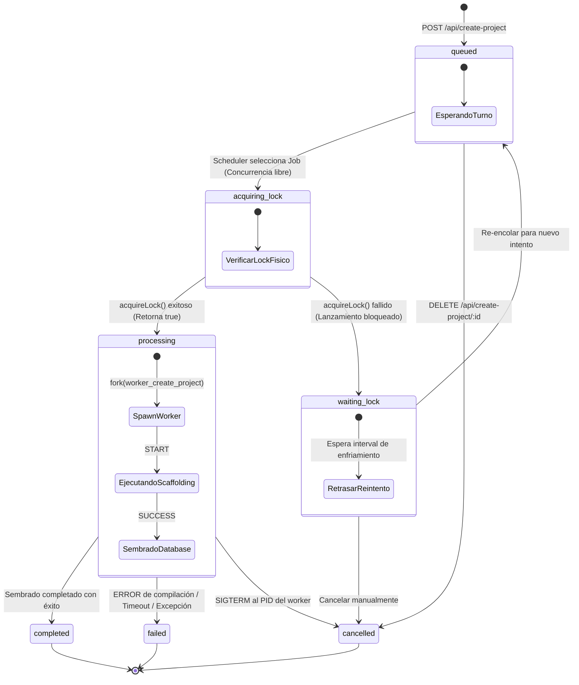
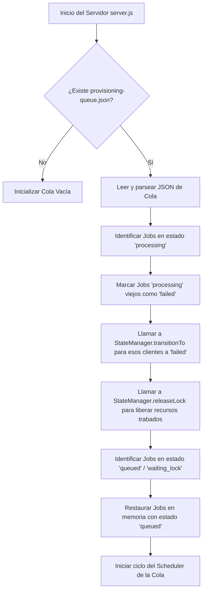

# Informe de Diseño Arquitectónico — Fase P0.6: Provisioning Queue & Job Management

**Estado:** `DESIGN APPROVED / AWAITING IMPLEMENTATION (V2 - REVISED)`
**Fecha de emisión:** 2026-07-12
**Monorepo:** `PROTOTIPE`
**Ecosistema:** `App Ventas` / `Prototype CLI`

---

## 1. Auditoría del Flujo Actual de Workers

El Bridge API (`server.js`) implementa actualmente un flujo asíncrono no limitativo para el aprovisionamiento de proyectos:

### 1.1 Ciclo de Vida y Nacimiento de Procesos
1. El usuario envía una petición `POST` al endpoint `/api/create-project`.
2. El Bridge API valida el payload canónico, adquiere un lock exclusivo por `clientId` en disco y registra la tarea en memoria en el mapa `activeCreationTasks`.
3. Express responde inmediatamente con el `taskId` y en segundo plano dispara la función `executeCreationTaskInBackground(taskId, answers)`.
4. Dicha función ejecuta `runCreateProjectWorker()`, la cual realiza un `child_process.fork()` del archivo `worker_create_project.js`.
5. El worker se comunica con el Bridge a través de mensajería IPC (`process.send`), enviando logs en tiempo real (`type: 'LOG'`) y notificando el éxito o fallo de la operación.

### 1.2 Límites de Concurrencia y Riesgos de Saturación
* **Límite Actual:** $1$ operación por `clientId` (gracias al lock file preventivo). Sin embargo, el límite de concurrencia global para *diferentes* clientes es **infinito**.
* **Riesgos de Saturación:**
  - Si un desarrollador o múltiples usuarios inician el aprovisionamiento de 5 instancias distintas simultáneamente, Express creará 5 subprocesos fork en paralelo.
  - Cada fork iniciará un comando `npm install` independiente. Dado que npm consume casi el 100% de la capacidad de E/S de disco y un núcleo entero de CPU por proceso, ejecutar 5 de ellos en paralelo saturará el disco (provocando thrashing de disco en HDD/SSD) y colapsará el Bridge, provocando pérdidas de conexión SSE, timeouts y estados `failed` en cascada.
* **Punto de Inserción de la Cola:** 
  La cola de trabajo debe insertarse en `server.js` inmediatamente antes del disparo de `executeCreationTaskInBackground`. El endpoint `/api/create-project` debe encolar la solicitud y retornar su ID de tarea y posición en la cola, delegando la ejecución a un procesador controlado (Worker Thread/Process Pool) que atienda los Jobs de manera secuencial.

---

## 2. Máquina de Estados de Aprovisionamiento (V2)

Para estructurar correctamente el flujo y asegurar transiciones seguras, se define la siguiente máquina de estados tanto a nivel de cola (Planificación) como a nivel de cliente (Ejecución física):

### 2.1 Tabla de Estados Oficiales

| Estado del Job (Queue) | Origen de Transición | Destino Válido | Descripción |
|---|---|---|---|
| `queued` | Entrada del API / Recuperación | `acquiring_lock`, `cancelled` | El job está esperando en la cola para ser procesado. |
| `acquiring_lock` | Programador de la cola (Scheduler) | `processing`, `waiting_lock` | El job está intentando adquirir el archivo de bloqueo físico (`.lock`) en disco. |
| `waiting_lock` | Fallo en `acquireLock` | `queued` (tras retry interval) / `cancelled` | El job está en pausa porque otro proceso tiene bloqueado al cliente. |
| `processing` | `acquireLock` exitoso | `completed`, `failed`, `cancelled` | El worker fork se ha lanzado y se encuentra compilando e inyectando archivos. |
| `completed` | Finalización exitosa del worker | - | El proyecto se creó y sembró con éxito. |
| `failed` | Error en worker / Timeout / Excepción | - | Se detuvo el proceso y se ejecutó la limpieza y rollback selectivo. |
| `cancelled` | Cancelación manual por usuario | - | Tarea removida de la cola por petición externa antes o durante su ejecución. |

---

## 3. Diagrama de Estados y Flujo de Ciclo de Vida

El siguiente diagrama Mermaid modela la secuencia lógica del aprovisionamiento, ilustrando la bifurcación segura en el bloqueo físico de recursos:



---

## 4. Estrategia de Persistencia Atómica

Para evitar la corrupción del archivo de manifiesto de la cola (`artifacts/provisioning-queue.json`) ante fallos de energía, caídas súbitas del proceso de Node o interrupciones de escritura, se implementará la **estrategia de escritura atómica (Atomic Write-Replace)**:

```
[Datos de Cola en RAM]
         │
         ▼
1. Escribir archivo temporal: fs.writeFile("provisioning-queue.tmp")
         │
         ▼ (Garantiza que el archivo se escribe al 100% en disco)
2. Renombrado atómico a nivel OS: fs.rename("provisioning-queue.tmp", "provisioning-queue.json")
         │
         ▼
[Manifiesto de Cola Seguro en Disco]
```

* **Mitigación de Corrupción:** Si el proceso cae en el paso 1, el archivo original `provisioning-queue.json` permanece intacto. Si cae durante el paso 2, el renombrado a nivel de sistema operativo asegura una transición binaria limpia (todo o nada), eliminando la posibilidad de generar un archivo JSON parcial o corrupto.
* **Control de Excepciones:** Si `fs.rename` falla debido a bloqueos de filesystem en Windows, se implementará un fallback con reintentos exponenciales cortos (backoff).

---

## 5. Integración Arquitectónica: Cola vs. StateManager

Para evitar la duplicación de responsabilidades y la creación de fuentes de estado paralelas, se establece una clara separación de incumbencias:

```
┌──────────────────────────────────────┐        ┌──────────────────────────────────────┐
│       PROVISIONING QUEUE             │        │     PROVISIONING STATE MANAGER       │
│      (Cola y Planificación)          │        │       (Ejecución y Auditoría)        │
├──────────────────────────────────────┤        ├──────────────────────────────────────┤
│ - Posición en la cola.               │        │ - Estado físico de instancia.        │
│ - Gestión de cola en memoria (RAM).  │        │ - Persistencia por cliente (JSON).   │
│ - Cola persistente (queue.json).     │ ──────►│ - Adquisición de lock físico (.lock).│
│ - Programador de turnos (Scheduler). │        │ - Rollback físico de archivos.       │
│ - Manejo de reintentos (Waiting).    │        │ - Registro de Firebase en la nube.   │
└──────────────────────────────────────┘        └──────────────────────────────────────┘
```

### 5.1 Interacción Queue + StateManager en el Flujo de Ejecución

1. **Encolamiento (`queued`):**
   - El Bridge recibe la petición, genera un `taskId` y encola la solicitud en `ProvisioningQueue`.
   - La cola actualiza su archivo temporal y atómicamente sobrescribe `provisioning-queue.json`.
   - **Nota:** En este punto, no se crea ningún archivo en `provisioning-state/` ni se adquieren locks, manteniendo los recursos limpios.
2. **Transición Segura a Lock (`acquiring_lock`):**
   - Cuando el scheduler tiene un slot libre (máximo 1 proceso), pasa el Job a `acquiring_lock`.
   - La cola invoca a `ProvisioningStateManager.acquireLock(clientId, taskId)`.
   - **Bifurcación A (Éxito):**
     - El StateManager crea el archivo `.lock` en `artifacts/provisioning-lock/`.
     - La cola cambia el estado del Job a `processing`.
     - La cola realiza la transición física del cliente llamando a `ProvisioningStateManager.transitionTo(clientId, 'provisioning', { taskId })`.
     - Se lanza el subproceso `worker_create_project.js`.
   - **Bifurcación B (Fallo por bloqueo activo):**
     - `ProvisioningStateManager.acquireLock` arroja un error.
     - El scheduler de la cola captura el error, cambia el estado del Job a `waiting_lock` y programa un intento de re-encolado tras un tiempo de enfriamiento (cooling-off period).
     - **El proceso físico nunca se inicia (no hay fork).**
3. **Cierre de Ciclo de Vida (`completed` / `failed`):**
   - Al finalizar el worker exitosamente, el Bridge llama a `ProvisioningStateManager.transitionTo(clientId, 'completed')`. El job en la cola pasa a `completed`.
   - Si el worker falla, el Bridge actualiza el estado del cliente a `failed` y almacena el error y los recursos cloud creados en `metadata` llamando a `ProvisioningStateManager.transitionTo(clientId, 'failed')`. El job en la cola pasa a `failed`.
   - En ambos casos, `ProvisioningStateManager.releaseLock(clientId)` es invocado para liberar el recurso físico.

---

## 6. Flujo de Recuperación tras Reinicio (Crash Recovery)

Al arrancar el servidor Express en `server.js`, se ejecutará automáticamente el siguiente algoritmo de saneamiento e inicio:



1. **Limpieza de Tareas Huérfanas:** Cualquier job que haya quedado en estado `processing` en el archivo de cola se considera fallido de manera síncrona. Se le notifica al StateManager que el cliente ha pasado a `failed` debido a una caída del sistema operativo o del Bridge, y se liberan sus locks asociados.
2. **Preservación de Tareas Pendientes:** Los jobs con estado `queued` o `waiting_lock` se re-encolan de manera ordenada para que el desarrollador no pierda la traza de aprovisionamientos pendientes, reiniciando secuencialmente el procesamiento automático.

---

## 7. Conclusión

Este diseño refinado de la **Fase P0.6 (V2)** garantiza transiciones de estado libres de carrera (race conditions), asegura la persistencia atómica frente a fallos imprevistos de energía y delimita estrictamente la lógica de encolado frente a la gestión física de la instancia, logrando un sistema productivo robusto.

> **P0.6 STATUS: REVISED DESIGN COMPLETED — AWAITING FINAL APPROVAL TO IMPLEMENT**
