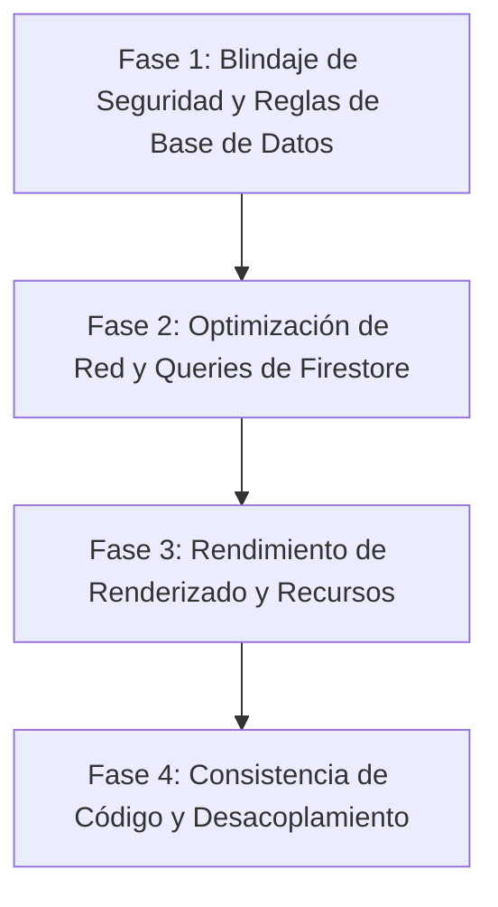

# 🚀 Plan de Resolución Estratégica - App Ventas

Este documento define la hoja de ruta y propuesta técnica para solucionar los hallazgos críticos detectados en la auditoría técnica de la aplicación **App Ventas**.

---

## 📅 Fases del Plan de Mitigación

---

## 🛠️ Detalles de Implementación por Fase

### 🔒 Fase 1: Blindaje de Seguridad y Reglas (Prioridad Crítica)
1. **Colección `/employees/`:**
   - **Problema:** Los PINs de los empleados son legibles públicamente.
   - **Acción:**
     - Modificar `firestore.rules` para denegar lectura en `/employees/{employeeId}`.
     - Crear una subcolección `/employees/{employeeId}/private/` que guarde la contraseña.
     - Implementar client-side hashing de PINs (mediante SHA-256) antes de guardarlos en base de datos. Al autenticarse, comparar los hashes en lugar de texto plano, reduciendo el riesgo en caso de filtración de base de datos.
2. **Colección `/users/` y `/credits/`:**
   - **Problema:** Accesibilidad de datos de crédito de otros clientes.
   - **Acción:**
     - Modificar `firestore.rules` para validar que el usuario que realiza la petición posee el mismo número de celular que el guardado en el documento, o generar firmas de validación anónima Firebase Auth asociadas a la sesión del navegador.

---

### 🌐 Fase 2: Optimización de Red y Queries (Prioridad Alta)
1. **Pedidos Completados en Panel de Control (`billingService.js`):**
   - **Problema:** Query O(N) que descarga el histórico completo de órdenes completadas.
   - **Acción:**
     - Restringir la query a un rango de fecha dinámico (ej: `createdAt >= fechaInicioMesActual`).
     - Programar el disparador de consolidación para que consolide y reporte las ventas y comisiones del período de manera mensual, específicamente ejecutándose en el último día de cada mes para generar el documento `/config/billing/periods/{año-mes}`. La UI del panel de control consumirá este documento estático consolidado, eliminando la carga e interactividad diaria innecesaria.

---

### ⚡ Fase 3: Rendimiento de Renderizado y Recursos (Prioridad Media)
1. **Iconos de la PWA (`public/`):**
   - **Problema:** Assets PNG sobredimensionados de `300 KB`.
   - **Acción:**
     - Comprimir las imágenes de la PWA mediante algoritmos sin pérdida, disminuyendo el peso unitario a un rango de `15 KB - 30 KB`.
2. **Pre-render y Pre-carga de scripts (`index.html`):**
   - **Problema:** Delay de renderizado del LCP por inicialización de scripts.
   - **Acción:**
     - Insertar directivas `<link rel="preload">` para el bundle de inicialización.
     - Agregar etiquetas de preconnect para servidores de Google Fonts y APIs de Firebase.

---

### 🏗️ Fase 4: Consistencia y Desacoplamiento (Prioridad Media)
1. **Hooks de Negocio de Productos:**
   - **Problema:** Duplicidad de lógica de stock y etiquetas inteligentes en portal de venta y QR.
   - **Acción:**
     - Crear el hook personalizado `/src/hooks/useProductVariants.js` que consolide y unifique el cálculo de variantes, stock global y marcas dinámicas del producto.

---

## 🧪 Plan de Verificación y Pruebas
1. **Pruebas de Reglas de Base de Datos:**
   - Utilizar el emulador local de Firebase para correr tests automáticos sobre `firestore.rules` y verificar que accesos no autorizados a `/employees/` y `/credits/` sean correctamente bloqueados (Retorno de código 403 / Insufficient Permissions).
2. **Pruebas de Rendimiento:**
   - Correr una auditoría Lighthouse posterior al despliegue para validar la reducción del tiempo de LCP y la mejora del rendimiento general en móvil y escritorio.
3. **Regresión de Funcionalidad:**
   - Ejecutar la suite Playwright localmente (`npm run test:ci`) para validar que las refactorizaciones y los ajustes de reglas no alteren el flujo de compra del cliente final.
