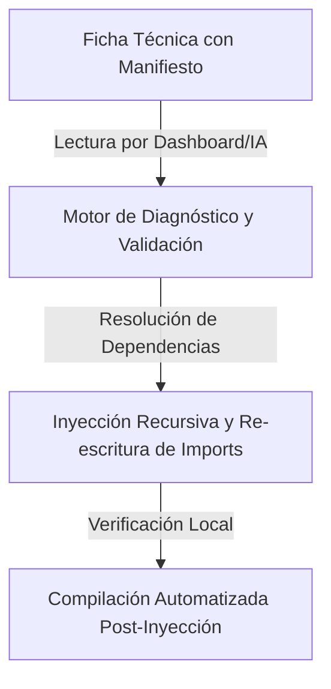

# Propuesta Técnica: Inyección Inteligente de Componentes y Resolución de Dependencias Ecosistémicas (CORE-119)

Esta propuesta describe la arquitectura técnica para implementar un sistema de **Inyección Inteligente de Componentes y Módulos** en el ecosistema de **PROTOTIPE**. Su objetivo es erradicar los errores comunes durante el copiado de componentes de la biblioteca hacia las instancias cliente, tales como: imports relativos rotos, dependencias npm faltantes, hooks o almacenes (Zustand) huérfanos y falta de parametrización de variables de base de datos.

---

## 1. Pilares de la Solución

Para que el proceso de inyección sea 100% autónomo y libre de fallos de compilación en el destino, proponemos una arquitectura basada en cuatro pilares:



1. **El Manifiesto de Dependencias (Metadata en Ficha Técnica):** Cada archivo markdown de documentación de la biblioteca contará con un bloque estructurado en formato JSON o YAML invisible que declara sus dependencias externas (npm) e internas (hooks, stores, helpers, subcomponentes).
2. **Path Aliasing Estándar (`@/*`):** Homologar todos los proyectos del ecosistema (plantillas y clientes) bajo alias de rutas de Vite (`@/`). Esto hace que los imports locales sean independientes del nivel de anidamiento de la carpeta destino.
3. **Analizador Automático de Imports (Import Rewriter):** Si no se usan alias de ruta, el backend de la CLI reescribirá dinámicamente los paths de imports locales (`../../` a `../`) calculando la distancia relativa entre las carpetas de origen y destino.
4. **Instalador Recursivo y Auto-Check (CLI Bridge):** Un endpoint que verifique el `package.json` del destino, instale los paquetes npm faltantes, inyecte en cascada las subdependencias internas y corra un build de verificación local.

---

## 2. Especificación Técnica detallada

### A. Estructura del Manifiesto de Dependencias
Se añadirá una sección técnica invisible al inicio del markdown del componente (o en una tabla normalizada):

```json
<!--
{
  "resource": "BackButton",
  "technicalName": "BackButton",
  "dependencies": {
    "npm": {
      "framer-motion": "^11.0.0",
      "lucide-react": ">=0.263.0"
    },
    "internal": [
      { "name": "useOrders", "type": "hook", "link": "file:///D:/PROTOTIPE/Documentacion%20PROTOTIPE/06_Biblioteca_Componentes/Logica_y_Hooks/useOrders/use_orders.md" },
      { "name": "LoaderSpinner", "type": "ui", "link": "file:///D:/PROTOTIPE/Documentacion%20PROTOTIPE/06_Biblioteca_Componentes/Formularios_y_UI/LoaderSpinner/loader_spinner.md" }
    ]
  }
}
-->
```

### B. Flujo Operativo del Backend (`server.js` `/api/library/inject/diagnose`)
Antes de inyectar, la interfaz enviará una petición de diagnóstico:
1. **Lectura del Manifiesto:** El backend parsea el JSON del markdown.
2. **Escaneo del Cliente:** Lee el `package.json` y el árbol de carpetas de la instancia cliente.
3. **Retorno de Diagnóstico:** Devuelve:
   - `npmMissing`: Lista de librerías npm que se deben instalar.
   - `internalDependencies`: Lista de componentes/hooks locales del ecosistema que deben inyectarse recursivamente porque el principal los necesita.
   - `importsToRewrite`: Lista de archivos cuyos imports serán normalizados.

### C. Algoritmo de Normalización de Imports (Vite Path Alias)
Para evitar reescribir imports manualmente, definiremos el alias `@` en todos los archivos `vite.config.js` del ecosistema:
```js
resolve: {
  alias: {
    '@': path.resolve(__dirname, './src'),
  },
}
```
Así, todos los imports de la biblioteca se escribirán de forma universal:
`import { useOrders } from '@/hooks/useOrders';`
`import LoaderSpinner from '@/components/ui/LoaderSpinner';`
Al inyectarse en cualquier subcarpeta del cliente, el código compilará de forma inmediata sin modificar una sola línea de importación.

---

## 3. Plan de Acción para la IA (antigravity)

Para que la IA resuelva todos los problemas al portar código mediante habilidades, actualizaremos las directrices del desarrollador de la siguiente manera:

* **Paso 1: Auditoría del Entorno:** La IA lee el código del componente y sus dependencias declaradas. Luego, inspecciona el `package.json` del cliente destino.
* **Paso 2: Instalación de Dependencias Externas:** Si faltan paquetes (ej. `framer-motion`), la IA propone la instalación e instala la librería mediante el CLI.
* **Paso 3: Inyección en Cascada:** La IA inyecte primero las subdependencias internas (hooks, helpers) en las carpetas correctas del cliente, y luego el componente principal.
* **Paso 4: Verificación y Corrección de Compilación:** La IA corre `npm run build` en el proyecto del cliente. Si la compilación falla (por ejemplo, por un import relativo huérfano), lee el error en el log, reescribe el import fallido y vuelve a compilar hasta que pase limpio.

---

## 4. Beneficios Esperados
* **Cero código roto:** Las inyecciones funcionarán al primer intento gracias a la normalización por alias `@/`.
* **Automatización total:** El dashboard podrá instalar módulos completos con todas sus dependencias asociadas en cascada con 1 clic.
* **Seguridad de Compilación:** La verificación del build post-inyección asegura la estabilidad de la rama de desarrollo antes de que el programador retome el trabajo.
