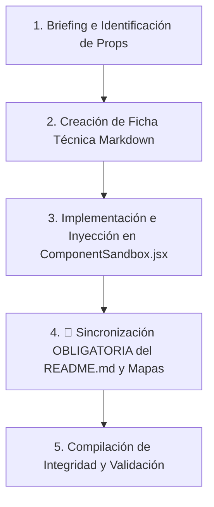

# Skill de Creación de Componentes (`component-creator`)

Esta skill automatiza de manera estricta el ciclo de vida completo al crear e integrar un nuevo componente premium en el catálogo reutilizable de **PROTOTIPE** y en el playground interactivo del **dev-dashboard**.

## 📁 Variable de Proyecto Dinámica

> **Variable `[PROYECTO_ACTIVO]`:** Ruta raíz del proyecto sobre el que se está trabajando. Se determina en este orden de prioridad:
> 1. Si el usuario la especificó en el trigger (ej. `@crear-componente "App Reservas" NombreComponente`), usar esa.
> 2. Si hay un proyecto abierto actualmente en el contexto de la sesión, usar ese.
> 3. Si ninguna de las anteriores aplica, preguntar al usuario antes de continuar: "¿En qué proyecto estás trabajando? Indica la ruta o el nombre de la plantilla."

---

## 📁 Rutas del Proyecto

> Las rutas de este flujo se construyen dinámicamente usando `[PROYECTO_ACTIVO]`. Las rutas de documentación y biblioteca son siempre fijas (pertenecen al ecosistema, no a un proyecto específico):
>
> **Rutas fijas del ecosistema (siempre iguales):**
> - Biblioteca: `D:\PROTOTIPE\Documentacion PROTOTIPE\06_Biblioteca_Componentes\`
> - Bitácora: `D:\PROTOTIPE\Documentacion PROTOTIPE\03_Auditorias_y_Faro_Core\bitacora_cambios.md`
> - Mapas: `D:\PROTOTIPE\Documentacion PROTOTIPE\04_Estandares_y_Skills\`
> - Dev-dashboard: `D:\PROTOTIPE\Central PROTOTIPE\dev-dashboard\`
>
> **Rutas dinámicas del proyecto (dependen de `[PROYECTO_ACTIVO]`):**
> - Código fuente: `D:\PROTOTIPE\[PROYECTO_ACTIVO]\src\`
> - Componentes: `D:\PROTOTIPE\[PROYECTO_ACTIVO]\src\components\`
> - Hooks: `D:\PROTOTIPE\[PROYECTO_ACTIVO]\src\hooks\`
> - Servicios: `D:\PROTOTIPE\[PROYECTO_ACTIVO]\src\services\`
> - Variables de entorno: `D:\PROTOTIPE\[PROYECTO_ACTIVO]\.env.local`
> - Package: `D:\PROTOTIPE\[PROYECTO_ACTIVO]\package.json`

---

## ⚠️ REGLA DE ORO — VISIBILIDAD EN DASHBOARD (CRÍTICO)

> [!CAUTION]
> El dashboard (`ComponentLibraryView`) carga los componentes **exclusivamente** desde el `README.md` de la biblioteca, consultado por el CLI Daemon en `http://localhost:3001/api/library`. Si un componente **no está indexado en el README.md**, será **completamente invisible en el árbol lateral del dashboard**, independientemente de que su ficha markdown exista y su playground esté implementado en `ComponentSandbox.jsx`.
>
> **La omisión del registro en README.md es el error más frecuente y más costoso de este flujo. Nunca lo omitas.**

---

## 📂 Categorías Válidas de la Biblioteca

> Las únicas categorías físicas permitidas en `06_Biblioteca_Componentes/` o la raíz de documentación son las siguientes. Usar un nombre fuera de esta lista rompe la consistencia e indexación:
> - `00_Core_Ecosistema_Obligatorios` (Core del Ecosistema)
> - `Ecommerce_y_Ventas` (Ventas y Carritos)
> - `Fidelizacion_y_Gamificacion` (Lealtad y Puntos)
> - `Formularios_y_UI` (Controles Visuales Básicos)
> - `Logica_y_Hooks` (Estado Local y Hooks React)
> - `Modales` (Popups y Modales)
> - `Paginas` (Vistas completas)
> - `Pedidos_y_Gestion` (Gestión de Pedidos)
> - `Reservas_y_Citas` (Agendas y Horarios)
> - `Servicios_y_Firebase` (Servicios JS / Firebase Integraciones)
> - `Utilidades` (Helpers y utilitarios genéricos)
> - `Visualizacion` (Gráficos, dashboards)
> - `09_Modulos_Completos` (Módulos de negocio enteros - ubicados en la raíz del ecosistema)
> 
> Si el componente no encaja en ninguna, usar `Utilidades` y notificar al usuario para evaluar una nueva carpeta formal.
>
> **Nota de Ecosistema:** Estas categorías aplican para todos los proyectos del ecosistema PROTOTIPE. Un componente documentado en la biblioteca es reutilizable por cualquier plantilla o app a la medida, independientemente de en qué proyecto fue creado originalmente.

---

## 🛠️ Flujo de Trabajo Secuencial Obligatorio

Cuando el usuario invoque el comando `@crear-componente [PROYECTO_ACTIVO?] [NombreComponente] [Requerimientos/Idea]`, la IA debe ejecutar rigurosamente los siguientes 5 pasos consecutivos:



---

### Paso 1: Briefing y Diseño Técnico
Antes de escribir una sola línea de código, la IA debe estructurar conceptualmente el componente:
- **Propósito y Casos de Uso:** Qué problema resuelve y dónde se aplica.
- **Props y Firma del Componente:** Definir con precisión los tipos de datos de las propiedades de entrada.
- **Estados Locales:** Qué estados maneja y qué hooks necesita (`useState`, `useRef`, `useMemo`).
- **Adaptabilidad Cromática (Marca Blanca):** Identificar cómo consumirá las variables CSS del ecosistema (`--color-primary`, `--color-surface-2`, `--color-border`, etc.).

---

### Paso 2: Creación de la Ficha Técnica Markdown
Crear un archivo `.md` de documentación en español bajo el directorio específico de la biblioteca:
- **Ruta de destino:** `D:\PROTOTIPE\Documentacion PROTOTIPE\06_Biblioteca_Componentes\[Categoría]\[Nombre_En_Español]\[nombre_en_serpiente].md`
- **Estructura del Markdown:** Debe iniciar obligatoriamente con el bloque de comentarios HTML conteniendo el JSON de Manifiesto de Dependencias para habilitar la resolución automática de dependencias durante la auto-inyección:
  ```markdown
  <!--
  {
    "resource": "[NombreTécnico]",
    "technicalName": "[NombreTécnico]",
    "targetPath": "[ruta/destino/en/proyecto/cliente/NombreTécnico.jsx]",
    "dependencies": {
      "npm": {
        "nombre-libreria": "^version"
      },
      "internal": []
    }
  }
  -->
  ```
  1. **Propósito y Casos de Uso**
  2. **Especificación Visual y Estilos (Tailwind CSS):** Detallar variables HSL y animaciones.
  3. **Código React Completo:** Código 100% funcional, autónomo, portable y sin placeholders. No omitir ninguna línea.
  4. **Lógica de Estado y Ciclo de Vida:** Explicar handlers, effects y hooks.
  5. **Flujo Operativo y Secuencia de Interacción:** Incluir diagramas Mermaid.

> [!WARNING]
> Queda estrictamente prohibido usar comentarios tipo `// ... código existente` o placeholders. El código React documentado debe ser un bloque completo y copiable directamente.

---

### Paso 3: Implementación e Inyección en `ComponentSandbox.jsx` y Sandboxes Individuales
- **Rutas clave:**
  - Archivo de Sandbox: [NEW] `D:\PROTOTIPE\Central PROTOTIPE\dev-dashboard\src\components\admin\sandboxes\[NombreComponente]Sandbox.jsx`
  - Consola Central: [MODIFY (Opcional)] `D:\PROTOTIPE\Central PROTOTIPE\dev-dashboard\src\components\admin\ComponentSandbox.jsx`
- **Tareas Obligatorias:**
  1. **Creación del Archivo de Sandbox:** Queda estrictamente PROHIBIDO inyectar la lógica del componente o del playground inline en `ComponentSandbox.jsx`. Se debe crear un archivo independiente `src/components/admin/sandboxes/[NombreComponente]Sandbox.jsx` (ejemplo: `SelectorFechaSandbox.jsx`) que exporte por defecto el sandbox interactivo con sus propios controles, imports y componentes de apoyo embebidos.
  2. **Resolución Automática por Globbing:** La Consola Central resuelve y carga dinámicamente los playgrounds usando `import.meta.glob('./sandboxes/*.jsx')`. No es necesario registrar imports estáticos ni wrappers `React.lazy` ni la entrada `SANDBOXES`.
  3. **Registro de Aliases en `COMPONENT_SANDBOX_MAP`:** Si el nombre físico de tu archivo Sandbox no coincide exactamente con el nombre o technicalName del componente de forma predecible, edita `ComponentSandbox.jsx` y agrega el mapeo de alias en minúsculas y sin tildes en `COMPONENT_SANDBOX_MAP`:
     ```javascript
     'nombre alternativo': 'nombre_clave_del_archivo_en_snake_case',
     ```
  4. **Regla fuzzy en getSandboxKey (Opcional):** Si el componente requiere coincidencia difusa avanzada, añade una regla `str.includes('...')` en la función `check()` dentro de `getSandboxKey()`.

---

### Paso 4: 🔴 Sincronización OBLIGATORIA del Catálogo — BLOQUEANTE

> [!CAUTION]
> Este paso es **no negociable y no omitible**. Debe ejecutarse **siempre**, incluso si el usuario no lo solicita explícitamente. No hacerlo deja el componente invisible en el dashboard.

Ejecutar **todos** los sub-pasos en una sola ronda de edición:

#### 4.1 — `README.md` del Catálogo ← **EL MÁS CRÍTICO**
Editar `D:\PROTOTIPE\Documentacion PROTOTIPE\06_Biblioteca_Componentes\README.md`:

> **Verificación previa de unicidad:** Antes de insertar la entrada, busca en el README.md si ya existe un componente con el mismo nombre técnico. Si existe: (a) informa al usuario, (b) propón versionar como `NombreComponenteV2` o extender el existente, (c) espera confirmación antes de continuar.

- Localizar la sección de categoría correcta (ej: `### 2. 📂 Formularios y UI`).
- Agregar la entrada con link markdown absoluto en el formato estándar:
  ```
  * [Nombre Visual (NombreTécnico)](file:///D:/PROTOTIPE/.../archivo.md): Descripción de una línea.
  ```
- **Sin este paso el componente NO existe desde la perspectiva del dashboard.**

#### 4.2 — `mapa_documentacion_ia.md`
Agregar la entrada del nuevo archivo con su Criterio de Decisión técnica en:
`D:\PROTOTIPE\Documentacion PROTOTIPE\04_Estandares_y_Skills\mapa_documentacion_ia.md`

#### 4.3 — `mapa_aplicacion.md` (condicional)
Si el componente se instala físicamente en el proyecto activo, actualizar:
`D:\PROTOTIPE\Documentacion PROTOTIPE\04_Estandares_y_Skills\mapa_aplicacion.md`

#### 4.4 — `bitacora_cambios.md`
Registrar el cambio en:
`D:\PROTOTIPE\Documentacion PROTOTIPE\03_Auditorias_y_Faro_Core\bitacora_cambios.md`
Con: tipo, archivos modificados, causa raíz, solución técnica y estatus.

---

### Paso 5: Compilación de Integridad y Verificación

> ⛔ **PASO BLOQUEANTE:** Si el build falla, el checklist NO puede marcarse como superado. Corrige los errores de compilación antes de reportar el componente como completado. No escribas en bitácora hasta que el build sea exitoso.

- **Comando:** `cmd /c npm run build` en `D:\PROTOTIPE\Central PROTOTIPE\dev-dashboard`
- **Verificación:** Sin errores de sintaxis, variables no definidas ni fallos de Vite.

---

## ✅ Checklist de Entrega Obligatorio

Antes de declarar el componente como "completado", verificar **cada ítem**:

| # | Entregable | Archivo objetivo |
|---|-----------|-----------------|
| 1 | Ficha `.md` creada con código completo | `06_Biblioteca_Componentes/[Cat]/[Nombre]/archivo.md` |
| 2 | Archivo Sandbox independiente creado | `src/components/admin/sandboxes/[NombreComponente]Sandbox.jsx` |
| 3 | Mapeo de alias en `COMPONENT_SANDBOX_MAP` (Opcional) | `ComponentSandbox.jsx` → solo si difiere del nombre técnico |
| 4 | Entrada en `README.md` de la biblioteca ← **BLOQUEANTE** | **`06_Biblioteca_Componentes/README.md`** |
| 5 | Entrada en `mapa_documentacion_ia.md` | `04_Estandares_y_Skills/mapa_documentacion_ia.md` |
| 6 | Registro en `bitacora_cambios.md` | `03_Auditorias_y_Faro_Core/bitacora_cambios.md` |
| 7 | Build exitoso sin errores | `cmd /c npm run build` en `dev-dashboard` |

> [!IMPORTANT]
> Si el ítem **#4 (README.md)** no está completado, el componente es **invisible en el dashboard**. El checklist no se considera superado sin este paso.

---

## 🎨 Estándar Estético y Código Portable de PROTOTIPE

1. **Sin dependencias externas complejas:** Animaciones con CSS nativo (`transition-all duration-300`) y keyframes inline. Iconos SVG en línea o Lucide React.
2. **Uso estricto de variables HSL:**
   - Fondo: `bg-[var(--color-bg)]`
   - Superficies: `bg-[var(--color-surface)]` / `bg-[var(--color-surface-2)]`
   - Bordes: `border-[var(--color-border)]`
   - Textos: `text-[var(--color-text)]` / `text-[var(--color-text-muted)]`
   - Marca: `text-[var(--color-primary)]` / `bg-[var(--color-primary)]`
3. **Control de Desbordamiento:** El contenedor directo del componente **no** debe tener `overflow-hidden` si hay animaciones de escala. Usar `py-4` exterior para dar holgura.
4. **Interactividad:** Siempre incluir microinteracciones (`hover:scale-102 active:scale-98`), estados de carga y estados de error/vacío elegantes.
