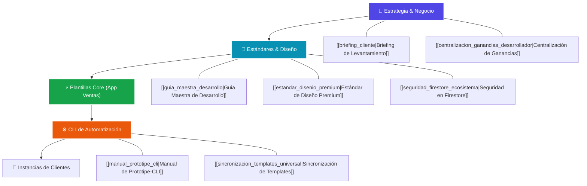

# 🧠 Obsidian Hub — Segundo Cerebro PROTOTIPE

Bienvenido al panel central de navegación de tu segundo cerebro técnico y estratégico para **PROTOTIPE**. Este archivo está diseñado para integrarse con **Obsidian**, estructurando las carpetas del proyecto mediante relaciones lógicas, mapas conceptuales e hipervínculos bidireccionales.

---

## 🗺️ Mapa de Navegación del Ecosistema

Usa este gráfico y listado como tu punto de partida para entender cómo se relacionan la **Estrategia de Negocio**, los **Estándares Técnicos**, el **Motor de Automatización (CLI)** y las **Plantillas de Código**.



---

## 📂 Índice de Carpetas y Ficheros Clave

### 1. 💼 Estrategia de Negocio y Escalabilidad
*   **[[contexto_negocio_aplicaciones_medida|Contexto de Negocio PROTOTIPE]]**: Misión, FODA y propuesta de valor de software industrializado a bajo costo para microempresas de LATAM.
*   **[[estrategia_negocio|Estrategia Operativa de Negocio]]**: Flujo de preventa, calificación de viabilidad y empaquetado de módulos.
*   **[[briefing_cliente|Briefing de Levantamiento de Requerimientos]]**: Cuestionario interactivo en español para mapear necesidades a variables del código.
*   **[[centralizacion_ganancias_desarrollador|Centralización de Ganancias del Desarrollador]]**: Modelo técnico comisional sobre la facturación de las aplicaciones de los clientes.
*   **[[resumen_ejecutivo_proyecto|Resumen Ejecutivo de Escalabilidad]]**: Plan de expansión y proyecciones de negocio.

### 2. 📐 Control de Calidad y Auditorías
*   **[[tareas_pendientes|Roadmap y Control de Tareas]]**: Bitácora del estado de desarrollo del CLI y soporte técnico.
*   **[[bitacora_cambios|Bitácora de Cambios del Ecosistema]]**: Registro detallado de parches, builds e implementaciones.
*   **[[registro_errores_bugs|Log de Errores y Bugs Comunes]]**: Base de conocimiento para evitar regresiones lógicas o race conditions conocidas.
*   **[[auditoria_critica_ecosistema_2026|Auditioría Crítica de Seguridad y Rendimiento]]**: Diagnóstico de reglas de Firestore y cuellos de botella de red.

### 3. 🚀 Estándares y Reglas de Desarrollo
*   **[[guia_maestra_desarrollo|Guía Maestra de Desarrollo]]**: Reglas obligatorias de estilo de código, estructura atómica de componentes e integraciones con Firebase.
*   **[[estandar_disenio_premium|Estándar de Diseño Premium (UI/UX)]]**: Lineamientos estéticos WCAG 2.1, colores HSL de Tailwind v4 y microinteracciones de escala.
*   **[[Firebase_Listeners_Clean|Buenas Prácticas de Firebase Listeners]]**: Control de fugas de memoria y optimización de suscripciones en tiempo real.
*   **[[seguridad_firestore_ecosistema|Manual de Seguridad y Reglas Firestore]]**: Estructuración y deploy de las reglas compuestas de seguridad de base de datos.
*   **[[sincronizacion_templates_universal|Estándar de Sincronización de Templates]]**: Protocolo para empaquetar cambios core y distribuirlos downstream a plantillas CLI.

### 4. 📚 Manuales Técnicos en Profundidad
*   **[[manual_prototipe_cli|Manual del CLI de Aprovisionamiento]]**: Detalla la arquitectura de `server.js`, `generator.js` y el pipeline de bootstrapping.
*   **[[Estandar_Sharding_Multitenant|Estándar de Sharding Multitenant]]**: Fragmentación lógica de bases de datos para aislar la data de clientes a costo cero ($0 USD Spark Plan).
*   **[[manual_credits_and_balances|Manual de Créditos, Saldos y Cajas]]**: Resolución de race conditions financieras en operaciones multi-cajero con transacciones atómicas.
*   **[[manual_generacion_pdf|Manual de Motor de PDFs Vectoriales]]**: Lógica de generación dinámica de reportes financieros jsPDF.

---

## 🧩 Biblioteca de Componentes Reutilizables

Tu catálogo de componentes portables está organizado en **[[06_Biblioteca_Componentes/README|Catálogo General (Readme)]]**. Los componentes clave que puedes inyectar mediante el CLI a cualquier nuevo cliente son:

1.  **[[facturacion_y_firma_digital|Facturación y Firma Táctil]]**: Panel de control del desarrollador y firma en Canvas.
2.  **[[modal_template|Modal Base Premium]]**: Estructura de modales con `framer-motion` y scroll lock.
3.  **[[selector_cantidad|Selector de Cantidad Editable]]**: Input numérico premium para compras al por mayor.
4.  **[[selector_fecha|Selector de Fecha Animado]]**: Calendario interactivo con formato localizado.
5.  **[[mapa_interactivo|Mapa Leaflet e Inserción Inversa]]**: Geolocalización sin llaves de pago de Google.

---

## ⚡ El Flujo Operativo de PROTOTIPE (Fórmula del Negocio)

Para pulir la idea de negocio, recuerda el flujo de valor automatizado:

```
[Briefing de Cliente (Requerimientos)]
                 │
                 ▼
[Definición de Vertical (Nicho) y Colores HSL]
                 │
                 ▼
[Ejecutar CLI: `npm run create-project`] 
   └─► Copia de Core Seed limpio
   └─► Generación de variables de entorno (.env.local)
   └─► Compresión y rediseño de logos (Jimp)
   └─► Autogeneración de reglas de base de datos
                 │
                 ▼
[Ejecutar Seeding: Rest Restores]
   └─► Inyecta productos/categorías realistas de niche.json
                 │
                 ▼
[Despliegue: `firebase deploy`] ──► ¡Proyecto en línea a costo $0 USD Spark Plan!
```

---

## 📝 Notas de Trabajo y Siguientes Pasos de la Idea
*   *Idea de Mejora 1*: ¿Cómo conectar la facturación DIAN de manera modular para clientes de régimen común sin sobrecargar el Core Seed?
*   *Idea de Mejora 2*: Automatizar el setup inicial de DNS y Dominios Personalizados en la consola del dev-dashboard.
*   *Idea de Mejora 3*: Integrar un asistente interactivo con IA (Gemini API) en la fase de Briefing para que el cliente dicte su menú o catálogo por voz y el CLI lo siembre de forma autónoma.
