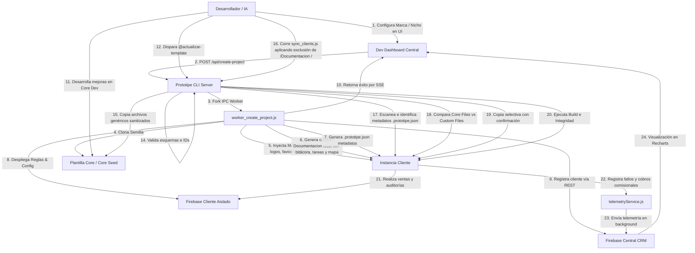

# Diagrama de Flujo Global del Ecosistema PROTOTIPE

Este documento detalla el flujo operativo y de datos del ecosistema PROTOTIPE, desde el aprovisionamiento de un nuevo cliente hasta la sincronización bidireccional de código y la telemetría centralizada.

---

## 🗺️ Flujo de Procesos de Principio a Fin

---

## ⚙️ Descripción de Flujos Críticos

### A. Aprovisionamiento (Onboarding)
El desarrollador define el color de marca, logo y nicho en el Dashboard. El CLI levanta un Worker en un proceso hijo, copia la plantilla, redimensiona el logo para la PWA, inyecta variables HSL, variables `.env.local` e inicializa dinámicamente la carpeta local de documentación (`Documentacion [ProjectName]`), inicializa Firebase y reporta al CRM Central.

### B. Mantenimiento Core (Upstream Sync)
Las mejoras y corrección de bugs se hacen en la app base de desarrollo. Al ejecutar `@actualizar-template`, el CLI sanitiza tokens y credenciales de cliente antes de actualizar la plantilla central en `templates/`, aplicando filtros de exclusión para no transferir documentación local.

### C. Mantenimiento Clientes (Downstream Sync)
Mediante `sync_clients.js`, el CLI escanea los metadatos `.prototipe.json` de cada cliente, analiza diferencias de archivos core, y propaga parches sin alterar variables de marca, temas visuales, configuraciones locales ni carpetas de documentación local.
