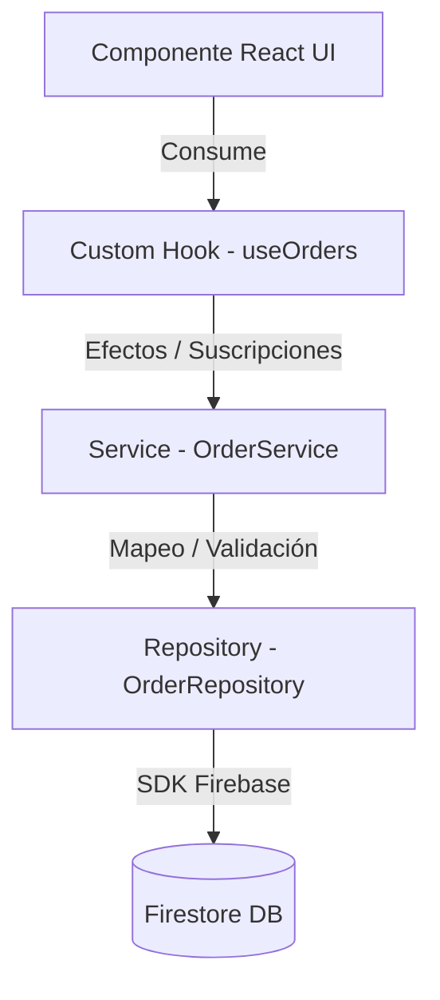

# 🏛️ Estándar Arquitectónico: React + Firebase + Tailwind CSS v4

Este documento establece las reglas y patrones de diseño definitivos para construir aplicaciones en el ecosistema **PROTOTIPE**. El objetivo principal es garantizar que el software sea modular, mantenible y libre de deuda técnica, permitiendo modificar vistas o sustituir servicios de infraestructura sin romper el núcleo de la aplicación.

---

## 1. Arquitectura de Módulos (Feature-Driven Development)

Para evitar la dispersión de archivos y facilitar la mantenibilidad, los proyectos se organizan en torno a **Features (Características de Negocio)** en lugar de agrupaciones técnicas.

### 1.1 Estructura del Directorio `src/`

```text
src/
 ├── app/             # Proveedores globales, enrutador y configuración del sistema
 ├── assets/          # Recursos estáticos globales (imágenes, favicons)
 ├── components/      # Componentes UI globales y transversales
 │    ├── ui/         # Componentes atómicos (Boton, Input, Badge) - 100% Presentacionales
 │    └── common/     # Componentes compuestos de UI (AlertConfirm, Drawer)
 ├── features/        # Módulos del dominio de negocio (Feature-Driven)
 │    ├── orders/     # Feature de Pedidos
 │    │    ├── api/   # Consultas Firestore y escrituras (Capa Repositorio)
 │    │    ├── components/ # Componentes de interfaz acoplados a Pedidos
 │    │    ├── hooks/ # Custom hooks de estado y ciclo de vida de Pedidos
 │    │    ├── types/ # Esquemas de tipado JSDoc / TypeScript
 │    │    └── index.js # Public API de la Feature (Exports autorizados)
 │    └── products/   # Feature de Productos
 ├── layouts/         # Contenedores estructurales (ClientLayout, AdminLayout)
 ├── routes/          # Declaración de rutas y protección de accesos (Guards)
 ├── store/           # Almacenes globales ligeros (Zustand)
 └── index.css        # Estilos globales y tema de Tailwind CSS v4
```

### 1.2 Regla del Gatekeeper (`index.js` de Feature)
Cada módulo dentro de `features/` debe actuar como un paquete aislado. El archivo `index.js` expone únicamente los componentes y hooks públicos.
*   **Prohibido:** Importar archivos internos de una feature desde otra feature (ej. `import Card from '../orders/components/OrderCard'`).
*   **Permitido:** Consumir del entrypoint (ej. `import { OrderCard } from '@/features/orders'`).

---

## 2. Capas de Datos y Desacoplamiento de Firebase

Los componentes visuales de React **nunca** deben importar directamente el SDK de Firebase (`firebase/firestore`, `getFirestore`, `onSnapshot`, etc.). Toda interacción se encapsula en tres capas desacopladas.

### 2.1 El Patrón de Tres Capas (Repository-Service-Hook)



#### A. Repositorio (`src/features/orders/api/orderRepository.js`)
Llamadas directas a base de datos. No sabe nada de React, ciclos de vida ni layouts.
```javascript
import { getFirestore, collection, doc, getDoc, query, where, getDocs } from 'firebase/firestore';

export const orderRepository = {
  async getById(orderId) {
    const db = getFirestore();
    const docRef = doc(db, 'pedidos', orderId);
    const docSnap = await getDoc(docRef);
    return docSnap.exists() ? { id: docSnap.id, ...docSnap.data() } : null;
  },

  getOrdersQuery(clientId) {
    const db = getFirestore();
    return query(collection(db, 'pedidos'), where('clientId', '==', clientId));
  }
};
```

#### B. Servicio (`src/features/orders/api/orderService.js`)
Lógica de transformación de datos, cálculos comerciales e integraciones de Zod.
```javascript
import { orderRepository } from './orderRepository';

export const orderService = {
  async fetchOrderDetails(orderId) {
    const rawData = await orderRepository.getById(orderId);
    if (!rawData) return null;

    // Transformación y formateo limpio para el cliente
    return {
      ...rawData,
      creadoEnFormateado: new Date(rawData.creadoEn?.seconds * 1000).toLocaleDateString(),
      totalConImpuesto: rawData.subtotal * 1.19
    };
  }
};
```

#### C. Custom Hook (`src/features/orders/hooks/useOrders.js`)
Suscripción reactiva a Firestore enlazada al ciclo de vida del componente React. Controla la seguridad evitando listeners huérfanos.
```javascript
import { useState, useEffect } from 'react';
import { getAuth, onAuthStateChanged } from 'firebase/auth';
import { onSnapshot } from 'firebase/firestore';
import { orderRepository } from '../api/orderRepository';

export function useOrders() {
  const [orders, setOrders] = useState([]);
  const [loading, setLoading] = useState(true);
  const [error, setError] = useState(null);

  useEffect(() => {
    const auth = getAuth();

    // 1. Escuchar primero cambios de sesión (Seguridad y prevencion de Missing Permissions)
    const unsubscribeAuth = onAuthStateChanged(auth, (user) => {
      let unsubscribeSnapshot = () => {};

      if (user) {
        try {
          const q = orderRepository.getOrdersQuery(user.uid);

          // 2. SOLO crear la suscripción si hay sesión activa
          unsubscribeSnapshot = onSnapshot(
            q,
            (snapshot) => {
              const items = snapshot.docs.map((doc) => ({
                id: doc.id,
                ...doc.data()
              }));
              setOrders(items);
              setLoading(false);
            },
            (err) => {
              console.error("Error en listener de pedidos:", err);
              setError(err);
              setLoading(false);
            }
          );
        } catch (err) {
          setError(err);
          setLoading(false);
        }
      } else {
        // Sesión cerrada: Limpiar estados
        setOrders([]);
        setLoading(false);
      }

      // Cleanup del listener de base de datos cuando la sesión cambia o se desmonta
      return () => {
        unsubscribeSnapshot();
      };
    });

    // Cleanup del listener de autenticación
    return () => unsubscribeAuth();
  }, []);

  return { orders, loading, error };
}
```

---

## 3. Mantenibilidad de UI/UX y Tailwind CSS v4

### 3.1 Estructura CSS-First del Branding
En Tailwind CSS v4, el branding se configura mediante CSS Variables nativas dentro del bloque `@theme` en `src/index.css`.

```css
@import "tailwindcss";

:root {
  /* Variables HSL base inyectadas dinámicamente por el CLI de PROTOTIPE */
  --primary-h: 142;
  --primary-s: 70%;
  --primary-l: 45%;

  --surface-h: 0;
  --surface-s: 0%;
  --surface-l: 100%;
}

@theme {
  /* Mapeo a utilidades de Tailwind v4 */
  --color-primary: hsl(var(--primary-h) var(--primary-s) var(--primary-l));
  --color-primary-hover: hsl(var(--primary-h) var(--primary-s) calc(var(--primary-l) - 8%));
  --color-primary-light: hsl(var(--primary-h) var(--primary-s) calc(var(--primary-l) + 40%));
  
  --color-surface: hsl(var(--surface-h) var(--surface-s) var(--surface-l));
  --color-border-app: var(--color-slate-200) / 40%;
}
```

### 3.2 Directivas de Interacción Obligatorias
*   **Transición Suave:** Todo elemento táctil o clickable (botón, tarjeta, input) debe declarar `transition-all duration-200 ease-in-out` para evitar micro-cortes visuales.
*   **Active Scale (Efecto Táctil):** Todo botón debe contraerse al clic con `active:scale-95` para proporcionar feedback háptico simulado.
*   **Cero Contraste Rígido:** Prohibido usar bordes toscos de color negro o gris oscuro. Usa siempre la variable semántica `border-app`.

---

## 4. Resiliencia de Carga y Manejo de Errores

### 4.1 Patrón de Skeleton Shimmer
El estado de carga no debe bloquear la pantalla con pantallas en blanco o spinners gigantes. Se debe utilizar un esqueleto animado que replique el esqueleto físico del componente final.

```jsx
export function CardSkeleton() {
  return (
    <div className="bg-surface border border-border-app rounded-2xl p-5 shadow-sm animate-pulse">
      <div className="h-6 w-2/3 bg-slate-200 rounded-md mb-3" />
      <div className="h-4 w-1/2 bg-slate-100 rounded-md mb-6" />
      <div className="flex justify-between items-center">
        <div className="h-8 w-20 bg-slate-200 rounded-lg" />
        <div className="h-8 w-8 bg-slate-200 rounded-full" />
      </div>
    </div>
  );
}
```

### 4.2 Flujo de Resiliencia en Vistas
Toda vista que cargue datos de forma asíncrona debe estructurarse obligatoriamente bajo tres estados de UI claros:
1.  **Carga (Loading):** Renderizado de Skeletons Shimmer correspondientes.
2.  **Vacío (Empty):** Si los datos retornan un array de longitud cero, mostrar una ilustración SVG inline descriptiva del nicho y un botón de llamada a la acción (CTA) para romper el estado de inactividad.
3.  **Error:** Un renderizador controlado que atrape la excepción y le provea al usuario un botón de "Reintentar" o recarga local sin congelar la app.

---

## 5. Directivas de Código para la IA

Cuando una Inteligencia Artificial edite o cree componentes en este proyecto, debe cumplir estrictamente las siguientes pautas:

1.  **Prohibición de Firebase Inline:** No inyectes sentencias de base de datos como `getDocs` o `onSnapshot` en componentes de la carpeta `pages/` o `components/`. Debes crear o extender su correspondiente custom hook en la capa lógica.
2.  **Validación de Imports de Hooks:** No omitas importar hooks de React (`useState`, `useEffect`, `useMemo`). Ejecuta siempre `npm run build` localmente para validar que el linter no reporte variables no definidas.
3.  **No use colores planos hardcodeados:** Está prohibido usar clases como `bg-[#22c55e]` o `bg-emerald-500` para colores de branding. Consume siempre `--color-primary` o `--color-secondary`.
4.  **Responsividad Móvil Obligatoria:** Los formularios o grupos de botones deben apilarse verticalmente en móviles (`flex-col`) y alinearse en fila (`sm:flex-row`) únicamente a partir de viewports superiores.
5.  **Aislamiento de Modales:** Los modales deben montarse usando React Portals y contar con un backdrop oscuro (`bg-black/50 backdrop-blur-sm`) que cierre la vista al hacer clic fuera del modal (Tap-shield).
