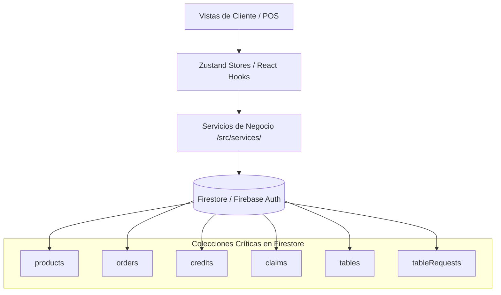

# Mapa de la Aplicación (Fuente de Verdad Arquitectónica)

Este mapa detalla de manera estructurada los módulos, vistas, flujos de datos e integraciones con Firebase de **App Ventas**. Debe mantenerse actualizado ante cualquier creación, eliminación o refactorización de archivos.

## 📂 Estructura de Documentación y Negocio
* **`/LandingPage/Index.html`**: Portal web y landing page corporativa de PROTOTIPE. Rediseñada con enfoque de consultoría, modo oscuro/claro persistente y modales de leads y CRO.
  * **Secciones principales**: `#hero` (partículas), `#rubros`, `#problema` (contador dinámico), `#solucion`, `#beneficios` (typewriter anti-layout shift), `#negocio-organizado`, `#testimonios` (carrusel 3D), `#soporte`, `#contacto` y `#lead-modal`.
  * **Efectos interactivos**: Botones magnéticos y mini-dashboard SVG interactivo.
* **`/Documentacion PROTOTIPE/03_Auditorias_y_Faro_Core/auditoria_landing_page_2026.md`**: Reporte de auditoría de seguridad (rel="noopener noreferrer"), optimizaciones SEO (metadatos Open Graph/Twitter Cards), semántica HTML5 y análisis de diseño premium de la landing page.
* **`/Documentacion PROTOTIPE/03_Auditorias_y_Faro_Core/auditoria_critica_server_cli_2026.md`**: Auditoría de seguridad de `server.js`. Evalúa riesgos de comandos shell exec/spawn, path traversal en inputs y conmutación de puertos.
* **`/Documentacion PROTOTIPE/03_Auditorias_y_Faro_Core/auditoria_generator_js.md`**: Auditoría de robustez de `generator.js`. Analiza la fusión lógica de manifiestos, procesamiento de logos con Jimp y resiliencia del seeding.
* **`/Documentacion PROTOTIPE/03_Auditorias_y_Faro_Core/auditoria_seguridad_aprovisionamiento_2026.md`**: Auditoría de seguridad del aprovisionador en la nube, evaluando roles de servicio de Firebase, validación de credenciales y mitigación de falsos negativos.
* **`/Documentacion PROTOTIPE/03_Auditorias_y_Faro_Core/auditoria_paridad_y_exclusiones_2026.md`**: Auditoría técnica del motor de paridad y sincronización de Cores. Analiza riesgos de sobreescritura, y detalla la arquitectura de preservación de branding y inyección SEO en index.html, la fusión de dependencias en package.json y los filtros flexibles de exclusión.
* **`/Documentacion PROTOTIPE/05_Estrategia_Comercial_Ecosistema/estrategia_negocio.md`**: Define el flujo operativo para adaptar la aplicación a clientes a partir de requerimientos de preventa, analizando componentes en la biblioteca o planificando nuevos módulos modularizados.
* **`/Documentacion PROTOTIPE/05_Estrategia_Comercial_Ecosistema/modelo_operativo_y_negocio.md`**: Detalla el modelo de negocio (setup, SaaS, comisiones), onboarding comercial, ventas QR, flujos de desarrollo, soporte de excepciones, mantenimiento y rollbacks automatizados de PROTOTIPE.
* **`/Documentacion PROTOTIPE/05_Estrategia_Comercial_Ecosistema/oferta_comercial_oficial.md`**: Presentación comercial oficial del ecosistema PROTOTIPE, detallando problemas que resuelve, entregables, propuesta de valor, misión, visión y principios de trabajo.
* **`/Documentacion PROTOTIPE/05_Estrategia_Comercial_Ecosistema/sistema_precios_licenciamiento.md`**: Define la filosofía de precios, valor de setup, comisiones operacionales por ventas/servicios, propiedad intelectual y políticas de suspensión del ecosistema.
* **`/Documentacion PROTOTIPE/05_Estrategia_Comercial_Ecosistema/matriz_precios_oficial.md`**: Matriz de precios del ecosistema, estableciendo cobros de implementación por nivel de solución (Nivel 1 a 4), operación recurrente, comisiones de venta (1% – 5%), y suscripciones mensuales.
* **`/Documentacion PROTOTIPE/05_Estrategia_Comercial_Ecosistema/manual_contratacion_clientes.md`**: Detalla el proceso de contratación estructurado (contacto, reunión inicial, diagnóstico, propuesta, aprobación, inicio de proyecto) y principios clave de preventa.
* **`/Documentacion PROTOTIPE/05_Estrategia_Comercial_Ecosistema/contrato_maestro_servicios.md`**: Contrato maestro oficial de prestación de servicios tecnológicos, definiendo la propiedad intelectual del core, propiedad de datos del cliente, licenciamiento, soporte y mantenimiento.
* **`/Documentacion PROTOTIPE/05_Estrategia_Comercial_Ecosistema/politica_proteccion_datos.md`**: Política oficial de protección y gestión de datos de PROTOTIPE, regulando la confidencialidad, propiedad, seguridad, retención y migración de la información.
* **`/Documentacion PROTOTIPE/05_Estrategia_Comercial_Ecosistema/manual_marca.md`**: Define la personalidad de marca, posicionamiento, tono de comunicación, valores, estilo visual e identidad de PROTOTIPE.
* **`/Documentacion PROTOTIPE/05_Estrategia_Comercial_Ecosistema/plan_comercial_marketing.md`**: Detalla el plan de marketing de PROTOTIPE, incluyendo los canales de adquisición, cliente ideal (emprendedores/pymes), embudo de ventas de 7 etapas y objetivos de crecimiento.
* **`/Documentacion PROTOTIPE/05_Estrategia_Comercial_Ecosistema/sistema_ventas_prototipe.md`**: Define el sistema estructurado de ventas de PROTOTIPE, regulando la clasificación inicial por WhatsApp, la fase de diagnóstico técnico, propuesta, cierre y escalabilidad post-pago.
* **`/Documentacion PROTOTIPE/05_Estrategia_Comercial_Ecosistema/centralizacion_ganancias_desarrollador.md`**: Propuesta de arquitectura técnica y multitenancy para centralizar y unificar las métricas de ganancias y comisiones de múltiples clientes independientes.
* **`/Documentacion PROTOTIPE/05_Estrategia_Comercial_Ecosistema/Plantillas_de_Levantamiento/briefing_cliente.md`**: Cuestionario interactivo de alta precisión para levantar requerimientos del cliente en español mapeado con variables Ecosistema del código.
* **`/git_backup.ps1`**: Script de PowerShell para automatizar copias de seguridad (Git Backup) completas de todo el ecosistema (Maestro) de manera no disruptiva sin detener servidores de desarrollo en ejecución, y forzando la rama `develop` al finalizar.
* **`/subproject_backup.ps1`**: Script de PowerShell para realizar respaldos Git y commits en subproyectos de manera no disruptiva sin detener los servidores de desarrollo de Vite/Node, y forzando la rama `develop` para componentes base (Core/Dashboard) o respetando ramas de cliente.
* **`/menu_backup.ps1`**: Script de PowerShell con menú interactivo por consola para simplificar copias de seguridad de forma manual de manera no disruptiva sin detener servidores locales.
* **`/Prototipe-CLI/`**: Herramienta de línea de comandos (CLI) interactiva para automatizar el aprovisionamiento, copiado de plantillas, inyección de variables de entorno y bootstrapping de nuevos proyectos del ecosistema en `D:\PROTOTIPE\Instancias Clientes\{coreType}\` mediante spinners interactivos `ora`.
  * **`config.js`**: Módulo de configuración central que unifica la resolución de rutas de trabajo y del sistema, incluyendo la resolución dinámica de directorios de instancias basada en su `coreType` mediante `getInstancePath()`, y permitiendo la portabilidad mediante variables de entorno (`PROTOTIPE_WORKSPACE_ROOT`, `PROTOTIPE_DOCS_ROOT`).
  * **`logger.js`**: Logger estructurado que escribe registros formateados en `cli_bridge.log` y con colores en consola.
  * **`worker_create_project.js`**: Proceso hijo (worker) para la creación de proyectos asíncrona que gestiona la instalación de dependencias npm, la pre-compilación y la ejecución del smoke test headless de Playwright usando `require` nativo de CommonJS compatible con Windows y estado de espera `load` para tolerar conexiones SSE persistentes.
  * **`server.js`**: Servidor local Express que expone la API Bridge con el dev-dashboard.
    * **Endpoints de Sincronización y Core**:
      - `/api/project/drift`: Detección de NPM drift (`mismatchDeps`, `missingDeps`, `addedDeps`), cálculo de desviaciones físicas y consistencia (`consistencyScore`), con soporte opcional de compilación Vite en seco (`buildAudit=true`).
      - `/api/project/sync-file` y `/api/project/sync-files`: Sincronización diferencial downstream Core → Instancias.
      - `/api/cores/*`: Sincronización y activación de plantillas Core en disco (`performCoreSync`).
      - `/api/project/fix/*`: Arreglos correctivos en caliente (reglas Firebase, Storage e índices).
    * **Endpoints de Firebase y Storage**:
      - `/api/project/firebase/cors-setup`: Configuración automatizada de reglas CORS de Firebase Storage con fallback a `.firebasestorage.app` e in-memory caching (`storageBucketCache`).
    * **Endpoints de Git**:
      - `/api/git/*`: Control de versiones Git (commits, diff-file, descarte, SSE streams).
    * **Endpoints de Inyección de Componentes**:
      - `/api/library/inject/*`: Diagnóstico preflight, reescritura de imports, backups y rollback guiado.
    * **Servicios de Logs e Instalación**:
      - `/api/project/dependencies/install`: Gestor asíncrono de instalación de dependencias NPM vía SSE.
      - `/api/project/dev/logs-stream`: Streaming de logs de servidores de desarrollo locales activos.
  * **`generator.js`**: Motor de aprovisionamiento de proyectos.
    * **Acciones Principales**:
      - Copia y estructuración de plantillas por tipo de Core.
      - Autogeneración de reglas restrictivas para Storage/Firestore.
      - Configuración dinámica HSL y redimensionamiento inteligente de logotipos con Jimp (con fallback resiliente).
      - Validación asíncrona robusta de credenciales de Firebase en la nube (Preflight check).
      - Generación de variables duales `.env.development`/`.env.production` y `.firebaserc`.
      - *Smart Seeding* automatizado de catálogos comerciales por nicho.
  * **`sync_templates.js`**: Script de sincronización universal de templates que extrae tokens de configuración del `.env.local`, realiza sanitización dinámica recursiva y soporta rutas anidadas por core.
  * **`sync_clients.js`**: Script de sincronización selectiva downstream para propagar de forma segura parches del core hacia las instancias de clientes (resolviendo dinámicamente sus carpetas bajo `Instancias Clientes/{coreType}/`), incorporando un menú de selección interactivo (Aplicar/Simular Diffs/Omitir) y Dry Run con previsualización coloreada de diferencias de código.
  * **`templates/template-core-seed/`**: Plantilla base (Core Seed) genérica y desacoplada de negocio, equipada con telemetría, facturación multi-modo, alerta remota de pago y ping test interactivos.
* **`/Prototipe-CLI/templates/template-ventas/playwright.config.js`**: Configuración de Playwright base para la nueva marca generada.
* **`/Prototipe-CLI/templates/template-ventas/tests/`**: Suite de pruebas base End-to-End preinstalada y autoinstanciable para la nueva marca.
* **`/Documentacion PROTOTIPE/08_Plan_Escalabilidad_Negocio/onboarding_clientes_roadmap.md`**: Pipeline estructurado de despliegue y backlog/agenda de onboarding para nuevos clientes y prospectos de la plataforma.
* **`/Documentacion PROTOTIPE/08_Plan_Escalabilidad_Negocio/roadmap_empresarial_2026_2029.md`**: Planificación estratégica empresarial por etapas (Consolidación, Validación, Escalamiento, Expansión) y metas de clientes activos (10, 50, 100, 200+) para el período 2026-2029.
* **`/Documentacion PROTOTIPE/08_Plan_Escalabilidad_Negocio/organigrama_futuro.md`**: Estructura organizativa futura por fases operativas (Fundador, Corto Plazo, Mediano Plazo, Largo Plazo) y principios de crecimiento eficiente.
* **`/Documentacion PROTOTIPE/06_Biblioteca_Componentes/`**: Catálogo central de componentes reutilizables y atómicos.
  * **`Formularios_y_UI/Carrito_Completo/carrito_completo.md`**: Módulo integral de Carrito de Compras (Store reactivo Zustand + CartDrawer visual animado).
  * **`Formularios_y_UI/Checkout_Modal/checkout_modal.md`**: Modal Multipaso Wizard de Checkout y formalización de pedidos para WhatsApp.
  * **`Servicios_y_Firebase/Sincronizacion_Firebase/sincronizacion_firebase.md`**: Hook reactivo genérico `useFirestoreCollection` para escuchar Firestore en tiempo real con soporte de caché offline local.
  * **`Formularios_y_UI/Tarjeta_Producto/tarjeta_producto.md`**: Tarjeta visual de producto adaptativa (`ProductCard`) con soporte grid/list y efecto Glow de neón.
  * **`Formularios_y_UI/Rejilla_Catalogo/rejilla_catalogo.md`**: Rejilla responsiva inteligente (`CatalogGrid`) con transiciones fluidas de layouts (grid/list) y Empty State reactivo comercial.
  * **`Formularios_y_UI/Stepper_Pedidos/stepper_pedidos.md`**: Stepper premium responsivo de seguimiento de pedidos (`OrderTrackingTimeline`) con micro-animaciones.
  * **`Formularios_y_UI/Seguimiento_Pedido/seguimiento_pedido.md`**: Portal público de seguimiento del progreso de pedidos (`OrderTracking`) desacoplado de rutas directas.
  * **`Formularios_y_UI/Gestor_Categorias/gestor_categorias.md`**: UI stateless para administrar, crear, editar y eliminar categorías con buscador e íconos SVG integrados.
  * **`Formularios_y_UI/Selector_Variantes/variant_selector.md`**: Interfaz atómica interactiva premium para seleccionar atributos combinados (talla, color, material) con validación de stock en tiempo real y deshabilitación de combinaciones agotadas.
  * **`Visualizacion/Alertas_Stock_Critico/admin_stock_alerts.md`**: Panel de reabastecimiento e inventario crítico (`AdminStockAlerts`) with aplanamiento de variantes.
  * **`Servicios_y_Firebase/Generacion_PDF/generacion_pdf.md`**: Motor dinámico y de marca blanca para exportar y descargar reportes PDF.
  * **`00_Core_Ecosistema_Obligatorios/Facturacion_y_Firma_Digital/facturacion_y_firma_digital.md`**: Panel de facturación del desarrollador con cálculo comisional multi-modo y firma táctil en canvas.
* **`/Documentacion PROTOTIPE/09_Modulos_Completos/`**: Catálogo de Módulos Completos (Ecosistema Features).
  * **`Caja_Diaria_POS/caja_diaria_pos.md`**: Apertura de caja, transacciones de flujo auxiliar, arqueo físico vs esperado HSL y lienzo interactivo para firmas.
  * **`Creditos_y_Saldos/creditos_saldos.md`**: Lógica de créditos, cuentas por cobrar, abonos y estado de cuentas de clientes.
  * **`Omnicanalidad_WhatsApp/omnicanalidad.md`**: Módulo de redirecciones y plantillas dinámicas de WhatsApp.
  * **`Telemetria_Centralizada/telemetria_centralizada.md`**: Monitoreo y subida de telemetría de facturación y logs a Firestore.
  * **`Reservas_Agenda_Citas/reservas_agenda_citas.md`**: Agenda interactiva semanal y cuadrícula de horarios asignables para servicios y reservas profesionales.
  * **`POS_Express_Scanner/pos_express_scanner.md`**: Módulo de checkout veloz en caja que interpreta eventos de lectores de códigos de barra físicos.
  * **`Ordenes_Trabajo_Equipos/ordenes_trabajo_equipos.md`**: Ficha de control de recepción de maquinaria y equipos para diagnóstico, repuestos y firma digital.
  * **`Pantalla_Cocina_KDS/pantalla_cocina_kds.md`**: Monitor interactivo de cocina en tiempo real (KDS) con semáforo cronológico de tiempos de preparación y alertas auditivas sintéticas (Web Audio API).
* **`/Documentacion PROTOTIPE/Manuales/`**: Carpeta jerárquica de manuales técnicos de desarrollo de Rápido Entendimiento para el programador.
  * **`README.md`**: Consola de Control Visual indexando y clasificando manuales por complejidad, tecnologías e impacto.
  * **`Arquitectura_Multi_Instancia/Configuracion_Marca/manual_brand_config.md`**: Guía técnica de personalización, HSL dinámico y script de siembra.
  * **`Arquitectura_Multi_Instancia/Configuracion_Marca/manual_centralizacion_comisiones.md`**: Guía técnica de implementación de telemetría y consolidación HTTP de comisiones en servidor central.
  * **`Arquitectura_Multi_Instancia/Configuracion_Marca/manual_nichos_servicios.md`**: Manual de Verticales de Servicios y Operaciones Técnicas a la Medida, detallando modelado de atributos, workflows y lógica de 8 industrias de servicios técnicos y talleres.
  * **`Paginas/Seguimiento_Pedido/manual_order_tracking.md`**: Guía de seguridad de tokens UUID y reglas compuestas de Firestore.
  * **`Visualizacion/Alertas_Stock/manual_admin_stock_alerts.md`**: Guía del algoritmo de stock crítico y transacciones concurrentes de inventario.
  * **`Servicios_y_Firebase/Generacion_PDF/manual_generacion_pdf.md`**: Guía técnica del procesamiento vectorial A4 y plugin de AutoTable. Detalla la lógica de reportes financieros y de caja (conciliación líquida vs cuentas por cobrar, y dinámica de empleados/vendedores) y el reporte de rotación/inventario 360° (tasa Sell-Through, Runway en días de stock, Pareto ABC del 80/20 y alertas dinámicas ante desactivación global de variantes).
  * **`Servicios_y_Firebase/Omnicanalidad_WhatsApp/manual_whatsapp_notifications.md`**: Guía técnica del parseo dinámico de templates de chat y APIs libres de cobro.
  * **`Servicios_y_Firebase/Creditos_y_Saldos/manual_credits_and_balances.md`**: Guía técnica de la mitigación de race conditions en cajas multi-vendedor con transacciones.
  * **`Paginas/Compra_por_QR/manual_compra_qr.md`**: Guía técnica del flujo de redirección por URL parametrizada, inicio de sesión express e integración de códigos QR en el catálogo.

* **`/Documentacion PROTOTIPE/Estandar de Desarrollo/`**: Guías técnicas, reglas de diseño y arquitectura.
  * **`inicializacion_nuevos_proyectos.md`**: Protocolo obligatorio y checklist paso a paso de bootstrap para nuevos proyectos de software (verificaciones de paridad, inicialización local y biblioteca de componentes).
  * **`guia_facturacion_dian_comisiones.md`**: Estándar técnico para la implementación y control de facturación electrónica DIAN y comisiones comisionales sobre base imponible.
  * **`mapa_documentacion_ia.md`**: Mapa semántico global de la documentación. GPS principal de la IA para localizar instantáneamente cualquier manual, componente, bitácora o estándar.
  * **`Copia_Seguridad_Reglas_y_Skills/`**: Directorio de resguardo de las reglas de comportamiento globales de la IA (`GEMINI.md`) y las habilidades o skills de automatización (`Skills/`).
    * **`Skills/sandbox_integrator/SKILL.md`**: Skill para registrar e integrar dinámicamente playgrounds de componentes manuales en el dashboard (`@sandbox`).
    * **`Skills/portar_componente/SKILL.md`**: Skill para portar, adaptar e inyectar automáticamente código de componentes a proyectos del disco (`@portar-componente`).
  * **`Copia_Seguridad_Reglas_y_Skills/sync_rules.js`**: Script de sincronización dinámica de reglas de IA para clonar de forma proactiva y automática el archivo GEMINI.md a todos los subproyectos y plantillas del CLI.
* **`/Documentacion PROTOTIPE/03_Auditorias_y_Faro_Core/auditoria_rendimiento_db_2026.md`**: Informe técnico de optimización de lecturas/escrituras en base de datos Firestore, sincronización delta para IndexedDB en POS y solución de lecturas duplicadas en montaje de hooks de pedidos.
* **`/Documentacion PROTOTIPE/03_Auditorias_y_Faro_Core/analisis_costos_firebase_2026.md`**: Informe técnico detallado analizando la procedencia del cobro de $2 USD por almacenamiento de imágenes en Cloud Functions en el proyecto Ventas, y el plan de prevención/mitigación para retornar a $0 USD.
* **`/Documentacion PROTOTIPE/03_Auditorias_y_Faro_Core/auditoria_replicacion_cores_2026.md`**: Análisis de seguridad, robustez y conectividad central del motor de aprovisionamiento de marcas blancas al clonar Cores genéricos actuales y futuros.
* **`/Documentacion PROTOTIPE/Tareas Pendientes/`**: Bitácora y estado del roadmap del proyecto.
  * **`tareas_pendientes.md`**: Lista general de tareas completadas, en progreso e hitos de desarrollo técnico.
  * **`tareas_pendientes_prioritarias.md`**: Backlog prioritario de desarrollo e infraestructura futura (como la centralización de comisiones) que se ejecutará bajo tu consentimiento.
<!-- START_AUTO_CORES_APP -->
### 📂 Carpeta del Core de App Ventas
* **`/Plantillas Core/App Ventas/Documentacion App Ventas/tareas_pendientes.md`**: Control de Tareas y Estado de Implementación.
* **`/Plantillas Core/App Ventas/Documentacion App Ventas/bitacora_cambios.md`**: Bitácora de Cambios y Control de Versiones.
* **`/Plantillas Core/App Ventas/Documentacion App Ventas/mapa_aplicacion.md`**: Mapa de la Aplicación (Arquitectura Física).
* **`/Plantillas Core/App Ventas/Documentacion App Ventas/esquema_colecciones.md`**: Esquema y Propósito de Colecciones de Base de Datos (Firestore).
* **`/Plantillas Core/App Ventas/Documentacion App Ventas/manual_migracion.md`**: Manual de Despliegue y Configuraciones Locales.
* **`/Plantillas Core/App Ventas/Documentacion App Ventas/flujos_aplicacion.md`**: Flujos Operativos y Diagramas de Secuencia.
* **`/Plantillas Core/App Ventas/Documentacion App Ventas/mapa_arquitectura.md`**: Mapa de Arquitectura Física y Árbol de Código.
* **`/Plantillas Core/App Ventas/Documentacion App Ventas/contexto_negocio.md`**: Contexto de Negocio y Reglas Operativas del Dominio.
* **`/Plantillas Core/App Ventas/Documentacion App Ventas/restricciones_tecnicas.md`**: Restricciones Técnicas y Patrones Prohibidos.
* **`/Plantillas Core/App Ventas/Documentacion App Ventas/guia_estilos_ui.md`**: Guía de Estilos de UI y Sistema de Diseño del Core.

<!-- END_AUTO_CORES_APP -->

---

## 📂 Estructura de Módulos y Archivos Clave

### 👥 Módulo Cliente (Tienda PWA)
* **`/src/layouts/ClientLayout.jsx`**: Layout raíz del flujo del cliente. Gestiona la barra de navegación, el banner dinámico de anuncios, el carrito lateral y el modal de cupones.
* **`/src/components/client/cart/CartDrawer.jsx`**: Cajón lateral del carrito de compras del cliente. Muestra el resumen de productos agregados, selector interactivo de cantidades, totales y botón de checkout. Integra el sistema de recomendaciones comerciales ("Recomendados para ti") con caché de ciclo de apertura para evitar consultas repetitivas de red.
* **`/src/pages/client/CatalogPage.jsx`**: Catálogo de productos. Integra el filtrado avanzado a través de `appConfigStore` y la barra de búsqueda en tiempo real.
* **`/src/components/client/catalog/ProductDetailModal.jsx`**: Detalle ampliado del producto seleccionado, opciones de color, talla y agregado al carrito (Usa [ModalTemplate](file:///d:/Aplicaciones/App%20Ventas/src/components/common/ModalTemplate.jsx)).
* **`/src/components/client/checkout/CheckoutModal.jsx`**: Proceso de compra tipo "wizard". Integra de manera anidada `ClientCouponsModal` para permitir la aplicación rápida y automatizada de códigos de descuento en el paso de método de pago, y un selector interactivo de mesas disponibles en tiempo real para clientes no sentados que eligen la opción "Pedido en Mesa" (Usa [ModalTemplate](file:///d:/Aplicaciones/App%20Ventas/src/components/common/ModalTemplate.jsx)).
* **`/src/components/client/claims/ClaimRequestModal.jsx`**: Formulario de reclamación de garantías por pedido (Usa [ModalTemplate](file:///d:/Aplicaciones/App%20Ventas/src/components/common/ModalTemplate.jsx)).
* **`/src/components/client/coupons/ClientCouponsModal.jsx`**: Listado de cupones y ofertas flash activos con diseño de ticket prémium que implementa dientes de sierra SVG y línea de perforación punteada (Usa [ModalTemplate](file:///d:/Aplicaciones/App%20Ventas/src/components/common/ModalTemplate.jsx)).
* **`/src/pages/client/ProductDetailPage.jsx`**: Página de vista detallada del producto para clientes de la tienda virtual. Integrada como ruta hija en `/tienda/producto/:id` para renderizar con barra lateral (Sidebar) en versión de escritorio y autoconstreñir las imágenes. En versión móvil, se ocultan el navbar superior y barra inferior de navegación para una visualización fluida a pantalla completa.
* **`/src/pages/client/ProductPublicDetail.jsx`**: Portal Público de Compra. Experiencia especializada y optimizada para conversión de clientes que escanean códigos QR físicos de productos. Soportada de manera responsiva y sin login.
* **`/src/pages/client/ClientCredits.jsx`**: Portal de visualización de créditos, abonos e historial para clientes, saneado con ModalTemplate (Módulo 5).

### 💼 Módulo Administración (POS / Dashboard / Control)
* **`/src/layouts/AdminLayout.jsx`**: Navegación interna y control de sesión de administradores y vendedores. Incorpora el diseño interactivo de barra lateral colapsable, menú hamburguesa alineado y transición de logotipo/título en escritorio. **[Modo Offline]**: Restringe la navegación únicamente al POS ("Venta") y fuerza una redirección automática hacia el POS si la conexión se cae estando en otra pestaña.
* **`/src/layouts/PortalLayout.jsx`**: Layout raíz del portal del vendedor y empleados. Gestiona la sesión del empleado, la campana de notificaciones y muestra un indicador de red dinámico que cambia a "Modo Offline" elástico en ámbar al perder la conexión.
* **`/src/pages/admin/AdminHome.jsx`**: Panel de Inicio del Administrador (diseño premium estilo "wallet" con balances destacados, distribución de caja diaria por métodos de pago y carrusel de transacciones recientes).
* **`/src/pages/admin/InventoryPage.jsx`**: Panel de control de productos, stock, tallas, imágenes y categorías.
* **`/src/pages/admin/AdminOrders.jsx`**: Panel de Gestión de Pedidos del administrador. Gestiona el flujo de estados de pedidos (Pendiente, Completado, Cancelado, Crédito Aprobado), visualización interactiva de mapas de Leaflet (desplegables), asignación de mensajeros, generación de facturas PDF, y consulta del modal interactivo de Historial de Pedidos.
* **`/src/pages/EmployeePortal.jsx`**: Interfaz de ingreso y selección de perfiles para empleados con keypad táctil de PIN, lobby de bienvenida con visualización de pago programado (salario, frecuencia y fecha) e indicadores de rendimiento diario, y redirección por roles.
* **`/src/pages/DeliveryPanel.jsx`**: Espacio de trabajo (Panel de Domicilios) para los domiciliarios autenticados con PIN, con control de entregas, estadísticas diarias y geolocalización integrada.
* **`/src/pages/admin/AdminPortalQR.jsx`**: Módulo administrativo de 3 pestañas para generar códigos QR de acceso, monitorear sesiones activas en tiempo real y consultar el historial logeado de accesos por turnos.
* **`/src/components/admin/inventory/ProductFormModal.jsx`**: Modal de creación/edición de productos asistido por IA. Permite la carga directa de imágenes a Storage mediante `uploadService` (portada, galería secundaria y variantes). El grid de variantes cuenta con rediseño simétrico a 2 columnas (SKU y Foto de variante) tras ser purgada la opción redundante de "Precio Propio" (Usa [ModalTemplate](file:///d:/Aplicaciones/App%20Ventas/src/components/common/ModalTemplate.jsx)).
* **`/src/components/admin/settings/CatalogFiltersCreator.jsx`**: Configurador administrativo de dimensiones del catálogo (categorías, tallas, colores) y gestor de atributos dinámicos personalizados.
* **`/src/components/admin/settings/DeveloperDiagnosticsModal.jsx`**: Modal de diagnóstico técnico para desarrolladores. Provee pestañas para ver variables de entorno, realizar pings de conectividad a Firebase Local y Central, y probar llaves de notificaciones VAPID y notificaciones push.
* **`/src/pages/admin/AdminSettings.jsx`**: Panel de Ajustes y Configuración del Administrador. Rediseñado como un controlador y despachador de pestañas ligero y desacoplado que importa secciones modulares.
* **`/src/pages/admin/settings/components/MobilePreview.jsx`**: Componente visual interactivo para simular la vista previa de la tienda PWA del cliente en tiempo real.
* **`/src/pages/admin/settings/sections/BrandSettings.jsx`**: Sub-panel de gestión de identidad de marca (logo, colores, PWA, redes sociales).
* **`/src/pages/admin/settings/sections/EmployeeSettings.jsx`**: Sub-panel de personal para control de PINs, generación de códigos QR de accesos y nóminas de empleados.
* **`/src/pages/admin/settings/sections/StoreSettings.jsx`**: Sub-panel de opciones operativas, que agrupa configuración de stock/movimientos, ventas al por mayor, temporadas, garantías/reclamaciones y plantilla de mensaje de seguimiento de pedidos.
* **`/src/pages/admin/settings/sections/PaymentSettings.jsx`**: Sub-panel de cuentas bancarias y métodos de cobro autorizados en checkout.
* **`/src/pages/admin/settings/sections/SecuritySettings.jsx`**: Sub-panel de seguridad para actualizar correo y clave del administrador principal.
* **`/src/pages/admin/settings/sections/DeveloperSettings.jsx`**: Zona protegida del desarrollador mediante PIN maestro (`DEV_PIN`), delegando la facturación, firma y telemetría a `DeveloperBillingPanel`, gestionando la restauración a cero y variables de entorno del servidor, y controlando la activación de módulos globales, configuración de facturación DIAN y métodos de entrega.
* **`/src/pages/admin/settings/sections/DeveloperBillingPanel.jsx`**: Componente modular y portable de facturación del desarrollador, que consolida las métricas de ganancias comisionales, la firma táctil digital del cliente, la generación del recibo certificado en PDF y la sección de telemetría y diagnósticos (error de prueba y envío manual de facturación).
* **`/dev-dashboard/`** [STANDALONE]: Consola Central del Desarrollador (Proyecto web independiente aislado). Interfaz interactiva privada conectada de forma híbrida al Firestore Central para ver comisiones acumuladas, ingresos y estado de pagos de clientes.
  * **Navegación Multi-Tab y Responsividad**: Sidebar fijo en desktop y barra de navegación inferior fija (`bottom-nav`) en móviles con 7 pestañas activas (Inicio, Cobros, Biblioteca, Nuevo, Monitoreo, Cores, Branding) y Safe Area (`pb-safe`) soportada. CRM es accesible exclusivamente mediante la tarjeta de "Clientes Activos" en Inicio (incorporando la pestaña "Matriz de Paridad (Drift Heatmap)" con mapa de calor del nivel de paridad global de clientes, la pestaña de Sincronización Core para detectar desviaciones físicas y dependencias NPM desincronizadas, un panel de control Git con descarte de cambios en caliente selectivo y masivo, visor de commits locales, estado de sincronización con GitHub y visor de diffs formateado, y botones para ver terminal de logs en vivo), y Ajustes se despliega desde el modal de Perfil (el cual está adaptado dinámicamente al modo claro y oscuro).
  * **Radar de Salud de Instancias**: Widget interactivo tipo sonar en la columna derecha de Inicio que representa las instancias en vivo mediante coordenadas polares (distancia radial y ángulo) deterministas en un lienzo circular con barrido conic-gradient rotativo (`animate-radar-sweep`), filtros de búsqueda rápidos por tipo de Core (Ventas, POS, etc.), ficha técnica de telemetría de ping/latencia del cliente seleccionado, y redirección directa a la Consola de Incidentes en caso de alertas activas. [HealthRadar.jsx](file:///d:/PROTOTIPE/Central%20PROTOTIPE/dev-dashboard/src/components/admin/HealthRadar.jsx) [NEW]
  * **Branding Studio HSL and WCAG 2.1 Validator**: Pestaña dedicada al diseño de identidad cromática de marca. Permite experimentar con selectores cromáticos HSL, validar las relaciones de contraste en tiempo real contra los estándares de la W3C (AAA, AA, Fail) para el botón primario y el fondo general, y seleccionar de una gallery de 100 paletas premium organizadas en acordeones por nichos de mercado (Tecnología, Moda, Comida, etc.).
  * **Historial de Aprovisionamientos Responsivo**: En la pestaña "Nuevo Cliente" (onboarding), el listado de aprovisionamientos previos cuenta con un diseño adaptativo que oculta la tabla clásica (`hidden md:table`) en dispositivos móviles y renderiza tarjetas detalladas optimizadas para pantallas táctiles (`md:hidden`) junto con un paginador fluído integrado.
  * **Integración de Recharts y Selector de Periodos**: Selector interactivo de periodos (Mes/Año) en cabecera con estilo glassmorphic, visualización reactiva de métricas del dashboard filtradas por mes/año y gráfico general de áreas ("Comisiones Generales") histórico con `ReferenceLine` vertical indicativa del mes seleccionado. Acordeón de clientes con mini-gráficos individuales de ventas y comisiones (Framer Motion + AreaChart), y participación comisional por nicho (PieChart) con tabla de margen neto en el simulador financiero.
  * **Transiciones Fluidas**: Animaciones fluidas al cambiar entre vistas, despliegue de drawers y acordeones interactivos usando Framer Motion.
  * **Portal del Cliente CRM**: Split-view para computadores y pantalla completa para móviles, permitiendo editar configuraciones del cliente (modo de cobro, DIAN billing y tokens), simular envíos de telemetría o generar la ficha de rendimiento y log individual de cliente en PDF.
  * **Modales de Métricas de Cabecera**: Modales funcionales de detalle para Comisión Acumulada, Cobrado y Por Recaudar, que muestran aportes por cliente, listado de transacciones históricas, registro de cobros directos integrados con CRM y exportación a PDF.
  * **Consola de Incidentes y Diagnósticos de Telemetría**: Panel interactivo en tiempo real conectado a `app_failures` en Firestore. Cuenta con filtros por estado (Activos / Resueltos / Todos), severidad (Errores / Advertencias / Información) y buscador de texto, con tarjetas métricas de cabecera interactivas como filtros directos. Implementa agrupación (de-duplicación) de incidentes duplicados con insignias animadas de impactos y resolución de errores con formulario inline para guardar de forma permanente notas de resolución históricas (`resolutionNote`, `resolvedAt`). El modal de diagnóstico integra visualización de código en vivo (CLI Bridge), datos del entorno de ejecución, enlaces automáticos de creación de índices compuestos de Firebase y un motor heurístico premium para detectar fallas de CORS, deserialización JSON, permisos de Firebase Storage y desconexión de red de Firestore.
    * **`src/hooks/useCopyToClipboard.js`**: Hook de copiado rápido al portapapeles.
    * **`src/hooks/useToast.js`**: Hook de control de notificaciones flotantes toast.
    * **`src/components/ui/GuidedToast.jsx`**: Banner de notificación toast interactiva premium adaptada.
    * **`src/components/common/AlertConfirmContext.jsx`**: Proveedor de diálogos de alertas y confirmaciones síncronas promesificadas.
    * **`src/components/admin/ComponentSandbox.jsx`**: Playground de previsualización interactiva con simulación de estados en vivo. Su carga está completamente automatizada usando `import.meta.glob` de Vite para importar de forma dinámica los componentes en `sandboxes/` sin requerir imports o mapeos estáticos manuales. Si un componente visual carece de sandbox configurado, ofrece el botón interactivo para crearlo en caliente usando la API de Scaffold. Robustecido con `SandboxErrorBoundary` para encapsular fallas en runtime.
    * **`src/components/admin/sandboxes/`**: Directorio de playgrounds visuales interactivos individuales de componentes complejos (FormularioProductoIASandbox, LoginPageSandbox, OrderTrackingSandbox, CatalogFiltersSandbox, PWAInstallBannerSandbox, ModuloAgendamientoBarberiaSandbox, etc.) integrados en el Sandbox del Dashboard.
    * **`src/components/admin/ComponentLibraryView.jsx`**: Vista de catálogo de la biblioteca a doble columna (30%/70%) conectada al Daemon CLI, con buscador inteligente, filtros por tipo/tag/sandbox, categorías colapsables tipo acordeón animadas con Framer Motion, y sistema de instalación guiada en 3 pasos (Modal Wizard): Paso 1 pre-validación (preflight), Paso 2 diagnóstico de dependencias NPM e internas (representadas como un árbol en cascada visual) + panel de curación "CSS Doctor" para autoinyectar variables de estilo faltantes + configuración interactiva de env vars, Paso 3 progreso en vivo via SSE con iconografía de estado por fase. 4 pestañas de detalle: Documentación, Código Fuente (con widget "Copia de Importación Inteligente" con ruta alias `@/`), Sandbox, Historial (CORE-127: timeline de inyecciones/rollbacks con filtros, paginación, visor de diffs unificado y estado de build). Registro de inventario en `.prototipe-injected.json` con checksum SHA-256. Rollback guiado de componentes individuales con reversión en cascada de dependencias.
    * **`src/components/admin/E2EPanel.jsx`**: Panel modular para lanzar y monitorear la suite de pruebas End-to-End (E2E) con Playwright de forma visual e interactiva por cliente, transmitiendo logs mediante SSE.
    * **`src/components/admin/CoreManagerPanel.jsx`**: Panel de control visual del desarrollador para registrar nuevos cores, clonar plantillas de referencia (scaffold) y administrar el estado general de las plantillas core, delegando la vista detallada de la tarjeta a `CoreCard.jsx`.
    * **`src/components/admin/CoreCard.jsx`**: Componente modular que encapsula el estado y ciclo de vida de una plantilla core. Administra de forma aislada las auditorías PWA/calidad, edición de variables de entorno (con doble confirmación de borrado), descarga de logs de compilación, despliegues por SSE y log de acciones, la visualización detallada de paridad física (0-100%) con cálculo lazy-loading de diffs al expandir el acordeón del archivo modificado, el reporte de archivos obsoletos (huérfanos) con soporte de sincronización y poda (prune: true) en caliente, y el panel de Monitoreo & Telemetría de Desarrollo para el orquestador local (`[clave]-smartfix`), el cual expone estados de pings en vivo, visor de fallos local, controles interactivos de servidor (Desplegar en Local, Detener, Ir a Local) y el lanzador al modal de gestión operativa/drift, evitando re-renders masivos en el panel principal.
    * **`src/components/admin/GitBackupPanel.jsx`**: Panel visual de control de versiones y copias de seguridad (Git Backup) con soporte para estrategias (GitHub Sync, Auto-Merge), visor de log interactivo en vivo y registro de metadatos de respaldos por SSE.
    * **`src/components/admin/BriefingStudioView.jsx`**: Wizard premium interactivo de preventa de 20 pasos de preventa con auto-guardado en la colección `briefings` de Firestore, panel de análisis de viabilidad (Modo 2) con el Bridge CLI e inyección a onboarding.
    * **`src/components/admin/CotizadorView.jsx`**: Calculadora comisional de 5 pasos basada en matriz de precios persistida en Firestore y generación/descarga del PDF de propuesta de negocio premium.
    * **`src/components/admin/FeatureFlagManager.jsx`**: Panel de control visual de las 10 flags operativas del Core (creditsEnabled, wholesaleEnabled, etc.) con timeline de auditoría de cambios en Firestore.
    * **`src/components/admin/RecaudoPanel.jsx`**: Módulo completo y autoadaptable de cartera y recaudación de comisiones a pantalla completa. Ofrece métricas de cobro y efectividad, buscador, filtros de vencimiento, paginación, toggle de agrupación de deuda por cliente (para soportar grandes volúmenes de datos), Side Drawer lateral de perfil comercial, e integraciones con WhatsApp para recordatorios de pago dinámicos.
    * **`src/components/admin/CobrosPanel.jsx`**: Módulo completo y modular del historial de comisiones recaudadas a pantalla completa. Ofrece métricas de cobro y efectividad, buscador, filtros por año, paginación, toggle de agrupación para consolidar el historial acumulado por cliente (abriendo un Side Drawer detallado) o desglose periodizado, e interacción de reversión de pagos con animaciones de carga.
    * **`src/components/admin/ComisionesPanel.jsx`**: Módulo completo y modular de visualización y exportación de comisiones acumuladas a pantalla completa. Presenta un desglose interactivo de aportes por cliente con barras de progreso y porcentaje de contribución, historial paginado de transacciones con búsquedas y ordenamientos, exportación general a PDF de métricas y proyecciones, y un Side Drawer lateral con el desglose histórico de periodos por cliente seleccionado.
    * **`src/components/admin/NichesManagerPanel.jsx`**: Módulo completo y modular de administración, creación y edición de verticales de negocio (nichos) del monorepo a pantalla completa. Permite buscar nichos, añadir nuevos atributos dinámicos (de tipo texto o dropdown con opciones delimitadas por comas), editar propiedades y borrar nichos mediante ventana de confirmación segura, unificado con `config/niches_metadata.json` del backend. [NEW]
    * **`src/components/admin/HealthMonitorView.jsx`**: Panel semafórico de monitoreo de disponibilidad HTTP y manifests de las instancias con gráficos históricos de latencia en ms.
    * **`src/firebase.js`**: Módulo de inicialización singleton de Firebase Central en dev-dashboard para persistir y sincronizar la colección `historial_respaldos`.
    * **`src/config.js`**: Configuración centralizada de constantes y variables de entorno del dashboard, unificando la API de comunicación con el CLI Bridge (`CLI_URL`) con soporte configurable via variable de entorno.
    * **`src/index.css`**: Hoja de estilos principal del dashboard. Define las animaciones premium, clases de neon glow, fuentes tipográficas, variables de tema HSL de la marca, el remapeo adaptativo dinámico de colores e inversor cromático de la escala slate de Tailwind para Modo Claro, y el fondo tecnológico premium animado (dots móviles y orbs GPU) junto a la generalización del efecto flotante glassmorphic para tarjetas.
* **`/src/pages/admin/AdminSales.jsx`**: POS Inteligente de Ventas Directas de Mostrador (con soporte para catálogo de productos y productos personalizados) e indicador en tiempo real de ventas diarias del vendedor activo.
* **`/src/pages/admin/AdminSalesDetail.jsx`**: Panel de Análisis de Ventas de Administrador. Muestra el rendimiento del mes y productos/empleados más vendidos. Integra el cálculo de la **Caja Neta Real (Ganancia Neta)** deduciendo los pagos fijos del periodo del total bruto comercial.
* **`/src/pages/admin/AdminQRPerformance.jsx`**: Panel de Rendimiento y Analítica de códigos QR. Permite monitorear escaneos, carritos abandonados y conversiones en tiempo real.
* **`/src/pages/admin/AdminCredits.jsx`**: Panel de administración de créditos de deudores, abonos e historial, saneado con ModalTemplate (Módulo 5).
* **`/src/components/admin/settings/AppResetTool.jsx`**: Utilidad administrativa destructiva de alta seguridad para restaurar bases de datos comerciales a cero conservando la cuenta admin actual.

### ⚙️ Componentes Comunes e Infraestructura
* **`/src/components/ui/feedback/ErrorBoundaryFallback.jsx`**: Componente de recuperación ante fallas críticas en tiempo de ejecución (React Error Boundary) con soporte colapsable para visualización de detalles técnicos in-situ y reporte automático a telemetría centralizada.
* **`/src/components/ui/DatePicker.jsx`**: Componente selector de fecha premium que renderiza el calendario en un portal centered modal con backdrop oscuro translúcido.
* **`/src/components/ui/CustomSelect.jsx`**: Selector personalizado reutilizable que soporta placeholder, animaciones, portabilidad, e interactividad adaptativa de despliegue hacia arriba (`dropUp`) para evitar clippings en modales o pantallas reducidas.
* **`/src/components/ui/CategoryManager.jsx`**: Componente de interfaz puro, stateless y portátil para gestionar categorías con íconos vectoriales.
* **`/src/components/admin/inventory/CategoryManager.jsx`**: Wrapper contenedor de estado que conecta el componente de UI con los hooks del inventario de Firebase.
* **`/src/components/common/ModalTemplate.jsx`**: Componente maestro unificado que provee overlays, portal, animaciones estandarizadas (Framer Motion) e inactivación de scroll.
* **`/src/components/common/AlertConfirmContext.jsx`**: Contexto y hook global (`useAlertConfirm`) que unifica y reemplaza los alerts/confirms nativos con modales HSL premium.
* **`/src/components/common/ScrollToTop.jsx`**: Componente utilitario que restablece la posición del scroll de la ventana al tope superior ante transiciones de ruta.
* **`/playwright.config.js`**: Configuración centralizada de Playwright para lanzar servidores Vite locales, grabaciones, capturas de pantalla automáticas ante fallos y suites headless.
* **`/tests/checkout.spec.js`**: Pruebas End-to-End (E2E) con Playwright. Automatiza y valida de forma robusta el flujo crítico de compra completo (Splash bienvenida -> Login cliente -> Catálogo -> Detalle producto -> Checkout directo -> Confirmación).

* **`/src/components/ui/BackButton.jsx`**: Componente atómico para botones estandarizados de navegación "atrás".
* **`/src/components/ui/QuantitySelector.jsx`**: Componente atómico de incremento y decremento de cantidades con control de límites.
* **`/src/components/ui/LeafletMapPicker.jsx`**: Selector y visualizador de mapas interactivo e independiente basado en Leaflet y OpenStreetMap (Nominatim).
* **`/src/services/alertService.js`**: Singleton imperativo de alertas y confirmaciones. Permite disparar los modales premium del sistema (`showAlert`, `showConfirm`) desde fuera del árbol React — hooks puros, class components y servicios JS. Registrado por `AlertConfirmProvider` al montar vía `useEffect`.
* **`/src/services/whatsappService.js`**: Utilidad unificada para formatear números y redireccionar a chats de WhatsApp.
* **`/src/services/centralFirebaseService.js`**: Singleton perezoso de conexión a la base de datos central del desarrollador (`centralDevApp`). Inicializa una segunda app de Firebase usando las variables `VITE_DEVELOPER_CENTRAL_*` y expone `getCentralFirestore()`. Permite al cliente escuchar en tiempo real `sistemaAlerta` (bloqueo remoto de pago) y responder al campo `triggerPing` escribiendo `lastPingResponse` sin autenticación (Ping-Pong). Retorna `null` silenciosamente si las variables no están configuradas (modo standalone).
* **`/src/services/billingService.js`**: Lógica de cálculo, acumulación y desglose de comisiones mensuales e históricas multi-modo (porcentaje, valor fijo por servicio, pago mensual fijo) con soporte de fallbacks dinámicos reactivos a variables locales de entorno de Vite (`import.meta.env.VITE_DEVELOPER_*`). Escucha y expone en tiempo real la señal `triggerTelemetryReport` emitida por el panel de control central.
* **`/src/services/telemetryService.js`**: Servicio de reporte y transmisión de telemetría de facturación mensual consolidada hacia el panel central (híbrido HTTP/Firestore).
* **`/src/services/pdfService.js`**: Utilidad centralizada para exportación y descarga de reportes y recibos PDF financieros, de inventario y de cartera (Módulo 5).
* **`/src/services/creditService.js`**: Lógica de administración de deudas y abonos con control transaccional robusto contra condiciones de carrera (Módulo 5).
* **`/src/services/accessLogService.js`**: Servicio atómico para registrar logs de accesos (inicio/cierre) de empleados, acumular estadísticas de actividad diaria y gestionar snapshots en tiempo real de sesiones de trabajo.
* **`/src/services/uploadService.js`**: Servicio de abstracción para la subida de archivos (imágenes de producto, variantes, logos) y eliminación de Storage. Intercepta y comprime dinámicamente imágenes WebP client-side a resoluciones máximas de 800px/400px.
* **`/src/services/inventoryService.js`**: Servicio de inventario que provee la función `getProductsPaged` para paginación de Firestore mediante cursores (`limit`, `startAfter`).
* **`/src/hooks/useInventory.js`**: Expone el hook `useProductsInfinite` para consultas paginadas con TanStack Query v5.
* **`/src/hooks/useAuthInit.js`**: Hook para escuchar el estado de autenticación (onAuthStateChanged) y auto-recrear el perfil del administrador en Firestore si sus datos son borrados o huérfanos.
* **`/src/utils/imageCompression.js`**: Helper utilitario autónomo que procesa imágenes con HTML Canvas a formato WebP optimizado (calidad 0.75).
* **`/src/services/qrAnalyticsService.js`**: Servicio de telemetría y analítica para registrar escaneos, vistas y conversiones provenientes de códigos QR de venta física.
* **`/src/services/trackingAnalyticsService.js`**: Servicio de telemetría para registrar interacciones (scans, clicks a tienda, descargas) en el portal público de seguimiento de pedidos.
* **`/src/hooks/useCopyToClipboard.js`**: Custom hook reutilizable para gestionar el copiado de textos al portapapeles con reset automático de estado.
* **`/src/hooks/useBilling.js`**: Custom hook de suscripción a métricas de facturación y actualización de tasas de comisión en tiempo real.
* **`/src/hooks/useProductVariants.js`**: Hook unificado para el cálculo de variantes de productos, stock consolidado e insignias inteligentes (reducción de duplicidad de código).
* **`/src/services/notificationCenterService.js`**: Único punto de entrada para crear, distribuir, suscribir y gestionar notificaciones de la plataforma, incluyendo soporte reactivo del conteo de no leídos (`subscribeToUnreadCount`).
* **`/src/hooks/useNotificationCenter.js`**: Hook unificado del Centro de Notificaciones con suscripción reactiva en tiempo real del conteo de no leídos de Firestore y carga histórica lazy de notificaciones antiguas.
* **`/src/hooks/useAppConfigSync.js`**: Hook global de sincronización de configuración que debe invocarse una única vez en la raíz de la app. Combina tres responsabilidades: (1) listener local a Firestore para `appConfig` y `catalogFilters` via `subscribeToAppConfig`/`subscribeToCatalogFilters`, (2) reporte automático de telemetría mensual de facturación (fin de mes o trigger remoto via `triggerTelemetryReport`), y (3) listener central al documento `/clientes_control/{CLIENT_ID}` en la BD del desarrollador para recibir `sistemaAlerta` en tiempo real y despachar solicitudes de ping test interactivos via eventos globales en la UI. Propagado a ambos templates CLI (`template-ventas` y `template-core-seed`).
* **`/src/components/common/NotificationHistoryTray.jsx`**: Bandeja visual en tiempo real de notificaciones con filtros, eliminación en lote, scroll infinito e iconografía y colores HSL dinámicos de Lucide.
* **`/src/utils/firestoreAuthGuard.js`**: Utilitario de blindaje que proporciona `withAuth()` y `withAuthSilent()` para envolver operaciones de Firestore, evitando excepciones por falta de sesión de usuario en el arranque.
* **`/src/utils/swHealthCheck.js`**: Utilitario de autocuración de Service Workers. Identifica y elimina las bases de datos de IndexedDB del SW de FCM que tengan conflictos de versión.
* **`/src/store/connectivityStore.js`**: Store Zustand reactivo para controlar y rastrear el estado de red online/offline de forma global.
* **`/src/services/offlineDB.js`**: Base de datos IndexedDB local para almacenar productos, categorías y cola de ventas pendientes offline.
* **`/src/config/firebaseConfig.js`**: Inicialización de servicios oficiales de Firebase (Firestore, Auth, Storage).
* **`/src/main.jsx`**: Punto de entrada de React. Configura el registro del Service Worker de la PWA (`registerSW`) y la lógica de recarga en caliente reactiva (`controllerchange`) al activar nuevas versiones en segundo plano.
* **`/firebase.json`**: Configuración de Firebase para Hosting y base de datos. Inyecta políticas estrictas de caching PWA (no-cache para index/sw/manifiestos, y caché inmutable de un año para `/assets/**`).
* **`/src/config/niche.json`**: Metadatos dinámicos por nicho. Configura de forma dinámica la visibilidad de colores/tallas de calzado e inyecta atributos específicos de la industria (tolerancia, PSI, etc.).
* **`/src/constants/palettes.js`**: Catálogos de paletas avanzadas (incluyendo 130 paletas para los 13 nuevos nichos de mercado con contrastes AAA/AA verificados), eventos estacionales de temporada y lógica de cálculo de colores HSL.
* **`/src/constants.js`**: Catálogos, nombres de colecciones y constantes del negocio.

---

## 🔄 Flujos de Datos e Integración de Firebase

---

## 🛠️ Reglas de Conectividad con la Base de Datos

* **Escritura en `products`**: Requiere rol administrativo y sesión iniciada (`request.auth != null`).
* **Escritura en `orders`**: Permitida para clientes públicos. Descuenta stock atómicamente al instante mediante transacciones (`runTransaction`).
* **Créditos (`credits`)**: Cuando un pedido pasa a estado `credito_aprobado`, el backend atómico descuenta el stock y genera de forma automática la cuenta de cobro correspondiente en la colección de créditos.
