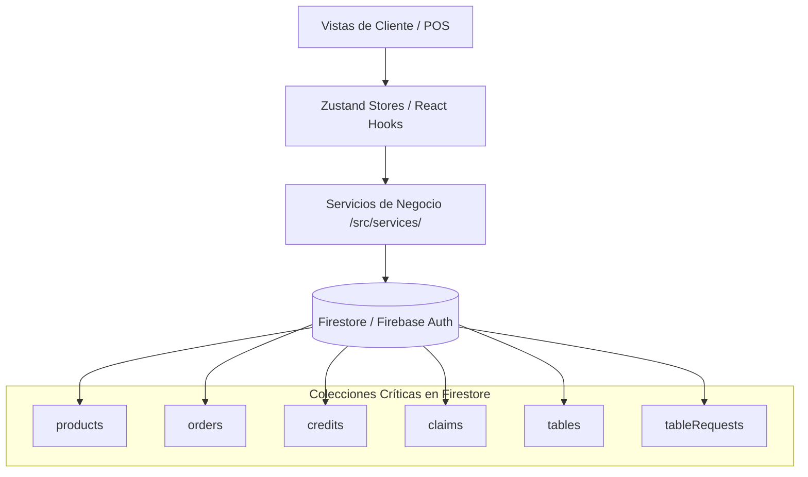

# Mapa de la Aplicación (Fuente de Verdad Arquitectónica)

Este mapa detalla de manera estructurada los módulos, vistas, flujos de datos e integraciones con Firebase de **App Ventas**. Debe mantenerse actualizado ante cualquier creación, eliminación o refactorización de archivos.

---

## 📂 Estructura de Documentación y Negocio
* **`/Documentacion PROTOTIPE/Estrategia de Negocio/estrategia_negocio.md`**: Define el flujo operativo para adaptar la aplicación a clientes a partir de requerimientos de preventa, analizando componentes en la biblioteca o planificando nuevos módulos modularizados.
* **`/Documentacion PROTOTIPE/Estrategia de Negocio/centralizacion_ganancias_desarrollador.md`**: Propuesta de arquitectura técnica y multitenancy para centralizar y unificar las métricas de ganancias y comisiones de múltiples clientes independientes.
* **`/Documentacion PROTOTIPE/Estrategia de Negocio/Plantillas_de_Levantamiento/briefing_cliente.md`**: Cuestionario interactivo de alta precisión para levantar requerimientos del cliente en español mapeado con variables Ecosistema del código.
* **`/Prototipe-CLI/`**: Herramienta de línea de comandos (CLI) interactiva para automatizar el aprovisionamiento, copiado de plantillas, inyección de variables de entorno y bootstrapping de nuevos proyectos del ecosistema en `D:\PROTOTIPE\Instancias Clientes\` mediante spinners interactivos `ora`.
  * **`config.js`**: Módulo de configuración central que unifica la resolución de rutas de trabajo y del sistema, permitiendo la portabilidad mediante variables de entorno (`PROTOTIPE_WORKSPACE_ROOT`, `PROTOTIPE_DOCS_ROOT`).
  * **`logger.js`**: Logger estructurado que escribe registros formateados en `cli_bridge.log` y con colores en consola.
  * **`worker_create_project.js`**: Proceso hijo (worker) para la creación de proyectos asíncrona, liberando el Event Loop de Express.
  * **`server.js`**: Servidor local Express que expone la API Bridge con el dev-dashboard, integrando telemetría de tests Playwright, logs en tiempo real, arranque del worker de creación, validación de contraste HSL y endpoints de auditoría y sincronización dinámica de reglas de base de datos (`/api/project/sync-database`).
  * **`generator.js`**: Motor de aprovisionamiento de proyectos que gestiona copias de plantillas, configuración HSL, autogeneración de reglas de Storage/Firestore, copiado y redimensionamiento inteligente de logos con Jimp (para evitar distorsiones y añadir padding seguro del 10% para maskables) y arranque síncrono inmediato del script de mapa de IA.
  * **`sync_templates.js`**: Script de sincronización universal de templates que extrae tokens de configuración del `.env.local` y realiza sanitización dinámica recursiva.
  * **`sync_clients.js`**: Script de sincronización selectiva downstream para propagar de forma segura parches del core hacia las instancias de clientes, incorporando un menú de selección interactivo (Aplicar/Simular Diffs/Omitir) y Dry Run con previsualización coloreada de diferencias de código.
* **`/Prototipe-CLI/templates/template-ventas/scratch/seed_brand.js`**: Script modular de siembra de base de datos Firestore y Firebase Auth (Seeding) nativo via REST API sin SDKs locales. Lee el archivo `src/config/niche.json` en caliente para determinar qué categorías y productos representativos inyectar según el nicho configurado.
* **`/Prototipe-CLI/templates/template-ventas/playwright.config.js`**: Configuración de Playwright base para la nueva marca generada.
* **`/Prototipe-CLI/templates/template-ventas/tests/`**: Suite de pruebas base End-to-End preinstalada y autoinstanciable para la nueva marca.
* **`/Documentacion PROTOTIPE/Estrategia de Negocio/onboarding_clientes_roadmap.md`**: Pipeline estructurado de despliegue y backlog/agenda de onboarding para nuevos clientes y prospectos de la plataforma.
* **`/Documentacion PROTOTIPE/06_Biblioteca_Componentes/`**: Catálogo central de componentes reutilizables y atómicos.
  * **`Formularios_y_UI/Carrito_Completo/carrito_completo.md`**: Módulo integral de Carrito de Compras (Store reactivo Zustand + CartDrawer visual animado).
  * **`Formularios_y_UI/Checkout_Modal/checkout_modal.md`**: Modal Multipaso Wizard de Checkout y formalización de pedidos para WhatsApp.
  * **`Formularios_y_UI/ProductFormModal_IA/analisis_viabilidad_ia.md`**: Análisis de viabilidad técnica y arquitectura de la integración de Gemini 1.5 Flash para generación de descripciones y títulos comerciales a partir de imágenes.
  * **`Servicios_y_Firebase/Sincronizacion_Firebase/sincronizacion_firebase.md`**: Hook reactivo genérico `useFirestoreCollection` para escuchar Firestore en tiempo real con soporte de caché offline local.
  * **`Formularios_y_UI/Tarjeta_Producto/tarjeta_producto.md`**: Tarjeta visual de producto adaptativa (`ProductCard`) con soporte grid/list y efecto Glow de neón.
  * **`Formularios_y_UI/Rejilla_Catalogo/rejilla_catalogo.md`**: Rejilla responsiva inteligente (`CatalogGrid`) con transiciones fluidas de layouts (grid/list) y Empty State reactivo comercial.
  * **`Formularios_y_UI/Stepper_Pedidos/stepper_pedidos.md`**: Stepper premium responsivo de seguimiento de pedidos (`OrderTrackingTimeline`) con micro-animaciones.
  * **`Formularios_y_UI/Seguimiento_Pedido/seguimiento_pedido.md`**: Portal público de seguimiento del progreso de pedidos (`OrderTracking`) desacoplado de rutas directas.
  * **`Formularios_y_UI/Gestor_Categorias/gestor_categorias.md`**: UI stateless para administrar, crear, editar y eliminar categorías con buscador e íconos SVG integrados.
  * **`Visualizacion/Alertas_Stock_Critico/admin_stock_alerts.md`**: Panel de reabastecimiento e inventario crítico (`AdminStockAlerts`) with aplanamiento de variantes.
  * **`Servicios_y_Firebase/Generacion_PDF/generacion_pdf.md`**: Motor dinámico y de marca blanca para exportar y descargar reportes PDF.
  * **`Monetizacion_Desarrollador/Facturacion_Comisional/facturacion_comisional.md`**: Panel de facturación del desarrollador con cálculo comisional multi-modo y firma táctil en canvas.
* **`/Documentacion PROTOTIPE/09_Modulos_Completos/`**: Catálogo de Módulos Completos (Ecosistema Features).
  * **`Caja_Diaria_POS/caja_diaria_pos.md`**: Apertura de caja, transacciones de flujo auxiliar, arqueo físico vs esperado HSL y lienzo interactivo para firmas.
  * **`Creditos_y_Saldos/creditos_y_saldos.md`**: Lógica de créditos, cuentas por cobrar, abonos y estado de cuentas de clientes.
  * **`Omnicanalidad_WhatsApp/omnicanalidad_whatsapp.md`**: Módulo de redirecciones y plantillas dinámicas de WhatsApp.
  * **`Telemetria_Centralizada/telemetria_centralizada.md`**: Monitoreo y subida de telemetría de facturación y logs a Firestore.
  * **`Pantalla_Cocina_KDS/pantalla_cocina_kds.md`**: Sistema de pantalla interactiva en vivo para control de comandas en cocina ordenadas por prioridad de tiempo.
  * **`Reservas_Agenda_Citas/reservas_agenda_citas.md`**: Agenda interactiva semanal y cuadrícula de horarios asignables para servicios y reservas profesionales.
  * **`POS_Express_Scanner/pos_express_scanner.md`**: Módulo de checkout veloz en caja que interpreta eventos de lectores de códigos de barra físicos.
  * **`Ordenes_Trabajo_Equipos/ordenes_trabajo_equipos.md`**: Ficha de control de recepción de maquinaria y equipos para diagnóstico, repuestos y firma digital.
* **`/Documentacion PROTOTIPE/Manuales/`**: Carpeta jerárquica de manuales técnicos de desarrollo de Rápido Entendimiento para el programador.
  * **`README.md`**: Consola de Control Visual indexando y clasificando manuales por complejidad, tecnologías e impacto.
  * **`Arquitectura_Multi_Instancia/Configuracion_Marca/manual_brand_config.md`**: Guía técnica de personalización, HSL dinámico y script de siembra.
  * **`Arquitectura_Multi_Instancia/Configuracion_Marca/manual_centralizacion_comisiones.md`**: Guía técnica de implementación de telemetría y consolidación HTTP de comisiones en servidor central.
  * **`Arquitectura_Multi_Instancia/Configuracion_Marca/manual_nichos_servicios.md`**: Manual de Verticales de Servicios y Operaciones Técnicas a la Medida, detallando modelado de atributos, workflows y lógica de 8 industrias de servicios técnicos y talleres.
  * **`Paginas/Seguimiento_Pedido/manual_order_tracking.md`**: Guía de seguridad de tokens UUID y reglas compuestas de Firestore.
  * **`Visualizacion/Alertas_Stock/manual_admin_stock_alerts.md`**: Guía del algoritmo de stock crítico y transacciones concurrentes de inventario.
  * **`Servicios_y_Firebase/Generacion_PDF/manual_generacion_pdf.md`**: Guía técnica del procesamiento vectorial A4 y plugin de AutoTable.
  * **`Servicios_y_Firebase/Omnicanalidad_WhatsApp/manual_whatsapp_notifications.md`**: Guía técnica del parseo dinámico de templates de chat y APIs libres de cobro.
  * **`Servicios_y_Firebase/Creditos_y_Saldos/manual_credits_and_balances.md`**: Guía técnica de la mitigación de race conditions en cajas multi-vendedor con transacciones.
  * **`Arquitectura_Multi_Instancia/Mapas_IA/manual_ia_maps.md`**: Guía técnica de generación, personalización con parámetros y uso del mapa semántico de arquitectura para onboarding acelerado de IAs.
  * **`Paginas/Compra_por_QR/manual_compra_qr.md`**: Guía técnica del flujo de redirección por URL parametrizada, inicio de sesión express e integración de códigos QR en el catálogo.

* **`/Documentacion PROTOTIPE/Estandar de Desarrollo/`**: Guías técnicas, reglas de diseño y arquitectura.
  * **`inicializacion_nuevos_proyectos.md`**: Protocolo obligatorio y checklist paso a paso de bootstrap para nuevos proyectos de software (seeding, mapeo de IA y biblioteca).
  * **`guia_facturacion_dian_comisiones.md`**: Estándar técnico para la implementación y control de facturación electrónica DIAN y comisiones comisionales sobre base imponible.
  * **`mapa_documentacion_ia.md`**: Mapa semántico global de la documentación. GPS principal de la IA para localizar instantáneamente cualquier manual, componente, bitácora o estándar.
  * **`Copia_Seguridad_Reglas_y_Skills/`**: Directorio de resguardo de las reglas de comportamiento globales de la IA (`GEMINI.md`) y las habilidades o skills de automatización (`Skills/`).
    * **`Skills/sandbox_integrator/SKILL.md`**: Skill para registrar e integrar dinámicamente playgrounds de componentes manuales en el dashboard (`@sandbox`).
    * **`Skills/portar_componente/SKILL.md`**: Skill para portar, adaptar e inyectar automáticamente código de componentes a proyectos del disco (`@portar-componente`).
  * **`Copia_Seguridad_Reglas_y_Skills/sync_rules.js`**: Script de sincronización dinámica de reglas de IA para clonar de forma proactiva y automática el archivo GEMINI.md a todos los subproyectos y plantillas del CLI.
* **`/Documentacion PROTOTIPE/Tareas Pendientes/`**: Bitácora y estado del roadmap del proyecto.
  * **`tareas_pendientes.md`**: Lista general de tareas completadas, en progreso e hitos de desarrollo técnico.
  * **`tareas_pendientes_prioritarias.md`**: Backlog prioritario de desarrollo e infraestructura futura (como la centralización de comisiones) que se ejecutará bajo tu consentimiento.
<!-- START_AUTO_CORES_APP -->
### 📂 Carpeta del Core de App Agendamiento
* **`/Plantillas Core/App Agendamiento/Documentacion App Agendamiento/tareas_pendientes.md`**: Control de Tareas y Estado de Implementación.
* **`/Plantillas Core/App Agendamiento/Documentacion App Agendamiento/bitacora_cambios.md`**: Bitácora de Cambios y Control de Versiones.
* **`/Plantillas Core/App Agendamiento/Documentacion App Agendamiento/mapa_aplicacion.md`**: Mapa de la Aplicación (Arquitectura Física).
* **`/Plantillas Core/App Agendamiento/Documentacion App Agendamiento/esquema_colecciones.md`**: Esquema y Propósito de Colecciones de Base de Datos (Firestore).
* **`/Plantillas Core/App Agendamiento/Documentacion App Agendamiento/plan_implementacion_ia.md`**: Plan de Implementación y Roadmaps de Inteligencia Artificial.
* **`/Plantillas Core/App Agendamiento/Documentacion App Agendamiento/manual_migracion.md`**: Manual de Despliegue y Configuraciones Locales.
* **`/Plantillas Core/App Agendamiento/Documentacion App Agendamiento/flujos_aplicacion.md`**: Flujos Operativos y Diagramas de Secuencia.
* **`/Plantillas Core/App Agendamiento/Documentacion App Agendamiento/mapa_arquitectura.md`**: Mapa de Arquitectura Física y Árbol de Código.
* **`/Plantillas Core/App Agendamiento/Documentacion App Agendamiento/mapa_arquitectura_ia.md`**: Mapa Semántico de Rutas para Inteligencia Artificial.
* **`/Plantillas Core/App Agendamiento/Documentacion App Agendamiento/contexto_negocio.md`**: Contexto de Negocio y Reglas Operativas del Dominio.
* **`/Plantillas Core/App Agendamiento/Documentacion App Agendamiento/restricciones_tecnicas.md`**: Restricciones Técnicas y Patrones Prohibidos.
* **`/Plantillas Core/App Agendamiento/Documentacion App Agendamiento/guia_estilos_ui.md`**: Guía de Estilos de UI y Sistema de Diseño del Core.

### 📂 Carpeta del Core de App Gastronomia
* **`/Plantillas Core/App Gastronomia/Documentacion App Gastronomia/tareas_pendientes.md`**: Control de Tareas y Estado de Implementación.
* **`/Plantillas Core/App Gastronomia/Documentacion App Gastronomia/bitacora_cambios.md`**: Bitácora de Cambios y Control de Versiones.
* **`/Plantillas Core/App Gastronomia/Documentacion App Gastronomia/mapa_aplicacion.md`**: Mapa de la Aplicación (Arquitectura Física).
* **`/Plantillas Core/App Gastronomia/Documentacion App Gastronomia/esquema_colecciones.md`**: Esquema y Propósito de Colecciones de Base de Datos (Firestore).
* **`/Plantillas Core/App Gastronomia/Documentacion App Gastronomia/plan_implementacion_ia.md`**: Plan de Implementación y Roadmaps de Inteligencia Artificial.
* **`/Plantillas Core/App Gastronomia/Documentacion App Gastronomia/manual_migracion.md`**: Manual de Despliegue y Configuraciones Locales.
* **`/Plantillas Core/App Gastronomia/Documentacion App Gastronomia/flujos_aplicacion.md`**: Flujos Operativos y Diagramas de Secuencia.
* **`/Plantillas Core/App Gastronomia/Documentacion App Gastronomia/mapa_arquitectura.md`**: Mapa de Arquitectura Física y Árbol de Código.
* **`/Plantillas Core/App Gastronomia/Documentacion App Gastronomia/mapa_arquitectura_ia.md`**: Mapa Semántico de Rutas para Inteligencia Artificial.
* **`/Plantillas Core/App Gastronomia/Documentacion App Gastronomia/contexto_negocio.md`**: Contexto de Negocio y Reglas Operativas del Dominio.
* **`/Plantillas Core/App Gastronomia/Documentacion App Gastronomia/restricciones_tecnicas.md`**: Restricciones Técnicas y Patrones Prohibidos.
* **`/Plantillas Core/App Gastronomia/Documentacion App Gastronomia/guia_estilos_ui.md`**: Guía de Estilos de UI y Sistema de Diseño del Core.

### 📂 Carpeta del Core de App Servicios
* **`/Plantillas Core/App Servicios/Documentacion App Servicios/tareas_pendientes.md`**: Control de Tareas y Estado de Implementación.
* **`/Plantillas Core/App Servicios/Documentacion App Servicios/bitacora_cambios.md`**: Bitácora de Cambios y Control de Versiones.
* **`/Plantillas Core/App Servicios/Documentacion App Servicios/mapa_aplicacion.md`**: Mapa de la Aplicación (Arquitectura Física).
* **`/Plantillas Core/App Servicios/Documentacion App Servicios/esquema_colecciones.md`**: Esquema y Propósito de Colecciones de Base de Datos (Firestore).
* **`/Plantillas Core/App Servicios/Documentacion App Servicios/plan_implementacion_ia.md`**: Plan de Implementación y Roadmaps de Inteligencia Artificial.
* **`/Plantillas Core/App Servicios/Documentacion App Servicios/manual_migracion.md`**: Manual de Despliegue y Configuraciones Locales.
* **`/Plantillas Core/App Servicios/Documentacion App Servicios/flujos_aplicacion.md`**: Flujos Operativos y Diagramas de Secuencia.
* **`/Plantillas Core/App Servicios/Documentacion App Servicios/mapa_arquitectura.md`**: Mapa de Arquitectura Física y Árbol de Código.
* **`/Plantillas Core/App Servicios/Documentacion App Servicios/mapa_arquitectura_ia.md`**: Mapa Semántico de Rutas para Inteligencia Artificial.
* **`/Plantillas Core/App Servicios/Documentacion App Servicios/contexto_negocio.md`**: Contexto de Negocio y Reglas Operativas del Dominio.
* **`/Plantillas Core/App Servicios/Documentacion App Servicios/restricciones_tecnicas.md`**: Restricciones Técnicas y Patrones Prohibidos.
* **`/Plantillas Core/App Servicios/Documentacion App Servicios/guia_estilos_ui.md`**: Guía de Estilos de UI y Sistema de Diseño del Core.

### 📂 Carpeta del Core de App Ventas
* **`/Plantillas Core/App Ventas/Documentacion App Ventas/tareas_pendientes.md`**: Control de Tareas y Estado de Implementación.
* **`/Plantillas Core/App Ventas/Documentacion App Ventas/bitacora_cambios.md`**: Bitácora de Cambios y Control de Versiones.
* **`/Plantillas Core/App Ventas/Documentacion App Ventas/mapa_aplicacion.md`**: Mapa de la Aplicación (Arquitectura Física).
* **`/Plantillas Core/App Ventas/Documentacion App Ventas/esquema_colecciones.md`**: Esquema y Propósito de Colecciones de Base de Datos (Firestore).
* **`/Plantillas Core/App Ventas/Documentacion App Ventas/plan_implementacion_ia.md`**: Plan de Implementación y Roadmaps de Inteligencia Artificial.
* **`/Plantillas Core/App Ventas/Documentacion App Ventas/manual_migracion.md`**: Manual de Despliegue y Configuraciones Locales.
* **`/Plantillas Core/App Ventas/Documentacion App Ventas/flujos_aplicacion.md`**: Flujos Operativos y Diagramas de Secuencia.
* **`/Plantillas Core/App Ventas/Documentacion App Ventas/mapa_arquitectura.md`**: Mapa de Arquitectura Física y Árbol de Código.
* **`/Plantillas Core/App Ventas/Documentacion App Ventas/mapa_arquitectura_ia.md`**: Mapa Semántico de Rutas para Inteligencia Artificial.
* **`/Plantillas Core/App Ventas/Documentacion App Ventas/contexto_negocio.md`**: Contexto de Negocio y Reglas Operativas del Dominio.
* **`/Plantillas Core/App Ventas/Documentacion App Ventas/restricciones_tecnicas.md`**: Restricciones Técnicas y Patrones Prohibidos.
* **`/Plantillas Core/App Ventas/Documentacion App Ventas/guia_estilos_ui.md`**: Guía de Estilos de UI y Sistema de Diseño del Core.

<!-- END_AUTO_CORES_APP -->

---

## 📂 Estructura de Módulos y Archivos Clave

### 👥 Módulo Cliente (Tienda PWA)
* **`/src/layouts/ClientLayout.jsx`**: Layout raíz del flujo del cliente. Gestiona la barra de navegación, el banner dinámico de anuncios, el carrito lateral y el modal de cupones.
* **`/src/components/client/cart/CartDrawer.jsx`**: Cajón lateral del carrito de compras del cliente. Muestra el resumen de productos agregados, selector interactivo de cantidades, totales y botón de checkout. Integra el sistema de recomendaciones comerciales ("Recomendados para ti") con caché de ciclo de apertura para evitar consultas repetitivas de red.
* **`/src/pages/client/CatalogPage.jsx`**: Catálogo de productos. Integra el filtrado avanzado a través de `appConfigStore` y la barra de búsqueda en tiempo real.
* **`/src/components/client/catalog/ProductDetailModal.jsx`**: Detalle ampliado del producto seleccionado, opciones de color, talla y agregado al carrito (Usa [ModalTemplate](file:///d:/Aplicaciones/App%20Ventas/src/components/common/ModalTemplate.jsx)).
* **`/src/components/client/checkout/CheckoutModal.jsx`**: Proceso de compra tipo "wizard". Integra de manera anidada `ClientCouponsModal` para permitir la aplicación rápida y automatizada de códigos de descuento en el paso de método de pago, y un selector interactivo de mesas disponibles en tiempo real para clientes no sentados que eligen la opción "Pedido en Mesa" (Usa [ModalTemplate](file:///d:/Aplicaciones/App%20Ventas/src/components/common/ModalTemplate.jsx)).
* **`/src/components/client/claims/ClaimRequestModal.jsx`**: Formulario de reclamación de garantías por pedido (Usa [ModalTemplate](file:///d:/Aplicaciones/App%20Ventas/src/components/common/ModalTemplate.jsx)).
* **`/src/components/client/coupons/ClientCouponsModal.jsx`**: Listado de cupones y ofertas flash activos con diseño de ticket prémium que implementa dientes de sierra SVG y línea de perforación punteada (Usa [ModalTemplate](file:///d:/Aplicaciones/App%20Ventas/src/components/common/ModalTemplate.jsx)).
* **`/src/pages/client/ProductDetailPage.jsx`**: Página de vista detallada del producto para clientes de la tienda virtual. Integrada como ruta hija en `/tienda/producto/:id` para renderizar con barra lateral (Sidebar) en versión de escritorio y autoconstreñir las imágenes. En versión móvil, se ocultan el navbar superior y barra inferior de navegación para una visualización fluida a pantalla completa.
* **`/src/pages/client/ProductPublicDetail.jsx`**: Portal Público de Compra. Experiencia especializada y optimizada para conversión de clientes que escanean códigos QR físicos de productos. Soportada de manera responsiva y sin login.
* **`/src/components/client/table/TableMenuBar.jsx`**: Barra flotante premium de autoservicio QR para clientes sentados en la mesa activa, permitiendo llamar al mesero o pedir la cuenta en tiempo real.

### 💼 Módulo Administración (POS / Dashboard / Control)
* **`/src/layouts/AdminLayout.jsx`**: Navegación interna y control de sesión de administradores y vendedores. Incorpora el diseño interactivo de barra lateral colapsable, menú hamburguesa alineado y transición de logotipo/título en escritorio. **[Modo Offline]**: Restringe la navegación únicamente al POS ("Venta") y fuerza una redirección automática hacia el POS si la conexión se cae estando en otra pestaña.
* **`/src/layouts/PortalLayout.jsx`**: Layout raíz del portal del vendedor y empleados. Gestiona la sesión del empleado, la campana de notificaciones y muestra un indicador de red dinámico que cambia a "Modo Offline" elástico en ámbar al perder la conexión.
* **`/src/pages/admin/AdminDashboard.jsx`**: Métricas de ventas, abonos e inventario bajo stock.
* **`/src/pages/admin/InventoryPage.jsx`**: Panel de control de productos, stock, tallas, imágenes y categorías.
* **`/src/pages/admin/AdminOrders.jsx`**: Panel de Gestión de Pedidos del administrador. Gestiona el flujo de estados de pedidos (Pendiente, Completado, Cancelado, Crédito Aprobado), visualización interactiva de mapas de Leaflet (desplegables), asignación de mensajeros, generación de facturas PDF, y consulta del modal interactivo de Historial de Pedidos.
* **`/src/pages/KitchenPanel.jsx`**: Panel de control de preparación (Cocina/Bodega) con soporte táctil de alertas de nuevos pedidos, seguridad por PIN e indicador de pedidos preparados hoy.
* **`/src/pages/EmployeePortal.jsx`**: Interfaz de ingreso y selección de perfiles para empleados con keypad táctil de PIN, lobby de bienvenida con visualización de pago programado (salario, frecuencia y fecha) e indicadores de rendimiento diario, y redirección por roles.
* **`/src/pages/DeliveryPanel.jsx`**: Espacio de trabajo (Panel de Domicilios) para los domiciliarios autenticados con PIN, con control de entregas, estadísticas diarias y geolocalización integrada.
* **`/src/pages/admin/AdminPortalQR.jsx`**: Módulo administrativo de 3 pestañas para generar códigos QR de acceso, monitorear sesiones activas en tiempo real y consultar el historial logeado de accesos por turnos.
* **`/src/components/admin/inventory/ProductFormModal.jsx`**: Modal de creación/edición de productos asistido por IA. Permite la carga directa de imágenes a Storage mediante `uploadService` (portada, galería secundaria y variantes). El grid de variantes cuenta con rediseño simétrico a 2 columnas (SKU y Foto de variante) tras ser purgada la opción redundante de "Precio Propio" (Usa [ModalTemplate](file:///d:/Aplicaciones/App%20Ventas/src/components/common/ModalTemplate.jsx)).
* **`/src/components/admin/settings/CatalogFiltersCreator.jsx`**: Configurador administrativo de dimensiones del catálogo (categorías, tallas, colores) y gestor de atributos dinámicos personalizados.
* **`/src/components/admin/settings/DeveloperDiagnosticsModal.jsx`**: Modal de diagnóstico técnico para desarrolladores. Provee pestañas para ver variables de entorno, realizar pings de conectividad a Firebase Local y Central, y probar llaves de notificaciones VAPID y notificaciones push.
* **`/src/pages/admin/AdminSettings.jsx`**: Panel de Ajustes y Configuración del Administrador. Rediseñado como un controlador y despachador de pestañas ligero y desacoplado que importa secciones modulares.
* **`/src/pages/admin/settings/components/MobilePreview.jsx`**: Componente visual interactivo para simular la vista previa de la tienda PWA del cliente en tiempo real.
* **`/src/pages/admin/settings/sections/BrandSettings.jsx`**: Sub-panel de gestión de identidad de marca (logo, colores, PWA, redes sociales).
* **`/src/pages/admin/settings/sections/EmployeeSettings.jsx`**: Sub-panel de personal para control de PINs, generación de códigos QR de accesos y nóminas de empleados.
* **`/src/pages/admin/settings/sections/StoreSettings.jsx`**: Sub-panel de opciones operativas, que agrupa métodos de envío, módulos activos (crédito, cupones, mayorista, temporadas), plantilla de mensajes y facturación electrónica DIAN.
* **`/src/pages/admin/settings/sections/PaymentSettings.jsx`**: Sub-panel de cuentas bancarias y métodos de cobro autorizados en checkout.
* **`/src/pages/admin/settings/sections/SecuritySettings.jsx`**: Sub-panel de seguridad para actualizar correo y clave del administrador principal.
* **`/src/pages/admin/settings/sections/DeveloperSettings.jsx`**: Zona protegida del desarrollador mediante PIN maestro (`DEV_PIN`), agrupando facturación comisional, firma táctil, visor de telemetría y reset de datos.
* **`/dev-dashboard/`** [STANDALONE]: Consola Central del Desarrollador (Proyecto web independiente aislado). Interfaz interactiva privada conectada de forma híbrida al Firestore Central para ver comisiones acumuladas, ingresos y estado de pagos de clientes.
  * **Navegación Multi-Tab y Responsividad**: Sidebar fijo en desktop y barra de navegación inferior fija (`bottom-nav`) en móviles con 6 pestañas activas (Inicio, Cobros, Biblioteca, Nuevo, Monitoreo, Cores) y Safe Area (`pb-safe`) soportada. CRM es accesible exclusivamente mediante la tarjeta de "Clientes Activos" en Inicio, y Ajustes se despliega desde el modal de Perfil.
  * **Historial de Aprovisionamientos Responsivo**: En la pestaña "Nuevo Cliente" (onboarding), el listado de aprovisionamientos previos cuenta con un diseño adaptativo que oculta la tabla clásica (`hidden md:table`) en dispositivos móviles y renderiza tarjetas detalladas optimizadas para pantallas táctiles (`md:hidden`) junto con un paginador fluído integrado.
  * **Integración de Recharts**: Visualización interactiva premium de comisiones acumuladas (BarChart), tendencias de crecimiento (LineChart), volumen de ventas (AreaChart) y donuts de estado de cobro en CRM (PieChart).
  * **Transiciones Fluidas**: Animaciones fluidas al cambiar entre vistas y despliegue de drawers usando Framer Motion.
  * **Portal del Cliente CRM**: Split-view para computadores y pantalla completa para móviles, permitiendo editar configuraciones del cliente (modo de cobro, DIAN billing y tokens) y simular envíos de telemetría o generar recibos de cobro.
  * **consola de logs y diagnósticos**: Terminal integrada para monitorizar logs y canales de Firestore en tiempo real con botones adaptativos en modo claro/oscuro.
    * **`src/hooks/useCopyToClipboard.js`**: Hook de copiado rápido al portapapeles.
    * **`src/hooks/useToast.js`**: Hook de control de notificaciones flotantes toast.
    * **`src/components/ui/GuidedToast.jsx`**: Banner de notificación toast interactiva premium adaptada.
    * **`src/components/common/AlertConfirmContext.jsx`**: Proveedor de diálogos de alertas y confirmaciones síncronas promesificadas.
    * **`src/services/pdfService.js`**: Servicio de exportación de recibos de comisión en formato PDF.
    * **`src/components/admin/ComponentSandbox.jsx`**: Playground de previsualización interactiva con simulación de estados en vivo para 12 playgrounds interactivos (stepper, paginación, tarjetas, loaders, toggles, etc.) y panel vacío inteligente.
    * **`src/components/admin/ComponentLibraryView.jsx`**: Vista de catálogo de la biblioteca a doble columna conectada al Daemon CLI, con buscador inteligente por Levenshtein, contador dinámico, copia de código por sección, botón global "Copiar todo el código" y categorías colapsables premium tipo acordeón animadas con Framer Motion.
    * **`src/components/admin/E2EPanel.jsx`**: Panel modular para lanzar y monitorear la suite de pruebas End-to-End (E2E) con Playwright de forma visual e interactiva por cliente, transmitiendo logs mediante SSE.
    * **`src/components/admin/CoreManagerPanel.jsx`**: Panel de control visual del desarrollador para registrar nuevos cores, clonar plantillas de referencia (scaffold), sincronizar código de desarrollo a CLI templates y activar/desactivar cores de forma visual con logs de consola interactivos en tiempo real.
* **`/src/pages/admin/AdminSales.jsx`**: POS Inteligente de Ventas Directas de Mostrador (con soporte para catálogo de productos y productos personalizados) e indicador en tiempo real de ventas diarias del vendedor activo.
* **`/src/pages/admin/AdminSalesDetail.jsx`**: Panel de Análisis de Ventas de Administrador. Muestra el rendimiento del mes y productos/empleados más vendidos. Integra el cálculo de la **Caja Neta Real (Ganancia Neta)** deduciendo los pagos fijos del periodo del total bruto comercial.
* **`/src/pages/admin/AdminQRPerformance.jsx`**: Panel de Rendimiento y Analítica de códigos QR. Permite monitorear escaneos, carritos abandonados y conversiones en tiempo real.
* **`/src/components/admin/orders/OrderShareModal.jsx`**: Modal interactivo premium de compartición de seguimiento de pedidos (QR, enlace de seguimiento y WhatsApp).
* **`/src/components/admin/settings/AppResetTool.jsx`**: Utilidad administrativa destructiva de alta seguridad para restaurar bases de datos comerciales a cero conservando la cuenta admin actual.

### ⚙️ Componentes Comunes e Infraestructura
* **`/src/components/ui/feedback/ErrorBoundaryFallback.jsx`**: Componente de recuperación ante fallas críticas en tiempo de ejecución (React Error Boundary) con soporte colapsable para visualización de detalles técnicos in-situ y reporte automático a telemetría centralizada.
* **`/src/components/ui/DatePicker.jsx`**: Componente selector de fecha premium que renderiza el calendario en un portal centered modal con backdrop oscuro translúcido.
* **`/src/components/ui/CustomSelect.jsx`**: Selector personalizado reutilizable que soporta placeholder, animaciones, portabilidad, e interactividad adaptativa de despliegue hacia arriba (`dropUp`) para evitar clippings en modales o pantallas reducidas.
* **`/src/components/ui/CategoryManager.jsx`**: Componente de interfaz puro, stateless y portátil para gestionar categorías con íconos vectoriales.
* **`/src/components/admin/inventory/CategoryManager.jsx`**: Wrapper contenedor de estado que conecta el componente de UI con los hooks del inventario de Firebase.
* **`/src/components/common/ModalTemplate.jsx`**: Componente maestro unificado que provee overlays, portal, animaciones estandarizadas (Framer Motion) e inactivación de scroll.
* **`/src/components/common/AlertConfirmContext.jsx`**: Contexto y hook global (`useAlertConfirm`) que unifica y reemplaza los alerts/confirms nativos con modales HSL premium.
* **`/src/components/common/ScrollToTop.jsx`**: Componente utilitario que restablece la posición del scroll de la ventana al tope superior ante transiciones de ruta.
* **`/playwright.config.js`**: Configuración centralizada de Playwright para lanzar servidores Vite locales, grabaciones, capturas de pantalla automáticas ante fallos y suites headless.
* **`/tests/checkout.spec.js`**: Pruebas End-to-End (E2E) con Playwright. Automatiza y valida de forma robusta el flujo crítico de compra completo (Splash bienvenida -> Login cliente -> Catálogo -> Detalle producto -> Checkout directo -> Confirmación).

* **`/src/components/ui/BackButton.jsx`**: Componente atómico para botones estandarizados de navegación "atrás".
* **`/src/components/ui/QuantitySelector.jsx`**: Componente atómico de incremento y decremento de cantidades con control de límites.
* **`/src/components/ui/LeafletMapPicker.jsx`**: Selector y visualizador de mapas interactivo e independiente basado en Leaflet y OpenStreetMap (Nominatim).
* **`/src/services/alertService.js`**: Singleton imperativo de alertas y confirmaciones. Permite disparar los modales premium del sistema (`showAlert`, `showConfirm`) desde fuera del árbol React — hooks puros, class components y servicios JS. Registrado por `AlertConfirmProvider` al montar vía `useEffect`.
* **`/src/services/whatsappService.js`**: Utilidad unificada para formatear números y redireccionar a chats de WhatsApp.
* **`/src/services/centralFirebaseService.js`**: Singleton unificado para inicializar de forma segura y perezosa la aplicación secundaria de control central (`centralDevApp`) sin colisiones de Hot Reload.
* **`/src/services/billingService.js`**: Lógica de cálculo, acumulación y desglose de comisiones mensuales e históricas multi-modo (porcentaje, valor fijo por servicio, pago mensual fijo).
* **`/src/services/telemetryService.js`**: Servicio de reporte y transmisión de telemetría de facturación mensual consolidada hacia el panel central (híbrido HTTP/Firestore).
* **`/src/services/pdfService.js`**: Utilidad centralizada para exportación y descarga de reportes y recibos PDF financieros y de inventario.
* **`/src/services/accessLogService.js`**: Servicio atómico para registrar logs de accesos (inicio/cierre) de empleados, acumular estadísticas de actividad diaria y gestionar snapshots en tiempo real de sesiones de trabajo.
* **`/src/services/uploadService.js`**: Servicio de abstracción para la subida de archivos (imágenes de producto, variantes, logos) y eliminación de Storage.
* **`/src/services/qrAnalyticsService.js`**: Servicio de telemetría y analítica para registrar escaneos, vistas y conversiones provenientes de códigos QR de venta física.
* **`/src/services/trackingAnalyticsService.js`**: Servicio de telemetría para registrar interacciones (scans, clicks a tienda, descargas) en el portal público de seguimiento de pedidos.
* **`/src/hooks/useCopyToClipboard.js`**: Custom hook reutilizable para gestionar el copiado de textos al portapapeles con reset automático de estado.
* **`/src/hooks/useBilling.js`**: Custom hook de suscripción a métricas de facturación y actualización de tasas de comisión en tiempo real.
* **`/src/store/connectivityStore.js`**: Store Zustand reactivo para controlar y rastrear el estado de red online/offline de forma global.
* **`/src/services/offlineDB.js`**: Base de datos IndexedDB local para almacenar productos, categorías y cola de ventas pendientes offline.
* **`/src/config/firebaseConfig.js`**: Inicialización de servicios oficiales de Firebase (Firestore, Auth, Storage).
* **`/src/config/niche.json`**: Metadatos dinámicos por nicho. Configura de forma dinámica la visibilidad de colores/tallas de calzado e inyecta atributos específicos de la industria (tolerancia, PSI, etc.).
* **`/src/constants/palettes.js`**: Catálogos de paletas avanzadas, eventos estacionales de temporada y lógica de cálculo de colores HSL.
* **`/src/constants.js`**: Catálogos, nombres de colecciones y constantes del negocio.

---

## 🔄 Flujos de Datos e Integración de Firebase

---

## 🛠️ Reglas de Conectividad con la Base de Datos

* **Escritura en `products`**: Requiere rol administrativo y sesión iniciada (`request.auth != null`).
* **Escritura en `orders`**: Permitida para clientes públicos. Descuenta stock atómicamente al instante mediante transacciones (`runTransaction`).
* **Créditos (`credits`)**: Cuando un pedido pasa a estado `credito_aprobado`, el backend atómico descuenta el stock y genera de forma automática la cuenta de cobro correspondiente en la colección de créditos.
