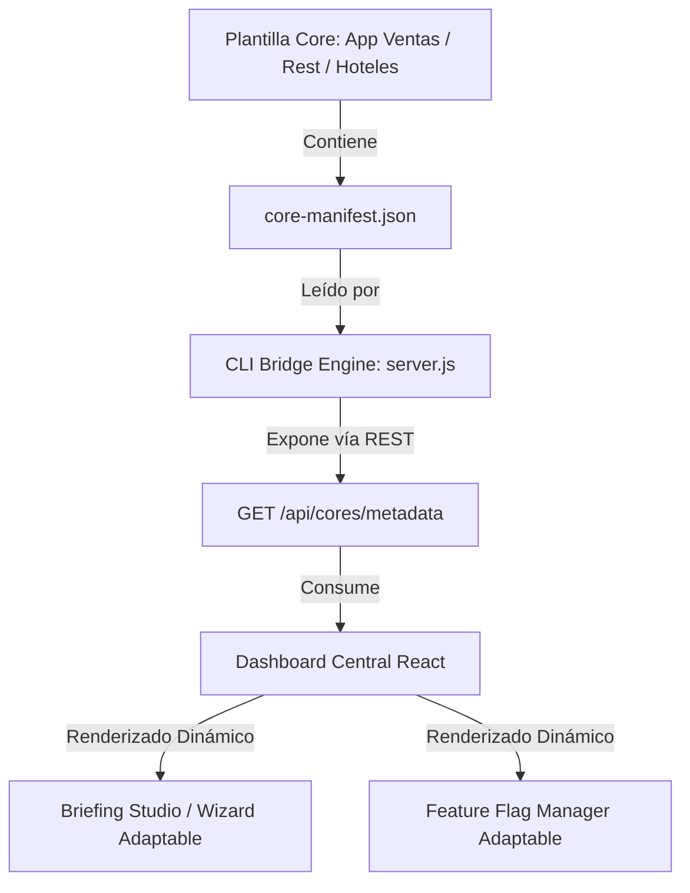

# Propuesta Técnica: Arquitectura Dinámica Multi-Core basada en Metadatos (Briefing & Flags)

Esta propuesta detalla el diseño de desacoplamiento para evitar el acoplamiento rígido con el **Core Ventas** en el Dashboard Central, permitiendo que tanto el **Briefing Studio** (Wizard de levantamiento) como el **Feature Flag Manager** (Gestión de módulos) se auto-configuren dinámicamente según el tipo de aplicación que se esté aprovisionando.

---

## 1. Causa Raíz del Acoplamiento Actual

Actualmente, el listado de preguntas del Wizard, el mapeo de componentes y las Feature Flags (Créditos, Cupones, Mayoreo, Domicilios, DIAN) están definidos de forma estática en el frontend (`BriefingStudioView.jsx` y `FeatureFlagManager.jsx`). Al agregar un nuevo Core (ej: `Core Restaurantes`, `Core Clínicas` o `Core Hoteles`):
1. El analista verá preguntas irrelevantes en el Wizard de descubrimiento.
2. El gestor de banderas mostrará switches incoherentes para el modelo de negocio del nuevo cliente.
3. Se generará redundancia y spaghetti code si intentamos meter condicionales manuales (`if (core === 'ventas') ... else if ...`).

---

## 2. Solución Propuesta: Arquitectura Guiada por Metadatos (Metadata-Driven)

La solución consiste en delegar la estructura del Wizard y las banderas al propio Core, utilizando un manifiesto de configuración estándar `core-manifest.json` dentro de cada plantilla de Core.



### A. Especificación del Manifiesto (`core-manifest.json`)
Cada Core del ecosistema en `Plantillas Core/[NombreCore]/` debe registrar un archivo que describa su modelo de datos de descubrimiento y configuración:

```json
{
  "coreName": "App Ventas",
  "coreKey": "ventas",
  "version": "1.0.0",
  "description": "Plantilla estándar de POS, inventarios, créditos y domicilios.",
  
  "featureFlags": [
    {
      "id": "creditsEnabled",
      "label": "Créditos y Fiado",
      "description": "Permite a los clientes fiar y abonar deudas mediante un timeline interactivo.",
      "default": false
    },
    {
      "id": "couponsEnabled",
      "label": "Cupones de Descuento",
      "description": "Sistema de cupones de descuento con confetti animado y validaciones.",
      "default": false
    }
  ],
  
  "wizardSteps": [
    {
      "step": 1,
      "title": "Información General",
      "description": "Nombre comercial, NIT y datos de localización de la empresa.",
      "fields": [
        { "id": "nombre", "label": "Nombre Comercial", "type": "text", "placeholder": "Ej: Ferretería El Clavo" },
        { "id": "nit", "label": "NIT / Identificación Fiscal", "type": "text", "placeholder": "Ej: 900.123.456-1" }
      ]
    },
    {
      "step": 20,
      "title": "Feature Flags",
      "description": "Activa las capacidades modulares recomendadas para esta instancia.",
      "fields": [
        { "id": "flags", "type": "flags_selector" }
      ]
    }
  ]
}
```

---

## 3. Flujo Operativo y de Datos

### Paso 1: Inicialización en el Bridge Backend (`server.js`)
El servidor Bridge escanea la carpeta `Plantillas Core/` en busca de subcarpetas con un archivo `core-manifest.json`. Al cargarlos, consolida los metadatos y los expone en:
* `GET /api/cores/metadata`

### Paso 2: Selección de Core en el Briefing Studio (Wizard)
* Al abrir la pestaña **Briefing Studio**, el analista selecciona el tipo de negocio en una lista desplegable: *POS y Ventas, Restaurantes y Cocina, Hoteles y Reservas, etc.*
* La selección modifica el estado de la vista React, la cual consume la estructura de `wizardSteps` del Core seleccionado para pintar exactamente las preguntas pertinentes de forma secuencial.

### Paso 3: Renderizado Dinámico del Gestor de Banderas
* La pestaña **Feature Flags** realiza una consulta de los clientes registrados. Cada cliente en Firestore tiene un campo `"coreBase": "ventas"` (o el core que use).
* El componente `FeatureFlagManager.jsx` cruza el `coreBase` del cliente seleccionado con el manifiesto del Core provisto por la API, renderizando dinámicamente en bucle (`.map`) solo las feature flags declaradas en su `core-manifest.json`.

---

## 4. Beneficios del Diseño

1. **Escalabilidad Infinita:** Crear un nuevo Core (ej: *Core Gimnasios*) no requiere tocar ni el código de React del dashboard ni refactorizar endpoints del Bridge. Solo se crea la plantilla del core con su JSON respectivo y el Dashboard se adapta al instante de forma automática.
2. **Normalización de Base de Datos:** Firestore solo almacena llaves-valor planas en el campo `flags`, por lo que el esquema de base de datos se mantiene consistente y ligero.
3. **Consistencia Documental:** Los reportes exportados en Markdown autogeneran las feature flags recomendadas leyendo el manifiesto del core.
