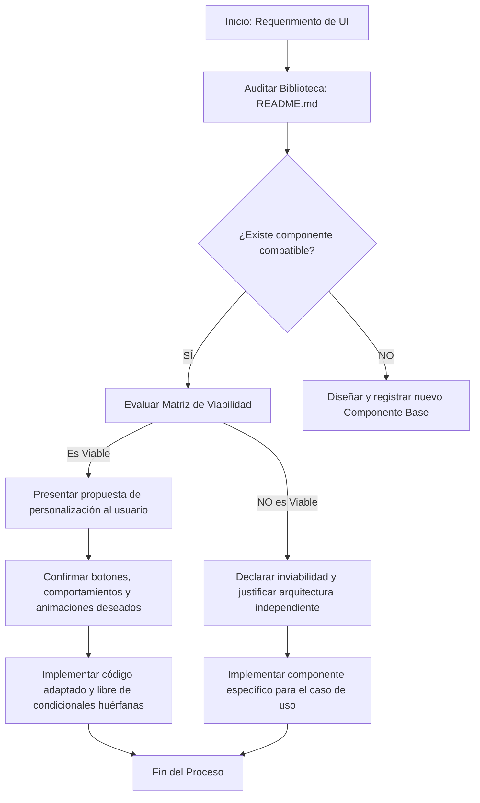

# Guía de Reutilización de Componentes y Viabilidad Arquitectónica

Este documento define la normativa técnica, el flujo de toma de decisiones y las directrices operativas para determinar cuándo es viable reutilizar un componente existente de la biblioteca y cuándo se debe construir uno independiente para proteger la arquitectura.

---

## 1. Matriz de Toma de Decisiones

Antes de escribir código o portar un componente, se debe contrastar el requerimiento contra los siguientes criterios técnicos:

| Criterio | Viable Reutilizar | Crear Componente Independiente |
| :--- | :--- | :--- |
| **Similitud Estructural** | $\ge 70\%$ de coincidencia en estructura visual y eventos de ciclo de vida. | $< 70\%$ de coincidencia o layouts radicalmente distintos. |
| **Complejidad de Props** | Parámetros limpios y flags de configuración sencillos. | Multiplicidad de bifurcaciones condicionales internas ("spaghetti code"). |
| **Acoplamiento** | Componentes de UI puros, desacoplados del estado del negocio. | Dependencia fuerte de stores específicos de un módulo ajeno. |
| **Rendimiento** | Comportamiento óptimo sin re-renders en cascada por lógica externa. | Inyección de listeners o suscripciones pesadas innecesarias. |

---

## 2. Flujo de Trabajo Operativo

El siguiente diagrama detalla la secuencia de pasos que el desarrollador (o agente de IA) debe seguir obligatoriamente para evaluar y ejecutar la integración de componentes:

---

## 3. Protocolo de Comunicación con el Usuario

Al reutilizar un componente, **está estrictamente prohibido programar asunciones a ciegas**. El flujo de comunicación técnica debe seguir esta estructura:

1. **Propuesta Inicial:** Presentar los componentes de la biblioteca que se identificaron como viables.
2. **Opciones de Configuración:** Ofrecer alternativas específicas de botones, animaciones (Framer Motion) y hooks de interacción.
3. **Confirmación y Generación:** Escribir el código adaptado únicamente tras recibir la validación explícita del usuario.
