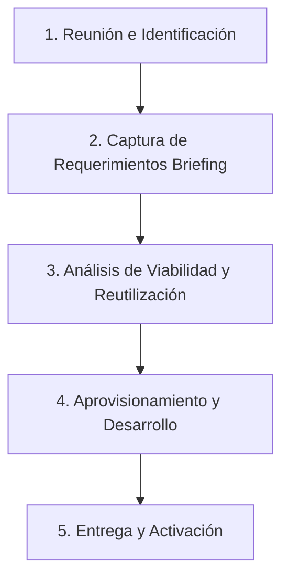

# Estrategia comercial: Levantamiento y Diseño de Soluciones a la Medida

Este documento define el modelo operativo y la estrategia comercial para interactuar con clientes, recopilar requerimientos e integrar funcionalidades de manera modular en las aplicaciones personalizadas. El objetivo principal es estructurar la preventa para maximizar la reutilización del catálogo de componentes y diseñar extensiones lógicas fluidas y alineadas con las necesidades de ventas, inventarios, servicios y fidelización del cliente.

---

## 1. Flujo de Trabajo con Clientes

El proceso de preventa, captura de requerimientos e implementación técnica se divide en cinco etapas estructuradas:



### Paso 1: Reunión Inicial y Diagnóstico
* **Objetivo:** Conocer el modelo de negocio del comerciante o profesional (tienda de barrio, veterinaria, tornería, etc.) e identificar sus cuellos de botella.
* **Propósito:** Presentar cómo una aplicación a la medida optimiza su operación (reducción de errores en inventario, ventas sin fricción, retención de clientes).

### Paso 2: Captura de Requerimientos (Briefing)
* **Objetivo:** Recopilar el funcionamiento actual del negocio del cliente, sus dolores operativos y metas.
* **Foco del Levantamiento:**
  * **Incrementar Ventas:** ¿Vende al por menor, al por mayor, por catálogos digitales o redes sociales? ¿Requiere QR o checkout rápido en WhatsApp?
  * **Gestionar Inventarios/Stock:** ¿Controla productos simples o variantes de tallas/colores? ¿Necesita alertas críticas de stock o control de materias primas?
  * **Gestionar Servicios:** ¿Trabaja por horas, turnos, citas u órdenes de servicio/producción personalizadas (ej. tornerías, talleres)?
  * **Fidelización y Lealtad:** ¿Ofrece fiados (deudas/saldos) o cupones de descuento? ¿Desea recuperar carritos abandonados?

### Paso 3: Análisis de Viabilidad y Mapeo Técnico (Rol de la IA)
* **Objetivo:** Recibir el briefing del cliente, auditar el catálogo actual de componentes en `06_Biblioteca_Componentes` y trazar el camino de menor esfuerzo de implementación.
* **Proceso de Decisión:**
  1. **Reutilización Directa:** Verificar si las necesidades pueden resolverse activando componentes del catálogo de la biblioteca (ej: habilitar el módulo de créditos o el motor de cupones).
  2. **Parametrización/Refactorización:** Evaluar si un componente existente se puede extender con nuevas propiedades (`props`) o callbacks sin perder su genericidad.
  3. **Desarrollo a la Medida (Lienzo Limpio):** Si la funcionalidad es atípica (ej: control de tiempos de mecanizado de piezas de un tornero), se planifica la creación de pantallas y colecciones específicas sobre el `template-core-seed` heredando el auth, PWA, HSL y facturación base.

### Paso 4: Aprovisionamiento y Desarrollo
* **Objetivo:** Configurar la marca y construir las pantallas.
* **Regla Crítica:** Todo desarrollo nuevo debe evitar hardcodeo de strings o lógicas de un cliente específico en el Core. Toda lógica cliente-específica se expone en carpetas de vistas específicas o configuraciones dinámicas cargadas desde la colección Firestore `/config/settings`.

---

## 2. Protocolo de Captura y Estructura de Datos (Briefing)

El reporte de requerimientos recopilado de las reuniones con los clientes se estructurará bajo la siguiente plantilla estándar:

```markdown
### Ficha del Cliente Potencial
* **Nombre de la Empresa / Cliente:**
* **Giro / Rubro / Sector:**
* **Dolores Críticos a Resolver:** [Ej. Fugas en inventario, pérdida de clientes, control de citas]

### Requerimientos Operativos
1. **Flujo de Venta:** [Detallar cómo vende y procesa pagos]
2. **Control de Inventario o Servicios:** [Especificar si controla stock físico o asignación de turnos/servicios a medida]
3. **Estrategia de Fidelización:** [Cupos de crédito, cupones, notificaciones push]

### Reglas Especiales del Negocio
* [Ej. "El tornero requiere registrar fotos de la pieza recibida antes de iniciar el mecanizado"]
```

Al recibir esta ficha, la IA generará una propuesta de arquitectura técnica detallando:
1. Componentes del catálogo reutilizables.
2. Componentes a modificar.
3. Nuevas pantallas/colecciones a crear.
4. Estimación de impacto en base de datos (Firestore) y reglas de seguridad.
