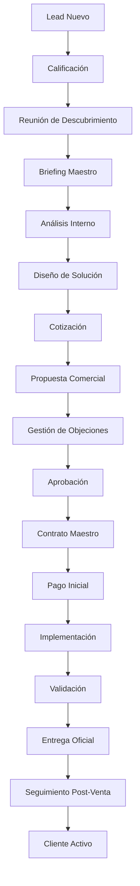

# PROCESO COMERCIAL PROTOTIPE

**Versión:** 1.0  
**Estado:** Activo  
**Área:** Comercial  
**Última actualización:** 2026-06-24

---

## OBJETIVO

Definir el proceso comercial oficial de PROTOTIPE para garantizar que todos los clientes potenciales sean atendidos de manera consistente, profesional y alineada con la filosofía de la empresa.

Este proceso cubre todo el ciclo de vida del cliente: desde la generación inicial del lead hasta la entrega formal de la solución y el seguimiento post-implementación para asegurar la adopción.

---

## FILOSOFÍA COMERCIAL PROTOTIPE

**PROTOTIPE no vende aplicaciones.**  
PROTOTIPE ayuda a negocios, emprendimientos y empresas a:
* Reducir tareas manuales.
* Automatizar procesos operativos.
* Mejorar el control gerencial.
* Facilitar el crecimiento ordenado.
* Adoptar tecnología de forma práctica y sin fricciones.

La tecnología es solo una herramienta; **el objetivo real es resolver problemas de negocio.**

---

## VISIÓN GENERAL DEL FLUJO (PIPELINE)

---

## ETAPAS DETALLADAS DEL PROCESO

### ETAPA 1 — GENERACIÓN DE LEADS
* **Objetivo:** Atraer o identificar posibles clientes con necesidades operativas.
* **Canales:** Referidos por clientes existentes, orgánico (Web/PWA), publicidad paga, contacto directo de nichos específicos y WhatsApp.
* **Resultado Esperado:** Lead registrado con datos básicos de contacto.

### ETAPA 2 — CALIFICACIÓN DEL LEAD
* **Objetivo:** Determinar de manera rápida si existe una oportunidad real viable para PROTOTIPE.
* **Preguntas de Calificación:** ¿Qué tipo de negocio tiene? ¿Cuántos empleados y sucursales operan? ¿Cuál es el principal cuello de botella que desea solucionar hoy? ¿Utiliza algún sistema o Excel actualmente?
* **Clasificación Interna:**
  - **A (Alta Prioridad):** Dolor operativo crítico identificado, presupuesto estimado y disposición de tiempo inmediata.
  - **B (Interés Medio):** Interesado en ordenar el negocio pero sin prisa crítica de arranque.
  - **C (Interés Bajo):** Buscando precios informativos únicamente.
  - **D (No califica):** Nicho fuera de nuestro Core Base o requerimientos no viables.
* **Resultado Esperado:** Agendamiento de la Reunión de Descubrimiento o descarte/pausa del lead.

### ETAPA 3 — REUNIÓN DE DESCUBRIMIENTO
* **Documento de Guía:** [sistema_ventas_prototipe.md](file:///d:/PROTOTIPE/Documentacion%20PROTOTIPE/05_Estrategia_Comercial_Ecosistema/sistema_ventas_prototipe.md)
* **Objetivo:** Comprender las dolencias físicas y lógicas del negocio (cómo operan, dónde pierden tiempo y dónde hay fugas).
* **Resultado Esperado:** Mapeo inicial de dolores y compromiso del cliente para responder el cuestionario detallado.

### ETAPA 4 — BRIEFING MAESTRO
* **Documento de Guía:** [briefing_maestro_cliente.md](file:///d:/PROTOTIPE/Documentacion%20PROTOTIPE/05_Estrategia_Comercial_Ecosistema/Plantillas_de_Levantamiento/briefing_maestro_cliente.md)
* **Objetivo:** Recopilar de forma exhaustiva toda la información técnica y de negocio requerida para estructurar la solución.
* **Actividades:** Relevamiento detallado de procesos (inventario, POS, créditos, KDS), volumen transaccional, usuarios, marcas, feature flags y branding.
* **Resultado Esperado:** Formulario de Briefing completo con la información de la operación.

### ETAPA 5 — ANÁLISIS INTERNO
* **Documento de Guía:** [plantilla_analisis_post_descubrimiento.md](file:///d:/PROTOTIPE/Documentacion%20PROTOTIPE/05_Estrategia_Comercial_Ecosistema/Plantillas_de_Levantamiento/plantilla_analisis_post_descubrimiento.md)
* **Objetivo:** Procesar las notas y datos de la reunión para modelar la solución tecnológica interna.
* **Actividades:** Diagnóstico técnico, análisis de viabilidad, estimación de esfuerzo en fases y mapeo de riesgos.
* **Resultado Esperado:** Diagnóstico interno finalizado y aprobado por el equipo de PROTOTIPE.

### ETAPA 6 — DISEÑO DE SOLUCIÓN
* **Objetivo:** Definir la arquitectura técnica óptima a desplegar.
* **Actividades:** Selección de plantilla (Core Base), definición de módulos a reutilizar (inventario, caja, citas), feature flags y APIs/Integraciones de terceros.
* **Resultado Esperado:** Arquitectura preliminar del proyecto documentada.

### ETAPA 7 — COTIZACIÓN
* **Documento de Guía:** [calculadora_cotizacion_prototipe.md](file:///d:/PROTOTIPE/Documentacion%20PROTOTIPE/05_Estrategia_Comercial_Ecosistema/calculadora_cotizacion_prototipe.md)
* **Objetivo:** Calcular la inversión requerida aplicando criterios objetivos y justificados de complejidad y valor.
* **Variables Evaluadas:** Complejidad funcional, técnica, nivel de personalización, factor de riesgo y valor de negocio generado.
* **Resultado Esperado:** Tarifa de Setup y modelo recurrente (mensual/comisión) definidos internamente.

### ETAPA 8 — PROPUESTA COMERCIAL
* **Documento de Guía:** [propuesta_comercial_prototipe.md](file:///d:/PROTOTIPE/Documentacion%20PROTOTIPE/05_Estrategia_Comercial_Ecosistema/propuesta_comercial_prototipe.md)
* **Objetivo:** Presentar formalmente el valor y los beneficios de la solución al cliente de manera simplificada y no técnica.
* **Incluye:** Diagnóstico del dolor del cliente, beneficios específicos medibles, alcance modular del software, modelo económico y próximos pasos.
* **Resultado Esperado:** Propuesta enviada y en manos del tomador de decisiones.

### ETAPA 9 — GESTIÓN DE OBJECIONES
* **Documento de Guía:** [manejo_objeciones_cierre_ventas.md](file:///d:/PROTOTIPE/Documentacion%20PROTOTIPE/05_Estrategia_Comercial_Ecosistema/manejo_objeciones_cierre_ventas.md)
* **Objetivo:** Resolver inquietudes, despejar miedos al cambio tecnológico y justificar de forma profesional la inversión.
* **Resultado Esperado:** Dudas resueltas y alineación total sobre el valor del software.

### ETAPA 10 — APROBACIÓN
* **Objetivo:** Obtener la confirmación formal del inicio del proyecto.
* **Verificaciones:** Confirmar alcances de la Fase 1, cronogramas de entrega, inversión económica y modelo recurrente.
* **Resultado Esperado:** Aprobación verbal/escrita de la cotización y propuesta.

### ETAPA 11 — CONTRATO
* **Documento de Guía:** [contrato_maestro_servicios.md](file:///d:/PROTOTIPE/Documentacion%20PROTOTIPE/05_Estrategia_Comercial_Ecosistema/contrato_maestro_servicios.md)
* **Objetivo:** Asegurar la relación comercial mediante el marco legal del ecosistema.
* **Resultado Esperado:** Contrato firmado digitalmente por ambas partes.

### ETAPA 12 — PAGO INICIAL
* **Objetivo:** Consolidar el compromiso del cliente y liberar recursos para la parametrización técnica.
* **Condición:** Cobro estándar del 50% de la tarifa única de Setup.
* **Resultado Esperado:** Recibo de pago emitido e inicio de la etapa de desarrollo.

### ETAPA 13 — IMPLEMENTACIÓN
* **Documento de Guía:** [inicializacion_nuevos_proyectos.md](file:///d:/PROTOTIPE/Documentacion%20PROTOTIPE/04_Estandares_y_Skills/inicializacion_nuevos_proyectos.md)
* **Objetivo:** Configurar el Core, personalizar branding HSL e integrar los módulos aprobados mediante el CLI Bridge Server.
* **Resultado Esperado:** Instancia clonada y testeada mediante Smoke Tests (Playwright).

### ETAPA 14 — VALIDACIÓN
* **Objetivo:** Certificar el cumplimiento de los requerimientos y el correcto desempeño en condiciones reales.
* **Actividades:** Pruebas internas, revisión de flujos críticos del cliente y ajustes menores finales.
* **Resultado Esperado:** Aceptación funcional por parte del cliente.

### ETAPA 15 — ENTREGA
* **Objetivo:** Traspasar el control del sistema al cliente y ponerlo en producción.
* **Actividades:** Capacitación al personal, entrega de accesos gerenciales/operativos, cobro del 50% restante del Setup y despliegue del Hosting oficial en Firebase.
* **Resultado Esperado:** Cliente operando de forma independiente en producción.

### ETAPA 16 — SEGUIMIENTO POST-VENTA
* **Objetivo:** Acompañar al cliente para garantizar una adopción exitosa de la tecnología y evitar el abandono de la plataforma.
* **Calendario de Control:**
  - **Día 7:** Validación del uso diario de caja y dudas operativas del personal.
  - **Día 30:** Primer cierre de mes e interpretación de reportes financieros.
  - **Día 90:** Evaluación de resultados (KPIs): ahorro de tiempo medido y mitigación de fugas de dinero.
* **Resultado Esperado:** Cliente consolidado y activo a largo plazo.

---

## ESTADOS OFICIALES DEL LEAD (FUNNEL CRM)

Para el control comercial dentro de la base central, cada prospecto debe clasificarse en alguno de los siguientes estados:

1. **Nuevo:** Lead registrado que no ha recibido contacto.
2. **Contactado:** Primer acercamiento de clasificación por WhatsApp.
3. **Calificado:** Calificación positiva de nicho y dolor operativa.
4. **Reunión Programada:** Fecha y hora agendada de diagnóstico.
5. **Descubrimiento Realizado:** Briefing completado.
6. **En Análisis:** Procesando arquitectura y estimación interna.
7. **Propuesta Enviada:** PDF de cotización en manos del cliente.
8. **Negociación:** Manejo de objeciones comerciales.
9. **Aprobado:** Aceptación del proyecto previa a la firma de contrato.
10. **Contrato Firmado:** Contrato digital maestro ejecutado.
11. **Implementación:** Instancia de software en proceso de aprovisionamiento.
12. **Activo:** Sistema en producción y operando.
13. **Pausado:** Suspensión temporal a solicitud del cliente.
14. **Perdido:** Oportunidad descartada (con registro de causa de pérdida).

---

## MÉTRICAS COMERCIALES CLAVE (KPIs)

Para evaluar la salud del proceso comercial de PROTOTIPE, se deben monitorizar periódicamente:
* **Leads Generados:** Total de prospectos atraídos por canal.
* **Tasa de Conversión de Descubrimiento:** `%` de leads que pasan de Calificados a Reunión.
* **Tasa de Cierre:** `%` de propuestas enviadas que se convierten en contratos activos.
* **Ciclo de Venta:** Tiempo promedio en días desde el primer contacto hasta el pago del Setup.
* **Setup Promedio por Cliente:** Valor medio facturado por implementación inicial.
* **Retención de Recurrencia:** `%` de clientes activos que sostienen su mensualidad/comisión mensual.

---

## REGLA DE ORO PROTOTIPE

> [!IMPORTANT]
> **Nunca comiences una conversación hablando de código, bases de datos o funcionalidades de la aplicación.**  
> Primero comprende cómo opera el negocio del cliente, cuáles son sus dolores diarios y qué metas desea alcanzar. La tecnología es simplemente una consecuencia natural para habilitar la solución de sus problemas.
