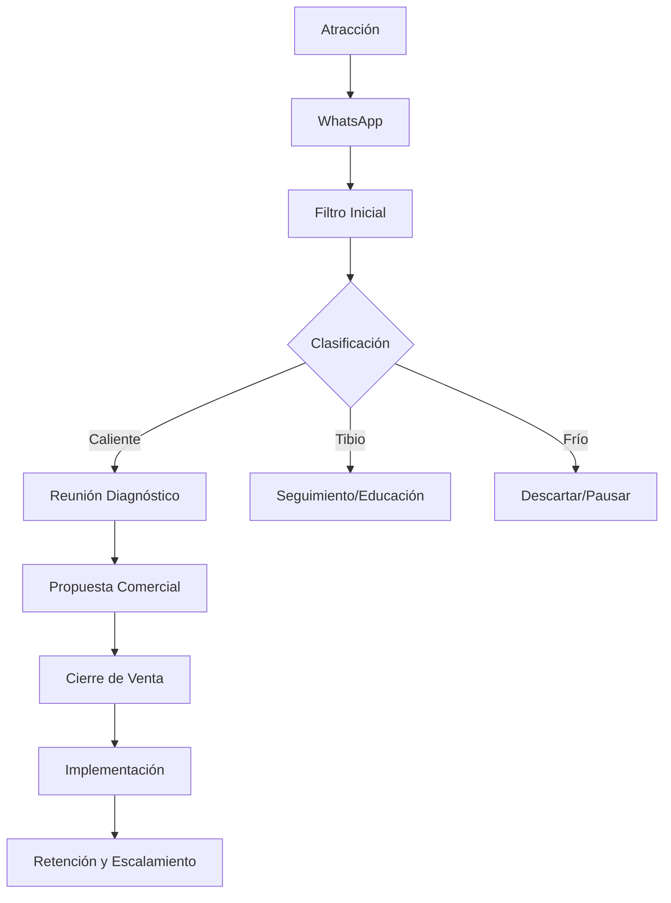

# Sistema de Ventas PROTOTIPE

Este documento define el sistema completo de ventas de PROTOTIPE, desde la captación del cliente hasta el cierre, implementación y escalamiento.

---

## 🧭 1. Objetivo del Sistema

Convertir interesados en clientes pagos de forma estructurada, replicable y escalable, sin depender de la improvisación.

---

## 📲 2. Filtro Inicial (WhatsApp)

### Mensaje de entrada
> Hola 👋
>
> Gracias por contactar a PROTOTIPE.
>
> Para entender mejor tu caso:
> 1. ¿Qué tipo de negocio tienes?
> 2. ¿Cómo lo gestionas actualmente?
> 3. ¿Qué problema te gustaría resolver?
>
> Con esto te orientamos mejor.

### 🧠 Clasificación del cliente
* **🔵 Cliente caliente**: Negocio activo, problema claro y busca una solución. → *Pasa directo a reunión de diagnóstico.*
* **🟡 Cliente tibio**: Tiene dudas o el problema aún es poco claro. → *Requiere seguimiento y educación.*
* **🔴 Cliente frío**: Curioso, sin intención real de compra inmediata o viabilidad. → *No priorizar.*

---

## 📞 3. Reunión de Diagnóstico

> [!IMPORTANT]
> **Regla principal**: NO se vende en la reunión. Se diagnostica para evaluar viabilidad y estructurar el alcance.

### 🧩 Estructura de la reunión
1. **Entendimiento del negocio**: Cómo funciona el negocio día a día.
2. **Problemas**: Qué dificultades operativas o de control tiene actualmente.
3. **Impacto**: Qué pérdidas de tiempo, dinero o clientes genera ese problema.
4. **Solución ideal**: Cómo le gustaría al cliente que funcionara su negocio.

### 🧠 Preguntas clave
* *"Cuéntame cómo manejas tu negocio en un día normal."*
* *"¿Qué es lo más difícil de gestionar hoy?"*
* *"Si eso se solucionara, ¿qué cambiaría exactamente para ti?"*

---

## 🧾 4. Propuesta Comercial

### Mensaje de envío
> Perfecto, ya entendí cómo funciona tu negocio.
>
> Te preparé una propuesta basada en lo que necesitas.

### Estructura de la propuesta
1. Resumen del negocio del cliente  
2. Problemas detectados  
3. Solución PROTOTIPE  
4. Módulos a implementar  
5. Beneficios  
6. Tiempo de desarrollo  
7. Precio  
8. Soporte incluido  
9. Siguientes pasos  

---

## 💰 5. Cierre de Venta

### Frase principal
* *"Si estás de acuerdo, podemos empezar la implementación esta semana. Solo necesitamos el pago inicial para reservar el desarrollo."*

### Variante suave
* *"Podemos iniciar cuando tú lo decidas. Yo te puedo reservar el espacio de desarrollo cuando confirmes."*

---

## ⚠️ 6. Manejo de Objeciones

### 💸 “Está caro”
> *"Entiendo. El objetivo no es ser un gasto, sino ayudarte a mejorar el control y eficiencia de tu negocio. Si quieres, podemos ajustar el alcance inicial."*

### ⏳ “Lo pienso”
> *"Perfecto. Te dejo la información clara para que puedas decidir con calma."*

### ❌ “No estoy seguro”
> *"Podemos empezar con algo básico e ir escalando según lo necesites."*

---

## ⚙️ 7. Post-Pago (Implementación)

1. Confirmación de pago  
2. Análisis detallado del negocio  
3. Diseño del sistema  
4. Desarrollo y Scaffolding  
5. Pruebas y QA (E2E)  
6. Entrega formal  
7. Capacitación y Onboarding  

---

## 🔁 8. Retención y Escalamiento

Después de la entrega, se escalan servicios con:
* Nuevos módulos adicionales.
* Mejoras personalizadas a la medida.
* Soporte técnico prioritario.
* Automatización avanzada de procesos.
* Expansión del sistema (multi-sucursal).

---

## 🧠 9. Flujo del Sistema Completo de Ventas

---

## 🚀 Conclusión

Este sistema convierte el onboarding de PROTOTIPE en un modelo replicable, minimizando riesgos y asegurando la entrega consistente de soluciones digitales adaptadas a negocios reales.
