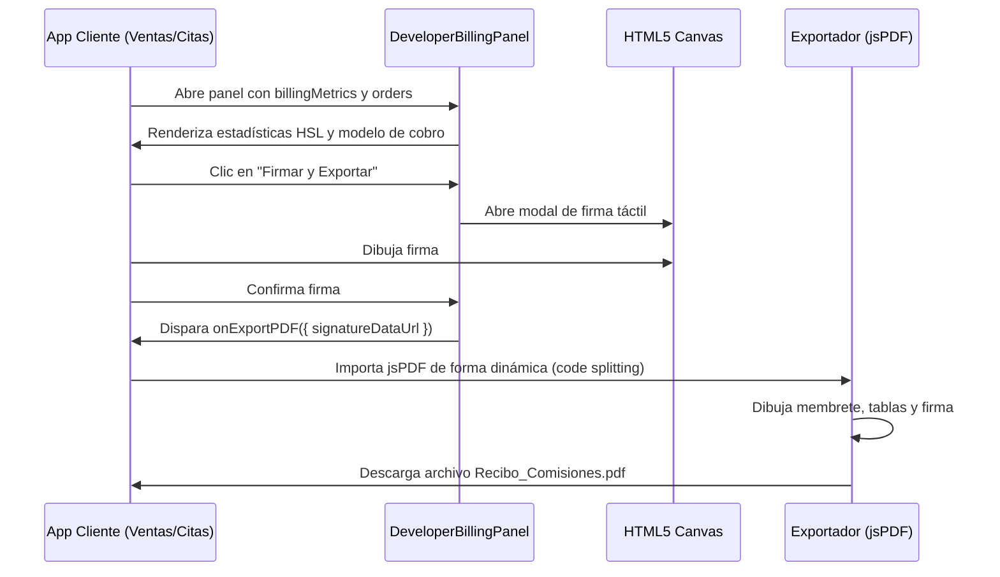

# Facturación y Firma Digital (DeveloperBillingPanel & Exportador PDF)

Este componente y flujo de trabajo es **MANDATORIO** en todas las aplicaciones del ecosistema **PROTOTIPE**. Centraliza el monitoreo de comisiones del desarrollador y sella el acuerdo de conformidad del período mediante firma digital y exportación de recibos.

---

## 1. Propósito y Casos de Uso
- **Auditoría Transaccional**: Muestra las ventas, pedidos y comisiones del mes en base a esquemas de porcentaje, tarifa fija por orden o cargo plano mensual.
- **Firma Táctil**: El cliente final firma con su dedo o cursor en un Canvas de alta precisión para ratificar el cobro mensual.
- **Generación de Recibo Certificado**: Compila un archivo PDF detallado con el membrete oficial del motor, tabla de pedidos, total de cobros, firma rasterizada e identificadores de telemetría.

---

## 2. Flujo Operativo y de Datos



---

## 3. Código React Portable del Panel (`DeveloperBillingPanel.jsx`)

```jsx
import React, { useState, useRef } from 'react';
import { Receipt, ShoppingBag, Wallet, TrendingUp, BarChart3, X, Trash2, Save } from 'lucide-react';

export function DeveloperBillingPanel({
  billingMetrics,
  isLoading = false,
  orders = [],
  config = {},
  onExportPDF = () => {},
  onClose = () => {}
}) {
  const [isSignatureModalOpen, setIsSignatureModalOpen] = useState(false);
  const [isDrawing, setIsDrawing] = useState(false);
  const canvasRef = useRef(null);

  const formatMoney = (value) => {
    return `$${Number(value || 0).toLocaleString('es-CO', { 
      minimumFractionDigits: 0, 
      maximumFractionDigits: 0 
    })}`;
  };

  const startDrawing = (e) => {
    const canvas = canvasRef.current;
    if (!canvas) return;
    const ctx = canvas.getContext('2d');
    ctx.lineWidth = 2.5;
    ctx.lineCap = 'round';
    ctx.strokeStyle = '#000000';
    
    const rect = canvas.getBoundingClientRect();
    const clientX = e.clientX || (e.touches && e.touches[0]?.clientX);
    const clientY = e.clientY || (e.touches && e.touches[0]?.clientY);
    if (!clientX || !clientY) return;

    const x = clientX - rect.left;
    const y = clientY - rect.top;
    
    ctx.beginPath();
    ctx.moveTo(x, y);
    setIsDrawing(true);
  };

  const draw = (e) => {
    if (!isDrawing) return;
    const canvas = canvasRef.current;
    if (!canvas) return;
    const ctx = canvas.getContext('2d');
    const rect = canvas.getBoundingClientRect();
    
    const clientX = e.clientX || (e.touches && e.touches[0]?.clientX);
    const clientY = e.clientY || (e.touches && e.touches[0]?.clientY);
    if (!clientX || !clientY) return;

    const x = clientX - rect.left;
    const y = clientY - rect.top;
    
    ctx.lineTo(x, y);
    ctx.stroke();
  };

  const stopDrawing = () => setIsDrawing(false);

  const clearCanvas = () => {
    const canvas = canvasRef.current;
    if (canvas) {
      const ctx = canvas.getContext('2d');
      ctx.clearRect(0, 0, canvas.width, canvas.height);
    }
  };

  const handleExport = () => {
    const canvas = canvasRef.current;
    if (!canvas) return;
    const signatureDataUrl = canvas.toDataURL('image/png');
    onExportPDF({ signatureDataUrl });
    setIsSignatureModalOpen(false);
  };

  const handleOpenSignature = () => {
    setIsSignatureModalOpen(true);
    setTimeout(() => clearCanvas(), 80);
  };

  return (
    <div className="space-y-4">
      {/* Visualización de Métricas Principales */}
      <div className="grid grid-cols-2 gap-3 text-[var(--color-text)]">
        <div className="bg-[var(--color-surface-2)] border border-[var(--color-border)] rounded-2xl p-4">
          <p className="text-xs text-[var(--color-text-muted)] font-medium">Ventas del mes</p>
          <p className="text-xl font-black">{formatMoney(billingMetrics?.totalMes)}</p>
        </div>
        <div className="bg-[var(--color-surface-2)] border border-emerald-500/20 rounded-2xl p-4">
          <p className="text-xs text-[var(--color-text-muted)] font-medium">Comisión del mes</p>
          <p className="text-xl font-black text-emerald-500">{formatMoney(billingMetrics?.comisionMes)}</p>
        </div>
      </div>

      {/* Botón de Confirmación y Firma */}
      {!isLoading && (
        <button
          onClick={handleOpenSignature}
          className="w-full h-11 px-5 rounded-xl font-bold text-sm bg-emerald-500 hover:bg-emerald-600 text-white flex items-center justify-center gap-2"
        >
          <Receipt size={16} />
          Firmar y Exportar Recibo del Mes
        </button>
      )}

      {/* Modal de Firma HTML5 Canvas */}
      {isSignatureModalOpen && (
        <div className="fixed inset-0 flex items-center justify-center z-[9999] p-4 bg-black/60 backdrop-blur-sm">
          <div className="bg-[var(--color-surface)] border border-[var(--color-border)] rounded-3xl p-6 shadow-2xl relative max-w-sm w-full space-y-4">
            <h3 className="text-sm font-bold text-[var(--color-text)]">Firma de Conformidad</h3>
            <div className="border border-[var(--color-border)] rounded-2xl overflow-hidden bg-white">
              <canvas
                ref={canvasRef}
                width={330}
                height={160}
                className="w-full h-[160px] block touch-none cursor-crosshair"
                onMouseDown={startDrawing}
                onMouseMove={draw}
                onMouseUp={stopDrawing}
                onMouseLeave={stopDrawing}
                onTouchStart={startDrawing}
                onTouchMove={draw}
                onTouchEnd={stopDrawing}
              />
            </div>
            <div className="flex gap-2">
              <button onClick={clearCanvas} className="flex-1 h-10 border border-[var(--color-border)] rounded-xl text-xs font-bold hover:bg-[var(--color-surface-2)]">
                Limpiar
              </button>
              <button onClick={handleExport} className="flex-1 h-10 bg-emerald-500 text-white rounded-xl text-xs font-bold hover:bg-emerald-600">
                Confirmar y Exportar
              </button>
            </div>
          </div>
        </div>
      )}
    </div>
  );
}
```

---

## 4. Implementación del Callback Exportador en el Cliente (`handleExportPDF`)

Este callback carga dinámicamente la biblioteca `jsPDF` en el hilo de ejecución para optimizar la carga inicial de la aplicación.

```javascript
const handleExportPDF = async ({ signatureDataUrl }) => {
  try {
    const { jsPDF } = await import('jspdf');
    const doc = new jsPDF();

    // Colores y Diseño Corporativo PROTOTIPE
    const darkColor = [15, 23, 42]; // Slate 900
    
    // Encabezado
    doc.setFillColor(...darkColor);
    doc.rect(0, 0, 210, 40, 'F');
    doc.setTextColor(255, 255, 255);
    doc.setFont("helvetica", "bold");
    doc.setFontSize(20);
    doc.text("PROTOTIPE", 15, 20);
    doc.setFontSize(8);
    doc.setFont("helvetica", "normal");
    doc.text("MOTOR DE APLICACIONES A LA MEDIDA", 15, 26);

    // Detalles del Reporte
    doc.setFontSize(10);
    doc.text(`Nº RECIBO: REC-${Math.floor(100000 + Math.random() * 900000)}`, 140, 15);
    doc.text(`FECHA: ${new Date().toLocaleDateString('es-CO')}`, 140, 21);

    // Información del Comercio
    doc.setTextColor(...darkColor);
    doc.setFont("helvetica", "bold");
    doc.setFontSize(12);
    doc.text("INFORMACIÓN DEL COMERCIO", 15, 52);
    doc.setFont("helvetica", "normal");
    doc.setFontSize(10);
    doc.text(`Cliente ID: ${config.clientId || 'smartfix-ventas'}`, 15, 60);
    doc.text(`Modelo Comercial: ${billingMetrics?.billingMode}`, 15, 66);

    // Totales Financieros
    doc.setFont("helvetica", "bold");
    doc.text("RESUMEN DE COMISIONES", 15, 88);
    doc.setFont("helvetica", "normal");
    doc.text("Ventas del Mes:", 15, 96);
    doc.text(`$${billingMetrics?.totalMes.toLocaleString()}`, 140, 96);
    doc.text("Comisión Consolidada:", 15, 104);
    doc.text(`$${billingMetrics?.comisionMes.toLocaleString()}`, 140, 104);

    // Firma
    doc.setFont("helvetica", "bold");
    doc.text("FIRMA DE CONFORMIDAD DEL CLIENTE", 15, 190);
    doc.rect(15, 195, 80, 35);
    doc.addImage(signatureDataUrl, 'PNG', 20, 198, 70, 28);

    doc.save(`Recibo_Comisiones_${config.clientId || 'comercio'}_${new Date().toISOString().slice(0, 7)}.pdf`);
  } catch (err) {
    console.error("Error al exportar PDF:", err);
  }
};
```
