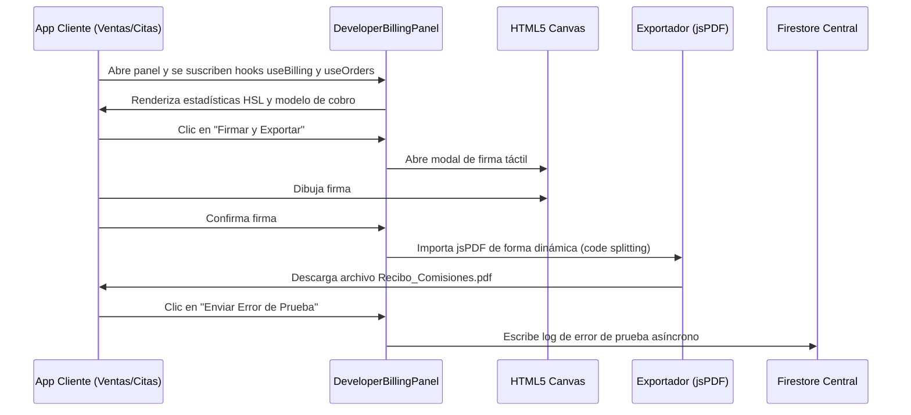

<!--
{
  "technicalName": "FacturacionYFirmaDigital",
  "targetPath": "src/components/ui/FacturacionYFirmaDigital.jsx",
  "dependencies": {
    "npm": {},
    "internal": []
  }
}
-->

# Facturación y Firma Digital (DeveloperBillingPanel & Exportador PDF)

Este componente y flujo de trabajo es **MANDATORIO** en todas las aplicaciones del ecosistema **PROTOTIPE**. Centraliza el monitoreo de comisiones del desarrollador y sella el acuerdo de conformidad del período mediante firma digital, exportación de recibos e integra la telemetría/diagnósticos en un solo panel unificado y portable.

---

## 1. Propósito y Casos de Uso
- **Auditoría Transaccional**: Muestra las ventas, pedidos y comisiones del mes en base a esquemas de porcentaje, tarifa fija por orden o cargo plano mensual.
- **Firma Táctil**: El cliente final firma con su dedo o cursor en un Canvas de alta precisión para ratificar el cobro mensual.
- **Generación de Recibo Certificado**: Compila un archivo PDF detallado con el membrete oficial del motor, tabla de pedidos, total de cobros, firma rasterizada e identificadores de telemetría.
- **Diagnóstico y Telemetría Integrada**: Expone botones de diagnóstico para disparar un error simulado o forzar el envío de telemetría a Firestore Central inmediatamente.

---

## 2. Flujo Operativo y de Datos



---

## 3. Código React Portable del Panel (`DeveloperBillingPanel.jsx`)

```jsx
import React, { useState, useRef } from 'react'
import { motion, AnimatePresence } from 'framer-motion'
import { 
  Receipt, ShoppingBag, Wallet, TrendingUp, BarChart3, X, 
  Activity, AlertTriangle, CheckCircle, Loader2 
} from 'lucide-react'
import { useBilling } from '../../../../hooks/useBilling'
import { useOrders } from '../../../../hooks/useOrders'

export default function DeveloperBillingPanel({ config, setSaveMessage }) {
  const { metrics: billingMetrics, isLoading: billingLoading } = useBilling()
  const { data: orders = [] } = useOrders()
  
  const [loading, setLoading] = useState(false)
  const [message, setMessage] = useState(null)
  const [isSignatureModalOpen, setIsSignatureModalOpen] = useState(false)
  const [isDrawing, setIsDrawing] = useState(false)
  const canvasRef = useRef(null)

  const fmt = (v) => `$${Number(v || 0).toLocaleString('es-CO', { minimumFractionDigits: 0, maximumFractionDigits: 0 })}`

  // --- FIRMA DIGITAL ---
  const startDrawing = (e) => {
    const canvas = canvasRef.current
    if (!canvas) return
    const ctx = canvas.getContext('2d')
    ctx.lineWidth = 2
    ctx.lineCap = 'round'
    ctx.strokeStyle = '#000000'
    
    const rect = canvas.getBoundingClientRect()
    const clientX = e.clientX || (e.touches && e.touches[0]?.clientX)
    const clientY = e.clientY || (e.touches && e.touches[0]?.clientY)
    if (!clientX || !clientY) return

    const x = clientX - rect.left
    const y = clientY - rect.top
    
    ctx.beginPath()
    ctx.moveTo(x, y)
    setIsDrawing(true)
  }

  const draw = (e) => {
    if (!isDrawing) return
    const canvas = canvasRef.current
    if (!canvas) return
    const ctx = canvas.getContext('2d')
    const rect = canvas.getBoundingClientRect()
    
    const clientX = e.clientX || (e.touches && e.touches[0]?.clientX)
    const clientY = e.clientY || (e.touches && e.touches[0]?.clientY)
    if (!clientX || !clientY) return

    const x = clientX - rect.left
    const y = clientY - rect.top
    
    ctx.lineTo(x, y)
    ctx.stroke()
  }

  const stopDrawing = () => {
    setIsDrawing(false)
  }

  const clearCanvas = () => {
    const canvas = canvasRef.current
    if (canvas) {
      const ctx = canvas.getContext('2d')
      ctx.clearRect(0, 0, canvas.width, canvas.height)
    }
  }

  const handleExportDeveloperReceiptPDF = async () => {
    try {
      const canvas = canvasRef.current
      if (!canvas) {
        console.error("Canvas ref is null")
        return
      }
      const signatureDataUrl = canvas.toDataURL('image/png')
      const { exportDeveloperReceiptPDF } = await import('../../../../services/pdfService')
      exportDeveloperReceiptPDF({ signatureDataUrl, orders, config, billingMetrics })
      setIsSignatureModalOpen(false)
    } catch (error) {
      console.error("Error al exportar el recibo en PDF:", error)
      if (setSaveMessage) {
        setSaveMessage({ type: 'error', text: 'Error al generar PDF: ' + error.message })
      }
    }
  }

  return (
    <div className="space-y-4 animate-in fade-in duration-200">
      <div className="relative overflow-hidden rounded-2xl border border-emerald-500/20 bg-gradient-to-br from-emerald-500/10 via-surface to-teal-500/5 p-5">
        <div className="absolute top-0 right-0 w-32 h-32 rounded-full bg-emerald-500/5 -translate-y-8 translate-x-8" />
        <div className="relative flex items-start gap-4">
          <div className="w-12 h-12 rounded-2xl bg-emerald-500/15 flex items-center justify-center shrink-0">
            <Receipt size={24} className="text-emerald-500" />
          </div>
          <div>
            <p className="text-sm font-bold text-app mb-1">Módulo de Facturación</p>
            <p className="text-xs text-muted leading-relaxed">
              Inicialmente ya hiciste tu pago para iniciar el proyecto. Gracias por contribuir a mejorar tu negocio.
            </p>
          </div>
        </div>
      </div>

      {billingLoading ? (
        <div className="grid grid-cols-2 gap-3">
          {[...Array(4)].map((_, i) => (
            <div key={i} className="bg-surface-2 border border-app rounded-2xl p-4 animate-pulse">
              <div className="h-3 bg-app/20 rounded-full w-16 mb-3" />
              <div className="h-7 bg-app/20 rounded-full w-24" />
            </div>
          ))}
        </div>
      ) : (
        <div className="grid grid-cols-2 gap-3">
          <div className="bg-surface-2 border border-app rounded-2xl p-4">
            <div className="flex items-center gap-2 mb-2">
              <div className="w-7 h-7 rounded-lg bg-blue-500/10 flex items-center justify-center">
                <ShoppingBag size={14} className="text-blue-500" />
              </div>
              <p className="text-xs text-muted font-medium">Ventas del mes</p>
            </div>
            <p className="text-xl font-black text-app">{fmt(billingMetrics?.totalMes)}</p>
          </div>

          <div className="bg-surface-2 border border-emerald-500/20 rounded-2xl p-4">
            <div className="flex items-center gap-2 mb-2">
              <div className="w-7 h-7 rounded-lg bg-emerald-500/10 flex items-center justify-center">
                <Wallet size={14} className="text-emerald-500" />
              </div>
              <p className="text-xs text-muted font-medium">Mi comisión del mes</p>
            </div>
            <p className="text-xl font-black text-emerald-500">{fmt(billingMetrics?.comisionMes)}</p>
          </div>

          <div className="bg-surface-2 border border-app rounded-2xl p-4">
            <div className="flex items-center gap-2 mb-2">
              <div className="w-7 h-7 rounded-lg bg-purple-500/10 flex items-center justify-center">
                <TrendingUp size={14} className="text-purple-500" />
              </div>
              <p className="text-xs text-muted font-medium">Pedidos completados</p>
            </div>
            <p className="text-xl font-black text-app">{billingMetrics?.pedidosMes ?? 0}</p>
            <p className="text-xs text-muted mt-0.5">este mes</p>
          </div>

          <div className="bg-surface-2 border border-app rounded-2xl p-4">
            <div className="flex items-center gap-2 mb-2">
              <div className="w-7 h-7 rounded-lg bg-amber-500/10 flex items-center justify-center">
                <BarChart3 size={14} className="text-amber-500" />
              </div>
              <p className="text-xs text-muted font-medium">Comisión acumulada</p>
            </div>
            <p className="text-xl font-black text-app">{fmt(billingMetrics?.comisionHistorica)}</p>
            <p className="text-xs text-muted mt-0.5">histórico total</p>
          </div>
        </div>
      )}

      <div className="bg-surface rounded-2xl border border-app overflow-hidden">
        <div className="px-5 py-4">
          <p className="text-sm font-bold text-app mb-1">Modelo de Facturación de Instancia</p>
          <p className="text-xs text-muted mb-4">Configurado de manera centralizada desde el Dashboard del Desarrollador.</p>
          <div className="p-3.5 bg-surface-2 border border-app rounded-xl space-y-2.5">
            <div className="flex justify-between items-center text-xs">
              <span className="font-semibold text-muted">Método Activo:</span>
              <span className="font-bold text-emerald-500 uppercase">
                {billingMetrics?.billingMode === 'percentage' && 'Porcentaje por Venta'}
                {billingMetrics?.billingMode === 'fixed_per_service' && 'Valor Fijo por Servicio'}
                {billingMetrics?.billingMode === 'flat_monthly' && 'Pago Mensual Fijo'}
              </span>
            </div>
            <div className="flex justify-between items-center text-xs border-t border-app pt-2.5">
              <span className="font-semibold text-muted">Tarifa Pactada:</span>
              <span className="font-bold text-app">
                {billingMetrics?.billingMode === 'percentage' && `${billingMetrics?.comisionPorcentaje}%`}
                {billingMetrics?.billingMode === 'fixed_per_service' && `${fmt(billingMetrics?.montoFijoServicio)} por pedido`}
                {billingMetrics?.billingMode === 'flat_monthly' && `${fmt(billingMetrics?.pagoMensualFijo)} al mes`}
              </span>
            </div>
          </div>
        </div>
      </div>

      {!billingLoading && billingMetrics && (
        <>
          <div className="bg-surface rounded-2xl border border-app overflow-hidden">
            <div className="px-5 py-4 border-b border-app">
              <p className="text-sm font-bold text-app">Resumen de comisiones</p>
              <p className="text-xs text-muted">Totales calculados sobre pedidos completados</p>
            </div>
            <div className="divide-y divide-app">
              {[
                { label: 'Ventas del mes', value: fmt(billingMetrics.totalMes), sub: `${billingMetrics.pedidosMes} pedidos completados` },
                { label: 'Comisión del mes', value: fmt(billingMetrics.comisionMes), highlight: true },
                { label: 'Total ventas histórico', value: fmt(billingMetrics.totalHistorico), sub: 'Todos los tiempos' },
                { label: 'Comisión histórica acumulada', value: fmt(billingMetrics.comisionHistorica), highlight: true },
              ].map((row, i) => (
                <div key={i} className="flex items-center justify-between px-5 py-3.5">
                  <div>
                    <p className="text-xs font-semibold text-app">{row.label}</p>
                    {row.sub && <p className="text-[10px] text-muted mt-0.5">{row.sub}</p>}
                  </div>
                  <p className={`text-sm font-black ${row.highlight ? 'text-emerald-500' : 'text-app'}`}>{row.value}</p>
                </div>
              ))}
            </div>
          </div>

          <div className="bg-surface rounded-2xl border border-app p-5 space-y-4">
            <div>
              <p className="text-sm font-bold text-app mb-1">Generar Recibo y Firma de Conformidad</p>
              <p className="text-xs text-muted leading-relaxed">
                Genera el recibo detallado de comisiones mensuales para que el cliente lo firme y lo exporte en PDF.
              </p>
            </div>
            <button
              onClick={() => {
                setIsSignatureModalOpen(true)
                setTimeout(() => clearCanvas(), 50)
              }}
              className="h-11 px-5 rounded-xl font-bold text-sm transition-all active:scale-95 flex items-center justify-center gap-2 bg-emerald-500 hover:bg-emerald-600 text-white cursor-pointer shadow-sm border-none"
            >
              <Receipt size={16} />
              Firmar y Exportar Recibo del Mes
            </button>
          </div>

          <div className="bg-surface rounded-2xl border border-app p-5 space-y-4">
            <div>
              <p className="text-sm font-bold text-app mb-1">Telemetría y Diagnóstico de Canal</p>
              <p className="text-xs text-muted leading-relaxed">
                Envía un error simulado o fuerza la sincronización de telemetría para comprobar la conexión activa con la consola central.
              </p>
            </div>
            
            {message && (
              <div className={`p-4 rounded-xl flex items-start gap-3 text-left border ${message.type === 'error' ? 'bg-red-500/10 border-red-500/20 text-red-500' : 'bg-green-500/10 border-green-500/20 text-green-500'}`}>
                {message.type === 'error' ? <AlertTriangle size={18} className="shrink-0" /> : <CheckCircle size={18} className="shrink-0" />}
                <span className="text-xs font-bold leading-relaxed">{message.text}</span>
              </div>
            )}

            <div className="pt-2 flex flex-col sm:flex-row items-center gap-3">
              <button
                onClick={async () => {
                  setLoading(true);
                  setMessage(null);
                  try {
                    const { reportAppFailureToDeveloper } = await import('../../../../services/telemetryService');
                    const testError = new Error('TestTelemetryError: Prueba manual desde Opciones de Desarrollo.');
                    await reportAppFailureToDeveloper(testError.message, testError.stack, 'manual');
                    setMessage({
                      type: 'success',
                      text: '¡Reporte de error de prueba enviado con éxito a Firestore Central! Verifica la consola del desarrollador.'
                    });
                  } catch (err) {
                    console.error(err);
                    setMessage({
                      type: 'error',
                      text: `Fallo al reportar: ${err.message || 'Error desconocido'}`
                    });
                  } finally {
                    setLoading(false);
                  }
                }}
                disabled={loading}
                className="w-full sm:w-auto px-6 min-h-11 py-2.5 bg-rose-500 text-white rounded-xl font-bold flex items-center justify-center gap-2 hover:bg-rose-600 active:scale-95 disabled:opacity-50 transition-all cursor-pointer shadow-sm border-none text-center"
              >
                {loading ? (
                  <Loader2 size={16} className="animate-spin shrink-0" />
                ) : (
                  <AlertTriangle size={16} className="shrink-0" />
                )}
                <span className="text-center leading-tight">Enviar Error de Prueba</span>
              </button>

              <button
                onClick={async () => {
                  setLoading(true);
                  setMessage(null);
                  let unsub = () => {};
                  try {
                    const { subscribeToBillingData } = await import('../../../../services/billingService');
                    const { reportMonthlyBillingToDeveloper } = await import('../../../../services/telemetryService');
                    
                    await new Promise((resolve, reject) => {
                      let resolved = false;
                      unsub = subscribeToBillingData(async (metrics) => {
                        if (resolved) return;
                        resolved = true;
                        try {
                          unsub();
                          if (!metrics) {
                            reject(new Error('No se pudieron obtener las métricas de facturación.'));
                            return;
                          }
                          const now = new Date();
                          const periodo = `${now.getFullYear()}-${String(now.getMonth() + 1).padStart(2, '0')}`;
                          await reportMonthlyBillingToDeveloper(
                            metrics.totalMes || 0,
                            metrics,
                            periodo,
                            metrics.pedidosMes || 0
                          );
                          resolve();
                        } catch (e) {
                          reject(e);
                        }
                      });
                      
                      // Timeout de seguridad de 5 segundos
                      setTimeout(() => {
                        if (!resolved) {
                          unsub();
                          reject(new Error('Tiempo de espera agotado al conectar con la base de datos.'));
                        }
                      }, 5000);
                    });

                    setMessage({
                      type: 'success',
                      text: '¡Telemetría de facturación (Billing) enviada con éxito a Firestore Central!'
                    });
                  } catch (err) {
                    console.error(err);
                    setMessage({
                      type: 'error',
                      text: `Fallo al reportar telemetría: ${err.message || 'Error desconocido'}`
                    });
                  } finally {
                    setLoading(false);
                  }
                }}
                disabled={loading}
                className="w-full sm:w-auto px-6 min-h-11 py-2.5 bg-primary text-white rounded-xl font-bold flex items-center justify-center gap-2 hover:opacity-90 active:scale-95 disabled:opacity-50 transition-all cursor-pointer shadow-sm border-none text-center"
              >
                {loading ? (
                  <Loader2 size={16} className="animate-spin shrink-0" />
                ) : (
                  <Activity size={16} className="shrink-0" />
                )}
                <span className="text-center leading-tight">Enviar Telemetría de Facturación</span>
              </button>
            </div>
          </div>

          <AnimatePresence>
            {isSignatureModalOpen && (
              <div style={{ position: 'fixed', inset: 0, display: 'flex', alignItems: 'center', justifyItems: 'center', justifyContent: 'center', zIndex: 99999 }}>
                <motion.div
                  initial={{ opacity: 0 }}
                  animate={{ opacity: 1 }}
                  exit={{ opacity: 0 }}
                  onClick={() => setIsSignatureModalOpen(false)}
                  style={{ position: 'absolute', inset: 0, backgroundColor: 'rgba(0,0,0,0.5)' }}
                />
                <motion.div
                  initial={{ scale: 0.95, opacity: 0 }}
                  animate={{ scale: 1, opacity: 1 }}
                  exit={{ scale: 0.95, opacity: 0 }}
                  className="bg-surface rounded-3xl p-6 shadow-2xl relative max-w-sm w-full mx-4 space-y-4"
                >
                  <div className="flex items-center justify-between border-b border-app pb-3">
                    <div>
                      <h3 className="text-sm font-bold text-app">Firma de Conformidad</h3>
                      <p className="text-[10px] text-muted">Dibuja la firma táctil del cliente en el recuadro</p>
                    </div>
                    <button
                      onClick={() => setIsSignatureModalOpen(false)}
                      className="w-8 h-8 rounded-xl bg-surface-2 hover:bg-surface-3 flex items-center justify-center text-muted cursor-pointer border-none"
                    >
                      <X size={16} />
                    </button>
                  </div>

                  <div className="bg-surface-2 rounded-2xl overflow-hidden flex flex-col items-center p-2 shadow-inner">
                    <canvas
                      ref={canvasRef}
                      width={300}
                      height={150}
                      onMouseDown={startDrawing}
                      onMouseMove={draw}
                      onMouseUp={stopDrawing}
                      onMouseLeave={stopDrawing}
                      onTouchStart={startDrawing}
                      onTouchMove={draw}
                      onTouchEnd={stopDrawing}
                      className="bg-white rounded-xl cursor-crosshair max-w-full"
                      style={{ display: 'block', touchAction: 'none' }}
                    />
                  </div>

                  <div className="flex gap-3 pt-2">
                    <button
                      onClick={clearCanvas}
                      className="flex-1 h-11 rounded-xl font-bold text-xs bg-surface-2 hover:bg-surface-3 text-app active:scale-95 transition-all cursor-pointer border-none"
                    >
                      Limpiar Firma
                    </button>
                    <button
                      onClick={handleExportDeveloperReceiptPDF}
                      className="flex-1 h-11 rounded-xl font-bold text-xs bg-emerald-500 hover:bg-emerald-600 text-white active:scale-95 transition-all cursor-pointer border-none"
                    >
                      Generar PDF
                    </button>
                  </div>
                </motion.div>
              </div>
            )}
          </AnimatePresence>
        </>
      )}
    </div>
  )
}
```

---

## 4. Estrategia de Unificación Ecosistema (Para futuros clientes y cores)
Para garantizar que todos los clientes (independientemente del Core: Agendamiento, Gastronomía, Servicios, etc.) tengan aplicada exactamente la misma telemetría y módulo de desarrollo sin duplicar código:
1. **Sincronización via CLI Downstream (`sync_templates.js` / `sync_clients.js`):** El CLI de PROTOTIPE propagará de forma automatizada el archivo `DeveloperBillingPanel.jsx` junto a `DeveloperSettings.jsx` y `useAppConfigSync.js` hacia todas las plantillas.
2. **Cero dependencias ad-hoc en el core:** El panel se conecta de forma directa a la estructura estándar de Firestore del ecosistema (`/clientes_control` y `/telemetria`), la cual es idéntica en cualquier vertical.
