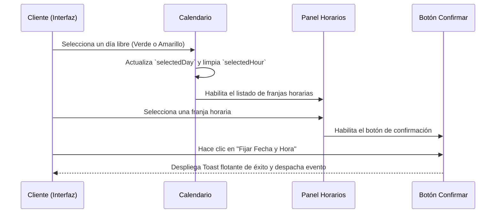

<!--
{
  "resource": "BloqueadorCalendarioEntregas",
  "technicalName": "BloqueadorCalendarioEntregas",
  "targetPath": "src/components/common/BloqueadorCalendarioEntregas.jsx",
  "type": "component",
  "niches": ["alimentos-artesanales"],
  "dependencies": {
    "npm": {
      "lucide-react": "^0.300.0"
    },
    "internal": []
  }
}
-->

# BloqueadorCalendarioEntregas

Calendario de entregas interactivo que muestra las fechas disponibles y bloquea automáticamente los días donde la cocina de repostería ya alcanzó el 100% de su capacidad operativa de horneado, previniendo sobreventa de pedidos.

## 1. Propósito y Casos de Uso
* Pastelerías y panaderías que necesitan regular la capacidad de producción por día, impidiendo que los clientes seleccionen fechas colapsadas.
* Negocios de catering y mesas de dulces que agendan despachos logísticos controlados por cupos horarios.

## 2. Especificación Visual y Estilos (Tailwind CSS)
* **Calendario de Grilla Completa:** Grilla de 7 columnas para los días de la semana con celdas cuadradas responsivas (`aspect-square` y `min-w-0`), evitando tamaños rígidos en píxeles.
* **Estados de Capacidad:**
  - **Verde (`bg-emerald-500/10 text-emerald-700`):** Disponible (Capacidad < 60%).
  - **Amarillo (`bg-amber-500/10 text-amber-700`):** Últimos cupos (Capacidad 60% - 90%).
  - **Rojo/Deshabilitado (`bg-rose-500/5 text-rose-300 cursor-not-allowed`):** Agotado/Bloqueado (Capacidad 100%).
* **Adaptación Mobile:** En móvil, el selector de horas se apila verticalmente (`flex flex-col`), y el calendario ocupa el 100% del ancho del viewport de manera flexible.

---

## 3. Código React Completo y 100% Funcional

```jsx
import React, { useState, useMemo } from 'react';
import { ChevronLeft, ChevronRight, Calendar, Clock, AlertTriangle, CheckCircle2 } from 'lucide-react';

// Días de la semana
const DIAS_SEMANA = ['Dom', 'Lun', 'Mar', 'Mié', 'Jue', 'Vie', 'Sáb'];

// Nombres de meses
const MESES = [
  'Enero', 'Febrero', 'Marzo', 'Abril', 'Mayo', 'Junio',
  'Julio', 'Agosto', 'Septiembre', 'Octubre', 'Noviembre', 'Diciembre'
];

// Horarios de entrega base
const FRANJAS_HORARIAS = [
  { id: 'morning_1', label: '9:00 AM - 11:30 AM (Mañana)', icon: '☀️' },
  { id: 'afternoon_1', label: '12:00 PM - 2:30 PM (Almuerzo)', icon: '🕛' },
  { id: 'afternoon_2', label: '3:00 PM - 5:30 PM (Tarde)', icon: '🌇' },
  { id: 'evening_1', label: '6:00 PM - 8:00 PM (Noche)', icon: '🌙' }
];

export default function BloqueadorCalendarioEntregas({ onSelectSlot }) {
  // Fecha actual como referencia base (Julio 2026 en simulación)
  const [currentYear, setCurrentYear] = useState(2026);
  const [currentMonth, setCurrentMonth] = useState(6); // 0-indexed (6 = Julio)
  const [selectedDay, setSelectedDay] = useState(null);
  const [selectedHour, setSelectedHour] = useState(null);
  const [toastMessage, setToastMessage] = useState('');

  // Simulación de estados de capacidad diaria de horneado (0% a 100% ocupado)
  const capacidadDias = useMemo(() => {
    const mapa = {};
    // Generar capacidades fijas realistas para la demostración
    for (let d = 1; d <= 31; d++) {
      if ([5, 12, 19, 26].includes(d)) {
        mapa[d] = 100; // Domingos cerrados / capacidad agotada
      } else if ([4, 15, 23, 30].includes(d)) {
        mapa[d] = 100; // Días bloqueados por pedidos grandes
      } else if ([3, 9, 14, 18, 22, 28].includes(d)) {
        mapa[d] = 75;  // Últimos cupos
      } else {
        mapa[d] = 20;  // Disponible
      }
    }
    return mapa;
  }, [currentMonth, currentYear]);

  // Obtener días del mes actual
  const { totalDays, startOffsetDays } = useMemo(() => {
    const total = new Date(currentYear, currentMonth + 1, 0).getDate();
    const startOffset = new Date(currentYear, currentMonth, 1).getDay();
    return { totalDays: total, startOffsetDays: startOffset };
  }, [currentMonth, currentYear]);

  const handlePrevMonth = () => {
    setSelectedDay(null);
    setSelectedHour(null);
    if (currentMonth === 0) {
      setCurrentMonth(11);
      setCurrentYear(prev => prev - 1);
    } else {
      setCurrentMonth(prev => prev - 1);
    }
  };

  const handleNextMonth = () => {
    setSelectedDay(null);
    setSelectedHour(null);
    if (currentMonth === 11) {
      setCurrentMonth(0);
      setCurrentYear(prev => prev + 1);
    } else {
      setCurrentMonth(prev => prev + 1);
    }
  };

  const getDayStatusClass = (day) => {
    const cap = capacidadDias[day] || 0;
    if (cap >= 100) return 'bg-rose-500/5 text-rose-300 cursor-not-allowed border-rose-100/10 line-through';
    if (cap >= 70) return 'bg-amber-500/10 text-amber-700 hover:bg-amber-500/20 border-amber-200/50';
    return 'bg-emerald-500/10 text-emerald-700 hover:bg-emerald-500/20 border-emerald-200/50';
  };

  const handleSelectDay = (day) => {
    const cap = capacidadDias[day] || 0;
    if (cap >= 100) return; // Bloqueado
    setSelectedDay(day);
    setSelectedHour(null); // Resetear hora al cambiar día
  };

  const handleFijarCupo = () => {
    if (!selectedDay || !selectedHour) return;

    const fechaString = `${selectedDay} de ${MESES[currentMonth]} de ${currentYear}`;
    const horaObj = FRANJAS_HORARIAS.find(h => h.id === selectedHour);

    const slotInfo = {
      day: selectedDay,
      month: MESES[currentMonth],
      year: currentYear,
      dateString: fechaString,
      timeSlot: horaObj?.label,
      timeIcon: horaObj?.icon
    };

    setToastMessage(`Entrega fijada con éxito: ${fechaString} en la franja ${horaObj?.label}`);
    setTimeout(() => setToastMessage(''), 4000);

    if (onSelectSlot) {
      onSelectSlot(slotInfo);
    }
  };

  return (
    <div className="w-full bg-[var(--color-surface)] text-[var(--color-text)] rounded-2xl border border-[var(--color-border)] shadow-xl p-4 sm:p-5 relative min-w-0">
      
      {/* Toast */}
      {toastMessage && (
        <div className="absolute top-4 left-1/2 -translate-x-1/2 z-50 bg-emerald-600 text-[var(--color-text)] px-4 py-2.5 rounded-full text-xs font-semibold shadow-xl flex items-center gap-2 whitespace-nowrap animate-bounce">
          <CheckCircle2 className="w-4.5 h-4.5" />
          <span>{toastMessage}</span>
        </div>
      )}

      {/* Header */}
      <div className="mb-5 border-b border-[var(--color-border)] pb-4 flex items-center gap-3">
        <div className="p-2 bg-[var(--color-primary)]/10 rounded-lg text-[var(--color-primary)]">
          <Calendar className="w-6 h-6" />
        </div>
        <div>
          <h3 className="font-bold text-base text-[var(--color-text)]">Bloqueador y Agenda de Entregas</h3>
          <p className="text-xs text-[var(--color-text-muted)] mt-0.5">Control de capacidad operativa de producción diaria</p>
        </div>
      </div>

      <div className="grid grid-cols-1 lg:grid-cols-12 gap-5">
        
        {/* Sección Calendario */}
        <div className="lg:col-span-7 flex flex-col gap-3">
          
          {/* Navegador de Meses */}
          <div className="flex justify-between items-center bg-[var(--color-surface-2)] p-2 rounded-xl border border-[var(--color-border)]">
            <button
              onClick={handlePrevMonth}
              type="button"
              className="p-1.5 hover:bg-[var(--color-border)] rounded-lg transition-colors text-[var(--color-text)]"
            >
              <ChevronLeft className="w-4 h-4" />
            </button>
            <span className="text-xs font-bold uppercase tracking-wider text-[var(--color-text)]">
              {MESES[currentMonth]} {currentYear}
            </span>
            <button
              onClick={handleNextMonth}
              type="button"
              className="p-1.5 hover:bg-[var(--color-border)] rounded-lg transition-colors text-[var(--color-text)]"
            >
              <ChevronRight className="w-4 h-4" />
            </button>
          </div>

          {/* Grilla Calendario */}
          <div className="border border-[var(--color-border)] rounded-xl p-3 bg-[var(--color-surface)] flex flex-col gap-2">
            
            {/* Cabecera Días */}
            <div className="grid grid-cols-7 gap-1 text-center font-bold text-[10px] text-[var(--color-text-muted)] uppercase tracking-wider">
              {DIAS_SEMANA.map(d => (
                <div key={d} className="py-1">{d}</div>
              ))}
            </div>

            {/* Días del Mes */}
            <div className="grid grid-cols-7 gap-1.5">
              {/* Espacios vacíos mes anterior */}
              {Array.from({ length: startOffsetDays }).map((_, idx) => (
                <div key={`empty-${idx}`} className="aspect-square" />
              ))}

              {/* Botones de Días */}
              {Array.from({ length: totalDays }).map((_, idx) => {
                const day = idx + 1;
                const isSelected = selectedDay === day;
                const capacity = capacidadDias[day] || 0;
                
                return (
                  <button
                    key={`day-${day}`}
                    onClick={() => handleSelectDay(day)}
                    disabled={capacity >= 100}
                    type="button"
                    className={`aspect-square rounded-lg border text-xs font-bold transition-all relative flex flex-col items-center justify-center gap-0.5 ${
                      isSelected
                        ? 'bg-[var(--color-primary)] text-[var(--color-text)] border-[var(--color-primary)] shadow-sm scale-105'
                        : getDayStatusClass(day)
                    }`}
                  >
                    <span>{day}</span>
                    {capacity < 100 && (
                      <span className={`w-1 h-1 rounded-full ${isSelected ? 'bg-white' : capacity >= 70 ? 'bg-amber-500' : 'bg-emerald-500'}`} />
                    )}
                  </button>
                );
              })}
            </div>

          </div>

          {/* Leyenda de Estados */}
          <div className="flex gap-4 text-[10px] justify-center py-1 text-[var(--color-text-muted)] font-semibold">
            <div className="flex items-center gap-1">
              <span className="w-2.5 h-2.5 rounded bg-emerald-500/20 border border-emerald-400/30 block" />
              <span>Disponible</span>
            </div>
            <div className="flex items-center gap-1">
              <span className="w-2.5 h-2.5 rounded bg-amber-500/20 border border-amber-400/30 block" />
              <span>Últimos Cupos</span>
            </div>
            <div className="flex items-center gap-1 text-rose-300">
              <span className="w-2.5 h-2.5 rounded bg-rose-500/10 border border-rose-400/20 block" />
              <span>Bloqueado/Agotado</span>
            </div>
          </div>

        </div>

        {/* Panel Lateral: Horarios y Acción */}
        <div className="lg:col-span-5 flex flex-col justify-between bg-[var(--color-surface-2)] border border-[var(--color-border)] rounded-2xl p-4 gap-4">
          
          {/* Cabecera del día seleccionado */}
          <div>
            <span className="text-[10px] font-bold uppercase tracking-wider text-[var(--color-text-muted)] block">
              Día Seleccionado
            </span>
            <div className="flex items-center gap-2 mt-1">
              <Calendar className="w-4 h-4 text-[var(--color-primary)]" />
              <span className="text-sm font-bold text-[var(--color-text)]">
                {selectedDay 
                  ? `${selectedDay} de ${MESES[currentMonth]} de ${currentYear}`
                  : 'Ningún día seleccionado'
                }
              </span>
            </div>
          </div>

          {/* Selector de Horarios (Chips) */}
          <div className="flex-1 flex flex-col gap-2">
            <span className="text-[10px] font-bold uppercase tracking-wider text-[var(--color-text-muted)] flex items-center gap-1">
              <Clock className="w-3.5 h-3.5" />
              Franjas de Entrega Sugeridas
            </span>

            {selectedDay ? (
              <div className="flex flex-col gap-2 mt-1">
                {FRANJAS_HORARIAS.map((hora) => {
                  const isHourSelected = selectedHour === hora.id;
                  return (
                    <button
                      key={hora.id}
                      onClick={() => setSelectedHour(hora.id)}
                      type="button"
                      className={`w-full py-2.5 px-3 rounded-xl border text-xs font-semibold flex items-center gap-2 transition-all ${
                        isHourSelected
                          ? 'bg-[var(--color-primary)] text-[var(--color-text)] border-[var(--color-primary)] shadow-sm scale-[1.01]'
                          : 'bg-[var(--color-surface)] border-[var(--color-border)] hover:bg-[var(--color-border)] text-[var(--color-text)]'
                      }`}
                    >
                      <span className="text-sm">{hora.icon}</span>
                      <span>{hora.label}</span>
                    </button>
                  );
                })}
              </div>
            ) : (
              <div className="flex-1 flex flex-col items-center justify-center border border-dashed border-[var(--color-border)] rounded-xl p-4 text-center text-[var(--color-text-muted)]">
                <AlertTriangle className="w-5 h-5 mb-1.5 text-amber-500/60" />
                <p className="text-xs">Selecciona primero un día disponible en el calendario para habilitar los horarios de despacho.</p>
              </div>
            )}
          </div>

          {/* Botón de Fijación */}
          <button
            onClick={handleFijarCupo}
            disabled={!selectedDay || !selectedHour}
            type="button"
            className={`w-full py-2.5 px-4 min-h-[44px] h-auto font-bold text-xs rounded-xl transition-all shadow-sm flex items-center justify-center gap-2 ${
              selectedDay && selectedHour
                ? 'bg-[var(--color-primary)] text-[var(--color-text)] hover:opacity-90 active:scale-95 cursor-pointer !text-[var(--color-text)]'
                : 'bg-[var(--color-surface-3)] text-[var(--color-text-muted)]/50 border border-[var(--color-border)] cursor-not-allowed'
            }`}
          >
            <CheckCircle2 className="w-4 h-4" />
            <span>Fijar Fecha y Hora de Entrega</span>
          </button>

        </div>

      </div>

    </div>
  );
}
```

## 4. Lógica de Estado y Ciclo de Vida
* **`capacidadDias` (Objeto memoizado):** Carga un mapa clave-valor donde cada día del mes representa la ocupación física de la cocina. Si un día tiene `100` (100% de capacidad), deshabilita completamente el botón del día mediante el atributo `disabled`, impidiendo la sobreventa.
* **`selectedDay` (Número):** Almacena el número del día seleccionado. Al modificarse, se borra automáticamente el estado de la hora (`selectedHour = null`) para forzar al cliente a re-confirmar el horario específico.
* **`toastMessage` (String):** Mensaje reactivo de aviso que se despliega con animaciones de rebote en la cabecera cuando se asegura la reserva de la franja.

## 5. Flujo Operativo y Secuencia de Interacción


