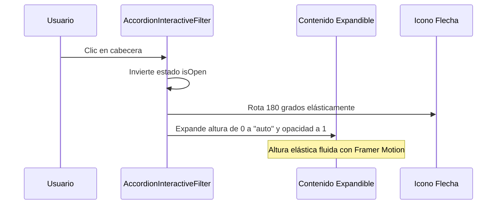

<!--
{
  "resource": "AccordionInteractiveFilter",
  "technicalName": "AccordionInteractiveFilter",
  "targetPath": "src/components/common/AccordionInteractiveFilter.jsx",
  "type": "atom",
  "niches": ["retail_clothing", "grocery_food"],
  "dependencies": {
    "npm": {
      "framer-motion": "^11.0.0"
    },
    "internal": []
  }
}
-->

# Accordion Premium Elástico (AccordionInteractiveFilter)

Componente atómico de filtrado/organización que colapsa y expande contenido estructurado de forma fluida usando físicas de altura elástica, evitando cortes visuales de elevación.

## 1. Propósito y Casos de Uso
Ideal para estructurar paneles laterales de búsqueda avanzada (ej: clasificar tallas, rangos de precio, marcas de repuesto, categorías de alimentos) en pantallas móviles de *E-commerce y POS*, permitiendo conservar espacio y ordenar visualmente los filtros activos.

## 2. Especificación Visual y Estilos (Tailwind CSS)
Utiliza cajas redondeadas y bordes sutiles. El contenido interno expandible debe tener enmascaramiento controlado (`overflow-hidden`). Consume variables HSL:
- Contenedor: `bg-[var(--color-surface)] border border-[var(--color-border)] rounded-xl`
- Cabecera: `text-[var(--color-text)] font-semibold hover:bg-[var(--color-surface-2)]`

---

## 3. Código React Completo y 100% Funcional

```jsx
import React, { useState } from 'react';
import { motion, AnimatePresence } from 'framer-motion';

export default function AccordionInteractiveFilter({
  title = 'Filtro',
  children,
  defaultOpen = false,
  disabled = false
}) {
  const [isOpen, setIsOpen] = useState(defaultOpen);

  return (
    <div className={`w-full rounded-xl border border-[var(--color-border)] bg-[var(--color-surface)] overflow-hidden transition-all duration-200
      ${disabled ? 'opacity-50 cursor-not-allowed pointer-events-none' : ''}
    `}>
      {/* Cabecera del Accordion */}
      <button
        type="button"
        disabled={disabled}
        onClick={() => setIsOpen(!isOpen)}
        className="w-full flex items-center justify-between px-4 py-3.5 text-left font-semibold text-sm text-[var(--color-text)] hover:bg-[var(--color-surface-2)]/60 transition-colors outline-none select-none"
      >
        <span>{title}</span>
        <motion.span
          animate={{ rotate: isOpen ? 180 : 0 }}
          transition={{ type: "spring", stiffness: 300, damping: 20 }}
          className="text-xs text-[var(--color-text-muted)]"
        >
          ▼
        </motion.span>
      </button>

      {/* Contenido Expandible */}
      <AnimatePresence initial={false}>
        {isOpen && (
          <motion.div
            initial={{ height: 0, opacity: 0 }}
            animate={{ height: "auto", opacity: 1 }}
            exit={{ height: 0, opacity: 0 }}
            transition={{
              type: "spring",
              stiffness: 300,
              damping: 24
            }}
            className="overflow-hidden"
          >
            {/* Margen de seguridad interior para evitar recorte de elevación de hijos */}
            <div className="px-4 pb-4 pt-1 border-t border-[var(--color-border)] text-sm text-[var(--color-text-muted)]">
              {children}
            </div>
          </motion.div>
        )}
      </AnimatePresence>
    </div>
  );
}
```

---

## 4. Lógica de Estado y Flujo Operativo


