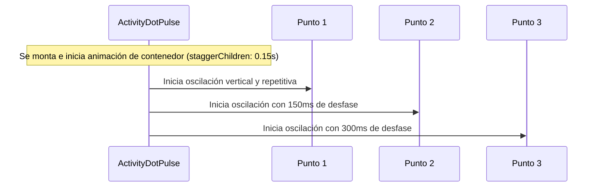

<!--
{
  "resource": "ActivityDotPulse",
  "technicalName": "ActivityDotPulse",
  "targetPath": "src/components/common/ActivityDotPulse.jsx",
  "type": "atom",
  "niches": ["grocery_food", "retail_clothing"],
  "dependencies": {
    "npm": {
      "framer-motion": "^11.0.0"
    },
    "internal": []
  }
}
-->

# Indicador de Escritura en Chat (ActivityDotPulse)

Componente atómico indicador de actividad que presenta tres puntos alineados que oscilan verticalmente con un retraso escalonado (staggered delay) continuo, simulando que un agente o cliente está escribiendo un mensaje.

## 1. Propósito y Casos de Uso
Se utiliza en la ventana de chat omnicanal (ej. Chat de WhatsApp integrado, soporte post-venta, o canal de despacho a domicilio) para comunicar estados activos de comunicación de forma sutil y fluida.

## 2. Especificación Visual y Estilos (Tailwind CSS)
Utiliza un contenedor flex horizontal con puntos grises redondeados. Consume variables HSL:
- Puntos de actividad: `bg-[var(--color-primary)]` o `bg-[var(--color-text-muted)]/60`

---

## 3. Código React Completo y 100% Funcional

```jsx
import React from 'react';
import { motion } from 'framer-motion';

const CONTAINER_VARIANTS = {
  initial: {},
  animate: {
    transition: {
      staggerChildren: 0.15
    }
  }
};

const DOT_VARIANTS = {
  initial: {
    y: '0%'
  },
  animate: {
    y: ['0%', '-60%', '0%'],
    transition: {
      duration: 0.8,
      repeat: Infinity,
      ease: "easeInOut"
    }
  }
};

export default function ActivityDotPulse({
  className = '',
  dotColor = 'bg-[var(--color-primary)]'
}) {
  return (
    <motion.div
      variants={CONTAINER_VARIANTS}
      initial="initial"
      animate="animate"
      className={`flex items-center gap-1.5 px-3 py-2 rounded-full bg-[var(--color-surface-3)] border border-[var(--color-border)] w-fit select-none ${className}`}
    >
      <motion.span
        variants={DOT_VARIANTS}
        className={`w-2 h-2 rounded-full ${dotColor}`}
      />
      <motion.span
        variants={DOT_VARIANTS}
        className={`w-2 h-2 rounded-full ${dotColor}`}
      />
      <motion.span
        variants={DOT_VARIANTS}
        className={`w-2 h-2 rounded-full ${dotColor}`}
      />
    </motion.div>
  );
}
```

---

## 4. Lógica de Estado y Flujo Operativo


