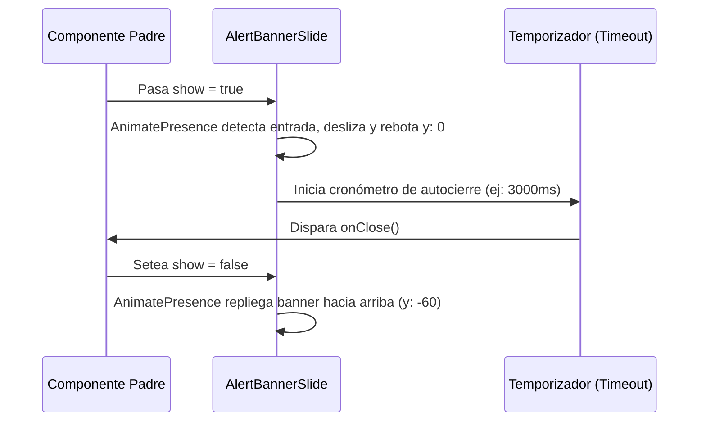

<!--
{
  "resource": "AlertBannerSlide",
  "technicalName": "AlertBannerSlide",
  "targetPath": "src/components/common/AlertBannerSlide.jsx",
  "type": "atom",
  "niches": ["grocery_food", "retail_clothing", "wellness_podology"],
  "dependencies": {
    "npm": {
      "framer-motion": "^11.0.0"
    },
    "internal": []
  }
}
-->

# Banner de Alerta Deslizable (AlertBannerSlide)

Componente atómico de notificación global que desliza desde el borde superior de la pantalla con una animación elástica (bounce/spring), autodesvaneciéndose tras un período de tiempo definido.

## 1. Propósito y Casos de Uso
Notifica eventos importantes y transitorios sin interrumpir la navegación principal (ej: "Producto Agregado al Carrito", "Caja Registradora Abierta con Éxito" en el POS, o "Error de Conexión" persistente).

## 2. Especificación Visual y Estilos (Tailwind CSS)
Se renderiza de forma absoluta o fija sobre el viewport. Consume variables HSL:
- Contenedor Éxito: `bg-green-500/10 border-green-500 text-green-500 shadow-md`
- Contenedor Alerta: `bg-amber-500/10 border-amber-500 text-amber-500 shadow-md`
- Contenedor Error: `bg-red-500/10 border-red-500 text-red-500 shadow-md`

---

## 3. Código React Completo y 100% Funcional

```jsx
import React, { useEffect } from 'react';
import { motion, AnimatePresence } from 'framer-motion';

const BANNER_THEMES = {
  success: 'bg-green-500/15 border-green-500 text-green-500 ring-4 ring-green-500/5',
  warning: 'bg-amber-500/15 border-amber-500 text-amber-500 ring-4 ring-amber-500/5',
  error: 'bg-red-500/15 border-red-500 text-red-500 ring-4 ring-red-500/5'
};

export default function AlertBannerSlide({
  show = false,
  message = '',
  type = 'success', // success, warning, error
  onClose,
  duration = 3000 // Autocierre en ms
}) {
  useEffect(() => {
    if (!show || duration <= 0) return;

    const timer = setTimeout(() => {
      if (onClose) onClose();
    }, duration);

    return () => clearTimeout(timer);
  }, [show, duration, onClose]);

  return (
    <AnimatePresence>
      {show && (
        <motion.div
          initial={{ y: -60, opacity: 0 }}
          animate={{ y: 0, opacity: 1 }}
          exit={{ y: -60, opacity: 0 }}
          transition={{ type: "spring", stiffness: 350, damping: 20 }}
          className={`absolute top-4 left-4 right-4 z-50 p-3.5 rounded-xl border flex items-center justify-between shadow-lg select-none ${BANNER_THEMES[type] || BANNER_THEMES.success}`}
        >
          <div className="flex items-center gap-2">
            <svg className="w-4 h-4 fill-current shrink-0" viewBox="0 0 20 20">
              <path fillRule="evenodd" d="M18 10a8 8 0 11-16 0 8 8 0 0116 0zm-7-4a1 1 0 11-2 0 1 1 0 012 0zM9 9a1 1 0 000 2v3a1 1 0 001 1h1a1 1 0 100-2v-3a1 1 0 00-1-1H9z" clipRule="evenodd" />
            </svg>
            <span className="text-xs font-bold leading-tight">{message}</span>
          </div>

          {onClose && (
            <button
              onClick={onClose}
              className="w-5 h-5 rounded-full flex items-center justify-center hover:bg-black/5 active:bg-black/10 transition-colors text-current font-bold"
            >
              ✕
            </button>
          )}
        </motion.div>
      )}
    </AnimatePresence>
  );
}
```

---

## 4. Lógica de Estado y Flujo Operativo


