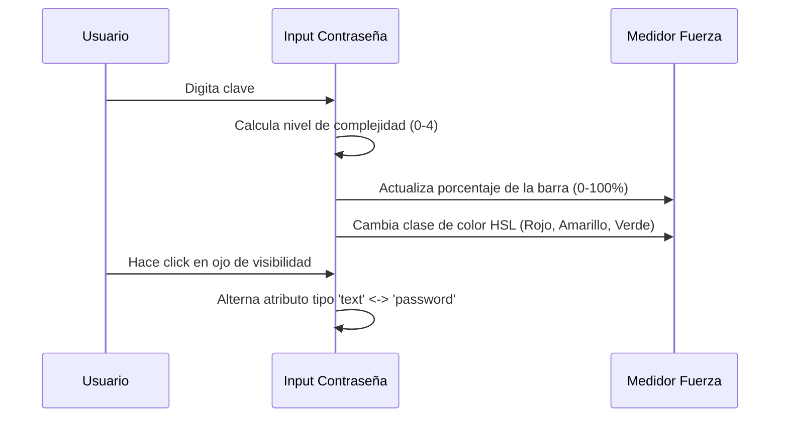

<!--
{
  "technicalName": "AnimatedPasswordInput",
  "targetPath": "src/components/ui/AnimatedPasswordInput.jsx",
  "dependencies": {
    "npm": {
      "framer-motion": "^11.0.0",
      "lucide-react": "^0.300.0"
    },
    "internal": []
  },
  "type": "atom",
  "niches": []
}
-->

# AnimatedPasswordInput — Input de Contraseña con Medidor de Seguridad

## 1. Propósito y Casos de Uso
El `AnimatedPasswordInput` es un campo de seguridad diseñado para la captura de contraseñas de usuarios administradores, repartidores o clientes. Ofrece un botón de visibilidad animado con Framer Motion (ojo) y una barra inferior de progreso reactiva que analiza la complejidad de la clave, reflejando su seguridad mediante una escala cromática HSL.

## 2. Especificación Visual y Estilos
- **Medidor HSL:** Escala cromática dinámica (de 0° rojo a 120° verde en HSL) para la barra de progreso de seguridad.
- **Micro-Interacción:** Animación de rebote elástico (spring) sobre el icono al alternar visibilidad.

## 3. Código React Completo y 100% Funcional

```jsx
import React, { useState } from 'react';
import { motion } from 'framer-motion';
import { Eye, EyeOff, Lock } from 'lucide-react';

export default function AnimatedPasswordInput({
  value,
  onChange,
  placeholder = 'Digita tu contraseña...',
  showStrengthMeter = true,
  className = ''
}) {
  const [showPassword, setShowPassword] = useState(false);
  const [isFocused, setIsFocused] = useState(false);

  // Evalúa la fuerza del password de 0 a 4
  const getStrength = (pwd) => {
    let score = 0;
    if (!pwd) return 0;
    if (pwd.length >= 6) score += 1;
    if (pwd.length >= 8 && /[A-Z]/.test(pwd)) score += 1;
    if (/[0-9]/.test(pwd)) score += 1;
    if (/[^A-Za-z0-9]/.test(pwd)) score += 1;
    return score;
  };

  const strength = getStrength(value);

  const getStrengthColor = (score) => {
    if (score === 1) return 'bg-red-500';
    if (score === 2) return 'bg-amber-500';
    if (score === 3) return 'bg-yellow-500';
    if (score >= 4) return 'bg-green-500';
    return 'bg-transparent';
  };

  const getStrengthLabel = (score) => {
    if (score === 0) return 'Muy débil';
    if (score === 1) return 'Débil';
    if (score === 2) return 'Media';
    if (score === 3) return 'Buena';
    return 'Excelente/Segura';
  };

  return (
    <div className={`relative w-full ${className}`}>
      <div
        className={`flex items-center w-full min-h-[44px] px-3.5 rounded-xl border transition-all duration-300 bg-[var(--color-surface)] ${
          isFocused
            ? 'border-[var(--color-primary)] ring-2 ring-[var(--color-primary)]/20 shadow-md shadow-[var(--color-primary)]/5'
            : 'border-[var(--color-border)] hover:border-[var(--color-text-muted)]/50'
        }`}
      >
        <Lock className="w-5 h-5 text-[var(--color-text-muted)] shrink-0 mr-2.5" />
        
        <input
          type={showPassword ? 'text' : 'password'}
          value={value}
          onChange={(e) => onChange(e.target.value)}
          placeholder={placeholder}
          onFocus={() => setIsFocused(true)}
          onBlur={() => setIsFocused(false)}
          className="w-full h-10 bg-transparent text-[var(--color-text)] focus:outline-none placeholder-transparent text-sm [appearance:textfield] [&::-webkit-outer-spin-button]:appearance-none [&::-webkit-inner-spin-button]:appearance-none"
        />

        <button
          type="button"
          onClick={() => setShowPassword(!showPassword)}
          className="p-1 rounded-md text-[var(--color-text-muted)] hover:text-[var(--color-text)] hover:bg-[var(--color-surface-2)] transition-colors shrink-0 ml-2"
        >
          <motion.div
            animate={{ scale: showPassword ? [1, 1.15, 1] : 1 }}
            transition={{ duration: 0.2 }}
          >
            {showPassword ? <EyeOff className="w-4 h-4" /> : <Eye className="w-4 h-4" />}
          </motion.div>
        </button>
      </div>

      {/* Barra de progreso de seguridad */}
      {showStrengthMeter && value.length > 0 && (
        <div className="mt-2.5 px-1 space-y-1">
          <div className="flex justify-between items-center text-[10px] font-bold text-[var(--color-text-muted)] uppercase tracking-wider">
            <span>Seguridad</span>
            <span className="font-semibold">{getStrengthLabel(strength)}</span>
          </div>
          <div className="h-1.5 w-full bg-[var(--color-surface-3)] rounded-full overflow-hidden">
            <motion.div
              initial={{ width: 0 }}
              animate={{ width: `${(strength / 4) * 100}%` }}
              transition={{ duration: 0.3, ease: 'easeOut' }}
              className={`h-full rounded-full transition-all duration-300 ${getStrengthColor(strength)}`}
            />
          </div>
        </div>
      )}
    </div>
  );
}
```

## 4. Lógica de Estado y Ciclo de Vida
Maneja el estado boolean `showPassword` local para alternar dinámicamente el tipo de campo (`text` vs `password`). Realiza un escaneo de expresiones regulares contra el string en el evento `onChange` para calcular el valor reactivo de `strength` sin retrasos en el hilo principal.

## 5. Flujo Operativo y Secuencia de Interacción


