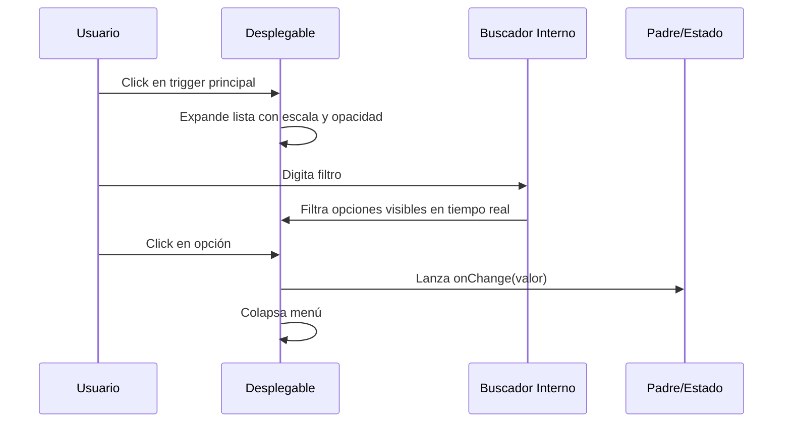

<!--
{
  "technicalName": "AnimatedSearchDropdown",
  "targetPath": "src/components/ui/AnimatedSearchDropdown.jsx",
  "dependencies": {
    "npm": {
      "framer-motion": "^11.0.0",
      "lucide-react": "^0.300.0"
    },
    "internal": []
  },
  "type": "atom",
  "niches": []
}
-->

# AnimatedSearchDropdown — Desplegable con Buscador Integrado

## 1. Propósito y Casos de Uso
El `AnimatedSearchDropdown` reemplaza el selector desplegable nativo en formularios que manejan una cantidad masiva de opciones (tales como nichos de clientes, listados de transportistas, bodegas o departamentos). Integra una barra de búsqueda en caliente y transiciones fluidas de escala.

## 2. Especificación Visual y Estilos
- **Control de Contraste:** Estilo unificado para listas flotantes y bordes interactivos en HSL.
- **Scroll Interno:** Altura acotada del desplegable con scrollbar dinámico para prevenir el desbordamiento de pantalla.

## 3. Código React Completo y 100% Funcional

```jsx
import React, { useState, useRef, useEffect } from 'react';
import { motion, AnimatePresence } from 'framer-motion';
import { ChevronDown, Search, X } from 'lucide-react';

export default function AnimatedSearchDropdown({
  options = [],
  value,
  onChange,
  placeholder = 'Selecciona una opción...',
  searchPlaceholder = 'Filtrar opciones...',
  className = ''
}) {
  const [isOpen, setIsOpen] = useState(false);
  const [search, setSearch] = useState('');
  const containerRef = useRef(null);

  const selectedOption = options.find((opt) => opt.value === value);

  const filteredOptions = options.filter((opt) =>
    opt.label.toLowerCase().includes(search.toLowerCase())
  );

  useEffect(() => {
    const handleOutsideClick = (e) => {
      if (containerRef.current && !containerRef.current.contains(e.target)) {
        setIsOpen(false);
      }
    };
    document.addEventListener('mousedown', handleOutsideClick);
    return () => document.removeEventListener('mousedown', handleOutsideClick);
  }, []);

  const handleSelect = (val) => {
    onChange(val);
    setIsOpen(false);
    setSearch('');
  };

  return (
    <div ref={containerRef} className={`relative w-full ${className}`}>
      {/* Botón Trigger Principal */}
      <button
        type="button"
        onClick={() => setIsOpen(!isOpen)}
        className={`flex items-center justify-between w-full min-h-[44px] px-3.5 rounded-xl border bg-[var(--color-surface)] transition-all duration-300 ${
          isOpen
            ? 'border-[var(--color-primary)] ring-2 ring-[var(--color-primary)]/20 shadow-md'
            : 'border-[var(--color-border)] hover:border-[var(--color-text-muted)]/50'
        }`}
      >
        <span className={`text-sm ${selectedOption ? 'text-[var(--color-text)] font-medium' : 'text-[var(--color-text-muted)]'}`}>
          {selectedOption ? selectedOption.label : placeholder}
        </span>
        <ChevronDown className={`w-4 h-4 text-[var(--color-text-muted)] transition-transform duration-300 ${isOpen ? 'rotate-180 text-[var(--color-primary)]' : ''}`} />
      </button>

      {/* Menú Desplegable Flotante */}
      <AnimatePresence>
        {isOpen && (
          <motion.div
            initial={{ opacity: 0, scale: 0.95, y: -4 }}
            animate={{ opacity: 1, scale: 1, y: 0 }}
            exit={{ opacity: 0, scale: 0.95, y: -4 }}
            transition={{ duration: 0.15, ease: 'easeOut' }}
            className="absolute z-50 w-full mt-2 bg-[var(--color-surface)] border border-[var(--color-border)] rounded-xl shadow-xl overflow-hidden"
          >
            {/* Buscador Interno */}
            <div className="flex items-center px-3 py-2 border-b border-[var(--color-border)] bg-[var(--color-surface-2)]">
              <Search className="w-4 h-4 text-[var(--color-text-muted)] mr-2 shrink-0" />
              <input
                type="text"
                value={search}
                onChange={(e) => setSearch(e.target.value)}
                placeholder={searchPlaceholder}
                className="w-full bg-transparent text-xs text-[var(--color-text)] focus:outline-none placeholder-[var(--color-text-muted)]/60"
              />
              {search && (
                <button type="button" onClick={() => setSearch('')} className="p-0.5 rounded text-[var(--color-text-muted)] hover:bg-[var(--color-surface-3)]">
                  <X className="w-3.5 h-3.5" />
                </button>
              )}
            </div>

            {/* Listado de Opciones */}
            <div className="max-h-[200px] overflow-y-auto scrollbar-thin py-1">
              {filteredOptions.length > 0 ? (
                filteredOptions.map((opt) => {
                  const isSelected = opt.value === value;
                  return (
                    <button
                      key={opt.value}
                      type="button"
                      onClick={() => handleSelect(opt.value)}
                      className={`flex items-center justify-between w-full px-3.5 py-2 text-xs text-left transition-colors ${
                        isSelected
                          ? 'bg-[var(--color-primary)]/10 text-[var(--color-primary)] font-semibold'
                          : 'text-[var(--color-text)] hover:bg-[var(--color-surface-2)]'
                      }`}
                    >
                      <span>{opt.label}</span>
                    </button>
                  );
                })
              ) : (
                <div className="px-3.5 py-4 text-center text-xs text-[var(--color-text-muted)]">
                  No se encontraron resultados
                </div>
              )}
            </div>
          </motion.div>
        )}
      </AnimatePresence>
    </div>
  );
}
```

## 4. Lógica de Estado y Ciclo de Vida
Sincroniza un escuchador de clics del DOM en `document` mediante `mousedown` en `useEffect` para detectar clics externos y contraer la lista flotante (Tap Shield de seguridad). Limpia automáticamente el buscador interno `search` al concretar la selección.

## 5. Flujo Operativo y Secuencia de Interacción


