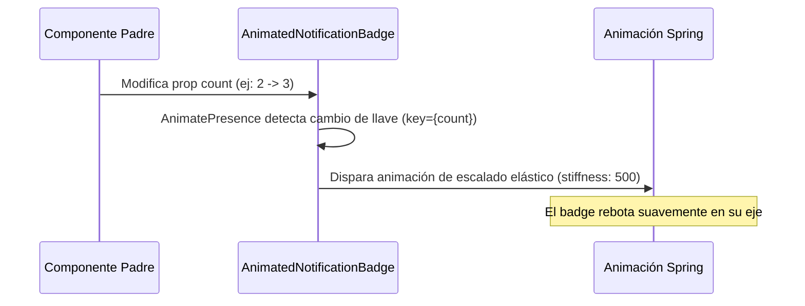

<!--
{
  "resource": "AnimatedNotificationBadge",
  "technicalName": "AnimatedNotificationBadge",
  "targetPath": "src/components/common/AnimatedNotificationBadge.jsx",
  "type": "atom",
  "niches": ["grocery_food", "retail_clothing"],
  "dependencies": {
    "npm": {
      "framer-motion": "^11.0.0"
    },
    "internal": []
  }
}
-->

# Badge de Notificaciones Animado (AnimatedNotificationBadge)

Componente atómico indicador de notificaciones o elementos del carrito que reacciona visualmente con una animación de rebote y escalado elástico (spring) al cambiar de valor numérico.

## 1. Propósito y Casos de Uso
Llama sutilmente la atención del usuario cuando se agregan productos al carrito de compras, o cuando entran nuevos mensajes de chat u órdenes pendientes, logrando una sensación responsiva y viva de la app.

## 2. Especificación Visual y Estilos (Tailwind CSS)
Utiliza un círculo flotante con sombras suaves y texto centrado. Consume variables HSL:
- Contenedor: `bg-[var(--color-primary)] !text-white border-2 border-[var(--color-surface)] shadow-sm`

---

## 3. Código React Completo y 100% Funcional

```jsx
import React from 'react';
import { motion, AnimatePresence } from 'framer-motion';

export default function AnimatedNotificationBadge({
  count = 0,
  showZero = false,
  className = ''
}) {
  const displayCount = count > 99 ? '99+' : count;
  const isVisible = showZero || count > 0;

  return (
    <div className="relative inline-flex items-center justify-center">
      <AnimatePresence mode="popLayout">
        {isVisible && (
          <motion.span
            key={count} // Forzar re-render y animación en cada cambio de número
            initial={{ scale: 0.4, opacity: 0 }}
            animate={{ scale: 1, opacity: 1 }}
            exit={{ scale: 0.4, opacity: 0 }}
            transition={{
              type: "spring",
              stiffness: 500,
              damping: 15
            }}
            className={`min-w-[20px] h-5 px-1.5 rounded-full flex items-center justify-center text-[10px] font-bold bg-[var(--color-primary)] !text-[var(--color-text)] border-2 border-[var(--color-surface)] shadow-md select-none pointer-events-none ${className}`}
          >
            {displayCount}
          </motion.span>
        )}
      </AnimatePresence>
    </div>
  );
}
```

---

## 4. Lógica de Estado y Flujo Operativo


