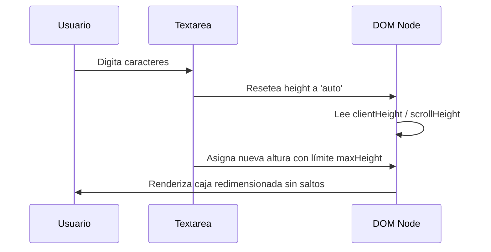

<!--
{
  "technicalName": "AutoResizeTextArea",
  "targetPath": "src/components/ui/AutoResizeTextArea.jsx",
  "dependencies": {
    "npm": {},
    "internal": []
  },
  "type": "atom",
  "niches": []
}
-->

# AutoResizeTextArea — Área de Texto con Auto-Ajuste de Altura

## 1. Propósito y Casos de Uso
El `AutoResizeTextArea` es un campo de entrada multilínea adaptativo diseñado para notas de entrega, observaciones de pedidos, detalles de mantenimiento o descripciones de productos. Su propósito es expandirse o contraerse de manera fluida eliminando barras de scroll molestas.

## 2. Especificación Visual y Estilos
- **Tema de Contraste:** Estilo unificado de bordes HSL (`var(--color-border)` en reposo y `var(--color-primary)` en foco).
- **Animaciones:** Transición suave de la propiedad `height` para evitar saltos toscos durante el redimensionamiento.

## 3. Código React Completo y 100% Funcional

```jsx
import React, { useRef, useEffect } from 'react';

export default function AutoResizeTextArea({
  value,
  onChange,
  placeholder = 'Escribe aquí...',
  minRows = 3,
  maxHeight = 300,
  className = ''
}) {
  const textareaRef = useRef(null);

  const resize = () => {
    const textarea = textareaRef.current;
    if (!textarea) return;

    // Reiniciar altura para calcular el scrollHeight real
    textarea.style.height = 'auto';

    // Asignar el scrollHeight con un tope opcional
    const newHeight = Math.min(textarea.scrollHeight, maxHeight);
    textarea.style.height = `${newHeight}px`;
  };

  useEffect(() => {
    resize();
  }, [value]);

  return (
    <textarea
      ref={textareaRef}
      value={value}
      onChange={(e) => onChange(e.target.value)}
      placeholder={placeholder}
      rows={minRows}
      className={`w-full p-3 text-sm rounded-xl border border-[var(--color-border)] bg-[var(--color-surface)] text-[var(--color-text)] focus:border-[var(--color-primary)] focus:ring-2 focus:ring-[var(--color-primary)]/20 focus:outline-none resize-none transition-all duration-200 overflow-y-auto scrollbar-thin ${className}`}
      style={{ maxHeight: `${maxHeight}px` }}
    />
  );
}
```

## 4. Lógica de Estado y Ciclo de Vida
Mapea el redimensionamiento físico mediante un efecto `useEffect` acoplado al cambio de la propiedad `value`. Resetea temporalmente el atributo inline de `height` a `auto` para leer el `scrollHeight` libre antes de aplicar el nuevo valor limitado por `maxHeight`.

## 5. Flujo Operativo y Secuencia de Interacción


